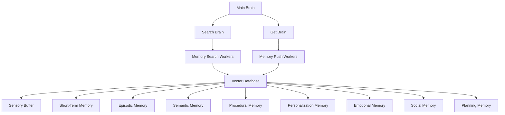

# LangMem 🧠

**Layered Memory Architecture for LLM Agents with LangGraph**

[](https://www.python.org/downloads/)
[](https://langchain-ai.github.io/langgraph/)
[](LICENSE)

LangMem is an advanced memory architecture system for Large Language Model (LLM) agents that implements multiple types of memory systems similar to human cognitive architecture. Built on top of LangGraph, it provides sophisticated memory management capabilities for AI agents with layered memory storage, retrieval, and management.

## 🚀 Features

### Multi-Layered Memory Architecture
- **Sensory Buffer**: Immediate perception and input processing
- **Short-Term Memory**: Temporary information storage
- **Episodic Memory**: Personal experiences and events
- **Semantic Memory**: General knowledge and facts
- **Procedural Memory**: Skills and learned procedures
- **Personalization Memory**: User-specific preferences and patterns
- **Emotional Memory**: Emotional associations and responses
- **Social Memory**: Social interactions and relationships
- **Planning Memory**: Goal-oriented planning and future intentions

### Advanced Features
- **Vector Database Storage**: Powered by Milvus with OpenAI embeddings
- **TTL Support**: Time-to-live functionality for temporary memories
- **Hierarchical Brain System**: Multi-level orchestration with specialized brains
- **LangGraph Integration**: Native support for complex agent workflows
- **Asynchronous Operations**: High-performance async memory operations
- **Flexible Search**: Semantic similarity search across memory layers

## 🏗️ Architecture



### Core Components

1. **Brain Module** (`brain.py`): Main orchestration layer
2. **Vector Database** (`vectorDB.py`): Persistent storage with Milvus
3. **Memory States** (`states.py`): Pydantic models for different memory types
4. **Orchestrators** (`orchestrators.py`): Brain configuration and management
5. **Workers** (`workers.py`): Specialized workers for memory operations
6. **LLM Integration** (`llm.py`): OpenAI integration and model management

## 📦 Installation

### Prerequisites
- Python 3.11 or higher
- OpenAI API key

### Using UV (Recommended)

```bash
# Clone the repository
git clone <repository-url>
cd LangMem

# Install with UV
uv sync
```

### Using Pip

```bash
# Clone the repository
git clone <repository-url>
cd LangMem

# Install dependencies
pip install -e .
```

### Development Installation

```bash
# Install with development dependencies
uv sync --group dev

# Or with pip
pip install -e ".[dev]"
```

## ⚙️ Configuration

### Environment Variables

Create a `.env` file in the project root:

```env
OPENAI_API_KEY=your_openai_api_key_here
```

### LangGraph Configuration

The project uses `langgraph.json` for configuration:

```json
{
  "dependencies": ["."],
  "graphs": {
    "brain": {
      "path": "./LanggraphMemory/brain.py:graph"
    }
  },
  "env": ".env"
}
```

## 🎯 Usage

### Basic Example

```python
from LanggraphMemory import CreateVectorDB, create_llm_openai
from LanggraphMemory.brain import graph

# Initialize the main brain
brain_graph = graph

# Process a message through the memory system
result = brain_graph.invoke({
    "messages": [{"role": "user", "content": "Remember that I like coffee"}]
})

print(result)
```

### Memory Operations

#### Storing Information

```python
from LanggraphMemory.vectorDB import CreateVectorDB

# Create a semantic memory database
semantic_memory = CreateVectorDB(
    name="semantic_memory",
    description="General knowledge and facts",
    ttl_seconds=86400  # 24 hours TTL
)

# Add a document to memory
semantic_memory.add_document(
    document_context="Python is a programming language",
    metadata={"category": "programming", "importance": "high"}
)
```

#### Searching Memory

```python
# Search for relevant information
results = semantic_memory.search(
    query="programming languages",
    k=5  # Return top 5 results
)

for result in results:
    print(f"Content: {result.page_content}")
    print(f"Metadata: {result.metadata}")
```

### Advanced Usage

#### Custom Memory Workers

```python
from langgraph_wave_orchestrator import WorkerNode
from LanggraphMemory.states import SemanticMemoryState

def custom_memory_processor(state):
    # Custom memory processing logic
    return {"processed": True}

custom_worker = WorkerNode(
    name="custom_processor",
    function=custom_memory_processor,
    model=SemanticMemoryState,
    state_placeholder="custom",
    description="Custom memory processing"
)
```

#### Brain Orchestration

```python
from LanggraphMemory.orchestrators import create_main_brain

# Create and configure a custom brain
brain = create_main_brain()
brain.add_node(custom_worker)
compiled_brain = brain.compile()

# Use the custom brain
result = compiled_brain.invoke({"messages": [...]})
```

## 🧪 Development

### Running Tests

```bash
# Run all tests
pytest

# Run with coverage
pytest --cov=LanggraphMemory

# Run specific test file
pytest tests/test_memory.py
```

### Code Quality

```bash
# Format code
black LanggraphMemory/

# Lint code
ruff check LanggraphMemory/

# Type checking
mypy LanggraphMemory/
```

### Local Development

```bash
# Start the LangGraph development server
langgraph dev

# Run the brain graph locally
langgraph run --graph brain
```

## 📊 Memory Types

| Memory Type | Purpose | TTL Support | Use Cases |
|-------------|---------|-------------|-----------|
| Sensory Buffer | Immediate input processing | ✅ | Real-time perception |
| Short-Term | Temporary working memory | ✅ | Active conversations |
| Episodic | Personal experiences | ❌ | User interactions |
| Semantic | General knowledge | ❌ | Facts and concepts |
| Procedural | Skills and procedures | ❌ | How-to knowledge |
| Personalization | User preferences | ❌ | Customization |
| Emotional | Emotional associations | ❌ | Sentiment analysis |
| Social | Social relationships | ❌ | User relationships |
| Planning | Future intentions | ✅ | Goal management |

## 🛠️ API Reference

### Core Classes

#### `CreateVectorDB`

```python
class CreateVectorDB:
    def __init__(self, name: str, description: str, ttl_seconds: int = None)
    def add_document(self, document_context: str, metadata: dict = None)
    def search(self, query: str, k: int = 5) -> List[Document]
```

#### Memory State Models

All memory states inherit from Pydantic BaseModel:

```python
class MemoryState(BaseModel):
    messages: list[BaseMessage] = Field(default_factory=list)
```

### Functions

- `create_llm_openai()`: Create OpenAI LLM instance
- `create_llm_openai_base()`: Create base OpenAI LLM
- `create_search_in_memory_brain()`: Initialize search brain
- `create_get_from_memory_brain()`: Initialize retrieval brain
- `create_main_brain()`: Initialize main orchestrator brain

## 🤝 Contributing

1. Fork the repository
2. Create a feature branch (`git checkout -b feature/amazing-feature`)
3. Commit your changes (`git commit -m 'Add amazing feature'`)
4. Push to the branch (`git push origin feature/amazing-feature`)
5. Open a Pull Request

### Development Guidelines

- Follow PEP 8 style guidelines
- Add type hints to all functions
- Write comprehensive tests
- Update documentation for new features
- Use conventional commit messages

## 📝 License

This project is licensed under the MIT License - see the [LICENSE](LICENSE) file for details.

## 🙏 Acknowledgments

- [LangGraph](https://langchain-ai.github.io/langgraph/) for the orchestration framework
- [LangChain](https://langchain.com/) for LLM integration
- [Milvus](https://milvus.io/) for vector database capabilities
- [OpenAI](https://openai.com/) for embedding and LLM services

## 📞 Support

- 📧 Email: [your-email@example.com]
- 🐛 Issues: [GitHub Issues](https://github.com/your-username/LangMem/issues)
- 💬 Discussions: [GitHub Discussions](https://github.com/your-username/LangMem/discussions)

---

**LangMem** - Bringing human-like memory architecture to AI agents 🧠✨
