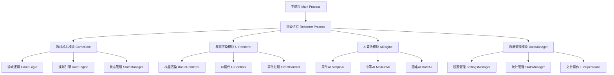

# 桌面五子棋游戏 - 技术架构设计文档

## 1. 项目概述

### 1.1 项目定位
- **目标用户**: 8-60岁休闲游戏爱好者，支持初学者到高级玩家
- **使用场景**: 家庭娱乐和办公休闲场景
- **核心价值**: 简洁易用的桌面五子棋游戏，支持人机对战和本地双人对战

### 1.2 功能范围
- **游戏模式**: 人机对战（3个难度级别）、本地双人对战、简单练习模式
- **游戏体验**: 单局5-15分钟，支持快速开始、暂停保存和悔棋功能
- **界面设计**: 简洁现代风格，800x600像素窗口，支持窗口缩放
- **数据存储**: 本地JSON文件存储游戏记录、用户设置和统计数据

## 2. 技术栈选型

### 2.1 核心技术栈
- **桌面框架**: Electron (跨平台支持)
- **前端技术**: HTML5 + CSS3 + 原生JavaScript
- **图形渲染**: Canvas 2D API
- **数据存储**: JSON文件 + Node.js fs模块
- **AI算法**: Minimax + Alpha-Beta剪枝

### 2.2 技术选型理由
- **Electron**: 跨平台兼容，开发效率高，易于维护
- **原生JavaScript**: 无复杂框架依赖，性能优秀，代码简洁
- **Canvas 2D**: 适合棋盘游戏渲染，性能良好
- **JSON存储**: 简单轻量，易于读写和调试

## 3. 系统架构设计

### 3.1 整体架构图



### 3.2 模块化设计

#### 3.2.1 游戏核心模块 (GameCore)
```javascript
// 游戏逻辑管理
class GameLogic {
    constructor()
    startNewGame(mode, difficulty)
    makeMove(x, y)
    undoMove()
    pauseGame()
    resumeGame()
    resetGame()
}

// 规则引擎
class RuleEngine {
    checkWin(board, x, y, player)
    isValidMove(board, x, y)
    getGameStatus()
}

// 状态管理
class StateManager {
    getCurrentState()
    saveState()
    loadState()
    getHistory()
}
```

#### 3.2.2 界面渲染模块 (UIRenderer)
```javascript
// 棋盘渲染
class BoardRenderer {
    drawBoard()
    drawPieces()
    highlightLastMove()
    drawGrid()
    resizeBoard()
}

// UI控件
class UIControls {
    createMenuBar()
    createControlPanel()
    createStatusBar()
    updateGameInfo()
}

// 事件处理
class EventHandler {
    handleMouseClick(event)
    handleKeyPress(event)
    handleWindowResize(event)
}
```

#### 3.2.3 AI算法模块 (AIEngine)
```javascript
// AI基类
class BaseAI {
    makeMove(board, difficulty)
    evaluateBoard(board)
    calculateBestMove()
}

// 简单AI
class SimpleAI extends BaseAI {
    makeMove() // 随机+基础评估
}

// 中等AI
class MediumAI extends BaseAI {
    makeMove() // Minimax算法
    minimax(board, depth, isMaximizing)
}

// 困难AI
class HardAI extends BaseAI {
    makeMove() // Alpha-Beta剪枝
    alphaBeta(board, depth, alpha, beta, isMaximizing)
}
```

#### 3.2.4 数据管理模块 (DataManager)
```javascript
// 设置管理
class SettingsManager {
    loadSettings()
    saveSettings()
    getDefaultSettings()
}

// 统计管理
class StatsManager {
    updateStats(gameResult)
    getStats()
    resetStats()
}

// 文件操作
class FileOperations {
    readFile(path)
    writeFile(path, data)
    ensureDirectory(path)
}
```

## 4. 数据模型设计

### 4.1 游戏状态数据结构
```javascript
const GameState = {
    board: Array(15).fill().map(() => Array(15).fill(0)), // 0:空, 1:黑, 2:白
    currentPlayer: 1, // 1:黑棋, 2:白棋
    gameMode: 'AI', // 'AI', 'PVP', 'PRACTICE'
    difficulty: 'MEDIUM', // 'EASY', 'MEDIUM', 'HARD'
    gameStatus: 'PLAYING', // 'PLAYING', 'PAUSED', 'FINISHED'
    winner: null, // null, 1, 2
    moveHistory: [], // [{x, y, player, timestamp}]
    undoCount: 0, // 悔棋次数
    startTime: null,
    endTime: null
}
```

### 4.2 用户设置数据结构
```javascript
const UserSettings = {
    soundEnabled: true,
    defaultDifficulty: 'MEDIUM',
    windowSize: {width: 800, height: 600},
    boardTheme: 'classic',
    autoSave: true
}
```

### 4.3 统计数据结构
```javascript
const GameStats = {
    totalGames: 0,
    wins: 0,
    losses: 0,
    draws: 0,
    winsByDifficulty: {
        EASY: 0,
        MEDIUM: 0,
        HARD: 0
    },
    averageGameTime: 0,
    longestGame: 0,
    lastPlayed: null
}
```

## 5. 核心算法设计

### 5.1 胜负判定算法
```javascript
function checkWin(board, x, y, player) {
    const directions = [
        [1, 0],   // 水平
        [0, 1],   // 垂直
        [1, 1],   // 主对角线
        [1, -1]   // 副对角线
    ];
    
    for (let [dx, dy] of directions) {
        let count = 1;
        
        // 正方向计数
        for (let i = 1; i < 5; i++) {
            const nx = x + dx * i;
            const ny = y + dy * i;
            if (nx < 0 || nx >= 15 || ny < 0 || ny >= 15 || board[nx][ny] !== player) break;
            count++;
        }
        
        // 反方向计数
        for (let i = 1; i < 5; i++) {
            const nx = x - dx * i;
            const ny = y - dy * i;
            if (nx < 0 || nx >= 15 || ny < 0 || ny >= 15 || board[nx][ny] !== player) break;
            count++;
        }
        
        if (count >= 5) return true;
    }
    
    return false;
}
```

### 5.2 AI评估函数
```javascript
function evaluateBoard(board, player) {
    let score = 0;
    const opponent = player === 1 ? 2 : 1;
    
    // 位置权重评估
    for (let i = 0; i < 15; i++) {
        for (let j = 0; j < 15; j++) {
            if (board[i][j] === player) {
                score += getPositionWeight(i, j);
            } else if (board[i][j] === opponent) {
                score -= getPositionWeight(i, j);
            }
        }
    }
    
    // 连子评估
    score += evaluateLines(board, player);
    score -= evaluateLines(board, opponent);
    
    return score;
}

function getPositionWeight(x, y) {
    const centerX = 7, centerY = 7;
    const distance = Math.abs(x - centerX) + Math.abs(y - centerY);
    return Math.max(1, 15 - distance);
}
```

## 6. 性能优化策略

### 6.1 渲染优化
- **局部重绘**: 只重绘发生变化的棋盘区域
- **双缓冲**: 使用离屏Canvas避免闪烁
- **事件节流**: 限制鼠标移动事件频率

### 6.2 AI计算优化
- **异步计算**: 使用Web Worker避免界面卡顿
- **剪枝优化**: Alpha-Beta剪枝减少搜索空间
- **缓存机制**: 缓存已计算的棋局评估结果

### 6.3 内存管理
- **对象池**: 复用棋子对象减少GC压力
- **及时清理**: 清理不需要的事件监听器
- **数据压缩**: 压缩历史记录数据

## 7. 项目结构

```
gomoku-desktop/
├── main.js                 # Electron主进程
├── package.json            # 项目配置
├── src/
│   ├── renderer/
│   │   ├── index.html      # 主页面
│   │   ├── css/
│   │   │   └── style.css   # 样式文件
│   │   └── js/
│   │       ├── app.js      # 应用入口
│   │       ├── game/
│   │       │   ├── GameCore.js
│   │       │   ├── RuleEngine.js
│   │       │   └── StateManager.js
│   │       ├── ui/
│   │       │   ├── BoardRenderer.js
│   │       │   ├── UIControls.js
│   │       │   └── EventHandler.js
│   │       ├── ai/
│   │       │   ├── BaseAI.js
│   │       │   ├── SimpleAI.js
│   │       │   ├── MediumAI.js
│   │       │   └── HardAI.js
│   │       └── data/
│   │           ├── SettingsManager.js
│   │           ├── StatsManager.js
│   │           └── FileOperations.js
│   └── assets/
│       ├── sounds/         # 音效文件
│       └── images/         # 图片资源
├── data/
│   ├── settings.json       # 用户设置
│   └── stats.json         # 游戏统计
└── dist/                  # 打包输出目录
```

## 8. 开发流程

### 8.1 开发阶段规划

#### 阶段1: 基础框架搭建 (1-2天)
1. **环境配置**
   - 初始化Electron项目
   - 配置开发环境和构建脚本
   - 设置项目目录结构

2. **基础界面**
   - 创建主窗口和基本布局
   - 实现棋盘Canvas渲染
   - 添加基本UI控件

#### 阶段2: 核心游戏逻辑 (2-3天)
1. **游戏核心**
   - 实现GameCore和RuleEngine
   - 添加胜负判定逻辑
   - 实现基本的下棋功能

2. **状态管理**
   - 实现StateManager
   - 添加悔棋功能
   - 实现游戏暂停/继续

#### 阶段3: AI算法实现 (2-3天)
1. **AI基础**
   - 实现BaseAI和评估函数
   - 开发SimpleAI（随机+基础评估）
   - 测试AI基本功能

2. **高级AI**
   - 实现MediumAI（Minimax算法）
   - 实现HardAI（Alpha-Beta剪枝）
   - 性能优化和异步处理

#### 阶段4: 数据管理和UI完善 (1-2天)
1. **数据持久化**
   - 实现SettingsManager和StatsManager
   - 添加JSON文件读写功能
   - 实现游戏统计功能

2. **UI优化**
   - 完善界面交互
   - 添加音效支持
   - 实现窗口自适应

#### 阶段5: 测试和优化 (1-2天)
1. **功能测试**
   - 全面测试游戏功能
   - 修复发现的bug
   - 性能优化

2. **用户体验**
   - 界面细节优化
   - 添加帮助文档
   - 准备发布版本

### 8.2 开发规范

#### 8.2.1 代码规范
- 使用ES6+语法
- 采用模块化设计
- 统一命名规范（驼峰命名）
- 添加必要的注释

#### 8.2.2 测试策略
- 单元测试覆盖核心算法
- 集成测试验证模块交互
- 用户测试验证游戏体验

#### 8.2.3 版本控制
- 使用Git进行版本控制
- 采用功能分支开发模式
- 定期提交和合并代码

## 9. 部署方案

### 9.1 打包配置
```json
{
  "build": {
    "appId": "com.example.gomoku",
    "productName": "五子棋大师",
    "directories": {
      "output": "dist"
    },
    "files": [
      "src/**/*",
      "main.js",
      "package.json"
    ],
    "win": {
      "target": "nsis",
      "icon": "assets/icon.ico"
    },
    "mac": {
      "target": "dmg",
      "icon": "assets/icon.icns"
    },
    "linux": {
      "target": "AppImage",
      "icon": "assets/icon.png"
    }
  }
}
```

### 9.2 发布流程
1. **代码检查**: 运行测试和代码质量检查
2. **版本更新**: 更新版本号和变更日志
3. **构建打包**: 生成各平台安装包
4. **测试验证**: 在目标平台测试安装包
5. **发布分发**: 上传到分发平台

## 10. 风险评估与应对

### 10.1 技术风险
- **性能问题**: 通过算法优化和异步处理解决
- **兼容性问题**: 充分测试各平台兼容性
- **内存泄漏**: 规范内存管理和及时清理

### 10.2 项目风险
- **开发周期**: 合理规划开发阶段，预留缓冲时间
- **需求变更**: 采用模块化设计，便于功能扩展
- **质量控制**: 建立完善的测试体系

## 11. 后续扩展规划

### 11.1 功能扩展
- 在线对战功能
- 复盘分析功能
- 自定义棋盘主题
- 游戏录像回放

### 11.2 技术升级
- 升级到更新的Electron版本
- 考虑使用WebGL提升渲染性能
- 集成更先进的AI算法

---

*本文档版本: v1.0*  
*最后更新: 2025-07-01*