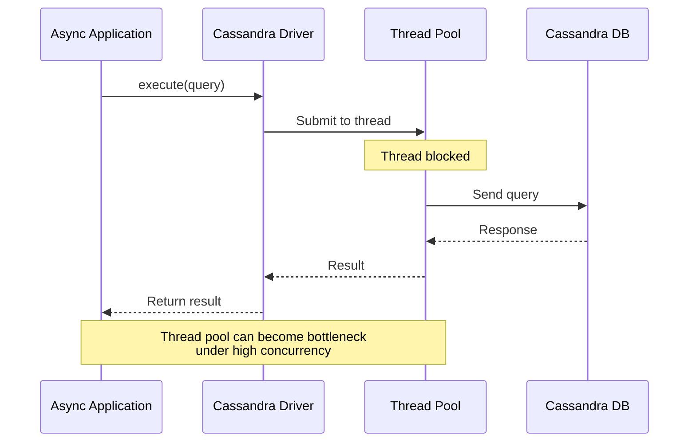
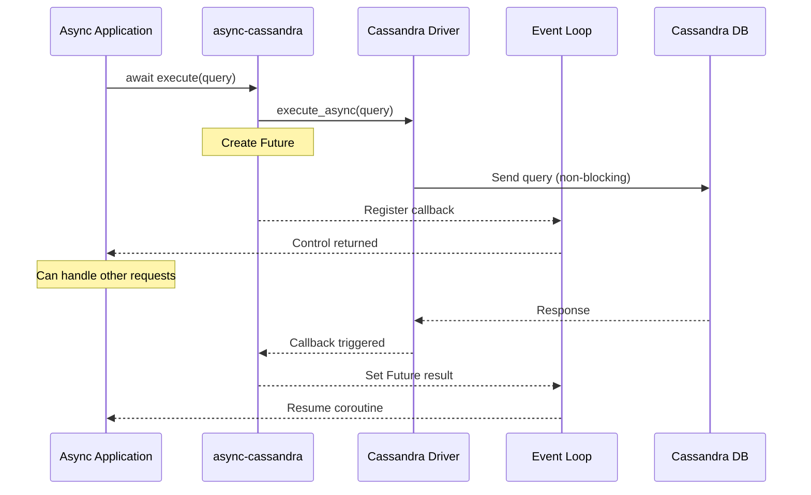
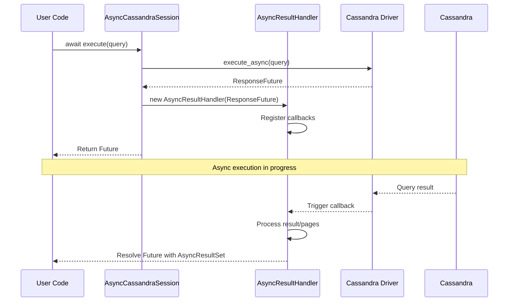
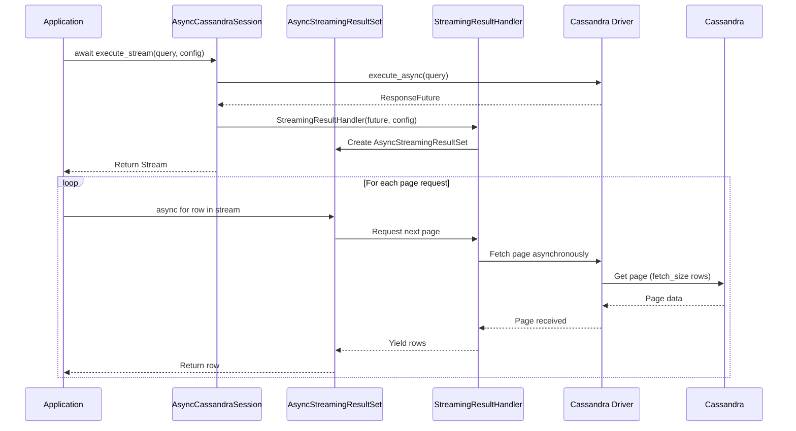

# Architecture Overview

This document provides a high-level overview of how async-cassandra bridges the gap between the synchronous DataStax Cassandra driver and Python's async/await ecosystem.

## Table of Contents

- [Problem Statement](#problem-statement)
- [Solution Architecture](#solution-architecture)
- [Key Components](#key-components)
- [Execution Flow](#execution-flow)
  - [Query Execution](#query-execution)
  - [Streaming Execution](#streaming-execution)
- [Design Principles](#design-principles)

## Problem Statement

The DataStax Cassandra Python driver uses a thread pool for I/O operations, which can create bottlenecks in async applications:

## Solution Architecture

async-cassandra wraps the driver's async operations to provide true async/await support:

## Key Components

### AsyncCluster
- Wraps the DataStax `Cluster` class
- Manages cluster lifecycle (connect, shutdown)
- Provides async context manager support
- Handles authentication and configuration

### AsyncCassandraSession
- Wraps the DataStax `Session` class
- Converts synchronous operations to async/await
- Provides streaming support for large result sets
- Integrates with metrics collection

### AsyncResultSet
- Wraps query results for async consumption
- Handles paging transparently
- Provides familiar result access methods (one(), all())

### AsyncStreamingResultSet
- Enables memory-efficient processing of large results
- Supports async iteration over rows
- Provides page-level access for batch processing
- Includes progress tracking capabilities

## Execution Flow

### Query Execution

The following diagram shows how a standard query flows through the async wrapper:

### Streaming Execution

For large result sets, streaming provides memory-efficient processing:

## Design Principles

### 1. Thin Wrapper Approach
- We wrap, not reimplement, the DataStax driver
- All driver features remain accessible
- Minimal performance overhead

### 2. True Async/Await Support
- All blocking operations converted to async
- Proper integration with Python's event loop
- No blocking of the event loop

### 3. Memory Efficiency
- Streaming support for large result sets
- Configurable fetch sizes
- Page-based processing options

### 4. Developer Experience
- Familiar async/await syntax
- Context manager support
- Type hints throughout

### 5. Production Ready
- Comprehensive error handling
- Metrics and monitoring built-in
- Battle-tested retry policies

## Important Limitations

While async-cassandra provides async/await syntax, it's important to understand:

1. **The underlying I/O is still synchronous** - The DataStax driver uses blocking sockets in threads
2. **Thread pool constraints apply** - Concurrency is limited by the driver's thread pool size
3. **Not a true async driver** - This is a compatibility layer, not a ground-up async implementation

For more details on these limitations and when to use this wrapper, see [Why an Async Wrapper is Necessary](why-async-wrapper.md).
