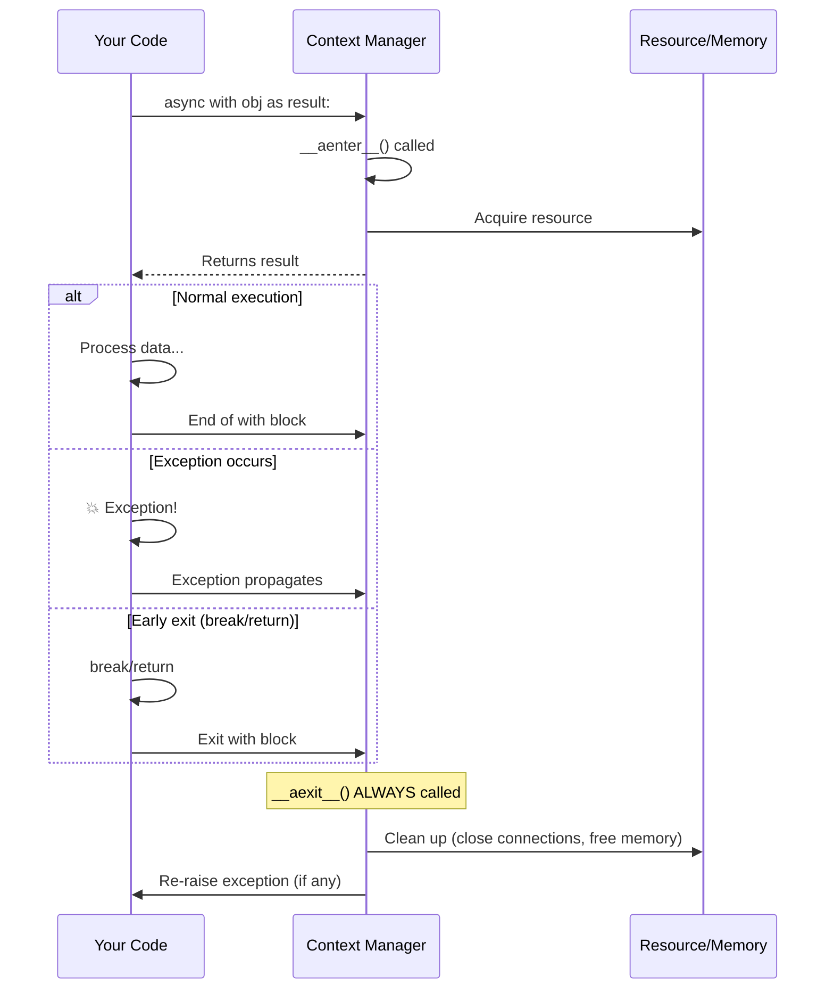

# Understanding Context Managers in async-cassandra

This guide explains how context managers work in Python and why they're critical for preventing memory leaks when using streaming operations in async-cassandra.

## Table of Contents

- [What are Context Managers?](#what-are-context-managers)
- [How Context Managers Work](#how-context-managers-work)
- [The Magic Behind async with](#the-magic-behind-async-with)
- [async-cassandra's Implementation](#async-cassandras-implementation)
- [Error Handling Scenarios](#error-handling-scenarios)
- [Why This Matters for Streaming](#why-this-matters-for-streaming)

## What are Context Managers?

Context managers are Python's way of ensuring that resources are properly cleaned up after use. They guarantee that cleanup code runs even if an error occurs, similar to a try/finally block but more elegant and harder to get wrong.

## How Context Managers Work

When you write `async with`, Python calls special methods on the object to manage its lifecycle:



## The Magic Behind `async with`

Here's what Python actually does when you use a context manager:

```python
# What you write:
async with await session.execute_stream(query) as result:
    async for row in result:
        process(row)

# What Python actually does behind the scenes:
result = await session.execute_stream(query)
await result.__aenter__()  # Called when entering the 'with' block
try:
    async for row in result:
        process(row)
finally:
    await result.__aexit__(exc_type, exc_val, exc_tb)  # ALWAYS called, even on error!
```

The key insight: The `finally` block ensures `__aexit__` runs no matter what happens.

## async-cassandra's Implementation

Here's the actual code from async-cassandra that makes this work:

```python
# From src/async_cassandra/streaming.py:
class AsyncStreamingResultSet:
    async def __aenter__(self):
        """Enter the context manager."""
        return self  # Return self so you can use it

    async def __aexit__(self, exc_type, exc_val, exc_tb):
        """Exit the context manager - THIS ALWAYS RUNS!"""
        await self.close()  # Clean up resources
        return None  # Don't suppress exceptions

    async def close(self):
        """The actual cleanup that prevents memory leaks."""
        self._closed = True
        self._exhausted = True

        # This is the critical part - breaks circular references:
        self._cleanup_callbacks()  # Removes callbacks from driver

        # Clear data to free memory
        self._current_page = []
        self._current_index = 0
```

### What Makes This Critical?

The `_cleanup_callbacks()` method breaks circular references between:
- The `AsyncStreamingResultSet` object
- Callback functions registered with the Cassandra driver
- The `ResponseFuture` from the driver

Without this cleanup, Python's garbage collector cannot free these objects, causing a memory leak.

## Error Handling Scenarios

Context managers handle all these cases gracefully:

### Scenario 1: Exception During Processing
```python
async with await session.execute_stream(query) as result:
    async for row in result:
        if row.id == "bad_id":
            raise ValueError("Bad data!")  # Exception!
        process(row)
# ✅ result.close() still gets called via __aexit__!
```

### Scenario 2: Breaking Out Early
```python
async with await session.execute_stream(query) as result:
    count = 0
    async for row in result:
        process(row)
        count += 1
        if count >= 100:
            break  # Early exit
# ✅ result.close() still gets called!
```

### Scenario 3: Timeout or Cancellation
```python
try:
    async with await session.execute_stream(query) as result:
        async for row in result:
            await asyncio.sleep(1)  # Slow processing
            process(row)
except asyncio.CancelledError:
    print("Operation cancelled!")
# ✅ result.close() was still called before the exception propagated!
```

### Without Context Manager - Memory Leak!
```python
# ❌ DON'T DO THIS:
result = await session.execute_stream(query)
async for row in result:
    if row.id == "bad_id":
        raise ValueError("Bad data!")  # Exception!
# ❌ result.close() NEVER gets called - MEMORY LEAK!
```

## Why This Matters for Streaming

Streaming operations in async-cassandra are particularly vulnerable to memory leaks because:

1. **Long-Running Operations**: Streaming queries can run for minutes or hours
2. **Large Data Sets**: Each leaked result set can hold significant memory
3. **Circular References**: The callback pattern creates reference cycles
4. **Accumulation**: In a web service, leaked objects accumulate over time

### Real-World Impact

Consider a web service that streams data:

```python
@app.get("/export")
async def export_data():
    # Without context manager - LEAKS MEMORY ON EVERY REQUEST!
    result = await session.execute_stream("SELECT * FROM large_table")
    data = []
    try:
        async for row in result:
            data.append(process_row(row))
    except Exception:
        # User cancelled request, network error, etc.
        return {"error": "Export failed"}
    # ❌ result.close() never called - memory leak!
    return {"data": data}
```

Each failed request leaks memory. After hundreds of requests, your service runs out of memory and crashes.

With context manager:

```python
@app.get("/export")
async def export_data():
    # ✅ SAFE - Memory always cleaned up
    async with await session.execute_stream("SELECT * FROM large_table") as result:
        data = []
        async for row in result:
            data.append(process_row(row))
    # Even if exception occurs, memory is freed
    return {"data": data}
```

## Summary

Context managers in Python provide a **guarantee** that cleanup code will run. For async-cassandra streaming:

- Always use `async with` when calling `execute_stream()`
- The cleanup breaks circular references that would otherwise leak memory
- This works even when errors occur, timeouts happen, or operations are cancelled
- It's not just a best practice - it's essential for production stability

The slight extra syntax of `async with` provides bulletproof resource management that manual cleanup simply cannot match.
