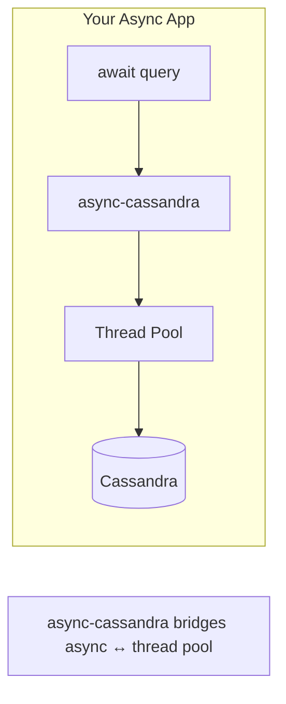

# Performance Guide

This guide provides insights into the performance characteristics of async-cassandra and best practices for optimizing your application.

## Table of Contents

- [Performance Benefits](#performance-benefits)
- [Benchmarks](#benchmarks)
- [Optimization Techniques](#optimization-techniques)
- [Common Pitfalls](#common-pitfalls)
- [Monitoring](#monitoring)

## Understanding Performance

### What async-cassandra Does (and Doesn't Do)

**Important**: async-cassandra does NOT eliminate the Cassandra driver's thread pool or provide raw performance improvements. Instead, it:

✅ **Prevents event loop blocking** - Your web server stays responsive
✅ **Enables async/await syntax** - Clean integration with async frameworks
✅ **Allows concurrent operations** - Via the event loop, not more threads

❌ **Does NOT eliminate threads** - The driver still uses its thread pool internally
❌ **Does NOT speed up queries** - Same underlying driver performance
❌ **Does NOT reduce resource usage** - May actually use slightly more due to the wrapper layer

### How It Works

The Cassandra driver uses blocking I/O with a thread pool:



The key benefit is that while the thread pool handles the blocking I/O, your event loop remains free to handle other requests. This is crucial for web applications where a blocked event loop means no requests can be processed.

## Benchmarking Your Application

To understand the performance characteristics of async-cassandra in your specific use case, you should benchmark with your actual workload:

```python
# Example benchmark setup
async def benchmark_async(session, queries=1000):
    start = time.time()

    # Prepare statement once before the benchmark
    select_stmt = await session.prepare("SELECT * FROM users WHERE id = ?")

    tasks = [
        session.execute(select_stmt, [uuid.uuid4()])
        for _ in range(queries)
    ]

    await asyncio.gather(*tasks)

    return time.time() - start
```

### What to Measure

When benchmarking, consider measuring:

1. **Query latency** at different concurrency levels
2. **Throughput** (queries per second)
3. **Resource usage** (CPU, memory, threads)
4. **Error rates** under load
5. **Connection pool efficiency**

### Factors Affecting Performance

Performance will vary based on:

- **Query complexity**: Simple key lookups vs. complex aggregations
- **Data size**: Row size and result set size
- **Network latency**: Local vs. remote Cassandra cluster
- **Cluster configuration**: Replication factor, consistency levels
- **Hardware**: CPU cores, memory, network bandwidth

## Optimization Techniques

### 1. Connection Pooling

Configure appropriate connection pool settings:

```python
cluster = AsyncCluster(
    contact_points=['localhost'],
    # Thread pool settings
    executor_threads=4,  # Number of reactor threads
    # Protocol settings
    protocol_version=5,
    # Heartbeat to keep connections alive
    idle_heartbeat_interval=30.0
)
```

### 2. Prepared Statements

Always use prepared statements for repeated queries:

```python
# Prepare once
insert_stmt = await session.prepare(
    "INSERT INTO users (id, name, email) VALUES (?, ?, ?)"
)

# Execute many times
async def insert_user(user_data):
    await session.execute(insert_stmt, user_data)

# Bulk insert with high concurrency
users = [(uuid.uuid4(), f"User{i}", f"user{i}@example.com") for i in range(1000)]
await asyncio.gather(*[insert_user(user) for user in users])
```

### 3. Batch Operations

**Important**: Batches in Cassandra are NOT for performance optimization in most cases!

#### When to Use Batches

✅ **Use LOGGED batches for**:
- Atomic writes across multiple tables
- Maintaining consistency

✅ **Use UNLOGGED batches ONLY for**:
- Multiple writes to the **same partition key**

❌ **Do NOT use batches for**:
- Bulk loading data to different partitions
- Performance optimization (it usually makes things worse!)

```python
from cassandra.query import BatchStatement, BatchType

# GOOD: Batch writes to same partition
async def update_user_profile(user_id, updates):
    batch = BatchStatement(batch_type=BatchType.UNLOGGED)

    # All these updates go to the same partition (user_id)
    batch.add("UPDATE users SET email = ? WHERE id = ?", (updates['email'], user_id))
    batch.add("UPDATE users SET name = ? WHERE id = ?", (updates['name'], user_id))
    batch.add("UPDATE users SET updated_at = ? WHERE id = ?", (datetime.now(), user_id))

    await session.execute(batch)

# BAD: Batch writes to different partitions - DON'T DO THIS!
# async def bulk_update_users(updates):
#     batch = BatchStatement(batch_type=BatchType.UNLOGGED)
#     for user_id, email in updates:  # Different user_ids = different partitions!
#         batch.add(update_stmt, (email, user_id))
#     await session.execute(batch)

# GOOD: For different partitions, use concurrent individual writes
async def bulk_update_users(updates):
    update_stmt = await session.prepare(
        "UPDATE users SET email = ? WHERE id = ?"
    )

    # Execute concurrently, not in a batch!
    tasks = [
        session.execute(update_stmt, (email, user_id))
        for user_id, email in updates
    ]
    await asyncio.gather(*tasks)
```

### 4. Query Optimization

#### Use Token-Aware Load Balancing

```python
from cassandra.policies import TokenAwarePolicy, DCAwareRoundRobinPolicy

cluster = AsyncCluster(
    load_balancing_policy=TokenAwarePolicy(
        DCAwareRoundRobinPolicy(local_dc='datacenter1')
    )
)
```

#### Limit Result Set Size

```python
# Use LIMIT clause
result = await session.execute("SELECT * FROM large_table LIMIT 100")

# Or use paging for large results
query = SimpleStatement(
    "SELECT * FROM large_table",
    fetch_size=100  # Fetch 100 rows at a time
)
result = await session.execute(query)
```

### 5. Concurrent Operations

Leverage asyncio for parallel operations:

```python
async def process_users(user_ids):
    # Prepare statement once
    select_stmt = await session.prepare("SELECT * FROM users WHERE id = ?")

    # Fetch all users concurrently
    tasks = [
        session.execute(select_stmt, [uid])
        for uid in user_ids
    ]

    results = await asyncio.gather(*tasks)

    # Process results
    users = [result.one() for result in results]
    return users
```

### 6. Connection Warmup

Pre-warm connections at startup:

```python
async def warmup_connections(session, hosts=3, queries_per_host=10):
    """Pre-establish connections to all nodes."""
    warmup_query = "SELECT key FROM system.local"

    tasks = [
        session.execute(warmup_query)
        for _ in range(hosts * queries_per_host)
    ]

    await asyncio.gather(*tasks, return_exceptions=True)
```

## Common Pitfalls

### 1. Not Using Prepared Statements

❌ **Bad:**
```python
for user_id in user_ids:
    await session.execute(
        f"SELECT * FROM users WHERE id = {user_id}"  # String formatting
    )
```

✅ **Good:**
```python
stmt = await session.prepare("SELECT * FROM users WHERE id = ?")
for user_id in user_ids:
    await session.execute(stmt, [user_id])
```

### 2. Sequential Operations

❌ **Bad:**
```python
users = []
for user_id in user_ids:
    # Sequential - only one query at a time
    stmt = await session.prepare("SELECT * FROM users WHERE id = ?")
    result = await session.execute(stmt, [user_id])
    users.append(result.one())
```

✅ **Good:**
```python
# Prepare statement once
select_stmt = await session.prepare("SELECT * FROM users WHERE id = ?")
tasks = [
    session.execute(select_stmt, [uid])
    for uid in user_ids
]
results = await asyncio.gather(*tasks)
users = [r.one() for r in results]
```

### 3. Unbounded Concurrency

❌ **Bad:**
```python
# Creating 10000 concurrent queries
tasks = [session.execute(query) for _ in range(10000)]
await asyncio.gather(*tasks)
```

✅ **Good:**
```python
# Use semaphore to limit concurrency
sem = asyncio.Semaphore(100)

async def bounded_execute(query):
    async with sem:
        return await session.execute(query)

tasks = [bounded_execute(query) for _ in range(10000)]
await asyncio.gather(*tasks)
```

### 4. Not Handling Retries

❌ **Bad:**
```python
try:
    result = await session.execute(query)
except Exception:
    # Give up immediately
    return None
```

✅ **Good:**
```python
from tenacity import retry, stop_after_attempt, wait_exponential

@retry(
    stop=stop_after_attempt(3),
    wait=wait_exponential(multiplier=1, min=1, max=10)
)
async def execute_with_retry(session, query, params=None):
    return await session.execute(query, params)
```

## Monitoring

### Performance Metrics

Track these key metrics:

```python
import time
from dataclasses import dataclass
from typing import Dict

@dataclass
class QueryMetrics:
    query_count: int = 0
    total_time: float = 0.0
    error_count: int = 0

    @property
    def avg_latency(self) -> float:
        return self.total_time / self.query_count if self.query_count > 0 else 0

class MonitoredSession:
    def __init__(self, session: AsyncCassandraSession):
        self._session = session
        self._metrics: Dict[str, QueryMetrics] = {}

    async def execute(self, query, parameters=None):
        query_str = query if isinstance(query, str) else "prepared"
        metrics = self._metrics.setdefault(query_str, QueryMetrics())

        start = time.time()
        try:
            result = await self._session.execute(query, parameters)
            metrics.query_count += 1
            metrics.total_time += time.time() - start
            return result
        except Exception as e:
            metrics.error_count += 1
            raise

    def get_metrics(self) -> Dict[str, QueryMetrics]:
        return self._metrics.copy()
```

### Connection Pool Monitoring

```python
def log_cluster_metrics(cluster):
    """Log connection pool metrics."""
    metadata = cluster.metadata

    for host in metadata.all_hosts():
        pool = cluster.get_connection_pool(host)
        if pool:
            print(f"Host {host.address}:")
            print(f"  Open connections: {pool.open_count}")
            print(f"  In-flight queries: {pool.in_flight}")
```

### Application-Level Monitoring

```python
from prometheus_client import Counter, Histogram, Gauge

# Define metrics
query_counter = Counter('cassandra_queries_total', 'Total queries executed')
query_duration = Histogram('cassandra_query_duration_seconds', 'Query duration')
active_connections = Gauge('cassandra_active_connections', 'Active connections')

# Instrument your code
async def monitored_execute(session, query, parameters=None):
    with query_duration.time():
        query_counter.inc()
        return await session.execute(query, parameters)
```

## Performance Checklist

- [ ] Use prepared statements for repeated queries
- [ ] Use batches ONLY for same-partition writes or atomicity (not for performance!)
- [ ] Leverage concurrent operations with asyncio.gather()
- [ ] Configure appropriate connection pool settings
- [ ] Use token-aware load balancing
- [ ] Implement retry logic for transient failures
- [ ] Monitor query latency and throughput
- [ ] Limit concurrency to prevent overwhelming the cluster
- [ ] Use appropriate consistency levels for your use case
- [ ] Profile your application to identify bottlenecks
