# Streaming Large Result Sets in async-cassandra

## Understanding Cassandra Paging and Streaming

When you query Cassandra for potentially large result sets, you need to understand how data flows from Cassandra to your application. This guide explains how async-cassandra's streaming works with Cassandra's native paging to efficiently process large amounts of data.

## Table of Contents

- [How Cassandra Paging Works](#how-cassandra-paging-works)
- [The Memory Problem](#the-memory-problem)
- [How Streaming Solves This](#how-streaming-solves-this)
- [Basic Usage](#basic-usage)
- [Understanding Fetch Size](#understanding-fetch-size)
- [Page-by-Page Processing](#page-by-page-processing)
- [Advanced Patterns](#advanced-patterns)
- [Performance Guidelines](#performance-guidelines)
- [Common Pitfalls](#common-pitfalls)

## How Cassandra Paging Works

First, let's understand what happens when you query Cassandra:


### Key Concepts:

1. **Fetch Size = Page Size**: The `fetch_size` parameter controls how many rows Cassandra returns in each "page" (default: 5000). This is the same as setting `statement.fetch_size` in the standard driver.
2. **Page**: A batch of rows returned by Cassandra
3. **Paging State**: A token that tells Cassandra where to continue reading

## The Memory Problem

When using ANY Cassandra driver (sync or async), the `execute()` method automatically fetches ALL pages into memory:

```python
# With the standard cassandra-driver (sync):
result = session.execute("SELECT * FROM billion_row_table")
# The driver fetches ALL pages automatically behind the scenes
# This could use gigabytes of memory!
all_rows = result.all()  # Now you have a billion rows in memory 💥

# With async-cassandra (async):
result = await session.execute("SELECT * FROM billion_row_table")
# SAME PROBLEM - driver fetches ALL pages automatically
all_rows = result.all()  # Still have a billion rows in memory 💥
```

Here's what happens behind the scenes:

```mermaid
sequenceDiagram
    participant App as Your App
    participant Driver as Driver Memory
    participant Cassandra

    App->>Driver: execute() or await execute()

    loop Until all pages fetched
        Driver->>Cassandra: Get page (5000 rows)
        Cassandra-->>Driver: Page data
        Note over Driver: Stores in memory<br/>(accumulating!)
    end

    Driver-->>App: ResultSet with ALL rows in memory
    Note over App: 💥 Out of Memory!
```



## Manual Paging with the Driver

The cassandra-driver does provide manual paging control:

```python
# Using the driver's manual paging (WITHOUT async-cassandra)
from cassandra.cluster import Cluster

cluster = Cluster(['localhost'])
session = cluster.connect()

# Set fetch size (page size)
statement = SimpleStatement("SELECT * FROM billion_row_table")
statement.fetch_size = 1000  # Each page will have 1000 rows

# Execute and get first page
result = session.execute(statement)
page1 = list(result.current_rows)  # First 1000 rows

# Manually fetch next page
if result.has_more_pages:
    result.fetch_next_page()
    page2 = list(result.current_rows)  # Next 1000 rows
```

This works, but has limitations:
1. **Not truly async** - `fetch_next_page()` blocks the event loop
2. **Complex iteration** - You must manually manage page fetching
3. **Error-prone** - Easy to accidentally load all pages into memory

### The Async Problem with Manual Paging

To understand why manual paging doesn't work well with async applications, you need to understand how async/await works:

#### What is the Event Loop?

In async Python applications, there's a single "event loop" that manages all concurrent operations:

```python
# Simplified view of what happens in an async app
async def handle_request_1():
    data = await database.query()  # Event loop switches to other tasks
    return process(data)

async def handle_request_2():
    result = await api.call()      # Event loop switches to other tasks
    return format(result)

# Event loop runs both concurrently by switching between them
```

The magic happens when you use `await` - it tells the event loop "I'm waiting for something, go handle other requests!"

#### Why Blocking Calls Break Everything

Here's what happens when you try manual paging in an async application:

```python
# ❌ BAD: Blocks the event loop!
async def process_with_manual_paging():
    # Even with async-cassandra, manual paging isn't truly async
    result = await session.execute("SELECT * FROM large_table")

    while True:
        # Process current page
        for row in result.current_rows:
            await process_row(row)  # ✅ Async - doesn't block

        if not result.has_more_pages:
            break

        # This BLOCKS the event loop! 😱
        result.fetch_next_page()  # ❌ Synchronous - blocks EVERYTHING
```

When `fetch_next_page()` is called:
1. It makes a network request to Cassandra (could take 10-100ms)
2. During this time, the event loop is FROZEN
3. NO other requests can be processed
4. Your entire application becomes unresponsive

#### Visual Comparison


#### Real-World Impact

Imagine a web server handling 100 requests/second:
- Each `fetch_next_page()` blocks for 50ms
- During those 50ms, 5 new requests arrive but can't be processed
- Those requests timeout or pile up
- Your server appears slow or unresponsive

This is why `fetch_next_page()` not having an async version is a critical limitation!

## How Streaming Solves This

With `execute_stream()`, you get automatic async page management:

```python
# DO THIS for large tables
result = await session.execute_stream(
    "SELECT * FROM billion_row_table",
    stream_config=StreamConfig(fetch_size=1000)
)

# Rows are fetched on-demand as you iterate
async for row in result:
    process_row(row)  # Process one row at a time
    # Old rows are garbage collected
```

Here's the streaming flow:


## ⚠️ CRITICAL: Resource Cleanup

**IMPORTANT**: Streaming result sets MUST be properly closed to prevent memory leaks. The streaming implementation uses callbacks that create circular references between the result set and the response future. Failing to close the result properly will cause memory leaks.

### Preferred Approach: Context Manager (Recommended)

The context manager pattern is the **preferred and safest approach** as it guarantees cleanup even if exceptions occur:

```python
# ✅ BEST PRACTICE: Using context manager (ALWAYS RECOMMENDED)
async with await session.execute_stream(query) as result:
    async for row in result:
        await process_row(row)
# Automatically closed when exiting the context, even on exceptions!
```

### Alternative: Manual Close with try/finally

If you cannot use a context manager for some reason, you MUST ensure cleanup with try/finally:

```python
# ✅ ALTERNATIVE: Manual close with try/finally
result = await session.execute_stream(query)
try:
    async for row in result:
        await process_row(row)
        if some_condition:
            break  # Even with early exit, finally ensures cleanup
finally:
    await result.close()  # CRITICAL: Always close in finally block!
```

### What NOT to Do

```python
# ❌ WRONG: No cleanup - MEMORY LEAK!
result = await session.execute_stream(query)
async for row in result:
    process_row(row)
# Result not closed - callbacks remain in memory forever!

# ❌ WRONG: Close without try/finally - risky!
result = await session.execute_stream(query)
async for row in result:
    process_row(row)  # If this throws, close() is never called!
await result.close()  # Won't run if exception occurs above
```

### Why This Happens

The streaming implementation registers callbacks with the Cassandra driver's response future. These callbacks hold references to the result set, creating a circular reference:

```
AsyncStreamingResultSet ←→ Callbacks ←→ ResponseFuture
```

Without explicit cleanup, Python's garbage collector cannot break this cycle, causing both the result set and any data it holds to remain in memory indefinitely.

> 📖 **Deep Dive**: For a comprehensive explanation of how context managers solve this problem and why they're guaranteed to work, see [Understanding Context Managers](context-managers-explained.md).

## Basic Usage

### Simple Row-by-Row Processing (WITH PROPER CLEANUP)

```python
from async_cassandra import AsyncCluster
from async_cassandra.streaming import StreamConfig

async def process_large_table():
    cluster = AsyncCluster(['localhost'])
    session = await cluster.connect('my_keyspace')

    # Configure streaming
    config = StreamConfig(
        fetch_size=1000  # Same as statement.fetch_size - sets page size to 1000 rows
    )

    # Start streaming query - ALWAYS USE CONTEXT MANAGER
    async with await session.execute_stream(
        "SELECT user_id, email, created_at FROM users",
        stream_config=config
    ) as result:
        # Process rows one at a time
        rows_processed = 0
        async for row in result:
            # At this point, only one page (1000 rows) is in memory
            # When we finish a page, the next one is fetched automatically
            await send_email(row.email)
            rows_processed += 1

            if rows_processed % 1000 == 0:
                print(f"Processed {rows_processed} users...")

        print(f"Done! Processed {rows_processed} total users")
    # Result automatically closed here

    await cluster.shutdown()
```

### What's Really Happening:

1. Query executes with `fetch_size=1000`
2. Cassandra returns first 1000 rows (Page 1)
3. You iterate through these 1000 rows
4. When you need row 1001, the driver fetches Page 2
5. Page 1 can now be garbage collected
6. Process continues until no more pages

## Understanding Fetch Size

The `fetch_size` parameter in `StreamConfig` is exactly the same as the `fetch_size` on Cassandra statements - it controls the page size. This parameter is crucial for performance:

```python
# Small fetch_size = More network requests, less memory
config_small = StreamConfig(fetch_size=100)
# - Fetches 100 rows at a time (page size = 100)
# - Good for: Large rows, limited memory
# - Bad for: Network latency, small rows

# Large fetch_size = Fewer network requests, more memory
config_large = StreamConfig(fetch_size=10000)
# - Fetches 10,000 rows at a time (page size = 10,000)
# - Good for: Small rows, good network
# - Bad for: Large rows, limited memory

# This is equivalent to:
# statement = SimpleStatement("SELECT * FROM table")
# statement.fetch_size = 10000

# How to choose?
row_size_bytes = 1024  # Estimate your average row size
memory_per_page = row_size_bytes * fetch_size
# For 1KB rows and fetch_size=5000: 5MB per page
```

### Fetch Size Comparison:


## Page-by-Page Processing

Sometimes you want to process entire pages at once (e.g., bulk operations):

```python
async def bulk_process_users():
    config = StreamConfig(fetch_size=1000)

    # ALWAYS use context manager for streaming
    async with await session.execute_stream(
        "SELECT * FROM users WHERE active = true",
        stream_config=config
    ) as result:
        # Process entire pages instead of individual rows
        async for page in result.pages():
            # 'page' is a list of up to 1000 rows
            print(f"Processing page {result.page_number} with {len(page)} rows")

            # Bulk operation on entire page
            user_ids = [row.user_id for row in page]
            await bulk_update_last_seen(user_ids)

            # The page is garbage collected after this iteration
    # Result automatically closed here
```

### Page Processing Flow:


## Advanced Patterns

### Pattern 1: Progress Tracking

```python
async def export_with_progress():
    # First, get total count (if needed)
    count_result = await session.execute(
        "SELECT COUNT(*) FROM events WHERE year = 2024"
    )
    total_rows = count_result.one()[0]
    print(f"Exporting {total_rows:,} events...")

    # Stream with progress callback
    rows_processed = 0

    def progress_callback(page_num: int, total_fetched: int):
        percent = (total_fetched / total_rows * 100) if total_rows > 0 else 0
        print(f"Page {page_num}: {total_fetched:,}/{total_rows:,} ({percent:.1f}%)")

    config = StreamConfig(
        fetch_size=5000,
        page_callback=progress_callback
    )

    async with await session.execute_stream(
        "SELECT * FROM events WHERE year = 2024",
        stream_config=config
    ) as result:
        async for row in result:
            await process_event(row)
            rows_processed += 1
```

### Pattern 2: Memory-Efficient Data Export

```python
async def export_to_parquet(table_name: str, output_file: str):
    """Export large table to Parquet without loading all data in memory"""
    import pyarrow as pa
    import pyarrow.parquet as pq

    config = StreamConfig(fetch_size=10000)

    schema = None
    writer = None

    try:
        # ALWAYS use context manager for streaming
        async with await session.execute_stream(
            f"SELECT * FROM {table_name}",
            stream_config=config
        ) as result:
            # Process page by page for efficient memory use
            async for page in result.pages():
                # Convert page to PyArrow table
                if schema is None:
                    # Define schema from first page
                    schema = pa.schema([
                        (field, pa.string()) for field in page[0]._fields
                    ])
                    writer = pq.ParquetWriter(output_file, schema)

                # Convert page to columnar format
                data = {
                    field: [getattr(row, field) for row in page]
                    for field in page[0]._fields
                }

                # Write batch to Parquet
                batch = pa.record_batch(data, schema=schema)
                writer.write_batch(batch)

                print(f"Exported page {result.page_number} "
                      f"({result.total_rows_fetched:,} rows total)")
        # Result automatically closed here

    finally:
        if writer:
            writer.close()
```

### Pattern 3: Parallel Stream Processing

```python
async def parallel_partition_processing():
    """Process multiple partitions in parallel with controlled concurrency"""

    partitions = ['2024-01', '2024-02', '2024-03', '2024-04']

    async def process_partition(partition: str):
        config = StreamConfig(
            fetch_size=2000,
            page_callback=lambda p, t: print(
                f"Partition {partition}: Page {p}, {t:,} rows"
            )
        )

        stmt = await session.prepare(
            "SELECT * FROM events WHERE partition_date = ?"
        )

        async with await session.execute_stream(
            stmt,
            parameters=[partition],
            stream_config=config
        ) as result:
            count = 0
            async for row in result:
                await process_event(row)
                count += 1

            return partition, count

    # Process up to 3 partitions concurrently
    # Each partition streams independently
    from asyncio import Semaphore

    sem = Semaphore(3)  # Limit concurrent partitions

    async def limited_process(partition):
        async with sem:
            return await process_partition(partition)

    results = await asyncio.gather(*[
        limited_process(p) for p in partitions
    ])

    for partition, count in results:
        print(f"Processed {count:,} events from partition {partition}")
```

## Performance Guidelines

### Choosing Fetch Size

| Scenario | Recommended fetch_size | Reasoning |
|----------|----------------------|-----------|
| Small rows (<100 bytes) | 5000-10000 | Minimize network round trips |
| Medium rows (100-1KB) | 1000-5000 | Balance memory and network |
| Large rows (>1KB) | 100-1000 | Prevent memory spikes |
| Limited memory | 100-500 | Keep pages small |
| High latency network | 10000+ | Reduce round trips |

### Memory Usage Calculation

```python
def calculate_memory_usage(avg_row_size_bytes: int, fetch_size: int) -> dict:
    """Calculate memory usage for different fetch sizes"""

    page_memory_mb = (avg_row_size_bytes * fetch_size) / (1024 * 1024)

    # For a table with 1 million rows
    total_rows = 1_000_000
    total_pages = total_rows // fetch_size

    return {
        "memory_per_page_mb": round(page_memory_mb, 2),
        "total_pages": total_pages,
        "network_round_trips": total_pages,
        "max_memory_mb": round(page_memory_mb, 2),  # Only one page in memory
    }

# Example calculations
small_rows = calculate_memory_usage(100, 5000)    # 100-byte rows
print(f"Small rows: {small_rows}")
# Output: {'memory_per_page_mb': 0.48, 'total_pages': 200,
#          'network_round_trips': 200, 'max_memory_mb': 0.48}

large_rows = calculate_memory_usage(10240, 500)   # 10KB rows
print(f"Large rows: {large_rows}")
# Output: {'memory_per_page_mb': 4.88, 'total_pages': 2000,
#          'network_round_trips': 2000, 'max_memory_mb': 4.88}
```

## Common Pitfalls

### ❌ Pitfall 1: Not Using Context Manager - MEMORY LEAK!

```python
# ❌ WRONG - Memory leak!
result = await session.execute_stream("SELECT * FROM huge_table")
async for row in result:
    process_row(row)
# Callbacks not cleaned up - circular reference remains!

# ✅ CORRECT - Always use context manager
async with await session.execute_stream("SELECT * FROM huge_table") as result:
    async for row in result:
        process_row(row)
# Automatically cleaned up
```

### ❌ Pitfall 2: Collecting All Rows Defeats Streaming

```python
# DON'T DO THIS - defeats the purpose of streaming!
async with await session.execute_stream(
    "SELECT * FROM huge_table",
    stream_config=StreamConfig(fetch_size=1000)
) as result:
    # This loads everything into memory!
    all_rows = []
    async for row in result:
        all_rows.append(row)  # ❌ Accumulating in memory

# DO THIS INSTEAD
async with await session.execute_stream(
    "SELECT * FROM huge_table",
    stream_config=StreamConfig(fetch_size=1000)
) as result:
    async for row in result:
        await process_row(row)  # ✅ Process and discard
```

### ❌ Pitfall 2: Using LIMIT with Streaming

```python
# Unnecessary - LIMIT already bounds the result
result = await session.execute_stream(
    "SELECT * FROM users LIMIT 100",  # Only 100 rows!
    stream_config=StreamConfig(fetch_size=1000)
)

# Just use regular execute for small results
result = await session.execute("SELECT * FROM users LIMIT 100")
```

### ❌ Pitfall 3: Not Handling Connection Issues

```python
# DO implement retry logic for large streams
async def reliable_stream_processing():
    last_processed_id = None

    while True:
        try:
            query = "SELECT * FROM events"
            if last_processed_id:
                query += f" WHERE id > '{last_processed_id}'"
            query += " ALLOW FILTERING"  # Be careful with this!

            async with await session.execute_stream(
                query,
                stream_config=StreamConfig(fetch_size=5000)
            ) as result:
                async for row in result:
                    await process_event(row)
                    last_processed_id = row.id

                break  # Success, exit loop

        except Exception as e:
            print(f"Stream failed after {last_processed_id}, retrying: {e}")
            await asyncio.sleep(5)
```

### ❌ Pitfall 4: Wrong Timeout Settings

```python
# Streaming large tables takes time!
result = await session.execute_stream(
    "SELECT * FROM billion_row_table",
    timeout=10.0,  # ❌ 10 seconds is too short!
    stream_config=StreamConfig(fetch_size=5000)
)

# Use appropriate timeout or no timeout
result = await session.execute_stream(
    "SELECT * FROM billion_row_table",
    timeout=None,  # ✅ No timeout for streaming
    stream_config=StreamConfig(fetch_size=5000)
)
```

## Quick Decision Guide

### When to Use Streaming?


## Example: Real-World ETL Pipeline

Here's a complete example showing how to build a robust ETL pipeline:

```python
import asyncio
from datetime import datetime
from typing import AsyncIterator

async def etl_pipeline(
    source_table: str,
    transform_func,
    destination_table: str,
    batch_size: int = 1000
):
    """
    Extract, transform, and load data efficiently
    """
    start_time = datetime.now()
    total_processed = 0
    failed_rows = []

    # Prepare insert statement for destination
    insert_stmt = await session.prepare(
        f"INSERT INTO {destination_table} (id, data, processed_at) "
        "VALUES (?, ?, ?)"
    )

    # Stream from source table
    config = StreamConfig(
        fetch_size=batch_size,
        page_callback=lambda p, t: print(
            f"[ETL] Page {p}: Extracted {t:,} rows from {source_table}"
        )
    )

    # Stream from source - ALWAYS use context manager
    async with await session.execute_stream(
        f"SELECT * FROM {source_table}",
        stream_config=config
    ) as result:
        # Process in batches for efficiency
        batch = []

        async for row in result:
            try:
                # Transform
                transformed = await transform_func(row)

                # Add to batch
                batch.append((
                    transformed['id'],
                    transformed['data'],
                    datetime.now()
                ))

                # Load batch when full
                if len(batch) >= batch_size:
                    await load_batch(insert_stmt, batch)
                    total_processed += len(batch)
                    batch = []

            except Exception as e:
                failed_rows.append((row.id, str(e)))

        # Load final partial batch
        if batch:
            await load_batch(insert_stmt, batch)
            total_processed += len(batch)
    # Result automatically closed here

    # Report results
    duration = (datetime.now() - start_time).total_seconds()
    print(f"\nETL Pipeline Complete:")
    print(f"- Processed: {total_processed:,} rows")
    print(f"- Failed: {len(failed_rows)} rows")
    print(f"- Duration: {duration:.1f} seconds")
    print(f"- Rate: {total_processed/duration:.1f} rows/second")

    return {
        'processed': total_processed,
        'failed': failed_rows,
        'duration': duration
    }

async def load_batch(prepared_stmt, batch):
    """Load a batch of transformed data"""
    # Use execute_concurrent for parallel inserts
    from cassandra.concurrent import execute_concurrent_with_args

    await asyncio.get_event_loop().run_in_executor(
        None,
        lambda: execute_concurrent_with_args(
            session._session,
            prepared_stmt,
            batch,
            concurrency=50
        )
    )
```

## Conclusion

The key to understanding streaming in async-cassandra is recognizing that:

1. **Cassandra returns data in pages** (controlled by `fetch_size`)
2. **Regular execute() fetches ALL pages** into memory automatically
3. **execute_stream() fetches pages on-demand** as you iterate
4. **Memory usage is bounded** to approximately one page at a time

Choose streaming when you need to process large result sets without overwhelming your application's memory. The slight complexity is worth it for the memory efficiency and control it provides.
