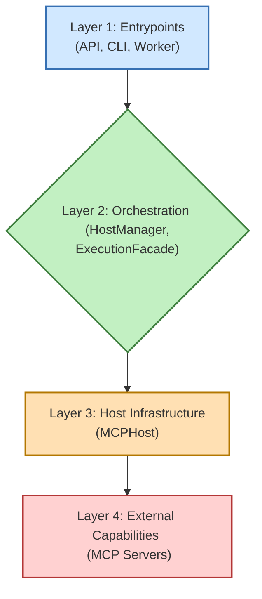

# Aurite Agents Framework

**Aurite Agents** is a Python framework designed for building and orchestrating AI agents. These agents can interact with a variety of external tools, prompts, and resources through the Model Context Protocol (MCP), enabling them to perform complex tasks.

Whether you're looking to create sophisticated AI assistants, automate processes, or experiment with agentic workflows, Aurite Agents provides the building blocks and infrastructure to get you started.

## Getting Started

To install the framework as a python package, see [Package Installation Guide](https://github.com/Aurite-ai/aurite-agents/blob/main/docs/package_installation_guide.md).

## Core Concepts for Users

Understanding these concepts will help you configure and use the Aurite Agents framework effectively.

### 1. Projects

A **Project** in Aurite Agents is defined by a JSON configuration file (e.g., `aurite_config.json`). This file acts as a central manifest for your agentic application, specifying:
*   The name and description of the project.
*   Which LLM configurations to use (`llms`).
*   Which MCP Servers to connect to (`mcp_servers`).
*   Which Agents, Simple Workflows, and Custom Workflows are part of this project.

The active project configuration tells the `Aurite` class what components to load and make available.

For more information on project configuration files, see [Projects](https://github.com/Aurite-ai/aurite-agents/blob/main/docs/components/PROJECT.md).

### 2. Agentic Components

These are the primary building blocks you'll work with:

*   **Agents (`src/agents/agent.py`):**
    *   LLM-powered entities that can engage in conversations, use tools, and optionally maintain history.
    *   Configured via `AgentConfig` models, typically stored in JSON files (e.g., `config/agents/my_weather_agent.json`) and referenced in your project file.
    *   Key settings include the LLM to use, system prompts, and rules for accessing MCP Servers.

    ```mermaid
    graph TD
        Agent["Agent <br/> (src/agents/agent.py)"] --> LLM["LLM <br/> (e.g., Claude, GPT)"];
        Agent --> MCP_Servers["MCP Servers <br/> (Connections)"];

        MCP_Servers --> MCP1["MCP Server 1 <br/> (e.g., Weather Tool)"];
        MCP_Servers --> MCP2["MCP Server 2 <br/> (e.g., Database)"];
        MCP_Servers --> MCP3["MCP Server 3 <br/> (e.g., Custom API)"];

        style Agent fill:#ADD8E6,stroke:#00008B,stroke-width:2px,color:#333333
        style LLM fill:#FFFFE0,stroke:#B8860B,stroke-width:2px,color:#333333
        style MCP1 fill:#90EE90,stroke:#006400,stroke-width:2px,color:#333333
        style MCP2 fill:#90EE90,stroke:#006400,stroke-width:2px,color:#333333
        style MCP3 fill:#90EE90,stroke:#006400,stroke-width:2px,color:#333333
    ```
    *   For more information on Agents, see [Agents](https://github.com/Aurite-ai/aurite-agents/blob/main/docs/components/agent.md).

*   **Simple Workflows (`src/workflows/simple_workflow.py`):**
    *   Define a sequence of Agents to be executed one after another.
    *   Configured via `WorkflowConfig` models (e.g., `config/workflows/my_simple_sequence.json`).
    *   Useful for straightforward, multi-step tasks where the output of one agent becomes the input for the next.

    ```mermaid
    graph LR
        Agent1["Agent A"] -->|Input/Output| Agent2["Agent B"];
        Agent2 -->|Input/Output| Agent3["Agent C"];

        style Agent1 fill:#ADD8E6,stroke:#00008B,stroke-width:2px,color:#333333
        style Agent2 fill:#ADD8E6,stroke:#00008B,stroke-width:2px,color:#333333
        style Agent3 fill:#ADD8E6,stroke:#00008B,stroke-width:2px,color:#333333
    ```
    *   For more information on Simple Workflows, see [Simple Workflows](https://github.com/Aurite-ai/aurite-agents/blob/main/docs/components/simple_workflow.md).

*   **Custom Workflows (`src/workflows/custom_workflow.py`):**
    *   Allow you to define complex orchestration logic using custom Python classes.
    *   Configured via `CustomWorkflowConfig` models, pointing to your Python module and class.
    *   Provide maximum flexibility for intricate interactions and conditional logic. Here's a conceptual example of what a custom workflow class might look like:
    ```python
    # Example: src/my_custom_workflows/my_orchestrator.py class definition
    class MyCustomOrchestrator:
        async def execute_workflow(
            self,
            initial_input: Any,
            executor: "ExecutionFacade", # Type hint for the passed executor
            session_id: Optional[str] = None # Optional session_id
        ) -> Any:

            # --- Your custom Python orchestration logic here ---
            # You can call other agents, simple workflows, or even other custom workflows
            # using the 'executor' instance.

            # Example: Call an agent
            agent_result = await executor.run_agent(
                agent_name="MyProcessingAgent",
                user_message=str(initial_input), # Ensure message is a string
            )

            processed_data = agent_result.final_response.content[0].text

            # Example: Call a simple workflow
            simple_workflow_result = await executor.run_simple_workflow(
                workflow_name="MyFollowUpWorkflow",
                initial_input=processed_data
            )
            simple_workflow_output = simple_workflow_result.get("final_message")

            # Example: Call a custom workflow
            custom_workflow_result = await executor.run_custom_workflow(custom_workflow_name="MyCustomWorkflow", initial_input=simple_workflow_output)

            return custom_workflow_result
    ```
    To use this custom workflow:
      1. Save this code into a Python file (e.g., in src/my_custom_workflows/basic_executor_example.py).
      2. In your project's JSON configuration (e.g., config/projects/default.json), add or update a custom_workflow entry like this:
    ```json
    {
      "custom_workflows": [
        {
          "name": "MyBasicWorkflowExample",
          "module_path": "src.my_custom_workflows.basic_executor_example",
          "class_name": "BasicExecutorExampleWorkflow",
          "description": "A basic example demonstrating custom workflow executor usage."
        }
        // ... any other custom workflows
      ]
    }
    ```
    * (Ensure this fits into your overall project JSON structure, typically under a "custom_workflows" key)
    1. Ensure the agent named "YourConfiguredAgentName" (or whatever name you use in the code) is also defined in the 'agents' section of your project configuration.

    * For more information on Custom Workflows, see [Custom Workflows](https://github.com/Aurite-ai/aurite-agents/blob/main/docs/components/simple_workflow.md).

### 3. LLM Configurations

*   Define settings for different Large Language Models (e.g., model name, temperature, max tokens).
*   Managed by `LLMConfig` models, typically stored in `config/llms/default_llms.json` or a custom file.
*   Agents reference these LLM configurations by their `llm_id`, allowing you to easily switch or share LLM settings.
*   The core LLM client abstraction is `src/llm/base_client.py`.

*   For more information on LLM Configurations, see [LLM Configurations](https://github.com/Aurite-ai/aurite-agents/blob/main/docs/components/llm.md).

### 4. MCP Servers (as Clients)

*   External processes that provide tools, prompts, or resources according to the Model Context Protocol (MCP).
*   The Aurite framework connects to these servers to provide capabilities to agents.
*   Configured via `ClientConfig` models (e.g., `config/mcp_servers/mcp_servers.json`), specifying the server's path, capabilities, and access rules.
*   An example MCP server is `src/packaged/example_mcp_servers/weather_mcp_server.py`.

*   For more information on MCP Server Configurations, see [MCP Servers](https://github.com/Aurite-ai/aurite-agents/blob/main/docs/components/mcp_server.md).


## Architecture Overview

The framework follows a layered architecture, illustrated below:



For a comprehensive understanding of the architecture, component interactions, and design principles, please see [`docs/layers/framework_overview.md`](https://github.com/Aurite-ai/aurite-agents/blob/main/docs/layers/framework_overview.md). Detailed information on each specific layer can also be found in the `docs/layers/` directory.

## Entrypoints

**Running the Backend API Server:**
The primary way to interact with the framework is through its FastAPI server:
```bash
python -m aurite.bin.api.api
```
or use the `pyproject.toml` script:
```bash
start-api
```
(This script is available after running `pip install -e .[dev]`. If using Docker, the API starts automatically within its container.)

*   By default, it starts on `http://0.0.0.0:8000`. You can then send requests to its various endpoints to execute agents, register components, etc. (e.g., using Postman or `curl`).

**API Documentation:**
The API server automatically provides interactive documentation:
*   **Swagger UI:** `http://localhost:8000/api-docs` - Interactive API testing interface
*   **ReDoc:** `http://localhost:8000/redoc` - Clean, readable documentation
*   **OpenAPI JSON:** `http://localhost:8000/openapi.json` - Raw specification for tooling

The Swagger UI allows you to:
- Explore all available endpoints
- Test API calls directly from your browser
- Authenticate with your API key
- See request/response examples and schemas

For more details on the OpenAPI integration, see [OpenAPI Integration Guide](https://github.com/Aurite-ai/aurite-agents/blob/main/docs/openapi_integration.md).

*   Besides the main API server, the framework offers other ways to interact:


**Command-Line Interface (`src/bin/cli.py`):** For terminal-based interaction.
The `run-cli` script is available after performing the Manual Installation and running `pip install -e .[dev]`.*
```bash
# Example: Execute an agent (ensure API server is running)
# Assumes API_KEY environment variable is set.
run-cli execute agent "Weather Agent" "What is the weather in London?"

# Example: Execute a simple workflow
run-cli execute workflow "Weather Planning Workflow" "What should I wear in San Francisco today?"

# Example: Execute a custom workflow (input must be a valid JSON string)
run-cli execute custom-workflow "ExampleCustomWorkflow" "{\"city\": \"London\"}"
```

**Using CLI with Docker:** If you are using the Docker setup, these CLI commands need to be run *inside* the backend service container. You can do this by first finding your backend container ID or name (e.g., using `docker ps`) and then executing the command:
```bash
docker exec -it <your_backend_container_name_or_id> run-cli execute agent "Weather Agent" "What is the weather in London?"
```
Ensure the `API_KEY` environment variable is set within the container's environment (it should be if you used the setup scripts or configured your `.env` file correctly).

## Further Documentation

*   **Framework Architecture:** For a detailed understanding of the internal architecture, component interactions, and design principles, please see [`docs/layers/framework_overview.md`](https://github.com/Aurite-ai/aurite-agents/blob/main/docs/layers/framework_overview.md).
*   **Layer-Specific Details:**
    *   [`docs/layers/1_entrypoints.md`](https://github.com/Aurite-ai/aurite-agents/blob/main/docs/layers/1_entrypoints.md) (API, CLI, Worker)
    *   [`docs/layers/2_orchestration.md`](https://github.com/Aurite-ai/aurite-agents/blob/main/docs/layers/2_orchestration.md) (HostManager, ExecutionFacade)
    *   [`docs/layers/3_host.md`](https://github.com/Aurite-ai/aurite-agents/blob/main/docs/layers/3_host.md) (MCPHost System)
*   **Testing:** Information on running tests can be found in [`tests/README.md`](https://github.com/Aurite-ai/aurite-agents/blob/main/tests/README.md). Testing strategies for each layer are also detailed within their respective documentation in `docs/layers/`.

## Contributing

Contributions are welcome! Please follow standard fork/pull request workflows. Ensure tests pass and documentation is updated for any changes.
