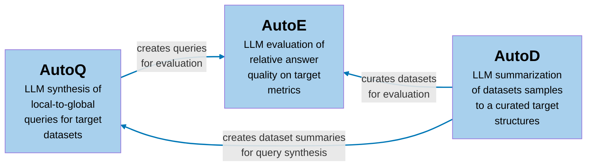

# BenchmarkQED

👉 [Microsoft Research Blog Post](https://www.microsoft.com/en-us/research/blog/benchmarkqed-automated-benchmarking-of-rag-systems/) 
👉 [BenchmarkQED Docs](https://microsoft.github.io/benchmark-qed/) 

  
  
  

## Overview

BenchmarkQED is a suite of tools designed for automated benchmarking of retrieval-augmented generation (RAG) systems. It provides components for query generation, evaluation, and dataset preparation to facilitate reproducible testing at scale.

- **AutoQ:** Generates four classes of synthetic queries with variable data scope, ranging from <i>local queries</i> (answered using a small number of text regions) to <i>global queries</i> (requiring reasoning over large portions or the entirety of a dataset).
- **AutoE:** Evaluates RAG answers by comparing them side-by-side on key metrics—relevance, comprehensiveness, diversity, and empowerment—using the LLM-as-a-Judge approach. When ground truth is available, AutoE can also assess correctness, completeness, and other custom metrics.
- **AutoD:** Provides data utilities for sampling and summarizing datasets, ensuring consistent inputs for query synthesis.

In addition to the tools, we also release two datasets to support the development and evaluation of RAG systems:

- **Podcast Transcripts:** Transcripts of 70 episodes of the [Behind the Tech](https://www.microsoft.com/en-us/behind-the-tech) podcast series. This is an updated version of the podcast transcript dataset used in the [GraphRAG](https://arxiv.org/abs/2404.16130) paper. 
- **AP News:** A collection of 1,397 health-related news articles from the Associated Press.

## Getting Started
Instructions for getting started can be found [here](https://microsoft.github.io/benchmark-qed/).

## Contributing

This project welcomes contributions and suggestions.  Most contributions require you to agree to a
Contributor License Agreement (CLA) declaring that you have the right to, and actually do, grant us
the rights to use your contribution. For details, visit https://cla.opensource.microsoft.com.

When you submit a pull request, a CLA bot will automatically determine whether you need to provide
a CLA and decorate the PR appropriately (e.g., status check, comment). Simply follow the instructions
provided by the bot. You will only need to do this once across all repos using our CLA.

This project has adopted the [Microsoft Open Source Code of Conduct](https://opensource.microsoft.com/codeofconduct/).
For more information see the [Code of Conduct FAQ](https://opensource.microsoft.com/codeofconduct/faq/) or
contact [opencode@microsoft.com](mailto:opencode@microsoft.com) with any additional questions or comments.

## Trademarks

This project may contain trademarks or logos for projects, products, or services. Authorized use of Microsoft 
trademarks or logos is subject to and must follow 
[Microsoft's Trademark & Brand Guidelines](https://www.microsoft.com/en-us/legal/intellectualproperty/trademarks/usage/general).
Use of Microsoft trademarks or logos in modified versions of this project must not cause confusion or imply Microsoft sponsorship.
Any use of third-party trademarks or logos are subject to those third-party's policies.

## Privacy & Cookies

[Microsoft Privacy Statement](https://go.microsoft.com/fwlink/?LinkId=521839)
