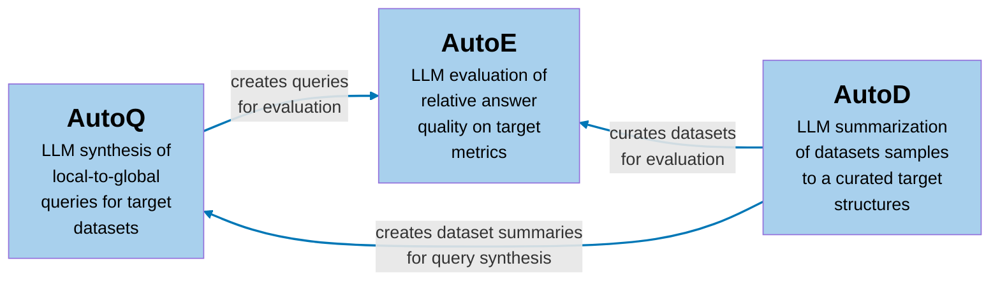

# Welcome to BenchmarkQED


BenchmarkQED is a suite of tools designed for automated benchmarking of retrieval-augmented generation (RAG) systems. It provides components for query generation, evaluation, and dataset preparation to facilitate reproducible testing at scale.

## Getting Started

### Installation Instructions

Install [Python 3.11+](https://www.python.org/downloads/)

To get started with BenchmarkQED, you have two options:

1. [Install from PyPI](https://pypi.org/project/benchmark-qed/): 
```sh
pip install benchmark-qed
```
2. [Use it from source](./developing.md)

## Usage
The sections below describe the three main components of BenchmarkQED—AutoQ, AutoE, and AutoD. You will also find step-by-step examples demonstrating how to use AutoQ and AutoE, using the Install from PyPI option.

### AutoQ


The AutoQ component generates four synthetic query classes based on the scope and source of the dataset. 

- *Query Scope*: the extent of the dataset that the question addresses
    - *Local* queries targeting specific details of a text corpus (e.g., *"What are the public health implications of the Alaskapox virus in Alaska?"*)
    - *Global* queries targeting general aspects of a text corpus such as common themes, trends, concerns (e.g., *"Across the dataset, what are the main public health initiatives mentioned that target underserved communities?"*)

- *Query Source*: the information used to generated local and global queries
    - *Data-driven* queries based on text sampled from the overall corpus
    - *Activity-driven* queries based on potential activities consistent with the data

AutoQ can be configured to generate any number and distribution of synthetic queries along these classes.

> **Note:** AutoQ generates queries only; it does **not** produce reference (ground truth) answers for these queries.

#### Example

Please follow these steps to generate synthetic queries from the [AP news dataset](https://github.com/microsoft/benchmark-qed/tree/main/datasets/AP_news/raw_data):

1. **Set up your project directory:**
    ```sh
    mkdir -p ./local/autoq_test
    cd ./local/autoq_test
    ```

2. **Download the AP news dataset into the `input` subfolder**:
    ```sh
    mkdir ./input
    benchmark-qed data download AP_news input
    ```
    Alternatively, you can manually download the files from the [AP News datasets folder](https://github.com/microsoft/benchmark-qed/tree/main/datasets/AP_news/raw_data).

3. **Create a configuration file:**
    ```sh
    benchmark-qed config init autoq .
    ```
    This command creates two files in the `./autoq_test` directory:
    - `.env`: Contains environment variables for the AutoQ pipeline. Open this file and replace `<API_KEY>` with your own OpenAI or Azure API key.
    - `settings.yaml`: Contains pipeline settings, which you can modify as needed.

4. **Generate all synthetic query classes:**
    ```sh
    benchmark-qed autoq settings.yaml output
    ```

For detailed instructions on configuring and running AutoQ from the command line, see the [AutoQ CLI Documentation](cli/autoq.md).

To learn more about the query synthesis process and using AutoQ programmatically, refer to the [AutoQ Notebook Example](notebooks/autoq.ipynb).

### AutoE
AutoE automates the evaluation of RAG methods using the LLM-as-a-Judge approach. It takes as input a set of queries (created by AutoQ or other sources) and corresponding answers generated by RAG systems (produced outside of BenchmarkQED). AutoE provides three evaluation methods:

1. **Pairwise comparison**: For each query, AutoE presents an LLM with pairs of answers (along with the query and target metric) in a counterbalanced order, and the model judges whether the first answer wins, loses, or ties with the second. Aggregating these judgments across multiple queries and trials yields **win rates** for each method. By default, AutoE compares RAG answers using [four quality metrics](https://github.com/microsoft/benchmark-qed/blob/799b78b6716a8f24fcd354b89a37b429ba1e587a/benchmark_qed/config/model/score.py#L28): relevance, comprehensiveness, diversity, and empowerment.

2. **Reference-based scoring**: When reference answers (such as ground truth or "gold standard" responses) are available, AutoE can evaluate RAG-generated answers against these references using [default metrics](https://github.com/microsoft/benchmark-qed/blob/799b78b6716a8f24fcd354b89a37b429ba1e587a/benchmark_qed/config/model/score.py#L50) like correctness, completeness, or other user-defined criteria on a customizable scoring scale.

3. **Assertion-based scoring**: AutoE can evaluate RAG answers against user-defined assertions. The LLM judge determines whether each answer satisfies the given assertions, providing binary pass/fail scores. This method is particularly useful for testing specific requirements or compliance with predefined criteria.

> **Choosing the Right LLM Judge**
>
> Selecting an appropriate LLM judge is **crucial** for reliable evaluation. Less capable models can introduce biases or produce unreliable results. To validate your judge model, start with an **A/A test**—compare a RAG method against itself. The expected outcome is a win rate of 0.5, with no statistically significant difference between the two sets of answers. Additionally, manually review the LLM’s scoring and reasoning to spot any systematic errors or biases in its judgments.

#### Example 1: Relative comparison of RAG methods

Please follow these steps to perform a relative comparison of RAG methods using example question-answer data generated from the [AP news dataset](https://github.com/microsoft/benchmark-qed/tree/main/docs/notebooks/example_answers):

1. **Set up your project directory:**
    ```sh
    mkdir -p ./local/pairwise_test
    cd ./local/pairwise_test
    ```

2. **Download the RAG answers into the `input` subfolder**:
    ```sh
    mkdir ./input
    benchmark-qed data download example_answers input
    ```
    Alternatively, you can manually copy the files inside the [example answers folder](https://github.com/microsoft/benchmark-qed/tree/main/docs/notebooks/example_answers).

3. **Create a configuration file for pairwise comparison:**
    ```sh
    benchmark-qed config init autoe_pairwise .
    ```
    This command creates two files in the `./pairwise_test` directory:
    - `.env`: Contains environment variables for the pairwise comparison tests. Open this file and replace `<API_KEY>` with your own OpenAI or Azure API key.
    - `settings.yaml`: Contains pipeline settings, which you can modify as needed.

4. **Run the pairwise comparison:**
    ```sh
    benchmark-qed autoe pairwise-scores settings.yaml output
    ```

#### Example 2: Scoring of RAG answers against reference answers
Please follow these steps to score RAG answers against reference answers using example data from the [AP news dataset](https://github.com/microsoft/benchmark-qed/tree/main/docs/notebooks/example_answers):

1. **Set up your project directory:**
    ```sh
    mkdir -p ./local/reference_test
    cd ./local/reference_test
    ```

2. **Download the RAG answers and reference answers into the `input` subfolder**:
    ```sh
    mkdir ./input
    benchmark-qed data download example_answers input
    ```
    Alternatively, you can manually copy the files inside the [example data folder](https://github.com/microsoft/benchmark-qed/tree/main/docs/notebooks/example_answers).

3. **Create a configuration file for reference scoring:**
    ```sh
    benchmark-qed config init autoe_reference .
    ```
    This command creates two files in the `./reference_test` directory:
    - `.env`: Contains environment variables for the reference scoring tests. Open this file and replace `<API_KEY>` with your own OpenAI or Azure API key.
    - `settings.yaml`: Contains pipeline settings, which you can modify as needed.

4. **Run the reference scoring:**
    ```sh
    benchmark-qed autoe reference-scores settings.yaml output
    ```

#### Example 3: Assertion-based scoring of RAG answers
Please follow these steps to evaluate RAG answers against predefined assertions using example data from the [AP news dataset](https://github.com/microsoft/benchmark-qed/tree/main/docs/notebooks/example_answers):

1. **Set up your project directory:**
    ```sh
    mkdir -p ./local/assertion_test
    cd ./local/assertion_test
    ```

2. **Download the RAG answers into the `input` subfolder**:
    ```sh
    mkdir ./input
    benchmark-qed data download example_answers input
    ```
    Alternatively, you can manually copy the files inside the [example data folder](https://github.com/microsoft/benchmark-qed/tree/main/docs/notebooks/example_answers).

3. **Create a configuration file for assertion scoring:**
    ```sh
    benchmark-qed config init autoe_assertion .
    ```
    This command creates two files in the `./assertion_test` directory:
    - `.env`: Contains environment variables for the assertion scoring tests. Open this file and replace `<API_KEY>` with your own OpenAI or Azure API key.
    - `settings.yaml`: Contains pipeline settings, which you can modify as needed.

4. **Run the assertion scoring:**
    ```sh
    benchmark-qed autoe assertion-scores settings.yaml output
    ```

For more details on configuring and running AutoE, see the [AutoE CLI Documentation](cli/autoe.md).


For detailed instructions on configuring and running AutoE subcommands, please refer to the [AutoE CLI Documentation](cli/autoe.md).

To learn how to use AutoE programmatically, please see the [AutoE Notebook Example](notebooks/autoe.ipynb).


### AutoD

The AutoD component provides two main data utitilies:

- Data sampling: Samples datasets to meet a target specification, defined by the number of topic clusters (breadth) and the number of samples per cluster (depth)

- Data summarization: Summarizes input or output datasets in a way that reflect their topic coverage, using a map-reduce process. These summaries play an important role in the AutoQ query synthesis process, but they can also be used more broadly, such as in prompts where context space is limited. 

To learn more about AutoD's data utilities, please see: [AutoD Notebook Example](notebooks/autod.ipynb).