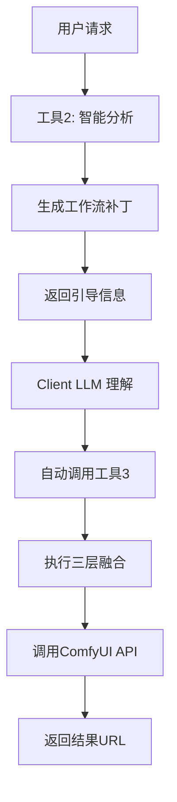

# ComfyFusion Engine - 智能化 ComfyUI 工作流执行引擎

🚀 基于 FastMCP 2.0+ 的 ComfyUI 智能代理服务，采用创新的三工具协作架构和流式协议设计。

## 🌟 核心特性

### 三工具协作架构
- **工具1 (`list_workflows`)**：工作流枚举器，提供可用工作流清单
- **工具2 (`analyze_and_execute`)**：智能分析器，分析用户需求并生成工作流补丁
- **工具3 (`execute_workflow`)**：纯执行引擎，执行三层融合和ComfyUI调用

### LLM引导的工具链协作
- 工具2不直接调用工具3，而是通过返回引导信息让Client LLM自动调用工具3
- 实现真正的MCP协议合规的工具链协作
- 符合FastMCP最佳实践

### 流式协议支持
- 所有工具函数支持 `AsyncGenerator` 流式返回
- 提供实时执行反馈和进度跟踪
- 支持流式错误处理和状态更新

### 三层融合架构
```
用户输入层 (Dynamic Patch)   [最高优先级]
    ⬇️ 覆盖合并
静态配置层 (Template)        [中间优先级] 
    ⬇️ 覆盖合并
基础工作流层 (Workflow)       [基础蓝图]
```

## 🛠️ 技术栈

- **FastMCP** >= 2.0.0 - MCP服务器框架
- **Pydantic** >= 2.0.0 - 数据验证
- **HTTPX** >= 0.24.0 - 异步HTTP客户端
- **aiofiles** >= 23.0.0 - 异步文件操作
- **deepmerge** >= 1.1.0 - 深度合并
- **watchdog** >= 3.0.0 - 文件系统监控

## 📦 安装

### 环境要求
- Python >= 3.9
- ComfyUI 正在运行（默认 http://127.0.0.1:8188）

### 安装步骤

1. **克隆项目**
```bash
git clone <repository-url>
cd mcp-comfyui-anything
```

2. **安装依赖**
```bash
pip install -e .
```

3. **配置设置**
```bash
# 可选：修改配置文件
cp config/settings.json config/settings.local.json
```

## 🚀 快速开始

### 1. 启动服务器
```bash
python run_server.py
```

### 2. 添加工作流

在 `workflows/` 目录中添加工作流文件对：

**基础工作流** (`workflows/my_workflow.json`):
```json
{
  "3": {
    "inputs": {
      "seed": 12345,
      "steps": 20,
      "cfg": 8.0,
      "model": ["4", 0],
      "positive": ["6", 0],
      "negative": ["7", 0],
      "latent_image": ["5", 0]
    },
    "class_type": "KSampler"
  }
  // ... 更多节点
}
```

**模板文件** (`workflows/my_workflow_tp.json`):
```json
{
  "_meta": {
    "description": "我的工作流",
    "category": "image_generation",
    "tags": ["text2image"],
    "version": "1.0"
  },
  "6": {
    "inputs": {
      "text": "{prompt}"
    }
  },
  "5": {
    "inputs": {
      "width": "{width}",
      "height": "{height}"
    }
  }
}
```

### 3. 使用工具

#### 查看可用工作流
```python
result = await client.call_tool("list_workflows")
```

#### 智能分析执行
```python
result = await client.call_tool("analyze_and_execute", {
    "user_request": "生成一只可爱的橘猫，动漫风格",
    "workflow_name": "text2image_v1"
})
```

#### 执行工作流
```python
result = await client.call_tool("execute_workflow", {
    "workflow_name": "text2image_v1", 
    "workflow_patch": {
        "prompt": "a cute orange cat, anime style",
        "width": 1024,
        "height": 1024
    }
})
```

## 📁 项目结构

```
mcp-comfyui-anything/
├── src/
│   └── comfyfusion/
│       ├── __init__.py
│       ├── server.py              # FastMCP 服务器主文件
│       ├── fusion/
│       │   ├── __init__.py
│       │   ├── engine.py          # 三层融合引擎
│       │   └── mapping.py         # 参数映射配置
│       ├── api/
│       │   ├── __init__.py
│       │   └── comfyui_client.py  # ComfyUI API 客户端
│       └── utils/
│           ├── __init__.py
│           ├── config.py          # 配置管理
│           ├── logger.py          # 日志系统
│           ├── types.py           # 类型定义
│           └── workflow_discovery.py  # 工作流发现
├── workflows/                     # 工作流和模板存储
│   ├── text2image_v1.json        # 基础工作流
│   ├── text2image_v1_tp.json     # 对应模板
│   └── ...
├── config/
│   └── settings.json             # 配置文件
├── pyproject.toml                # 项目配置
├── run_server.py                 # 启动脚本
└── README.md
```

## ⚙️ 配置

### 基础配置 (`config/settings.json`)
```json
{
  "comfyui": {
    "host": "127.0.0.1",
    "port": 8188,
    "timeout": 300
  },
  "mcp": {
    "server_name": "comfyfusion-engine",
    "description": "ComfyUI 智能工作流执行引擎",
    "version": "1.0.0",
    "protocol": "streaming",
    "enable_streams": true
  },
  "paths": {
    "workflows": "./workflows"
  },
  "logging": {
    "level": "INFO"
  }
}
```

## 🔧 工作流管理

### 文件命名规范
- 基础工作流：`{工作流名称}.json`
- 模板文件：`{工作流名称}_tp.json`

### 模板设计最佳实践

1. **使用 `_meta` 字段**描述工作流信息
2. **参数化占位符**使用 `{参数名}` 格式
3. **合理分组**相关参数到同一节点
4. **提供默认值**确保基础工作流可独立运行

### 示例模板结构
```json
{
  "_meta": {
    "description": "工作流描述",
    "category": "分类",
    "tags": ["标签1", "标签2"],
    "version": "1.0",
    "author": "作者",
    "created_at": "2024-01-01",
    "updated_at": "2024-01-01"
  },
  "节点ID": {
    "inputs": {
      "参数名": "{占位符}"
    }
  }
}
```

## 🌊 流式特性

### 实时进度反馈
```python
async for update in client.call_tool_stream("execute_workflow", args):
    print(f"进度: {update.get('progress', 0)}%")
    print(f"状态: {update.get('status', 'processing')}")
```

### 错误流式处理
- 异常和错误信息通过流式协议实时反馈
- 支持优雅降级和自动重试
- 详细的错误追踪和调试信息

## 🔄 工具协作流程



## 🛡️ 错误处理

### 监控与日志
- **流式监控**：实时状态和性能指标
- **审计日志**：完整的操作记录
- **错误追踪**：详细的异常信息

### 资源管理
- **并发控制**：合理的任务队列管理
- **资源限制**：CPU、内存和执行时间限制
- **自动清理**：临时文件和缓存管理

## 🔧 开发

### 开发环境设置
```bash
# 安装开发依赖
pip install -e .[dev]

# 代码格式化
black src/
isort src/

# 类型检查
mypy src/
```

### 运行测试
```bash
pytest tests/
```

## 🚀 部署

### Docker 部署
```dockerfile
FROM python:3.11-slim

WORKDIR /app
COPY . .
RUN pip install -e .

EXPOSE 8000
CMD ["python", "run_server.py"]
```

### 生产配置
- 使用环境变量覆盖配置
- 配置日志轮转和监控
- 设置健康检查端点

## 📄 许可证

Apache License 2.0 - 详见 [LICENSE](LICENSE) 文件

```
                                 Apache License
                           Version 2.0, January 2004
                        http://www.apache.org/licenses/

   TERMS AND CONDITIONS FOR USE, REPRODUCTION, AND DISTRIBUTION

   1. Definitions.

      "License" shall mean the terms and conditions for use, reproduction, and
      distribution as defined by Sections 1 through 9 of this document.

      "Licensor" shall mean the copyright owner or entity authorized by the
      copyright owner that is granting the License.

      "Legal Entity" shall mean the union of the acting entity and all other
      entities that control, are controlled by, or are under common control
      with that entity. For the purposes of this definition, "control" means
      (i) the power, direct or indirect, to cause the direction or management
      of such entity, whether by contract or otherwise, or (iii) ownership of
      fifty percent (50%) or more of the outstanding shares, or (iii)
      beneficial ownership of such entity.

      "You" (or "Your") shall mean an individual or Legal Entity exercising
      permissions granted by this License.

      "Source" form shall mean the preferred form for making modifications,
      including but not limited to software source code, documentation source,
      and configuration files.

      "Object" form shall mean any form resulting from mechanical transformation
      or translation of a Source form, including but not limited to compiled
      object code, generated documentation, and conversions to other media types.

      "Work" shall mean the work of authorship, whether in Source or Object
      form, made available under the License, as indicated by a copyright notice
      that is included in or attached to the work (an example is provided in the
      Appendix below).

      "Derivative Works" shall mean any work, whether in Source or Object form,
      that is based on (or derived from) the Work and for which the editorial
      revisions, annotations, elaborations, or other modifications represent, as
      a whole, an original work of authorship. For the purposes of this License,
      Derivative Works shall not include works that remain separable from, or
      merely link (or bind by name) to the interfaces of, the Work and
      Derivative Works thereof.

      "Contribution" shall mean any work of authorship, including the original
      version of the Work and any modifications or additions to that Work or
      Derivative Works thereof, that is intentionally submitted to Licensor for
      inclusion in the Work by the copyright owner or by an individual or Legal
      Entity authorized to submit on behalf of the copyright owner. For the
      purposes of this definition, "submitted" means any form of electronic,
      verbal, or written communication sent to the Licensor or its
      representatives, including but not limited to communication on electronic
      mailing lists, source code control systems, and issue tracking systems that
      are managed by, or on behalf of, the Licensor for the purpose of discussing
      and improving the Work, but excluding communication that is conspicuously
      marked or otherwise designated in writing by the copyright owner as "Not a
      Contribution."

      "Contributor" shall mean Licensor and any individual or Legal Entity
      on behalf of whom a Contribution has been received by Licensor and
      subsequently incorporated within the Work.

   2. Grant of Copyright License. Subject to the terms and conditions of this
      License, each Contributor hereby grants to You a perpetual, worldwide,
      non-exclusive, no-charge, royalty-free, irrevocable copyright license
      to reproduce, prepare Derivative Works of, publicly display, publicly
      perform, sublicense, and distribute the Work and such Derivative Works
      in Source or Object form.

   3. Grant of Patent License. Subject to the terms and conditions of this
      License, each Contributor hereby grants to You a perpetual, worldwide,
      non-exclusive, no-charge, royalty-free, irrevocable (except as stated
      in this section) patent license to make, have made, use, offer to sell,
      sell, import, and otherwise transfer the Work, where such license applies
      only to those patent claims licensable by such Contributor that are
      necessarily infringed by their Contribution(s) alone or by combination of
      their Contribution(s) with the Work to which such Contribution(s) was
      submitted. If You institute patent litigation against any entity (including
      a cross-claim or counterclaim in a lawsuit) alleging that the Work or a
      Contribution incorporated within the Work constitutes direct or
      contributory patent infringement, then any patent licenses granted to You
      under this License for that Work shall terminate as of the date such
      litigation is filed.

   4. Redistribution. You may reproduce and distribute copies of the Work or
      Derivative Works thereof in any medium, with or without modifications, and
      in Source or Object form, provided that You meet the following conditions:

      (a) You must give any other recipients of the Work or Derivative Works a
          copy of this License; and

      (b) You must cause any modified files to carry prominent notices stating
          that You changed the files; and

      (c) You must retain, in the Source form of any Derivative Works that You
          distribute, all copyright, patent, trademark, and attribution notices
          from the Source form of the Work, excluding those notices that do not
          pertain to any part of the Derivative Works; and

      (d) If the Work includes a "NOTICE" text file as part of its distribution,
          then any Derivative Works that You distribute must include a readable
          copy of the attribution notices contained within such NOTICE file,
          excluding those notices that do not pertain to any part of the
          Derivative Works, in at least one of the following places: within a
          NOTICE text file distributed as part of the Derivative Works; within
          the Source form or documentation, if provided along with the
          Derivative Works; or, within a display generated by the Derivative
          Works, if and wherever such third-party notices normally appear. The
          contents of the NOTICE file are for informational purposes only and
          do not modify the License. You may add Your own attribution notices
          within Derivative Works that You distribute, alongside or as an
          addendum to the NOTICE text from the Work, provided that such
          additional attribution notices cannot be construed as modifying the
          License.

      You may add Your own copyright statement to Your modifications and may
      provide additional or different license terms and conditions for use,
      reproduction, or distribution of Your modifications, or for any such
      Derivative Works as a whole, provided Your use, reproduction, and
      distribution of the Work otherwise complies with the conditions stated in
      this License.

   5. Submission of Contributions. Unless You explicitly state otherwise, any
      Contribution intentionally submitted for inclusion in the Work by You to
      the Licensor shall be under the terms and conditions of this License,
      without any additional terms or conditions.
      Notwithstanding the above, nothing herein shall supersede or modify the
      terms of any separate license agreement you may have executed with Licensor
      regarding such Contributions.

   6. Trademarks. This License does not grant permission to use the trade names,
      trademarks, service marks, or product names of the Licensor, except as
      required for reasonable and customary use in describing the origin of the
      Work and reproducing the content of the NOTICE file.

   7. Disclaimer of Warranty. Unless required by applicable law or agreed to in
      writing, Licensor provides the Work (and each Contributor provides its
      Contributions) on an "AS IS" BASIS, WITHOUT WARRANTIES OR CONDITIONS OF ANY
      KIND, either express or implied, including, without limitation, any
      warranties or conditions of TITLE, NON-INFRINGEMENT, MERCHANTABILITY, or
      FITNESS FOR A PARTICULAR PURPOSE. You are solely responsible for determining
      the appropriateness of using or redistributing the Work and assume any risks
      associated with Your exercise of permissions under this License.

   8. Limitation of Liability. In no event and under no legal theory, whether in
      tort (including negligence), contract, or otherwise, unless required by
      applicable law (such as deliberate and grossly negligent acts) or agreed to
      in writing, shall any Contributor be liable to You for damages, including any
      direct, indirect, special, incidental, or consequential damages of any
      character arising as a result of this License or out of the use or inability
      to use the Work (including but not limited to damages for loss of goodwill,
      work stoppage, computer failure or malfunction, or any and all other
      commercial damages or losses), even if such Contributor has been advised of
      the possibility of such damages.

   9. Accepting Warranty or Additional Liability. While redistributing the Work or
      Derivative Works thereof, You may choose to offer, and charge a fee for,
      acceptance of support, warranty, indemnity, or other liability obligations
      and/or rights consistent with this License. However, in accepting such
      obligations, You may act only on Your own behalf and on Your sole
      responsibility, not on behalf of any other Contributor, and only if You
      agree to indemnify, defend, and hold each Contributor harmless for any
      liability incurred by, or claims asserted against, such Contributor by reason
      of your accepting any such warranty or additional liability.

   END OF TERMS AND CONDITIONS

   APPENDIX: How to apply the Apache License to your work.

      To apply the Apache License to your work, attach the following
      boilerplate notice, with the fields enclosed by brackets "[]"
      replaced with your own identifying information. (Don't include the
      brackets!) The text should be enclosed in the appropriate comment
      syntax for the file format. We also recommend that a file or class
      name and description of purpose be included on the same "printed page"
      as the copyright notice for easier identification within third-party
      archives.

   Copyright [yyyy] [name of copyright owner]

   Licensed under the Apache License, Version 2.0 (the "License");
   you may not use this file except in compliance with the License.
   You may obtain a copy of the License at:

       http://www.apache.org/licenses/LICENSE-2.0

   Unless required by applicable law or agreed to in writing, software
   distributed under the License is distributed on an "AS IS" BASIS,
   WITHOUT WARRANTIES OR CONDITIONS OF ANY KIND, either express or implied.
   See the License for the specific language governing permissions and
   limitations under the License.
```

## 🤝 贡献

欢迎提交 Issue 和 Pull Request！

## 📞 支持

如有问题，请提交 Issue 或联系维护团队。

---

**ComfyFusion Engine** - 让 ComfyUI 工作流变得智能而简单 🎨✨ 