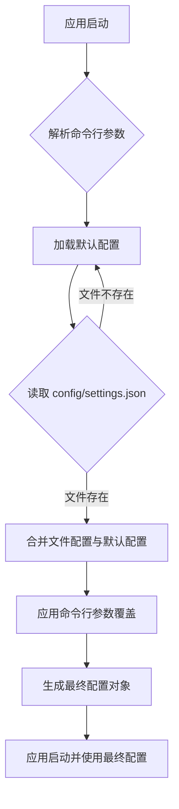

# 命令行参数覆盖计划

## 目标
允许用户通过命令行参数覆盖 `config/settings.json` 中的 `comfyui.host`, `comfyui.port`, `mcp.protocol`, `mcp.host`, `mcp.port` 以及 `paths.workflows` 配置。

## 实现步骤

1.  **修改 `src/comfyfusion/utils/config.py`：**
    *   **引入 `argparse`：** 在 `load_config` 函数中，使用 Python 的 `argparse` 模块来解析命令行参数。
    *   **定义命令行参数：** 为需要覆盖的配置项定义相应的命令行参数，例如：
        *   `--comfyui-host` (str)
        *   `--comfyui-port` (int)
        *   `--mcp-protocol` (str)
        *   `--mcp-host` (str)
        *   `--mcp-port` (int)
        *   `--workflows-path` (str)
    *   **参数优先级处理：** 在加载配置文件并合并默认配置之后，将解析到的命令行参数应用到 `merged_config` 中，确保命令行参数具有最高优先级。
        *   优先级顺序：命令行参数 > 配置文件 > 默认值。
    *   **更新 `AppConfig` 实例化：** 确保 `AppConfig` 及其子配置类在实例化时，使用最终合并后的配置字典。

2.  **修改 `src/comfyfusion/server.py` (或主启动文件)：**
    *   **调用 `load_config`：** 确保在应用程序启动时，调用 `load_config` 函数来获取配置，并将命令行参数传递给它。

## 配置加载和覆盖流程

## 详细说明

*   **命令行参数命名约定：** 建议采用扁平化的命名方式，例如 `comfyui.host` 对应 `--comfyui-host`，`paths.workflows` 对应 `--workflows-path`，这样更符合命令行工具的习惯。
*   **类型转换：** `argparse` 会根据参数定义自动进行类型转换（例如，将字符串转换为整数），这需要与配置类中的类型保持一致。
*   **错误处理：** 在解析命令行参数时，可以添加适当的错误处理，例如当参数值无效时给出友好的提示。
*   **日志记录：** 在配置加载过程中，可以添加日志记录，以便在调试时了解配置的来源和最终值。

## 验证标准

*   通过 `uvx` 启动项目，并使用命令行参数成功覆盖 `comfyui.host` 和 `comfyui.port`。
*   通过 `uvx` 启动项目，并使用命令行参数成功覆盖 `mcp.protocol`、`mcp.host` 和 `mcp.port`。
*   通过 `uvx` 启动项目，并使用命令行参数成功覆盖 `paths.workflows`。
*   在不提供命令行参数时，项目能够正确加载 `config/settings.json` 中的配置。
*   当 `config/settings.json` 不存在时，项目能够正确使用默认配置。