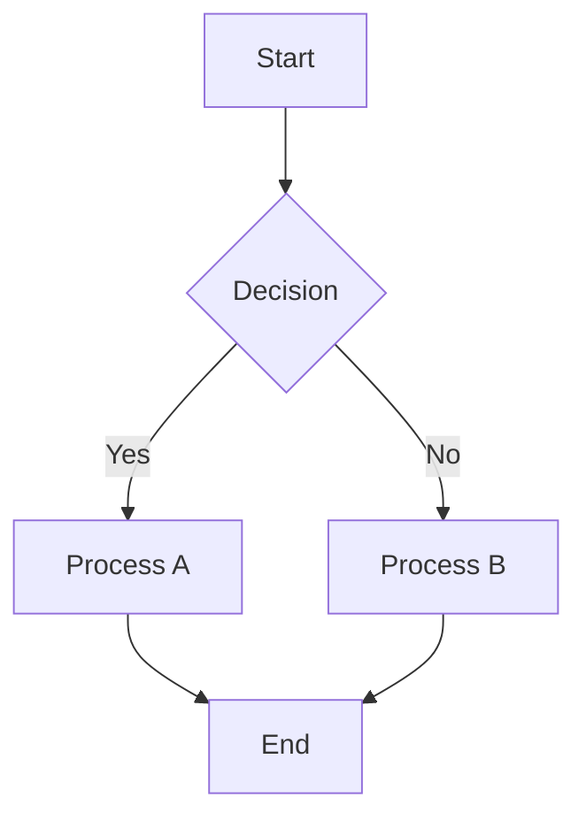
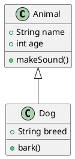
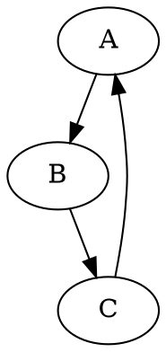

# Diagram Renderer

A comprehensive diagram rendering service supporting Mermaid, PlantUML, and Graphviz diagrams with an interactive web interface:

- **Streamlit Dashboard** - Interactive web interface for diagram rendering

## Features

- Automatic diagram type detection (Mermaid, PlantUML, Graphviz)
- Static Mermaid.js assets (version controlled)
- VizJS for Graphviz/DOT rendering
- PlantUML to DOT conversion and rendering
- Multiple themes for Mermaid diagrams
- Interactive Streamlit dashboard

## Installation

```bash
uv install
```

## Usage

### Examples

The `examples/` directory contains two demonstration applications:

**Streamlit Dashboard** - Interactive web interface:
```bash
uv sync --extra dashboard
uv run --extra dashboard python -m streamlit run examples/dashboard.py
```

**Command Line Interface** - Batch processing and automation:
```bash
# Render diagram from file
uv run python examples/cli.py render diagram.mmd

# Quick inline rendering
uv run python examples/cli.py quick "graph TD; A-->B"

# Show examples and help
uv run python examples/cli.py examples
uv run python examples/cli.py --help
```

## Supported Diagram Types

### Mermaid
- Flowcharts, Sequence diagrams, Class diagrams
- State diagrams, ER diagrams, User journey
- Gantt charts, Pie charts, and more

### PlantUML
- UML diagrams (Class, Sequence, Use Case, Activity)
- Network diagrams, Mind maps
- Gantt charts, Work breakdown structure

### Graphviz
- DOT language diagrams
- Directed and undirected graphs
- Network diagrams, organizational charts

## Configuration

### Mermaid Themes
- `default` - Default theme
- `base` - Base theme
- `dark` - Dark theme
- `forest` - Forest theme
- `neutral` - Neutral theme

## Development

The main components are:

- `diagram/` - Core diagram rendering logic and renderers
- `st_diagram.py` - Streamlit diagram component wrapper
- `examples/cli.py` - Command-line interface and dashboard launcher
- `examples/dashboard.py` - Streamlit web interface
- `diagram/renderers/static/js/` - Static JavaScript assets (Mermaid.js, VizJS)

## Examples

### Mermaid Flowchart


### PlantUML Class Diagram


### Graphviz DOT Diagram
