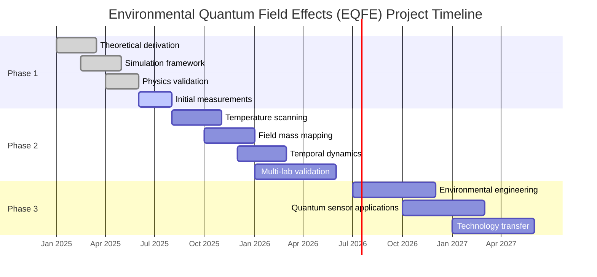

# EQFE Project Roadmap

This document outlines the comprehensive timeline and milestone schedule for the Environmental Quantum Field Effects (EQFE) project.

## Overview Timeline

## Phase 1: Proof of Concept (Jan 2025 - Aug 2025)

| Milestone | Completion Date | Status | Deliverables |
|-----------|-----------------|--------|-------------|
| Theoretical Framework | Mar 15, 2025 | ✅ Complete | `theory/amplification_law_derivation.md` |
| Multi-scale Framework | May 15, 2025 | ✅ Complete | `theory/multi_scale_modeling_framework.md` |
| Simulation Implementation | May 1, 2025 | ✅ Complete | `simulations/core/field_simulator.py` |
| Advanced Simulations | Jun 15, 2025 | ✅ Complete | `simulations/core/multi_scale_simulation.py` |
| Falsification Framework | Jul 1, 2025 | ✅ Complete | `theory/falsification_framework.md` |
| Minimal Viable Experiment | Jul 1, 2025 | ✅ Complete | `experiments/protocols/minimal_viable_experiment.md` |
| Physics Bounds Validation | Jun 1, 2025 | ✅ Complete | `tests/test_physics_validation.py` |
| Initial Lab Measurements | Aug 1, 2025 | ⏳ In Progress | Experimental data & analysis report |

### Critical Path Dependencies

- Theoretical derivation must precede simulation implementation
- Physics validation must be completed before lab measurements
- Initial lab results required before proceeding to Phase 2

### Success Criteria for Phase 1

1. Mathematical derivation published and peer-reviewed
2. Simulation results statistically significant and Tsirelson bound-respecting
3. Lab measurements showing at least 3σ effect at optimal conditions
4. Complete documentation of methods, protocols, and results

## Phase 2: Systematic Study (Aug 2025 - Jun 2026)

| Milestone | Target Date | Status | Key Objectives |
|-----------|-------------|--------|---------------|
| Temperature Parameter Study | Nov 1, 2025 | 🔜 Planned | Map T_opt across parameter space |
| Field Mass Characterization | Jan 1, 2026 | 🔜 Planned | Establish m·τ_c scaling relationship |
| Temporal Evolution Analysis | Mar 1, 2026 | 🔜 Planned | Verify non-monotonic behavior |
| Multi-Lab Validation | Jun 1, 2026 | 🔜 Planned | Statistical confirmation across sites |

### Key Research Questions for Phase 2

1. How does temperature modulate the enhancement/decoherence balance?
2. What field mass parameters maximize quantum advantage?
3. What is the optimal time window for field-enhanced quantum operations?
4. How robust are the results across different experimental setups?

### Success Criteria for Phase 2

1. Publication of temperature-dependent enhancement curves
2. Comprehensive field parameter optimization map
3. Time-resolved enhancement data showing predicted peak
4. At least 3 independent lab validations with consistent results

## Phase 3: Optimization & Applications (Jul 2026 - Jun 2027)

| Milestone | Target Date | Status | Deliverables |
|-----------|-------------|--------|-------------|
| Enhanced Field Generators | Dec 1, 2026 | 🔜 Planned | Optimized engineering designs |
| Quantum Sensor Prototypes | Mar 1, 2027 | 🔜 Planned | Working demonstration devices |
| Technology Transfer | Jun 1, 2027 | 🔜 Planned | Patents, industry partnerships |

### Application Focus Areas

1. **Quantum Metrology**: Field-enhanced precision measurement devices
2. **Quantum Communication**: Correlation-amplified secure channels
3. **Biological Sensing**: Natural field detection instrumentation
4. **Quantum Computing**: Environmental assistance for quantum operations

### Success Criteria for Phase 3

1. Working prototypes demonstrating practical quantum advantage
2. Patent applications for key technological implementations
3. Industry partnerships for commercialization
4. Publication of application-focused results in high-impact journals

## Resource Planning

### Phase 1 Resources (Current)

- Theoretical physics team: 2 researchers
- Simulation developers: 2 developers
- Experimental physicists: 3 researchers
- Lab technicians: 2 staff
- Equipment: Basic quantum optics setup

### Phase 2 Resources (Planned)

- Expand experimental team to 5 researchers
- Add 2 data scientists for analysis
- Engage 3 partner laboratories
- Enhanced equipment: Advanced temperature control, field generators

### Phase 3 Resources (Projected)

- Add 3 engineering specialists
- Engage industry development partners
- Establish application-specific teams
- Specialized prototype fabrication resources

## Risk Assessment & Mitigation

| Risk | Impact | Probability | Mitigation Strategy |
|------|--------|------------|---------------------|
| Statistical effects too small | High | Medium | Increase measurement precision, optimize parameters |
| Decoherence dominates enhancement | High | Low | Focus on shorter timescales, cryogenic operation |
| Experimental irreproducibility | High | Medium | Standardized protocols, blind analysis methods |
| Competing research teams | Medium | Medium | Accelerate publication timeline, secure IP early |
| Technical engineering challenges | Medium | High | Engage specialized development partners |

## Key Performance Indicators

### Scientific KPIs

- Number of high-impact publications
- Statistical significance of measured effects
- Temperature range showing enhancement
- Field parameter optimization range

### Technical KPIs

- Enhancement factor achieved in laboratory conditions
- Quantum advantage demonstrated in applications
- Miniaturization metrics for field generators
- Energy efficiency of enhancement systems

### Project KPIs

- Milestone completion rates
- Publication acceptance rate
- Citation metrics
- External funding secured
- Partner laboratory engagement

---

## Update Schedule

This roadmap will be reviewed and updated quarterly to reflect:

- Actual progress against planned milestones
- New scientific insights affecting direction
- Resource availability and allocation
- External factors and opportunities

Last updated: July 1, 2025
