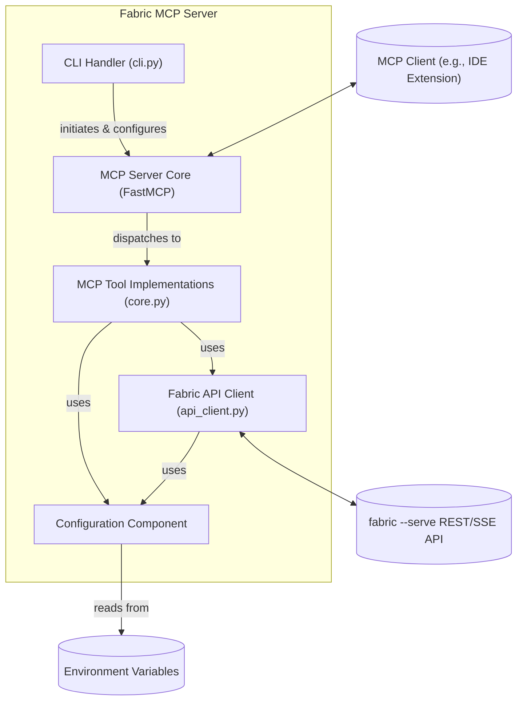
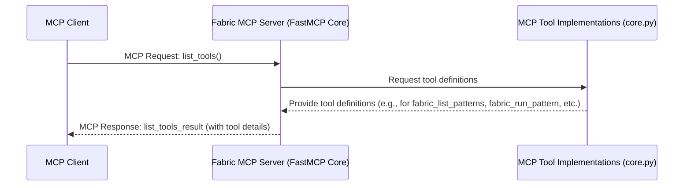
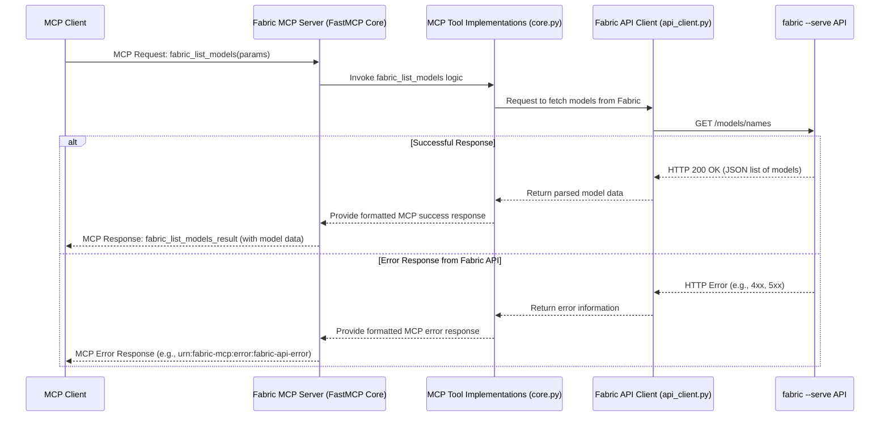
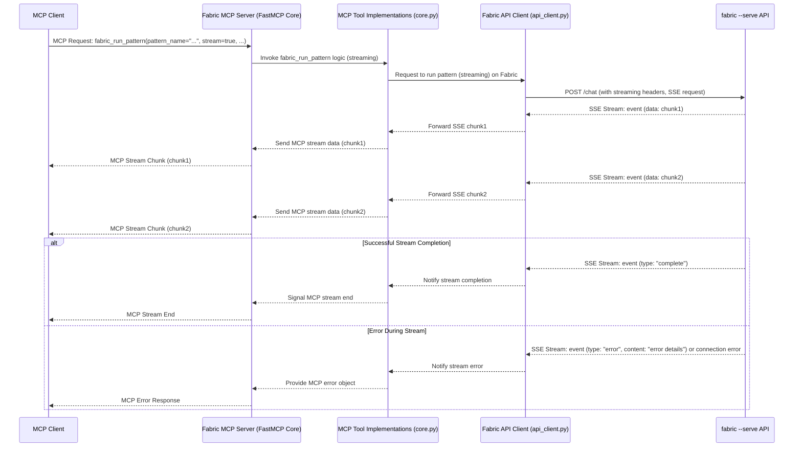
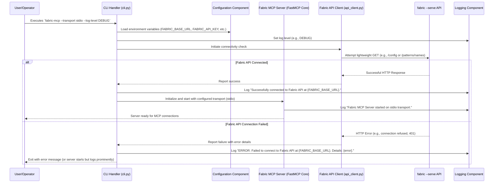

# Fabric MCP Server Architecture Document

## Introduction / Preamble

This document outlines the overall project architecture for the Fabric MCP Server, including backend systems, shared services, and non-UI specific concerns. Its primary goal is to serve as the guiding architectural blueprint for AI-driven development, ensuring consistency and adherence to chosen patterns and technologies. As this project is a backend server without a significant user interface, a separate Frontend Architecture Document is not applicable. Core technology stack choices documented herein (see "Definitive Tech Stack Selections") are definitive for the entire project.

## Technical Summary

The Fabric MCP Server is a Python-based monolithic application designed to act as a bridge between Model Context Protocol (MCP) clients and Daniel Miessler's Fabric AI framework. It will expose Fabric's functionalities (such as pattern listing, execution, and configuration retrieval) as MCP tools. The server will achieve this by consuming the REST API provided by a running `fabric --serve` instance and translating these interactions into MCP-compliant messages. Key architectural goals include robust MCP adherence, clear API translation logic, configurable connectivity to the Fabric API, and support for stdio, Streamable HTTP, and SSE transport protocols for MCP communication, all while ensuring maintainability and ease of operation. The project will leverage the FastMCP library for MCP implementation, `httpx` for Fabric API communication, and `click` for its command-line interface.

## High-Level Overview

The Fabric MCP Server is designed as a **monolithic service**, operating within a **single repository (monorepo)** structure as established in the PRD's technical assumptions. Its primary function is to serve as an intermediary, translating requests from Model Context Protocol (MCP) clients into appropriate REST API calls to a running `fabric --serve` instance. Conversely, it translates responses, including Server-Sent Event (SSE) streams from the Fabric API, back into MCP-compliant messages for the client.

The system exposes Fabric's core capabilities—such as pattern discovery, detailed introspection, execution (with support for various parameters and streaming), model and strategy listing, and configuration retrieval—through a set of standardized MCP tools. Users interact with these tools via their preferred MCP-compatible client applications (e.g., IDE extensions, chat interfaces), which connect to this server using one of the supported transport protocols: stdio, Streamable HTTP, or SSE.

The typical interaction flow is as follows:

1. An MCP client connects to the Fabric MCP Server.
2. The client discovers available tools (e.g., `fabric_run_pattern`) via MCP.
3. Upon user action in the client, an MCP request is sent to this server.
4. The Fabric MCP Server makes a corresponding HTTP request to the `fabric --serve` API.
5. The Fabric API processes the request and responds (potentially with an SSE stream for pattern execution).
6. The Fabric MCP Server relays this response, correctly formatted for MCP, back to the client.

This architecture ensures that the Fabric MCP Server remains a distinct layer, abstracting the specifics of Fabric's REST API and providing a standardized MCP interface, without requiring any modifications to the core Fabric framework.

## Architectural / Design Patterns Adopted

The Fabric MCP Server will adopt several key architectural patterns to ensure a robust, maintainable, and clear design, conducive to implementation by AI developer agents.

* **Adapter Pattern:** This is fundamental to the server's purpose. The server will act as an adapter between the Model Context Protocol (MCP) interface exposed to clients and the REST/SSE API of the `fabric --serve` instance. Specific MCP tool implementations will adapt MCP requests and data structures into formats suitable for the Fabric API, and vice-versa for responses.
* **Facade Pattern:** The MCP tools themselves (e.g., `fabric_run_pattern`, `fabric_list_patterns`) will serve as a simplified facade over the potentially more detailed interactions required with the Fabric API. This shields MCP clients from the complexities of direct Fabric API communication.
* **Service Layer / Modular Design:** The application will be structured with clear separation of concerns:
  * **MCP Transport Handling Layer:** Managed by FastMCP, responsible for receiving MCP requests and sending MCP responses over stdio, Streamable HTTP, or SSE.
  * **Core Logic/Orchestration Layer:** Contains the implementation of the MCP tools. This layer orchestrates the translation of MCP requests, calls to the Fabric API client, and the formatting of responses.
  * **Fabric API Client Layer:** A dedicated module (`api_client.py` as per existing structure) responsible for all communication with the `fabric --serve` REST API, including handling HTTP requests, SSE stream consumption, and authentication.
* **Asynchronous Processing & Streaming:** Given the requirement to handle streaming output from Fabric patterns (via SSE) and relay it to MCP clients, the server will heavily rely on asynchronous programming paradigms (e.g., Python's `asyncio`, `httpx` async client) to manage concurrent connections and data streams efficiently.
* **Configuration Management:** Externalized configuration via environment variables (`FABRIC_BASE_URL`, `FABRIC_API_KEY`, `FABRIC_MCP_LOG_LEVEL`) as defined in the PRD will be used to manage operational parameters, promoting flexibility and adherence to twelve-factor app principles.

## Component View

The Fabric MCP Server is composed of several key logical components that work together to bridge MCP clients with the Fabric API. These components align with the architectural patterns previously discussed:

* **MCP Server Core (FastMCP Engine):**

  * **Responsibility:** This component, provided by the `FastMCP` library, is responsible for managing the low-level details of the Model Context Protocol. It handles establishing connections with MCP clients over the configured transport (stdio, Streamable HTTP, or SSE), parsing incoming MCP requests, and dispatching them to the appropriate tool implementations. It also takes care of formatting and sending MCP responses (including error responses and stream data) back to the client.
  * **Interaction:** Receives requests from MCP clients and forwards them to the MCP Tool Implementations. Sends responses generated by the Tool Implementations back to the MCP clients.

* **MCP Tool Implementations (Core Logic):**

  * **Responsibility:** This layer contains the specific business logic for each MCP tool exposed by the server (e.g., `fabric_list_patterns`, `fabric_get_pattern_details`, `fabric_run_pattern`, `fabric_list_models`, `fabric_list_strategies`, `fabric_get_configuration`). For each tool, it:
    * Validates and interprets the incoming MCP request parameters.
    * Orchestrates the necessary calls to the Fabric API Client to fetch data or execute operations on the Fabric instance.
    * Transforms the data received from the Fabric API Client into the appropriate MCP response format, including handling streaming data for `fabric_run_pattern`.
    * Implements any specific logic required by the tool, such as data redaction for `fabric_get_configuration`.
  * **Interaction:** Receives processed requests from the MCP Server Core. Interacts with the Fabric API Client to communicate with `fabric --serve`. Produces MCP-compliant responses for the MCP Server Core. It also utilizes the Configuration Component for accessing necessary settings.

* **Fabric API Client (`api_client.py`):**

  * **Responsibility:** This component encapsulates all direct communication with the external `fabric --serve` REST API. It is responsible for:
    * Constructing and sending HTTP requests (GET, POST) to the appropriate Fabric API endpoints based on the details derived from the Fabric source code.
    * Handling authentication with the Fabric API by including the `FABRIC_API_KEY` if provided.
    * Consuming and processing responses from the Fabric API, including handling standard JSON responses and Server-Sent Event (SSE) streams for pattern execution.
    * Implementing retry logic for API calls.
  * **Interaction:** Called by the MCP Tool Implementations. Makes network requests to the `fabric --serve` instance. Returns data or streams back to the MCP Tool Implementations. Uses the Configuration Component for API base URL and key.

* **Configuration Component:**

  * **Responsibility:** Provides access to runtime configuration settings sourced from environment variables (`FABRIC_BASE_URL`, `FABRIC_API_KEY`, `FABRIC_MCP_LOG_LEVEL`). This ensures that configurable parameters are centralized and easily managed.
  * **Interaction:** Provides configuration values to the Fabric API Client (for URL and key) and the CLI Handler/Main Application (for log level and server settings).

* **CLI Handler (`cli.py`):**

  * **Responsibility:** This component, built using `click`, parses command-line arguments provided when the server is launched. It interprets arguments such as `--transport`, `--host`, `--port`, `--path`, and `--log-level` to configure and initialize the MCP Server Core with the correct transport mode and settings. It also handles informational commands like `--version` and `--help`.
  * **Interaction:** Acts as the entry point for the application. Initializes and starts the MCP Server Core based on user-provided CLI arguments and the Configuration Component.

<!-- end list -->



## Project Structure

The Fabric MCP Server will adhere to the following project structure. This structure is designed for clarity, maintainability, and to support standard Python packaging and development practices.

```plaintext
fabric-mcp/
├── .github/                    # GitHub specific configurations
│   ├── pull_request_template.md # Template for pull requests
│   └── workflows/              # CI/CD workflows (GitHub Actions)
│       ├── get-version.yml     # Workflow to get project version
│       ├── publish.yml         # Workflow for publishing the package
│       └── tests.yml           # Workflow for running tests and linters
├── .vscode/                    # VSCode specific settings
│   ├── settings.json           # Workspace settings for VSCode
│   └── tasks.json              # Task configurations for VSCode
├── docs/                       # Project documentation
│   ├── contributing-cheatsheet.md # Contributor micro-summary
│   ├── contributing-detailed.md   # Detailed contribution guidelines
│   ├── contributing.md            # Main contribution guidelines
│   ├── design.md                  # High-Level Design Document (existing)
│   ├── design-architecture/index.md  # Developer/Operational Experience Spec (existing)
│   ├── logo.png                   # Project logo
│   ├── PM-checklist.md            # Product Manager checklist (existing)
│   ├── PRD.md                     # Product Requirements Document (existing)
│   ├── architecture/index.md      # The index file with all the architecture documents
│   ├── api-reference.md           # Generated: Details of Fabric API consumed & MCP tools provided
│   ├── data-models.md             # Generated: Data schemas for MCP tools and Fabric API
│   ├── environment-vars.md        # Generated: Detailed list of environment variables
│   ├── operational-guidelines.md  # Generated: Coding standards, testing, error handling
│   ├── project-structure.md       # Generated: This section, as a standalone file
│   ├── tech-stack.md              # Generated: Definitive technology stack
│   └── index.md                   # Generated: Central catalog of all documentation
├── src/                        # Application source code
│   └── fabric_mcp/             # Main Python package for the server
│       ├── __about__.py        # Stores package version and metadata
│       ├── __init__.py         # Package initializer
│       ├── api_client.py       # Fabric API Client component
│       ├── cli.py              # CLI Handler component (using Click)
│       ├── core.py             # MCP Tool Implementations (core logic)
│       ├── server_hooks.py     # (New) Callbacks or hooks for FastMCP (if needed)
│       ├── server_stdio.py     # Existing entry point for `make dev` / MCP Inspector
│       ├── server_transports.py # (New) Specific configurations for stdio, HTTP, SSE transports (used by cli.py)
│       └── utils.py            # Utility functions shared within the application
├── tests/                      # Automated tests
│   ├── __init__.py
│   ├── integration/            # Integration tests
│   │   ├── __init__.py
│   │   └── test_mcp_integration.py # Example: E2E tests for MCP tools with live Fabric
│   └── unit/                   # Unit tests (mirroring src/fabric_mcp structure)
│       ├── __init__.py
│       ├── test_api_client.py
│       ├── test_cli.py         # Renamed from test_cli_additional.py for consistency
│       ├── test_core.py
│       ├── test_server_transports.py # (New) Tests for transport configurations
│       └── test_utils.py
├── .env.example                # Example environment variables file
├── .gitignore                  # Git ignore rules
├── .pylintrc                   # Pylint configuration file
├── .ruff.toml                  # Ruff linter and formatter configuration file
├── cspell.json                 # Spell checking configuration (existing)
├── LICENSE                     # Project license file
├── Makefile                    # Make commands for development tasks
├── pyproject.toml              # Python project configuration (PEP 518/621)
├── README.md                   # Project overview and setup instructions
└── uv.lock                     # uv lock file for reproducible dependencies
```

### Key Directory Descriptions

* **`.github/`**: Contains GitHub-specific files, including `pull_request_template.md` and workflow configurations for CI/CD in the `workflows/` subdirectory (e.g., `tests.yml`, `publish.yml`, `get-version.yml`).
* **`.vscode/`**: Holds VSCode editor-specific settings (`settings.json`) and task configurations (`tasks.json`).
* **`docs/`**: Houses all project documentation, including the PRD, this architecture document, user guides, and other specifications. The `index.md` within will serve as a catalog.
* **`src/fabric_mcp/`**: The primary Python package containing all the server's operational code.
  * `api_client.py`: Dedicated module for interacting with the Fabric REST API.
  * `cli.py`: Implements the command-line interface using `click`; serves as the main user entry point for all transport modes.
  * `core.py`: Contains the logic for MCP tool implementations.
  * `server_hooks.py` (New): Intended for any callback functions or hooks that FastMCP might require for specific events or customizations during the MCP communication lifecycle.
  * `server_stdio.py`: Existing file, maintained as the specific entry point for `make dev` which uses `uv run fastmcp dev src/fabric_mcp/server_stdio.py` for the MCP Inspector.
  * `server_transports.py` (New): Will contain helper functions or classes for setting up and configuring the different MCP transports (stdio, Streamable HTTP, SSE) to be used by `cli.py` when launching FastMCP for general use.
* **`tests/`**: Contains all automated tests.
  * `tests/unit/`: Unit tests for individual modules and functions, mirroring the `src/fabric_mcp/` structure.
  * `tests/integration/`: Integration tests that verify interactions between components or with a mocked/live Fabric API instance.
* **Root directory files**: Standard project files including:
  * Linters and formatter configurations: `.ruff.toml`, `.pylintrc`.
  * Project build and dependency management: `pyproject.toml` (which also configures `pyright` for strict type checking), `uv.lock`.
  * Development utilities: `Makefile`.
  * Informational: `README.md`, `LICENSE`, `.env.example`.
  * Other tooling: `cspell.json`, `.gitignore`.

### Notes

* The `src/fabric_mcp/server_stdio.py` is understood to be a specific entry point for development and debugging with the MCP Inspector via `make dev`.
* The main `cli.py` will handle the operational launch of the server in stdio mode for end-users, as well as for HTTP and SSE transports, likely utilizing helpers from the new `server_transports.py` for configuring FastMCP.
* I've suggested renaming `test_cli_additional.py` to `test_cli.py` for more direct correspondence if it's the primary test file for `cli.py`.
* New files like `server_hooks.py` and `server_transports.py` are proposed to better organize the server's operational aspects and cleanly integrate with FastMCP via the main `cli.py`.

## API Reference

### External APIs Consumed

This section details the external APIs that the Fabric MCP Server interacts with. The primary external dependency is the Fabric REST API.

#### Fabric REST API

* **Purpose:** The Fabric MCP Server consumes this API to leverage the functionalities of a running `fabric --serve` instance, such as pattern execution, listing available patterns, models, strategies, and retrieving configuration.

* **Base URL(s):**

  * Configured via the `FABRIC_BASE_URL` environment variable.
  * Default: `http://127.0.0.1:8080`.

* **Authentication:**

  * Method: API Key in Header. Header Name: `X-API-Key`.
  * The key is provided via the `FABRIC_API_KEY` environment variable. If not set, authentication is not attempted by `fabric-mcp` (though `fabric --serve` might still require it if it was started with an API key).

* **Key Endpoints Used (Based on `fabric --serve` output and Go source code):**

    1. **Endpoint:** `POST /chat`

          * **Description:** Executes a Fabric pattern, potentially with streaming output. This is the primary endpoint for the `fabric_run_pattern` MCP tool.
          * **Request Body Schema (`ChatRequest` from `chat.go`):**

            ```json
            {
              "prompts": [
                {
                  "userInput": "string",
                  "vendor": "string", // Optional, for model selection
                  "model": "string", // Optional, specific model name
                  "contextName": "string", // Optional
                  "patternName": "string", // Name of the Fabric pattern to run
                  "strategyName": "string" // Optional strategy name
                }
              ],
              "language": "string", // Optional
              // Embedded common.ChatOptions from Fabric:
              "temperature": "float", // Optional
              "topP": "float", // Optional
              "frequencyPenalty": "float", // Optional
              "presencePenalty": "float", // Optional
            }
            ```

          * **Success Response (SSE Stream - `text/event-stream`):** Each event is a JSON object (`StreamResponse` from `chat.go`):

            ```json
            {
              "type": "string", // e.g., "content", "error", "complete"
              "format": "string", // e.g., "markdown", "mermaid", "plain"
              "content": "string" // The actual content chunk or error message
            }
            ```

          * **Non-Streaming Success Response:** If streaming is not used/supported by a specific call, a consolidated response would be expected (details to be confirmed, possibly a final "content" message or a different structure).
          * **Error Response Schema(s):** Errors during streaming are sent as a `StreamResponse` with `type: "error"`. Standard HTTP errors (4xx, 5xx) for request issues.

    2. **Endpoint:** `GET /patterns/names`

          * **Description:** Retrieves a list of available Fabric pattern names. Used by the `fabric_list_patterns` MCP tool.
          * **Request Parameters:** None.
          * **Success Response Schema (Code: `200 OK`):**

            ```json
            [
              "patternName1",
              "patternName2"
            ]
            ```

          * **Error Response Schema(s):** Standard HTTP errors.

    3. **Endpoint:** `GET /patterns/:name`

          * **Description:** Retrieves details for a specific Fabric pattern. Used by the `fabric_get_pattern_details` MCP tool.
          * **Request Parameters:**
              * `name` (path parameter): The name of the pattern.
          * **Success Response Schema (Code: `200 OK`):**

            ```json
            {
              "name": "string",
              "description": "string",
              "tags": ["string"],
              "system_prompt": "string",
              "user_prompt_template": "string"
            }
            ```

          * **Error Response Schema(s):** `404 Not Found` if pattern doesn't exist. Other standard HTTP errors.

    4. **Endpoint:** `GET /config`

          * **Description:** Retrieves the current Fabric operational configuration. Used by the `fabric_get_configuration` MCP tool.
          * **Request Parameters:** None.
          * **Success Response Schema (Code: `200 OK`) (`configuration.go` GetConfig response):**

            ```json
            {
              "openai": "string",
              "anthropic": "string",
              "groq": "string",
              "mistral": "string",
              "gemini": "string",
              "ollama": "string",
              "openrouter": "string",
              "silicon": "string",
              "deepseek": "string",
              "grokai": "string",
              "lmstudio": "string"
            }
            ```

          * **Error Response Schema(s):** Standard HTTP errors.

    5. **Endpoint:** `GET /models/names`

          * **Description:** Retrieves a list of configured Fabric models. Used by the `fabric_list_models` MCP tool.
          * **Request Parameters:** None.
          * **Success Response Schema (Code: `200 OK`) (`models.go` GetModelNames response):**

            ```json
            {
              "models": ["string"],
              "vendors": {
                "vendor_name": ["string"]
              }
            }
            ```

          * **Error Response Schema(s):** Standard HTTP errors.

    6. **Endpoint:** `GET /strategies`

          * **Description:** Retrieves a list of available Fabric strategies. Used by the `fabric_list_strategies` MCP tool.
          * **Request Parameters:** None.
          * **Success Response Schema (Code: `200 OK`) (JSON array of `StrategyMeta` from `strategies.go`):**

            ```json
            [
              {
                "name": "string",
                "description": "string",
                "prompt": "string"
              }
            ]
            ```

          * **Error Response Schema(s):** Standard HTTP errors.

* **Link to Official Docs:** The primary reference for Fabric is [Daniel Miessler's Fabric GitHub repository](https://github.com/danielmiessler/fabric).

A note on the `POST /chat` request: The PRD (Functional Requirements, 3. Run Pattern) mentions `variables` (map[string]string) and `attachments` (list of strings) as optional parameters for pattern execution. The `ChatRequest` struct from `chat.go` doesn't explicitly list these top-level fields.
For the architecture, we'll assume that:

1. Simple `variables` might be substituted into the `userInput` string before sending the request.
2. `attachments` might be handled by specific patterns within Fabric itself.
    Our `fabric_mcp` server will pass the `variables` and `attachments` as received in the MCP request to the `fabric_run_pattern` tool. The `api_client.py` will need a strategy to include these in the `POST /chat` request.

### Internal APIs Provided (MCP Tools)

The Fabric MCP Server provides the following tools to MCP clients. These tools adhere to the Model Context Protocol specification and allow clients to interact with the underlying Fabric instance. Error responses for these tools will follow the standard MCP error structure, providing a `type` (URN-style), `title`, and `detail` message.

1. **Tool: `fabric_list_patterns`**

      * **Description:** Retrieves a list of all available pattern names from the connected Fabric instance.
      * **Parameters:** None.
      * **Return Value:**
          * **Type:** `object`
          * **Description:** A JSON object containing a single key `patterns`.
          * **Schema:**

            ```json
            {
              "patterns": [
                "string"
              ]
            }
            ```

2. **Tool: `fabric_get_pattern_details`**

      * **Description:** Retrieves detailed information for a specific Fabric pattern by its name.
      * **Parameters:**
          * `name`: `pattern_name`
              * `type`: `string`
              * `required`: `true`
              * `description`: The exact name of the Fabric pattern.
      * **Return Value:**
          * **Type:** `object`
          * **Description:** A JSON object containing pattern details.
          * **Schema:**

            ```json
            {
              "name": "string",
              "description": "string",
              "system_prompt": "string",
              "user_prompt_template": "string",
              "tags": ["string"]
            }
            ```

      * **Errors:** Can return `urn:fabric-mcp:error:pattern-not-found`.

3. **Tool: `fabric_run_pattern`**

      * **Description:** Executes a Fabric pattern with options and optional streaming.
      * **Parameters:**
          * `name`: `pattern_name` (`string`, required)
          * `name`: `input_text` (`string`, optional)
          * `name`: `stream` (`boolean`, optional, default: `false`)
          * `name`: `model_name` (`string`, optional)
          * `name`: `strategy_name` (`string`, optional)
          * `name`: `variables` (`object` map[string]string, optional)
          * `name`: `attachments` (`array` of `string`, optional)
          * `name`: `temperature` (`number` float, optional)
          * `name`: `top_p` (`number` float, optional)
          * `name`: `presence_penalty` (`number` float, optional)
          * `name`: `frequency_penalty` (`number` float, optional)
      * **Return Value (Non-streaming, `stream: false`):**
          * **Type:** `object`
          * **Schema:**

            ```json
            {
              "output_format": "string",
              "output_text": "string"
            }
            ```

      * **Return Value (Streaming, `stream: true`):**
          * **Type:** MCP Stream. Each chunk is a JSON object:

            ```json
             {
               "type": "string", // "content", "error", "complete"
               "format": "string", // "markdown", "mermaid", "plain"
               "content": "string"
             }
            ```

          * Stream ends with MCP stream end or error (e.g., `urn:fabric-mcp:error:fabric-stream-interrupted`).

4. **Tool: `fabric_list_models`**

      * **Description:** Retrieves configured Fabric models.
      * **Parameters:** None.
      * **Return Value:**
          * **Type:** `object`
          * **Schema:**

            ```json
            {
              "all_models": ["string"],
              "models_by_vendor": {
                "vendor_name": ["string"]
              }
            }
            ```

5. **Tool: `fabric_list_strategies`**

      * **Description:** Retrieves available Fabric strategies.
      * **Parameters:** None.
      * **Return Value:**
          * **Type:** `object`
          * **Schema:**

            ```json
            {
              "strategies": [
                {
                  "name": "string",
                  "description": "string",
                  "prompt": "string"
                }
              ]
            }
            ```

6. **Tool: `fabric_get_configuration`**

      * **Description:** Retrieves Fabric's operational configuration, with sensitive values redacted.
      * **Parameters:** None.
      * **Return Value:**
          * **Type:** `object`
          * **Description:** Fabric configuration map. Sensitive keys replaced with `"[REDACTED_BY_MCP_SERVER]"`.
          * **Schema:** (Example based on Fabric's `/config` output)

            ```json
            {
              "openai_api_key": "string", // e.g., "[REDACTED_BY_MCP_SERVER]"
              "ollama_url": "string"    // e.g., "http://localhost:11434"
            }
            ```

## Data Models

The Fabric MCP Server primarily deals with transforming data between the Model Context Protocol (MCP) and the Fabric REST API. It does not maintain its own persistent database or complex internal domain entities beyond what is necessary for request/response handling and configuration.

### Core Application Entities / Domain Objects

Conceptually, the server handles:

* **MCP Requests/Responses:** Structures defined by the Model Context Protocol and specific to each MCP tool. These are detailed in the "Internal APIs Provided (MCP Tools)" section of this document.
* **Fabric API Requests/Responses:** Structures defined by the `fabric --serve` REST API. These are detailed in the "External APIs Consumed" section, with specific Go structs like `ChatRequest`, `PromptRequest`, `StreamResponse`, `StrategyMeta`, and configuration/model data structures from the `restapi-code.json` source.
* **Configuration Settings:** Simple key-value pairs loaded from environment variables (e.g., `FABRIC_BASE_URL`, `FABRIC_API_KEY`, `FABRIC_MCP_LOG_LEVEL`).

### API Payload Schemas (MCP Tools & Fabric API)

The detailed JSON schemas for data exchanged are best understood in the context of the APIs themselves:

* **Fabric REST API (Consumed):** The request and response schemas for the Fabric API endpoints (e.g., `/chat`, `/patterns/names`, `/config`, `/models/names`, `/strategies`) have been defined in the **[External APIs Consumed](https://www.google.com/search?q=%23fabric-rest-api)** section, based on the provided Go source code.
* **MCP Tools (Provided):** The parameter and return value schemas for each MCP tool provided by this server (e.g., `fabric_list_patterns`, `fabric_run_pattern`) have been defined in the **[Internal APIs Provided (MCP Tools)](https://www.google.com/search?q=%23internal-apis-provided-mcp-tools)** section. These define the contract with MCP clients.

### Database Schemas

* **Not Applicable:** The Fabric MCP Server is a stateless application. It does not have its own database and relies on the connected `fabric --serve` instance for any data persistence related to patterns, models, configurations, etc..

## Core Workflow / Sequence Diagrams

These diagrams illustrate the primary interaction flows within the Fabric MCP Server system.

### 1. MCP Client: Tool Discovery (`list_tools`)



**Description:**

1. The MCP Client sends a `list_tools()` request to the Fabric MCP Server.
2. The FastMCP Core (ServerCore) receives this and queries the MCP Tool Implementations (ToolLogic) for the definitions of all registered tools.
3. The ToolLogic provides these definitions.
4. The ServerCore formats this into an MCP `list_tools_result` and sends it back to the Client.

### 2. MCP Client: Execute Non-Streaming Pattern (e.g., `fabric_list_models`)



**Description (Revised for clarity):**

1. The MCP Client sends a request for a tool like `fabric_list_models`.
2. The ServerCore passes this to the specific ToolLogic implementation.
3. ToolLogic instructs the FabricClient to fetch the required data.
4. FabricClient makes a `GET /models/names` HTTP request to the `fabric --serve` API.
5. **If successful:**
      * FabricAPI returns an HTTP 200 OK response with the JSON data.
      * FabricClient parses this and returns it to ToolLogic.
      * ToolLogic formats the data into the MCP success response structure.
      * ServerCore sends the final MCP success response to the Client.
6. **If an error occurs at the Fabric API level:**
      * FabricAPI returns an HTTP error (e.g., 4xx or 5xx).
      * FabricClient conveys this error information to ToolLogic.
      * ToolLogic constructs an appropriate MCP error response.
      * ServerCore sends the MCP error response to the Client.

### 3. MCP Client: Execute Streaming Pattern (`fabric_run_pattern` with `stream: true`)



**Description:**

1. Client requests `fabric_run_pattern` with `stream: true`.
2. ServerCore invokes the ToolLogic for `fabric_run_pattern`.
3. ToolLogic instructs FabricClient to execute the pattern with streaming.
4. FabricClient makes a `POST /chat` request to FabricAPI, establishing an SSE connection.
5. FabricAPI sends SSE events (data chunks).
6. FabricClient receives these chunks and forwards them to ToolLogic.
7. ToolLogic wraps these chunks into MCP stream data and sends them via ServerCore to the Client.
8. This continues until the FabricAPI SSE stream ends (e.g., with a "complete" type event) or an error occurs. The Fabric MCP Server then appropriately signals the end of the MCP stream or sends an MCP error to the client.

### 4. Server Startup & Fabric API Connectivity Check



**Description:**

1. User starts the server via the CLI, providing transport and log level arguments.
2. The CLI loads configuration from environment variables.
3. The CLI initiates a connectivity check via the FabricClient.
4. The FabricClient attempts a lightweight GET request to the Fabric API (e.g., `/config` or `/patterns/names`).
5. If successful, a success message is logged, and the MCP Server Core is initialized and started.
6. If it fails, an actionable error message is logged, and the server might exit or start with a prominent error warning.

## Definitive Tech Stack Selections

This section outlines the definitive technology choices for the project. These selections are based on the project's requirements as detailed in the PRD. This table is the **single source of truth** for all technology selections.

| Category                   | Technology                               | Version / Details         | Description / Purpose                                       | Justification (Optional)                                     |
| :------------------------- | :--------------------------------------- | :------------------------ | :---------------------------------------------------------- | :----------------------------------------------------------- |
| **Languages** | Python                                   | >=3.11                    | Primary language for the server                             | Modern Python features, community support, available libraries. |
| **Runtime** | CPython                                  | Matches Python >=3.11     | Standard Python runtime                                     |                                                              |
| **Frameworks** | FastMCP                                  | >=2.5.1                   | Core Model Context Protocol implementation                  | Chosen for MCP adherence.                         |
|                            | Click                                    | >=8.1.8                   | CLI framework for user-friendly command-line interactions   | Specified in PRD for CLI.                         |
| **Libraries** | httpx                                    | >=0.28.1                  | HTTP client for Fabric API communication                    | Supports async, HTTP/2, chosen for REST API calls.  |
|                            | httpx-retries                            | >=0.4.0                   | Retry mechanisms for httpx                                  | Enhances resilience of Fabric API calls.        |
|                            | httpx-sse                                | Specific version TBD (latest) | Client for consuming Server-Sent Events from Fabric API     | Required for streaming from Fabric API.           |
|                            | Rich                                     | >=14.0.0                  | Enhanced terminal output for logging and CLI messages     | Improves CLI usability and log readability.     |
| **Development Tooling** | uv                                       | Latest stable             | Python package and environment manager                      | Speed and modern dependency management. |
|                            | pre-commit                               | Latest stable             | Framework for managing pre-commit hooks                     | Enforces code quality and standards before commit. |
|                            | Ruff                                     | Latest stable             | Linter and formatter                                        | Speed and comprehensive checks.                 |
|                            | isort                                    | Latest stable             | Import sorter (often integrated via Ruff)                 | Code style consistency.                       |
|                            | Pylint                                   | Latest stable             | Additional linter for deeper static analysis                | Complements Ruff for thorough linting.          |
|                            | Pyright                                  | Latest stable             | Static type checker (configured for strict mode)          | Ensures type safety and code reliability.      |
| **Testing** | Pytest                                   | Latest stable             | Testing framework                                           | Powerful and flexible for unit/integration tests. |
|                            | pytest-cov                               | Latest stable             | Pytest plugin for code coverage measurement               | Ensures test coverage targets are met.          |
| **CI/CD** | GitHub Actions                           | N/A                       | Continuous Integration/Deployment platform                  | Based on existing `.github/workflows`.       |
| **Version Control** | Git                                      | N/A                       | Distributed version control system                          | Standard for source code management.                       |

**Notes on Versions:**

* For libraries like `httpx-sse`, `uv`, `pre-commit`, `Ruff`, `isort`, `Pylint`, `Pyright`, `Pytest`, and `pytest-cov`, "Latest stable" implies using the most recent stable version at the time of development or dependency updates. For more predictable AI agent behavior during implementation, we should aim to pin these to specific versions (e.g., `httpx-sse==X.Y.Z`) in `pyproject.toml` once established.

This project is a standalone server application. Categories like "Databases," "Cloud Platform," or specific "Cloud Services" are not directly applicable to the `fabric-mcp` server itself, as it's designed to be deployed as a process and does not have its own persistent storage, relying on the Fabric API for data.

## Infrastructure and Deployment Overview

The Fabric MCP Server is designed as a standalone Python application, intended to be flexible in its deployment to suit various user environments.

* **Deployment Model:** The server is deployed as a single, self-contained process. It does not require a complex distributed infrastructure for its own operation. Users will typically run it as a background service or a command-line application on a machine that has network access to the target `fabric --serve` instance.
* **Installation:**
  * The primary distribution method is via PyPI (Python Package Index). Users can install it using `pip install fabric-mcp` or `uv pip install fabric-mcp`.
  * For development, it can be run directly from the source code within a virtual environment managed by `uv`.
* **Runtime Environment:**
  * Requires a Python runtime (>=3.11, as specified in the tech stack).
  * Necessary environment variables (`FABRIC_BASE_URL`, `FABRIC_API_KEY`, `FABRIC_MCP_LOG_LEVEL`) must be configured in the execution environment.
* **Execution:**
  * The server is launched via its command-line interface (`fabric-mcp`), which is built using `click`.
  * The CLI allows users to specify the MCP transport mode (`stdio`, `http`, `sse`) and associated parameters like host, port, and path for HTTP-based transports.
* **Cloud Agnostic:** The server itself is cloud-agnostic. It can be run on any system that supports Python, whether it's a local machine, a virtual machine in any cloud (AWS, Azure, GCP), or a containerized environment. No specific cloud services are mandated for its core operation.
* **Infrastructure as Code (IaC):** Not directly applicable for the server application itself, as it's a process rather than managed infrastructure. If users deploy it within a larger system managed by IaC (e.g., as part of an EC2 instance setup or a Kubernetes pod definition), that would be external to this project's direct scope.
* **CI/CD:**
  * GitHub Actions are used for continuous integration (running tests, linters) on code pushes/pull requests.
  * GitHub Actions are also configured for publishing the package to PyPI (e.g., via `publish.yml` in `.github/workflows/`).
* **Environments:**
  * **Development:** Local machine with `uv` managing dependencies.
  * **Production/User Deployment:** Any system meeting the Python runtime requirements, where the user installs the package and runs the `fabric-mcp` command.
* **Rollback Strategy:** For the application itself, rollback would typically involve deploying a previous version of the `fabric-mcp` package from PyPI if an issue is found with a new release.
* **Future Considerations (Post-MVP):** Dockerization could be considered in the future to simplify deployment further, similar to the main Fabric project. This would involve creating a `Dockerfile` and publishing container images.

## Error Handling Strategy

A robust error handling strategy is crucial for providing a reliable and user-friendly experience. This section outlines the approach for handling errors within the Fabric MCP Server.

* **General Approach:**

  * The primary mechanism for error handling within the Python application will be through exceptions. Custom exceptions may be defined for specific error conditions arising from the Fabric API client or core logic to allow for more granular error management.
  * Errors propagated to the MCP client will be formatted as standard MCP error objects, including a URN-style `type`, a `title`, and a `detail` message, as specified in the DX/Interaction document.
  * For CLI operations, errors will be clearly reported to `stderr`, potentially using `rich` for better formatting, and the server will exit with a non-zero status code for critical startup failures.

* **Logging:**

  * **Library/Method:** The `rich` library will be used for enhanced console output, and Python's standard `logging` module will be configured to work with it for structured logging.
  * **Format:** Logs should be structured (e.g., JSON format is preferred for production-like deployments if easily configurable, otherwise human-readable with clear timestamp, level, and message). For `rich`-based console output, a human-readable, color-coded format will be used.
  * **Levels:** Standard Python logging levels (`DEBUG`, `INFO`, `WARNING`, `ERROR`, `CRITICAL`) will be used. The log level will be configurable via the `--log-level` CLI flag and the `FABRIC_MCP_LOG_LEVEL` environment variable.
  * **Context:** Logs for errors should include relevant contextual information such as:
    * Timestamp
    * Log level
    * Module/function where the error occurred
    * A unique request ID or correlation ID if feasible (especially for HTTP transports)
    * Sanitized key parameters related to the operation
    * The error message and potentially a stack trace for `DEBUG` level.

* **Specific Handling Patterns:**

  * **External API Calls (to `fabric --serve`):**
    * **HTTP Errors:** The `Fabric API Client` (`api_client.py`) will handle HTTP status codes from the Fabric API.
      * `4xx` errors (e.g., `401 Unauthorized`, `403 Forbidden`, `404 Not Found`) will be translated into specific MCP error types and logged appropriately. For instance, a `404` when fetching a pattern could become `urn:fabric-mcp:error:pattern-not-found`.
      * `5xx` server errors from Fabric will be treated as critical failures of the upstream service and result in an MCP error like `urn:fabric-mcp:error:fabric-api-unavailable` or `urn:fabric-mcp:error:fabric-internal-error`.
    * **Connection Errors:** Network issues (e.g., connection refused, timeouts) when calling the Fabric API will be caught by `httpx` and should result in an MCP error (e.g., `urn:fabric-mcp:error:fabric-api-unavailable`).
    * **Retries:** The `Fabric API Client` will use `httpx-retries` to automatically retry idempotent requests on transient network errors or specific server-side error codes (e.g., 502, 503, 504) as configured. Max retries and backoff strategy will be defined.
    * **Timeouts:** Explicit connect and read timeouts will be configured for `httpx` to prevent indefinite blocking.
    * **SSE Stream Errors:** If an error occurs *during* an active SSE stream from the Fabric API (e.g., Fabric sends an error event or the connection drops), the `Fabric API Client` will detect this. The MCP Tool Implementation for `fabric_run_pattern` will then terminate the MCP stream to the client and send a distinct MCP error object (e.g., `urn:fabric-mcp:error:fabric-stream-interrupted`).
  * **Internal Errors / Business Logic Exceptions:**
    * Unexpected errors within the Fabric MCP Server's core logic will be caught by a top-level error handler for each MCP tool invocation.
    * These will be logged with detailed stack traces (at `DEBUG` or `ERROR` level).
    * A generic MCP error (e.g., `urn:fabric-mcp:error:internal-server-error`) will be sent to the client to avoid exposing internal details, but with a unique identifier (correlation ID if implemented) that can be used to find the detailed log.
  * **MCP Request Validation Errors:**
    * If an MCP client sends a malformed request (e.g., missing required parameters, incorrect data types for parameters), the FastMCP library or the tool implementation layer should catch this.
    * An MCP error with a type like `urn:fabric-mcp:error:invalid-request` or `urn:mcp:error:validation` will be returned to the client with details about the validation failure.
  * **Configuration Errors:**
    * Missing or invalid essential configurations (e.g., unparseable `FABRIC_BASE_URL`) at startup will result in clear error messages logged to `stderr` and the server may fail to start.
  * **Transaction Management:** Not applicable, as the Fabric MCP Server is stateless. Data consistency is the responsibility of the `fabric --serve` instance.

## Coding Standards

These standards are mandatory for all code generation by AI agents and human developers. Deviations are not permitted unless explicitly approved and documented as an exception in this section or a linked addendum.

* **Primary Language & Runtime:** Python >=3.11 with CPython (as per Definitive Tech Stack Selections).
* **Style Guide & Linter:**
  * **Tools:** `Ruff` for formatting and primary linting, `Pylint` for additional static analysis, `isort` for import sorting (often managed via Ruff). `Pyright` for static type checking in strict mode.
  * **Configuration:**
    * Ruff: Configured via `.ruff.toml` and/or `pyproject.toml`.
    * Pylint: Configured via `.pylintrc`.
    * isort: Configured in `pyproject.toml` (often via `[tool.ruff.lint.isort]`).
    * Pyright: Configured in `pyproject.toml` (under `[tool.pyright]`) for strict mode.
  * **Enforcement:** Linter rules are mandatory and must be enforced by `pre-commit` hooks and CI checks.
* **Naming Conventions:**
  * Variables: `snake_case`
  * Functions/Methods: `snake_case`
  * Classes/Types/Interfaces: `PascalCase` (e.g., `MyClass`, `FabricPatternDetail`)
  * Constants: `UPPER_SNAKE_CASE` (e.g., `DEFAULT_TIMEOUT`)
  * Files: `snake_case.py` (e.g., `api_client.py`)
  * Modules/Packages: `snake_case` (e.g., `fabric_mcp`)
* **File Structure:** Adhere strictly to the layout defined in the "[Project Structure](https://www.google.com/search?q=%23project-structure)" section of this document.
* **Unit Test File Organization:**
  * Location: Unit test files will be located in the `tests/unit/` directory, mirroring the `src/fabric_mcp/` package structure where appropriate.
  * Naming: Test files must be prefixed with `test_` (e.g., `test_api_client.py`, `test_core.py`). Test functions within these files must also be prefixed with `test_`.
* **Asynchronous Operations:**
  * Always use `async` and `await` for asynchronous I/O operations (e.g., `httpx` calls, FastMCP stream handling).
  * Ensure proper error handling for `async` operations, including `try...except` blocks for `async` calls.
* **Type Safety:**
  * **Type Hinting:** Comprehensive type hints are mandatory for all new functions, methods (including `self` and `cls` arguments), and variable declarations. Utilize Python's `typing` module extensively.
  * **Strict Mode:** `Pyright` (or MyPy if also used by linters) will be configured for strict type checking. All type errors reported must be resolved.
  * **Type Definitions:** Complex or shared type aliases and `TypedDict` definitions should be clearly defined, potentially in a dedicated `types.py` module within relevant packages if they are widely used, or co-located if specific to a module.
  * **Policy on `Any`:** Usage of `typing.Any` is strongly discouraged and requires explicit justification in comments if deemed absolutely necessary. Prefer more specific types like `object`, `Callable[..., T]`, or `TypeVar`.
* **Comments & Documentation:**
  * **Code Comments:** Explain *why*, not *what*, for complex or non-obvious logic. Avoid redundant comments. Use Python docstrings (Google or NumPy style preferred, to be consistent) for all public modules, classes, functions, and methods. Docstrings must describe purpose, arguments, return values, and any exceptions raised.
  * **READMEs:** Each significant module or component might have a brief README if its setup or usage is complex and not self-evident from its docstrings or the main project `README.md`.
* **Dependency Management:**
  * **Tool:** `uv` is used for package and environment management.
  * **Configuration:** Dependencies are defined in `pyproject.toml`. The `uv.lock` file ensures reproducible builds.
  * **Policy on Adding New Dependencies:** New dependencies should be carefully considered for their necessity, maintenance status, security, and license. They must be added to `pyproject.toml` with specific, pinned versions where possible, or using conservative version specifiers (e.g., `~=` for patch updates, `^=` for minor updates if strictly following SemVer and API stability is expected).
  * **Versioning Strategy:** Prefer pinned versions for all dependencies to ensure build reproducibility and avoid unexpected breaking changes, especially crucial for AI agent code generation.

### Detailed Language & Framework Conventions

#### Python Specifics

* **Immutability:**
  * Prefer immutable data structures where practical (e.g., use tuples instead of lists for sequences that should not change).
  * Be cautious with mutable default arguments in functions/methods; use `None` as a default and initialize mutable objects inside the function body if needed.
* **Functional vs. OOP:**
  * Employ classes for representing entities (like MCP tool request/response models if complex), services (like `FabricApiClient`), and managing state if necessary.
  * Use functions for stateless operations and utility tasks.
  * Utilize list comprehensions and generator expressions for concise and readable data transformations over `map` and `filter` where appropriate.
* **Error Handling Specifics (Python Exceptions):**
  * Always raise specific, custom exceptions inheriting from a base `FabricMCPError` (which itself inherits from `Exception`) for application-specific error conditions. This allows for cleaner `try...except` blocks. Example: `class FabricApiError(FabricMCPError): pass`.
  * Use `try...except...else...finally` blocks appropriately for robust error handling and resource cleanup.
  * Avoid broad `except Exception:` or bare `except:` clauses. If used, they must re-raise the exception or log detailed information and handle the situation specifically.
* **Resource Management:**
  * Always use `with` statements (context managers) for resources that need to be reliably closed or released, such as file operations (if any) or network connections managed by `httpx` if not handled by its higher-level client context management.
* **Type Hinting (Reiteration & Emphasis):**
  * All new functions and methods *must* have full type hints for all arguments (including `self`/`cls`) and return values.
  * Run `Pyright` in strict mode as part of CI/linting to enforce this.
* **Logging Specifics (Python `logging` module with `RichHandler`):**
  * Use the standard Python `logging` module, configured with `RichHandler` for console output to leverage `rich` formatting capabilities.
  * Acquire loggers via `logging.getLogger(__name__)`.
  * Log messages should provide context as outlined in the "Error Handling Strategy." Do not log sensitive information like API keys.
* **Framework Idioms:**
  * **Click:** Utilize decorators (`@click.command()`, `@click.option()`, `@click.argument()`) for defining CLI commands and options. Structure CLI logic clearly within command functions.
  * **FastMCP:** Follow FastMCP's patterns for registering tools and handling request/response cycles. If FastMCP provides specific hooks or extension points, they should be used as intended (potentially in the proposed `server_hooks.py`).
  * **httpx:** Use an `httpx.AsyncClient` instance, potentially as a singleton or managed context, for making calls to the Fabric API, especially for connection pooling and consistent configuration (headers, timeouts).
* **Key Library Usage Conventions:**
  * When using `httpx`, explicitly set connect and read timeouts for all requests to the Fabric API.
  * Ensure proper handling of `httpx.Response.raise_for_status()` or manual status code checking for API responses.
* **Code Generation Anti-Patterns to Avoid (for AI Agent Guidance):**
  * Avoid overly nested conditional logic (aim for a maximum of 2-3 levels; refactor complex conditions into separate functions or use other control flow patterns).
  * Avoid single-letter variable names unless they are trivial loop counters (e.g., `i`, `j`, `k` in simple loops) or very common idioms in a small, obvious scope.
  * Do not write code that bypasses the intended use of chosen libraries (e.g., manually constructing multipart form data if `httpx` can handle it).
  * Ensure all string formatting for user-facing messages or logs uses f-strings or the `logging` module's deferred formatting; avoid manual string concatenation with `+` for building messages.

## Overall Testing Strategy

This section outlines the project's comprehensive testing strategy, which all AI-generated and human-written code must adhere to. It complements the testing tools listed in the "Definitive Tech Stack Selections."

* **Tools:**

  * **Primary Testing Framework:** `Pytest`.
  * **Code Coverage:** `pytest-cov`.
  * **Mocking:** Python's built-in `unittest.mock` library.

* **Unit Tests:**

  * **Scope:** Test individual functions, methods, and classes within the `fabric_mcp` package in isolation. Focus will be on business logic within MCP tool implementations (`core.py`), utility functions (`utils.py`), CLI argument parsing (`cli.py`), API response parsing in `api_client.py`, and transport configurations (`server_transports.py`).
  * **Location & Naming:** As defined in "Coding Standards": located in `tests/unit/`, mirroring the `src/fabric_mcp/` structure, with filenames `test_*.py` and test functions prefixed with `test_`.
  * **Mocking/Stubbing:** All external dependencies, such as calls made by `httpx` within the `Fabric API Client`, file system operations (if any), and system time (if relevant for specific logic), MUST be mocked using `unittest.mock`.
  * **AI Agent Responsibility:** The AI Agent tasked with developing or modifying code MUST generate comprehensive unit tests covering all public methods/functions, significant logic paths (including conditional branches), common edge cases, and expected error conditions for the code they produce.

* **Integration Tests:**

  * **Scope:**
        1. **Internal Component Interaction:** Test the interaction between major internal components, primarily focusing on the flow from `MCP Tool Implementations (core.py)` to the `Fabric API Client (api_client.py)`. This involves verifying that MCP tool logic correctly invokes the API client and processes its responses (both success and error), with the actual Fabric API HTTP calls being mocked.
        2. **Live Fabric API Interaction:** Validate the Fabric MCP Server's interaction with a live (locally running) `fabric --serve` instance. These tests will cover the successful execution of each defined MCP tool against the live Fabric backend, verifying correct request formation to Fabric and response parsing from Fabric, including SSE stream handling.
  * **Location:** `tests/integration/`.
  * **Environment:** For tests requiring a live Fabric API, clear instructions will be provided (e.g., in a test-specific README or a contributing guide) on how to run `fabric --serve` locally with any necessary patterns or configurations for the tests to pass.
  * **AI Agent Responsibility:** The AI Agent may be tasked with generating integration tests for key MCP tool functionalities, especially those validating the interaction with the (mocked or live) Fabric API.

* **End-to-End (E2E) Tests:**

  * **Scope:** Simulate an MCP client interacting with the Fabric MCP Server across all supported transports (stdio, Streamable HTTP, SSE). These tests will cover common user workflows for each defined MCP tool, ensuring the entire system works as expected from the client's perspective through to the Fabric API (which might be mocked at its boundary for some E2E scenarios to ensure deterministic behavior, or live for full-stack validation).
  * **Tools:** This may involve creating a lightweight test MCP client script using Python (e.g., leveraging the `modelcontextprotocol` library directly) or using existing MCP client development tools if suitable for test automation.
  * **AI Agent Responsibility:** The AI Agent may be tasked with generating E2E test stubs or scripts based on user stories or BDD scenarios, focusing on critical happy paths and key error scenarios for each transport.

* **Test Coverage:**

  * **Target:** A minimum of 90% code coverage (line and branch where applicable) for unit tests, as measured by `pytest-cov`. While this is a quantitative target, the qualitative aspect of tests (testing meaningful behavior and edge cases) is paramount.
  * **Measurement:** Coverage reports will be generated using `pytest-cov` and checked as part of the CI process.

* **Mocking/Stubbing Strategy (General):**

  * Prefer using `unittest.mock.patch` or `MagicMock` for replacing dependencies.
  * Strive for tests that are fast, reliable, and isolated. Test doubles (stubs, fakes, mocks) should be used judiciously to achieve this isolation without making tests overly brittle to implementation details of mocked components.

* **Test Data Management:**

  * Test data (e.g., sample pattern names, mock API request/response payloads, MCP message structures) will primarily be managed using Pytest fixtures or defined as constants within the respective test modules.
  * For more complex data structures, consider using helper functions or small, local data files (e.g., JSON files in a test assets directory) loaded by fixtures.

## Security Best Practices

The following security considerations and practices are mandatory for the development and operation of the Fabric MCP Server.

* **Input Sanitization/Validation:**

  * All parameters received from MCP clients for MCP tool execution (e.g., `pattern_name`, `input_text`, `model_name` for `fabric_run_pattern`) MUST be validated by the respective tool implementation in `core.py` before being used or passed to the `Fabric API Client`.
  * Validation should check for expected types, formats (e.g., ensuring `pattern_name` is a string and does not contain malicious path traversal characters if used in constructing API paths, though `httpx` typically handles URL encoding), and reasonable length limits to prevent abuse or unexpected behavior.
  * The `click` framework provides some initial validation for CLI arguments.

* **Output Encoding:**

  * The primary output to MCP clients is structured JSON (for tool responses or MCP errors) or SSE data chunks (which are also JSON formatted as per Fabric's `StreamResponse`). The `FastMCP` library and standard JSON serialization libraries are expected to handle correct encoding, preventing injection issues into the MCP communication channel.
  * Data relayed from the Fabric API is assumed to be correctly formatted by Fabric; our server focuses on faithfully transmitting it within the MCP structure.

* **Secrets Management:**

  * The `FABRIC_API_KEY` is a critical secret and MUST be handled securely.
  * It MUST be provided to the server exclusively via the `FABRIC_API_KEY` environment variable.
  * The server MUST NEVER hardcode the `FABRIC_API_KEY` or include it directly in source control.
  * The `FABRIC_API_KEY` MUST NOT be logged in clear text. If logging API interactions for debugging, the key itself must be masked or omitted from logs.
  * The `api_client.py` will read this key from the environment via the Configuration Component and include it in the `X-API-Key` header for requests to the Fabric API.
  * The `fabric_get_configuration` MCP tool has a specific NFR to redact API keys (and other known sensitive values) received from the Fabric API `/config` endpoint before relaying them to the MCP client, using a placeholder like `"[REDACTED_BY_MCP_SERVER]"`.

* **Dependency Security:**

  * Project dependencies managed by `uv` via `pyproject.toml` and `uv.lock` should be regularly checked for known vulnerabilities.
  * Tools like `uv audit` (if available and analogous to `pip-audit` or `npm audit`) or other vulnerability scanners (e.g., Snyk, Dependabot alerts integrated with GitHub) should be used periodically or as part of the CI process.
  * Vulnerable dependencies, especially high or critical ones, must be updated promptly. New dependencies should be vetted before addition.

* **Authentication/Authorization:**

  * **To Fabric API:** The Fabric MCP Server authenticates to the Fabric REST API using the `FABRIC_API_KEY` if provided.
  * **MCP Client to Fabric MCP Server:** The MVP of the Fabric MCP Server does not define its own user authentication or authorization layer for incoming MCP client connections. Security for these connections relies on the inherent security of the chosen transport:
    * `stdio`: Assumes a secure local environment where the client process and server process are run by the same trusted user.
    * `http`/`sse`: For network-based transports, it's recommended to run the server behind a reverse proxy (e.g., Nginx, Caddy) that can enforce TLS (HTTPS), and potentially client certificate authentication or network-level access controls (firewalls, IP whitelisting) if needed by the deployment environment. These external measures are outside the direct scope of the `fabric-mcp` application code but are operational best practices.

* **Principle of Least Privilege (Implementation):**

  * The OS user account running the `fabric-mcp` server process should have only the necessary permissions required for its operation (e.g., execute Python, bind to a configured network port if using HTTP/SSE, read environment variables, make outbound network connections to the Fabric API).
  * It should not run with elevated (e.g., root) privileges unless absolutely necessary for a specific, justified reason (none anticipated).

* **API Security (for HTTP/SSE Transports):**

  * **HTTPS:** While the Python ASGI server (like Uvicorn, which FastMCP might use under the hood for HTTP transports) can serve HTTP directly, production deployments MUST use a reverse proxy to terminate TLS and serve over HTTPS.
  * **Standard HTTP Security Headers:** A reverse proxy should also be configured to add standard security headers like `Strict-Transport-Security` (HSTS), `Content-Security-Policy` (CSP) if serving any HTML content (not typical for this MCP server), `X-Content-Type-Options`, etc.
  * **Rate Limiting & Throttling:** Not in scope for MVP but could be implemented at a reverse proxy layer in the future if abuse becomes a concern.

* **Error Handling & Information Disclosure:**

  * As outlined in the "Error Handling Strategy," error messages returned to MCP clients (via MCP error objects) or logged to the console must not leak sensitive internal information such as stack traces, internal file paths, or raw database errors (from Fabric, if they were to occur and be relayed). Generic error messages with correlation IDs (for server-side log lookup) are preferred for client-facing errors when the detail is sensitive.

* **Logging:**

  * Ensure that logs, especially at `DEBUG` level, do not inadvertently include sensitive data from requests or responses. API keys are explicitly forbidden from being logged.

## Key Reference Documents

The following documents provide essential context, requirements, and background information for the Fabric MCP Server architecture:

1. **Product Requirements Document (PRD):**
      * Location: `docs/PRD/index.md` (or the user-provided PRD file)
      * Description: Defines the project goals, objectives, functional and non-functional requirements, user interaction goals, technical assumptions, and MVP scope for the Fabric MCP Server. This is the foundational document driving the architecture.
2. **Developer Experience (DX) and Operational Experience (OpX) Interaction Specification:**
      * Location: `docs/design-architecture/index.md` (or the user-provided file)
      * Description: Details the command-line interface (CLI) design, Model Context Protocol (MCP) tool interaction conventions, target user personas, and overall usability goals for technical users of the server.
3. **Fabric AI Framework (Daniel Miessler):**
      * Location: [https://github.com/danielmiessler/fabric](https://github.com/danielmiessler/fabric)
      * Description: The official GitHub repository for the open-source Fabric AI framework. This is the system the Fabric MCP Server integrates with. Its documentation and source code (especially the `restapi` package) are key references for understanding the behavior and API of `fabric --serve`.
4. **Model Context Protocol (MCP) Specification:**
      * Location: [https://modelcontextprotocol.io/](https://modelcontextprotocol.io/)
      * Description: The official specification for the Model Context Protocol. This defines the communication standard that the Fabric MCP Server implements for interacting with MCP clients. The version referenced in `design.md` (which is `docs/design.md` in the provided file structure) is 2025-03-26.
5. **Project README:**
      * Location: `README.md`
      * Description: Provides a high-level overview of the Fabric MCP Server project, setup instructions, configuration details, and links to other important resources.
6. **Contribution Guidelines:**
      * Location: `docs/contributing.md`, `docs/contributing-detailed.md`, `docs/contributing-cheatsheet.md`
      * Description: Outline the development workflow, code style, testing practices, and commit guidelines for contributors to the project.

## Change Log

| Version | Date       | Author        | Description of Changes                                                      |
| :------ | :--------- | :------------ | :-------------------------------------------------------------------------- |
| 1.0.1   | 2025-05-27 | Kayvan Sylvan | Format fixes. Table of Contents. |
| 1.0.0   | 2025-05-27 | BMad (as Fred the Architect) | Initial draft of the Fabric MCP Server Architecture Document created. |
|         |            |               |                                                                             |
