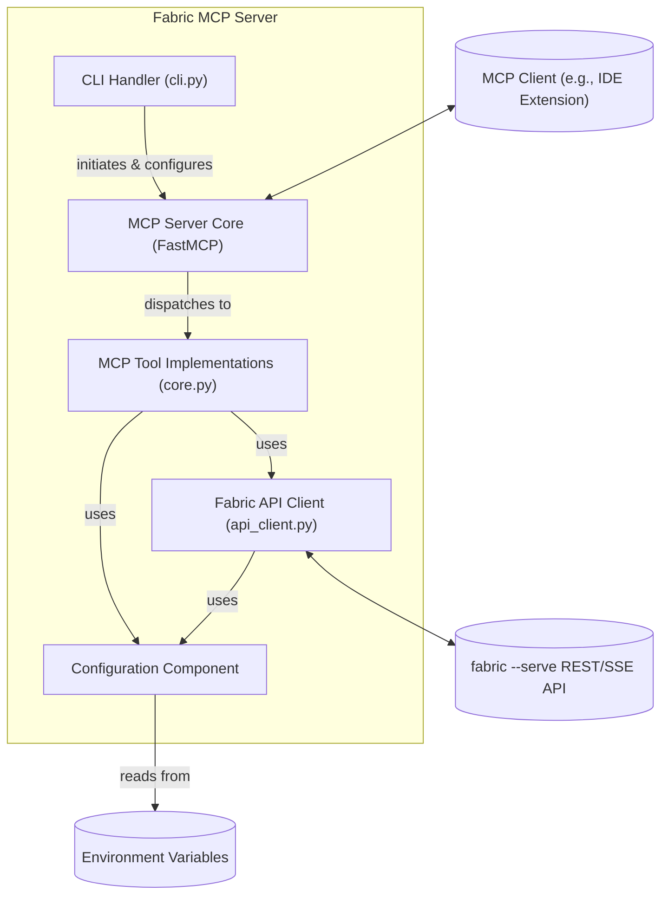

# Component View

The Fabric MCP Server is composed of several key logical components that work together to bridge MCP clients with the Fabric API. These components align with the architectural patterns previously discussed:

* **MCP Server Core (FastMCP Engine):**

  * **Responsibility:** This component, provided by the `FastMCP` library, is responsible for managing the low-level details of the Model Context Protocol. It handles establishing connections with MCP clients over the configured transport (stdio, Streamable HTTP, or SSE), parsing incoming MCP requests, and dispatching them to the appropriate tool implementations. It also takes care of formatting and sending MCP responses (including error responses and stream data) back to the client.
  * **Interaction:** Receives requests from MCP clients and forwards them to the MCP Tool Implementations. Sends responses generated by the Tool Implementations back to the MCP clients.

* **MCP Tool Implementations (Core Logic):**

  * **Responsibility:** This layer contains the specific business logic for each MCP tool exposed by the server (e.g., `fabric_list_patterns`, `fabric_get_pattern_details`, `fabric_run_pattern`, `fabric_list_models`, `fabric_list_strategies`, `fabric_get_configuration`). For each tool, it:
    * Validates and interprets the incoming MCP request parameters.
    * Orchestrates the necessary calls to the Fabric API Client to fetch data or execute operations on the Fabric instance.
    * Transforms the data received from the Fabric API Client into the appropriate MCP response format, including handling streaming data for `fabric_run_pattern`.
    * Implements any specific logic required by the tool, such as data redaction for `fabric_get_configuration`.
  * **Interaction:** Receives processed requests from the MCP Server Core. Interacts with the Fabric API Client to communicate with `fabric --serve`. Produces MCP-compliant responses for the MCP Server Core. It also utilizes the Configuration Component for accessing necessary settings.

* **Fabric API Client (`api_client.py`):**

  * **Responsibility:** This component encapsulates all direct communication with the external `fabric --serve` REST API. It is responsible for:
    * Constructing and sending HTTP requests (GET, POST) to the appropriate Fabric API endpoints based on the details derived from the Fabric source code.
    * Handling authentication with the Fabric API by including the `FABRIC_API_KEY` if provided.
    * Consuming and processing responses from the Fabric API, including handling standard JSON responses and Server-Sent Event (SSE) streams for pattern execution.
    * Implementing retry logic for API calls.
  * **Interaction:** Called by the MCP Tool Implementations. Makes network requests to the `fabric --serve` instance. Returns data or streams back to the MCP Tool Implementations. Uses the Configuration Component for API base URL and key.

* **Configuration Component:**

  * **Responsibility:** Provides access to runtime configuration settings sourced from environment variables (`FABRIC_BASE_URL`, `FABRIC_API_KEY`, `FABRIC_MCP_LOG_LEVEL`). This ensures that configurable parameters are centralized and easily managed.
  * **Interaction:** Provides configuration values to the Fabric API Client (for URL and key) and the CLI Handler/Main Application (for log level and server settings).

* **CLI Handler (`cli.py`):**

  * **Responsibility:** This component, built using `click`, parses command-line arguments provided when the server is launched. It interprets arguments such as `--transport`, `--host`, `--port`, `--path`, and `--log-level` to configure and initialize the MCP Server Core with the correct transport mode and settings. It also handles informational commands like `--version` and `--help`.
  * **Interaction:** Acts as the entry point for the application. Initializes and starts the MCP Server Core based on user-provided CLI arguments and the Configuration Component.

<!-- end list -->

