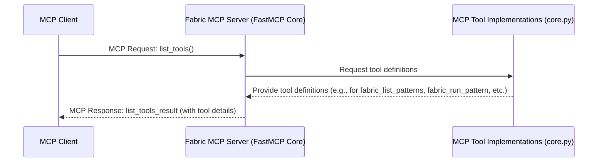
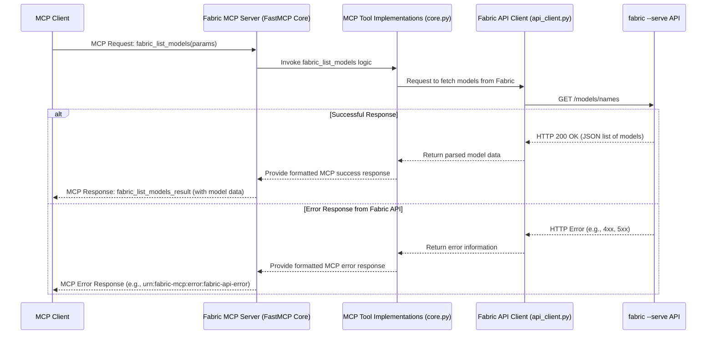
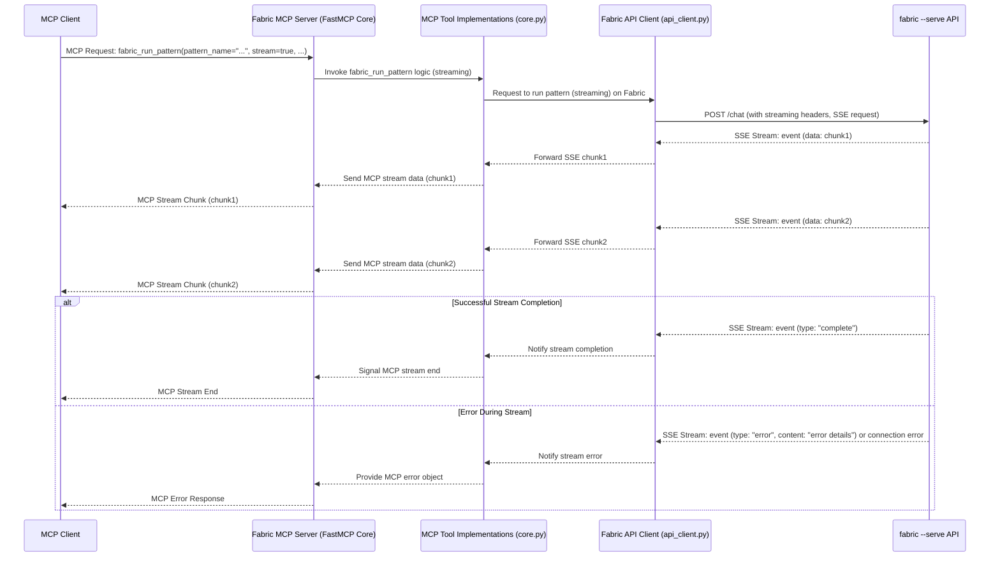
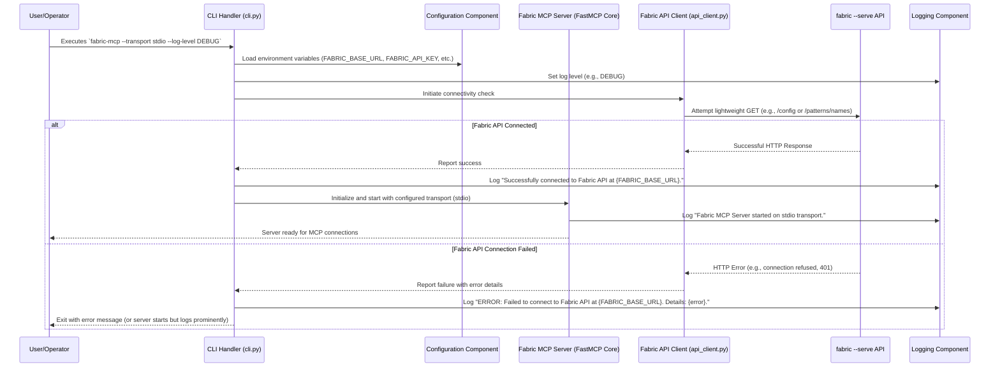

# Core Workflow / Sequence Diagrams

These diagrams illustrate the primary interaction flows within the Fabric MCP Server system.

## 1. MCP Client: Tool Discovery (`list_tools`)

**Description:**

1. The MCP Client sends a `list_tools()` request to the Fabric MCP Server.
2. The FastMCP Core (ServerCore) receives this and queries the MCP Tool Implementations (ToolLogic) for the definitions of all registered tools.
3. The ToolLogic provides these definitions.
4. The ServerCore formats this into an MCP `list_tools_result` and sends it back to the Client.

## 2. MCP Client: Execute Non-Streaming Pattern (e.g., `fabric_list_models`)

**Description (Revised for clarity):**

1. The MCP Client sends a request for a tool like `fabric_list_models`.
2. The ServerCore passes this to the specific ToolLogic implementation.
3. ToolLogic instructs the FabricClient to fetch the required data.
4. FabricClient makes a `GET /models/names` HTTP request to the `fabric --serve` API.
5. **If successful:**
      * FabricAPI returns an HTTP 200 OK response with the JSON data.
      * FabricClient parses this and returns it to ToolLogic.
      * ToolLogic formats the data into the MCP success response structure.
      * ServerCore sends the final MCP success response to the Client.
6. **If an error occurs at the Fabric API level:**
      * FabricAPI returns an HTTP error (e.g., 4xx or 5xx).
      * FabricClient conveys this error information to ToolLogic.
      * ToolLogic constructs an appropriate MCP error response.
      * ServerCore sends the MCP error response to the Client.

## 3. MCP Client: Execute Streaming Pattern (`fabric_run_pattern` with `stream: true`)

**Description:**

1. Client requests `fabric_run_pattern` with `stream: true`.
2. ServerCore invokes the ToolLogic for `fabric_run_pattern`.
3. ToolLogic instructs FabricClient to execute the pattern with streaming.
4. FabricClient makes a `POST /chat` request to FabricAPI, establishing an SSE connection.
5. FabricAPI sends SSE events (data chunks).
6. FabricClient receives these chunks and forwards them to ToolLogic.
7. ToolLogic wraps these chunks into MCP stream data and sends them via ServerCore to the Client.
8. This continues until the FabricAPI SSE stream ends (e.g., with a "complete" type event) or an error occurs. The Fabric MCP Server then appropriately signals the end of the MCP stream or sends an MCP error to the client.

## 4. Server Startup & Fabric API Connectivity Check

**Description:**

1. User starts the server via the CLI, providing transport and log level arguments.
2. The CLI loads configuration from environment variables.
3. The CLI initiates a connectivity check via the FabricClient.
4. The FabricClient attempts a lightweight GET request to the Fabric API (e.g., `/config` or `/patterns/names`).
5. If successful, a success message is logged, and the MCP Server Core is initialized and started.
6. If it fails, an actionable error message is logged, and the server might exit or start with a prominent error warning.
