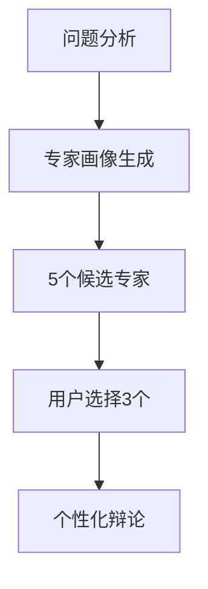
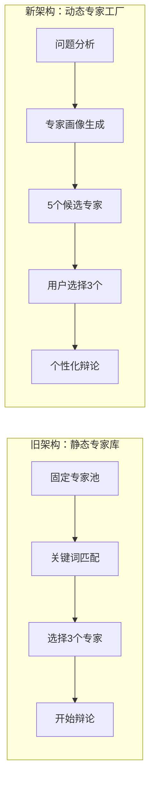

# Guru-PK MCP 智能专家辩论系统

基于MCP（Model Context Protocol）的AI专家辩论系统，从静态专家库升级为**智能专家工厂**，根据问题动态生成最适合的专家组合进行多轮智慧碰撞。

## ✨ 核心特色

- 🏭 **动态专家工厂** - 问题驱动的专家生成，告别固定专家限制
- 🎯 **5选3候选机制** - 智能生成5位候选专家，用户选择最佳3位组合
- 🔄 **多轮PK流程** - 独立思考 → 交叉辩论 → 最终立场 → 智慧综合  
- 🤖 **智能专家推荐** - MCP Host端LLM深度分析问题，精准匹配专家
- 🌟 **混合专家池** - 内置经典专家 + 自定义专家 + 动态生成专家

## 🚀 快速安装

### 1. 安装依赖

**方式一：使用安装脚本（推荐）**

**macOS/Linux:**

```bash
curl -LsSf https://astral.sh/uv/install.sh | sh
```

**Windows:**

```powershell
powershell -ExecutionPolicy ByPass -c "irm https://astral.sh/uv/install.ps1 | iex"
```

**方式二：使用 pip 安装（适用于所有平台）**

```bash
pip install uv
```

**方式三：下载安装包**

从 [UV Releases](https://github.com/astral-sh/uv/releases) 页面下载对应平台的安装包

### 2. 配置MCP客户端

**推荐方式：从PyPI安装**

```json
{
  "mcpServers": {
    "guru-pk": {
      "command": "uvx",
      "args": ["--from", "guru-pk-mcp", "guru-pk-mcp-server"],
      "env": {
        "DATA_DIR": "~/.guru-pk-data"  // macOS/Linux: ~/目录, Windows: %USERPROFILE%目录
      }
    }
  }
}
```

> **注意**:
>
> - macOS用户可能需要使用完整路径：`/Users/{用户名}/.local/bin/uvx`
> - Windows用户：`~`会自动解析为用户主目录（如 `C:\Users\{用户名}`），无需手动修改
> - 如果遇到路径问题，可以使用绝对路径替代，例如：
>   - Windows: `"DATA_DIR": "C:\\Users\\{用户名}\\.guru-pk-data"`
>   - macOS: `"DATA_DIR": "/Users/{用户名}/.guru-pk-data"`
>   - Linux: `"DATA_DIR": "/home/{用户名}/.guru-pk-data"`

**开发方式：从源码安装**

```json
{
  "mcpServers": {
    "guru-pk": {
      "command": "uvx", 
      "args": ["--from", "/path/to/guru-pk-mcp", "guru-pk-mcp-server"],
      "env": {
        "DATA_DIR": "~/.guru-pk-data"  // macOS/Linux: ~/目录, Windows: %USERPROFILE%目录
      }
    }
  }
}
```

### 3. 开始使用

重启MCP客户端，输入 `guru_pk_help` 获取帮助，或直接提问开始专家辩论！

## 🎭 专家阵容

### 哲学思辨

🧠 **苏格拉底** - 批判思维，质疑表面答案  
☯️ **王阳明** - 心学大师，知行合一  
🧘 **克里希那穆提** - 觉察智慧，当下哲学  

### 商业创新  

🚀 **埃隆·马斯克** - 第一性原理，颠覆创新  
📚 **查理·芒格** - 多元思维，投资智慧  
🍎 **史蒂夫·乔布斯** - 产品完美主义，用户体验  
🌸 **稻盛和夫** - 敬天爱人，经营哲学  

### 经济战略

💰 **冯·米塞斯** - 奥地利学派，人类行动学  
⚔️ **孙子** - 兵学圣祖，战略思维  
📖 **曾国藩** - 修身治国，渐进改良  

### 科学方法

🔬 **卡尔·波普尔** - 可证伪性，批判理性主义  
🔄 **杰伊·福雷斯特** - 系统动力学，反馈环理论  
🧠 **大卫·伯恩斯** - CBT心理学，认知重构  

## 💡 使用方法

### 🎯 新架构：智能专家工厂



#### 智能专家生成流程

1. **提出问题** - 系统深度分析问题特征
2. **生成候选** - 智能创建5位专家（内置+自定义+动态生成）
3. **用户选择** - 从候选中选择最符合需求的3位
4. **开始辩论** - 启动多轮PK流程

```javascript
// 1. 智能生成候选专家
start_pk_session({"question": "如何在AI时代实现个人突破？"})

// 2. 选择专家组合
select_experts_and_start_session({
  "selected_experts": ["专家A", "专家B", "专家C"]
})
```

### 核心工具

- `start_pk_session` - 智能生成候选专家
- `select_experts_and_start_session` - 选择专家并启动辩论
- `get_persona_prompt` - 获取当前专家的角色提示
- `record_round_response` - 记录专家发言

### 专家管理

- `list_available_personas` - 查看所有专家
- `recommend_personas` - 传统关键词推荐
- `create_custom_persona_from_description` - 智能创建自定义专家
- `save_custom_persona` - 保存自定义专家数据

### 会话管理

- `view_session_history` - 查看会话历史
- `export_session` - 导出会话为Markdown文件
- `advance_to_next_round` - 手动进入下一轮/专家

### 系统设置

- `get_language_settings` - 查看当前语言设置
- `set_language` - 设置回复语言
- `get_usage_statistics` - 获取使用统计分析
- `guru_pk_help` - 获取系统帮助

### 🌟 智能自定义专家创建（重点功能）

**全新架构：MCP Host端LLM智能生成 + MCP Server端保存**

#### 第一步：获取创建指导

```javascript
create_custom_persona_from_description({
  "description": "我想要一个世界历史方面的顶尖专家"
})
```

#### 第二步：LLM生成专家数据

系统返回详细指导后，让MCP Host端的LLM生成完整专家数据：

```json
{
  "name": "汤因比",
  "emoji": "📚",
  "description": "英国著名历史学家，文明史研究的集大成者",
  "core_traits": ["文明史观", "挑战-应战理论", "宏观历史视野"],
  "speaking_style": "宏观深邃，善于从文明兴衰中提炼规律",
  "base_prompt": "详细的角色提示词..."
}
```

#### 第三步：保存专家

```javascript
save_custom_persona({
  "persona_data": { /* 上面生成的完整数据 */ }
})
```

**🎯 核心优势：**

- 🧠 **真正智能** - 利用MCP Host端LLM的强大生成能力
- 🎭 **专业定制** - 创建真正有价值的领域专家，而非通用模板
- 🔧 **完整验证** - 自动处理名称冲突、数据验证等技术细节
- 📚 **详细指导** - 提供专家数据模板和创建要点

#### 🌟 推荐专家领域

- **历史学**: 汤因比、黄仁宇、钱穆
- **物理学**: 爱因斯坦、费曼、霍金  
- **文学**: 莎士比亚、鲁迅、村上春树
- **艺术**: 达芬奇、毕加索、宫崎骏
- **经济学**: 亚当·斯密、凯恩斯、张五常

### 🔧 备用方式：手动指定专家

```javascript
// 直接指定专家组合
start_pk_session({
  "question": "如何在AI时代保持竞争力？",
  "personas": ["苏格拉底", "埃隆马斯克", "大卫伯恩斯"]
})
```

### 🎯 智能专家工厂优势

- **问题驱动** - 专家服务于问题，而非问题迁就专家
- **动态生成** - 每个专家都为特定问题量身定制  
- **智能组合** - 确保专家组合的多样性和互补性
- **混合推荐** - 内置经典 + 用户自定义 + 实时生成

## 🔄 辩论流程

1. **独立思考** - 每位专家独立分析
2. **交叉辩论** - 互相批评和借鉴  
3. **最终立场** - 形成完善方案
4. **智慧综合** - 融合终极答案

## 🛠️ 技术架构

**语言**: Python 3.10+ | **框架**: MCP | **包管理**: UVX  
**存储**: 本地JSON | **特点**: 零部署、隐私保护

### 项目结构

```
src/guru_pk_mcp/
├── server.py           # MCP服务器
├── personas.py         # 13位专家配置  
├── session_manager.py  # 会话管理
├── custom_personas.py  # 自定义专家
└── models.py          # 数据模型
```

## 🎨 核心创新

### 🏭 动态专家工厂（架构革新）

**从"专家库"到"专家工厂"的根本性转变** - 解决传统AI辩论系统的根本局限。

#### 💡 设计理念转变



#### 🎯 核心价值重新定位

系统真正的价值在于**多轮反思的PK流程**，而非具体的专家人设。新架构将专家完全服务于问题，实现：

- **专业深度** - 针对问题生成真正的领域专家
- **动态匹配** - 基于问题语义智能组合专家
- **无限扩展** - 突破固定专家池的限制

#### 🚀 三层专家生成架构

1. **问题理解层** - 深度分析问题的领域、层次、目标
2. **专家设计层** - 基于问题特征生成专家画像
3. **人格塑造层** - 赋予专家独特的思维方式和冲突点

### 🌟 自然语言创建专家（核心优势）

**革命性的专家创建体验** - 这是Guru-PK MCP最强大的功能，也是与其他AI辩论系统的核心差异化优势。

#### ⚡ 超简单的创建流程

```bash
# 1. 用自然语言描述需求
create_custom_persona_from_description({
  "description": "我想要一个现代教育领域最顶尖的大师"
})

# 2. 系统智能生成完整模板
# 3. 您确认或微调
# 4. 立即可用于专家辩论！
```

#### 🎭 智能推荐专家库

系统内置了各领域顶级专家的模板：

**教育领域**: 肯·罗宾逊（创造力教育）  
**AI科技**: 杰弗里·辛顿（深度学习教父）  
**心理治疗**: 维克多·弗兰克尔（意义疗法）  
**商业创新**: 克莱顿·克里斯坦森（颠覆式创新）  
**设计思维**: 蒂姆·布朗（设计思维）  
...更多领域持续扩展

#### 💡 使用技巧

```bash
# 具体领域
"我需要一个区块链技术专家"
"我想要一个儿童心理学家"  
"我需要一个可持续发展专家"

# 特定需求
"我想要一个擅长解决团队冲突的专家"
"我需要一个专门研究创业失败的专家"
"我想要一个关注女性领导力的专家"

# 历史人物
"我想要一个像爱因斯坦一样的物理学家"
"我需要一个类似甘地的精神领袖"
```

### 传统方式：手动创建专家

如果您仍希望手动创建，可以使用 `create_custom_persona` 工具

### 数据管理  

- 自动保存会话到本地JSON
- 支持Markdown导出
- 历史会话查看和恢复
- 完全本地化，保护隐私

### 统计分析

- 会话完成率和活跃度
- 热门专家排行榜  
- 问题领域分析
- 讨论质量统计

## 📱 兼容性

支持所有MCP兼容应用：Claude Desktop、Cursor、TRAE、DeepChat、Cherry Studio等

## 💡 使用提示

- 🤖 **直接提问** - 最简单的使用方式，自动智能推荐专家
- 📋 `guru_pk_help` - 获取系统介绍和详细帮助
- 👥 `list_available_personas` - 查看所有可用专家
- 📊 `get_usage_statistics` - 查看使用统计和分析
- 📄 `export_session` - 导出会话记录为Markdown
- 🌍 `set_language` - 设置专家回复语言
- 💾 推荐使用UVX方式安装，零配置依赖管理

## 💭 设计理念

### 灵感来源

本项目受到 [人生教练团Agent](https://mp.weixin.qq.com/s/QGNzRRo7U3Y2fmvOXNJvyw) 的启发。原文提出了多角色PK的创新思路，通常这类系统会使用LangGraph等Agent框架开发，而原作者选择了"飞书MCP"实现更简单的方案，思路巧妙。

### 技术方案对比

**🔧 Agent框架开发**

- ✅ 功能强大，可集成多个LLM API
- ✅ 前端交互灵活，控制性强
- ❌ 开发复杂度高
- ❌ API调用成本高昂

**☁️ 飞书MCP方案**  

- ✅ 几乎零开发，部署简单
- ✅ 利用现有飞书生态
- ❌ 依赖第三方服务
- ❌ 定制化程度有限

**🏠 本地MCP方案（本项目）**

- ✅ 与订阅制Chat APP结合，无API费用
- ✅ 数据本地化，隐私保护
- ✅ 开源可定制，技术独立
- ✅ **MCP Host端智能推荐** - 充分利用订阅制LLM的智能优势
- ❌ 依赖MCP客户端实现，兼容性差异
- ❌ 需要一定开发工作

### 核心优势

**智能专家工厂** - 实现了从静态专家库到动态专家生成的根本性突破：

#### 🏭 **动态生成优势**

- **问题驱动** - 专家完全服务于问题，告别固定专家限制
- **无限扩展** - 突破13位内置专家的边界，支持任意领域
- **智能组合** - 确保专家组合的多样性和互补性

#### 🤖 **智能化架构**  

- **MCP Host端智能** - 利用订阅制LLM的强大分析和生成能力
- **语义理解** - 深度理解问题本质，精准匹配专家特征
- **混合推荐** - 内置经典 + 自定义专家 + 动态生成的完美融合

#### 💰 **成本效益**

- **零API费用** - 充分利用订阅制Chat APP的LLM能力  
- **本地隐私** - 所有数据本地存储，完全隐私保护
- **开源可定制** - 不依赖任何第三方服务

这种**动态专家工厂**的设计，将AI专家辩论系统推向了新的高度。
