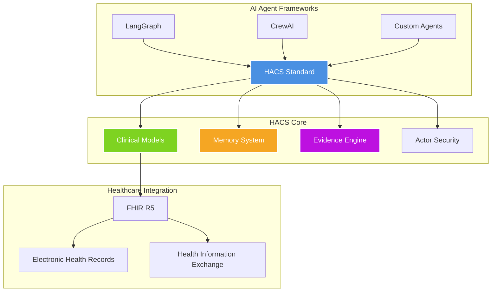

# HACS – Healthcare Agent Communication Standard

<div align="center">


**A standardized communication framework for healthcare AI agents**

*FHIR-compatible • Type-safe • Production-ready*

[**📚 Documentation**](docs/README.md) • [**🚀 Quick Start**](docs/getting-started/quickstart.md) • [**💬 Community**](https://discord.gg/hacs) • [**🤝 Contributing**](docs/contributing/guidelines.md)


</div>

---

## Overview

HACS provides a standardized framework for healthcare AI agents to communicate effectively while maintaining clinical accuracy and regulatory compliance. Built with healthcare professionals and AI developers in mind, it bridges the gap between clinical workflows and modern AI systems.

### Key Principles

- **Healthcare-First**: Designed specifically for clinical environments and workflows
- **Interoperability**: Full FHIR R5 compatibility with bidirectional data mapping
- **Type Safety**: Comprehensive validation to prevent clinical data errors
- **Agent-Native**: Built-in support for AI agent memory, reasoning, and evidence tracking
- **Community-Driven**: Open source with contributions from healthcare and AI communities

## Problem Statement

Healthcare AI systems often struggle with:

| Challenge | HACS Solution |
|-----------|---------------|
| Inconsistent data formats | Standardized, typed models for all clinical data |
| Poor agent memory management | Structured memory types (episodic, procedural, executive) |
| Lack of evidence tracking | Built-in provenance and quality scoring |
| Complex protocol integration | Universal adapters for major AI frameworks |
| FHIR integration complexity | Seamless bidirectional FHIR conversion |
| Limited agent collaboration | Rich messaging with reasoning traces |

## Quick Start

### Installation

```bash
# Install UV package manager (recommended)
curl -LsSf https://astral.sh/uv/install.sh | sh

# Clone and setup HACS
git clone https://github.com/voa-health/hacs.git
cd hacs
uv sync
```

### Basic Usage

```python
from hacs_models import Patient, Observation, AgentMessage
from hacs_core import Actor, MemoryBlock, Evidence
from hacs_tools import CreateResource, store_memory, create_evidence
from datetime import date

# Create a healthcare actor
physician = Actor(
    id="physician-001",
    name="Dr. Sarah Johnson",
    role="physician",
    permissions=["patient:read", "patient:write", "observation:*"],
    is_active=True
)

# Create a patient record
patient = Patient(
    id="patient-001",
    given=["John"], family="Doe",
    gender="male", birth_date=date(1985, 3, 15),
    agent_context={
        "preferences": ["morning_appointments"],
        "communication_style": "detailed_explanations"
    }
)

# Record a clinical observation
observation = Observation(
    status="final",
    code={"coding": [{"system": "http://loinc.org", "code": "8480-6", "display": "Systolic blood pressure"}]},
    subject=patient.id,
    value_quantity={"value": 120, "unit": "mmHg"},
    agent_context={
        "measurement_context": "routine_checkup",
        "patient_position": "sitting"
    }
)

# Store agent memory
memory = MemoryBlock(
    memory_type="episodic",
    content="Patient responded well to lifestyle counseling regarding blood pressure management",
    importance_score=0.7,
    metadata={"intervention": "lifestyle_counseling", "response": "positive"}
)
memory_id = store_memory(memory, actor=physician)

# Create evidence record
evidence = create_evidence(
    citation="AHA/ACC 2017 Hypertension Guidelines",
    content="Lifestyle modifications are recommended as first-line therapy for stage 1 hypertension",
    actor=physician,
    evidence_type="guideline",
    confidence_score=0.95
)

print(f"Created records for {patient.display_name}")
print(f"Memory stored: {memory_id}")
print(f"Evidence linked: {evidence.id}")
```

## Architecture

<div align="center">



</div>

## Package Structure

| Package | Purpose | Status |
|---------|---------|--------|
| **[hacs-core](docs/modules/hacs-core.md)** | Foundation models and security framework | ✅ Stable |
| **[hacs-models](docs/modules/hacs-models.md)** | Clinical and agent communication models | ✅ Stable |
| **[hacs-fhir](docs/modules/hacs-fhir.md)** | FHIR R5 integration and mapping | ✅ Stable |
| **[hacs-tools](docs/modules/hacs-tools.md)** | CRUD operations and protocol adapters | ✅ Stable |
| **[hacs-cli](docs/modules/hacs-cli.md)** | Command-line interface and utilities | ✅ Stable |
| **[hacs-api](docs/modules/hacs-api.md)** | REST API service | 🔄 Basic |

## Features

### Healthcare-Native Design
- **FHIR R5 Compliance**: Complete bidirectional mapping with healthcare standards
- **Clinical Terminology**: Built-in support for LOINC, SNOMED CT, and UCUM
- **Patient Safety**: Comprehensive validation and audit capabilities
- **Regulatory Awareness**: HIPAA-compatible design patterns

### AI Agent Support
- **Structured Memory**: Episodic, procedural, and executive memory types
- **Evidence Tracking**: Provenance, quality scoring, and confidence metrics
- **Reasoning Traces**: Explainable AI with step-by-step decision tracking
- **Context Preservation**: Rich metadata for agent interactions

### Protocol Integration
- **Multiple Frameworks**: Native adapters for LangGraph, CrewAI, and custom agents
- **Universal Protocols**: Support for MCP, Agent-to-Agent, and AG-UI standards
- **Flexible Architecture**: Easy integration with existing healthcare systems

## Command Line Interface

```bash
# Validate healthcare data
uv run hacs validate samples/patient_example.json

# Convert between formats
uv run hacs convert to-fhir samples/patient_example.json

# Memory operations
uv run hacs memory store "Patient prefers morning appointments" --type episodic
uv run hacs memory recall "appointment preferences" --type episodic

# Evidence management
uv run hacs evidence create "Clinical Study 2024" "Evidence content here"

# Protocol exports
uv run hacs export mcp samples/observation_example.json --operation create

# Schema inspection
uv run hacs schema Patient --format table
```

## API Service

Start the REST API server:

```bash
uv run python -m hacs_api
# Access at http://localhost:8000
# Interactive docs: http://localhost:8000/docs
```

Key endpoints:
- `POST /patients` - Create and validate patient records
- `GET /patients/{id}` - Retrieve patient data with FHIR conversion
- `POST /memories` - Store agent memories
- `GET /memories/search` - Search and recall memories
- `POST /evidence` - Create evidence records
- `GET /convert/to-fhir` - Convert HACS models to FHIR format

## Roadmap

| Version | Focus Area | Key Features |
|---------|------------|--------------|
| **v0.1.0** | Foundation | Core models, FHIR integration, basic adapters |
| **v0.2.0** | AI Enhancement | Vector RAG, semantic search, advanced memory |
| **v0.3.0** | Enterprise | Multi-tenancy, real-time collaboration, scalability |
| **v1.0.0** | Certification | HL7 certification, enterprise hardening |

## Contributing

We welcome contributions from the healthcare and AI communities. Whether you're a:

- **Healthcare Professional**: Help validate clinical workflows and terminology
- **AI Developer**: Contribute agent frameworks and protocol adapters
- **Software Engineer**: Improve core functionality and performance
- **Documentation Writer**: Help make HACS more accessible
- **Quality Assurance**: Help maintain our testing standards

See our [Contributing Guidelines](docs/contributing/guidelines.md) for detailed information.

### Getting Involved

- 🐛 **Report Issues**: Help us identify and fix problems
- ✨ **Request Features**: Suggest improvements and new capabilities
- 📚 **Improve Documentation**: Make HACS easier to understand and use
- 🔧 **Submit Pull Requests**: Contribute code improvements
- 💬 **Join Discussions**: Share ideas and ask questions

## Community

<div align="center">

[](https://discord.gg/hacs)
[](https://github.com/voa-health/hacs/discussions)
[](docs/README.md)

</div>

### Support Channels

- **GitHub Issues**: Bug reports and feature requests
- **GitHub Discussions**: Community Q&A and general discussion
- **Discord**: Real-time chat with the community
- **Documentation**: Comprehensive guides and API reference

## License & Compliance

- **License**: [Apache-2.0](LICENSE) - Open source with commercial use permitted
- **FHIR Compliance**: Full R5 compatibility with healthcare standards
- **Privacy**: HIPAA-aware design patterns and audit capabilities
- **Security**: Actor-based permissions and comprehensive logging

## Acknowledgments

HACS is built by a community of healthcare professionals, AI researchers, and software developers who believe in making healthcare AI more accessible and reliable. We thank all contributors who have helped shape this project.

---

<div align="center">

**Building the future of healthcare AI communication, together**

[Get Started](docs/getting-started/quickstart.md) • [Join Community](https://discord.gg/hacs) • [Contribute](docs/contributing/guidelines.md)

</div>
