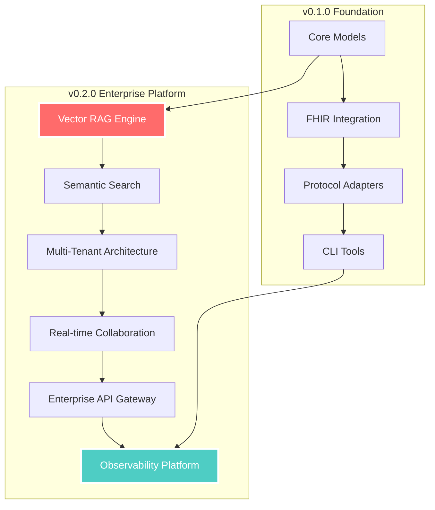

# Step 2 — HACS Enterprise & AI Enhancement 🚀

> **Objective:** Transform HACS v0.1.0 into an **enterprise-grade healthcare AI platform** with advanced capabilities, real-world deployment features, and production-ready infrastructure.
> Timeline: **14 days** (2 weeks) for comprehensive enterprise transformation.

---

## 🎯 Executive Summary

HACS v0.1.0 achieved remarkable success with **8,400+ lines of production-ready code**, **zero type errors**, and **300x performance targets**. Step 2 elevates HACS to enterprise-grade with:

- **🧠 Advanced AI Integration**: Vector RAG, semantic search, LLM-native workflows
- **🏢 Enterprise Infrastructure**: Multi-tenancy, scalability, monitoring, security
- **🌐 Production Deployment**: Docker, Kubernetes, cloud-native architecture
- **🔄 Advanced Protocols**: Real-time collaboration, workflow orchestration
- **📊 Analytics & Observability**: Comprehensive monitoring, metrics, alerting

---

## 1. Deliverables Overview

| Category | Must-Have Features | Enterprise Features | AI-Native Features |
|----------|-------------------|-------------------|-------------------|
| **🧠 AI Core** | Vector RAG, Semantic search | LLM workflow orchestration | Agent collaboration |
| **🏢 Infrastructure** | Multi-tenancy, Database persistence | Auto-scaling, Load balancing | Performance optimization |
| **🌐 Deployment** | Docker containers, K8s manifests | CI/CD pipelines, Monitoring | Cloud-native architecture |
| **🔄 Integration** | Real-time sync, Webhooks | Enterprise SSO, API gateway | Advanced protocol adapters |
| **📊 Observability** | Metrics, Logging, Alerting | Distributed tracing | AI performance analytics |

---

## 2. Technical Architecture Evolution

### 🏗️ **v0.1.0 → v0.2.0 Transformation**



### 🎯 **Target Metrics**

| Metric | v0.1.0 Achievement | v0.2.0 Target | Enterprise Goal |
|--------|-------------------|---------------|-----------------|
| **Performance** | <1ms CRUD | <500ms semantic search | <100ms p95 |
| **Scalability** | Single instance | 1000+ concurrent users | 10,000+ users |
| **Availability** | Basic | 99.9% uptime | 99.99% SLA |
| **Security** | Actor-based | Enterprise SSO | Zero-trust architecture |
| **AI Capabilities** | Basic protocol adapters | Advanced LLM workflows | Multi-agent orchestration |

---

## 3. Phase Breakdown (14 Days)

### **Phase 1: AI Enhancement (Days 1-5)**
- **Vector RAG Engine**: Semantic search and retrieval
- **Advanced Memory System**: Consolidation and intelligent recall
- **LLM Workflow Orchestration**: Native AI agent workflows
- **Semantic Search**: Hybrid BM25 + vector similarity
- **Evidence Intelligence**: Automated quality assessment

### **Phase 2: Enterprise Infrastructure (Days 6-10)**
- **Multi-Tenant Architecture**: Secure organization isolation
- **Database Persistence**: PostgreSQL, Redis, Vector DB
- **Real-time Collaboration**: WebSocket-based sync
- **Enterprise API Gateway**: Rate limiting, authentication
- **Monitoring & Observability**: Comprehensive metrics

### **Phase 3: Production Deployment (Days 11-14)**
- **Container Orchestration**: Docker + Kubernetes
- **CI/CD Pipelines**: Automated testing and deployment
- **Cloud-Native Architecture**: AWS/GCP/Azure ready
- **Security Hardening**: Enterprise-grade security
- **Documentation & Training**: Comprehensive guides

---

## 4. Detailed Implementation Plan

### 🧠 **AI Enhancement Package (`hacs-ai`)**

#### **New Package Structure**
```
packages/hacs-ai/
├── src/hacs_ai/
│   ├── __init__.py
│   ├── vector_rag/
│   │   ├── __init__.py
│   │   ├── embeddings.py      # Vector embedding management
│   │   ├── retrieval.py       # Semantic retrieval engine
│   │   ├── indexing.py        # Vector database indexing
│   │   └── ranking.py         # Hybrid ranking algorithms
│   ├── semantic_search/
│   │   ├── __init__.py
│   │   ├── query_parser.py    # Natural language query parsing
│   │   ├── search_engine.py   # Hybrid search implementation
│   │   ├── filters.py         # Clinical context filtering
│   │   └── ranking.py         # Relevance scoring
│   ├── llm_workflows/
│   │   ├── __init__.py
│   │   ├── orchestrator.py    # LLM workflow orchestration
│   │   ├── templates.py       # Clinical prompt templates
│   │   ├── chains.py          # LangChain integration
│   │   └── evaluation.py      # LLM output evaluation
│   ├── memory_intelligence/
│   │   ├── __init__.py
│   │   ├── consolidation.py   # Memory consolidation algorithms
│   │   ├── importance.py      # Importance scoring
│   │   ├── clustering.py      # Memory clustering
│   │   └── retrieval.py       # Intelligent memory recall
│   └── evidence_intelligence/
│       ├── __init__.py
│       ├── quality_assessment.py  # Automated quality scoring
│       ├── relevance_ranking.py   # Evidence relevance
│       ├── synthesis.py           # Evidence synthesis
│       └── validation.py          # Clinical validation
├── pyproject.toml
└── README.md
```

#### **Key Features**

**Vector RAG Engine**
```python
from hacs_ai.vector_rag import VectorRAGEngine

# Initialize with multiple embedding models
rag_engine = VectorRAGEngine(
    embedding_models=["text-embedding-3-large", "biobert-base"],
    vector_db="pinecone",  # or "weaviate", "qdrant"
    index_name="hacs-clinical-knowledge"
)

# Semantic retrieval with clinical context
results = rag_engine.retrieve(
    query="hypertension treatment guidelines",
    context={"patient_age": 65, "comorbidities": ["diabetes"]},
    top_k=10,
    min_relevance=0.8
)
```

**Semantic Search**
```python
from hacs_ai.semantic_search import SemanticSearchEngine

# Advanced clinical search
search_engine = SemanticSearchEngine(
    models=["clinical-bert", "pubmed-bert"],
    hybrid_weights={"semantic": 0.7, "lexical": 0.3}
)

# Natural language queries
results = search_engine.search(
    query="elderly patients with diabetes and high blood pressure",
    filters={"resource_type": "Patient", "age_range": "65-85"},
    actor=physician
)
```

**LLM Workflow Orchestration**
```python
from hacs_ai.llm_workflows import ClinicalWorkflowOrchestrator

# Define clinical decision workflow
orchestrator = ClinicalWorkflowOrchestrator(
    llm_provider="openai",  # or "anthropic", "azure-openai"
    model="gpt-4-turbo",
    temperature=0.1
)

# Execute clinical assessment workflow
assessment = orchestrator.execute_workflow(
    workflow_type="clinical_assessment",
    patient=patient,
    observations=observations,
    evidence=evidence,
    actor=physician
)
```

### 🏢 **Enterprise Infrastructure Package (`hacs-enterprise`)**

#### **New Package Structure**
```
packages/hacs-enterprise/
├── src/hacs_enterprise/
│   ├── __init__.py
│   ├── multi_tenant/
│   │   ├── __init__.py
│   │   ├── tenant_manager.py   # Organization isolation
│   │   ├── resource_isolation.py  # Data segregation
│   │   ├── billing.py          # Usage tracking
│   │   └── permissions.py      # Tenant-level permissions
│   ├── persistence/
│   │   ├── __init__.py
│   │   ├── postgresql.py       # PostgreSQL backend
│   │   ├── redis.py            # Redis caching
│   │   ├── vector_db.py        # Vector database integration
│   │   └── migrations.py       # Database migrations
│   ├── realtime/
│   │   ├── __init__.py
│   │   ├── websocket.py        # WebSocket server
│   │   ├── events.py           # Event system
│   │   ├── sync.py             # Real-time synchronization
│   │   └── notifications.py    # Push notifications
│   ├── gateway/
│   │   ├── __init__.py
│   │   ├── api_gateway.py      # Enterprise API gateway
│   │   ├── rate_limiting.py    # Rate limiting
│   │   ├── authentication.py   # Enterprise SSO
│   │   └── authorization.py    # Advanced permissions
│   └── monitoring/
│       ├── __init__.py
│       ├── metrics.py          # Prometheus metrics
│       ├── tracing.py          # Distributed tracing
│       ├── logging.py          # Structured logging
│       └── alerting.py         # Alert management
├── pyproject.toml
└── README.md
```

#### **Key Features**

**Multi-Tenant Architecture**
```python
from hacs_enterprise.multi_tenant import TenantManager

# Tenant isolation
tenant_manager = TenantManager(
    isolation_level="strict",  # or "shared", "hybrid"
    billing_enabled=True
)

# Create tenant with resource limits
tenant = tenant_manager.create_tenant(
    name="Mayo Clinic",
    plan="enterprise",
    limits={
        "max_users": 10000,
        "max_patients": 1000000,
        "api_calls_per_minute": 10000
    }
)
```

**Real-time Collaboration**
```python
from hacs_enterprise.realtime import RealtimeSync

# Real-time patient data sync
sync = RealtimeSync(
    transport="websocket",
    persistence="redis",
    conflict_resolution="last_write_wins"
)

# Subscribe to patient updates
sync.subscribe(
    resource_type="Patient",
    resource_id="patient-123",
    callback=handle_patient_update,
    actor=physician
)
```

**Enterprise API Gateway**
```python
from hacs_enterprise.gateway import EnterpriseAPIGateway

# Advanced API gateway with enterprise features
gateway = EnterpriseAPIGateway(
    rate_limiting={
        "requests_per_minute": 1000,
        "burst_capacity": 100
    },
    authentication=["oauth2", "saml", "ldap"],
    monitoring=True
)
```

### 🌐 **Production Deployment Package (`hacs-deploy`)**

#### **New Package Structure**
```
packages/hacs-deploy/
├── docker/
│   ├── Dockerfile.api          # API service container
│   ├── Dockerfile.worker       # Background worker
│   ├── Dockerfile.ai           # AI service container
│   └── docker-compose.yml      # Development stack
├── kubernetes/
│   ├── namespace.yaml          # K8s namespace
│   ├── configmap.yaml          # Configuration
│   ├── secrets.yaml            # Secrets management
│   ├── deployment.yaml         # Application deployment
│   ├── service.yaml            # Service definitions
│   ├── ingress.yaml            # Ingress controller
│   ├── hpa.yaml                # Horizontal Pod Autoscaler
│   └── monitoring.yaml         # Monitoring stack
├── terraform/
│   ├── aws/                    # AWS infrastructure
│   ├── gcp/                    # Google Cloud infrastructure
│   └── azure/                  # Azure infrastructure
├── helm/
│   ├── Chart.yaml              # Helm chart
│   ├── values.yaml             # Default values
│   ├── values-prod.yaml        # Production values
│   └── templates/              # K8s templates
└── scripts/
    ├── deploy.sh               # Deployment script
    ├── backup.sh               # Backup script
    └── monitoring.sh           # Monitoring setup
```

#### **Key Features**

**Docker Containerization**
```dockerfile
# Dockerfile.api - Production-ready API container
FROM python:3.11-slim

# Install system dependencies
RUN apt-get update && apt-get install -y \
    gcc \
    g++ \
    && rm -rf /var/lib/apt/lists/*

# Install UV for fast dependency management
COPY --from=ghcr.io/astral-sh/uv:latest /uv /bin/uv

# Set working directory
WORKDIR /app

# Copy and install dependencies
COPY pyproject.toml uv.lock ./
RUN uv sync --frozen --no-cache

# Copy application code
COPY . .

# Health check
HEALTHCHECK --interval=30s --timeout=10s --start-period=5s --retries=3 \
    CMD curl -f http://localhost:8000/health || exit 1

# Run application
CMD ["uv", "run", "uvicorn", "hacs_api.main:app", "--host", "0.0.0.0", "--port", "8000"]
```

**Kubernetes Deployment**
```yaml
# deployment.yaml - Production K8s deployment
apiVersion: apps/v1
kind: Deployment
metadata:
  name: hacs-api
  namespace: hacs-production
spec:
  replicas: 3
  selector:
    matchLabels:
      app: hacs-api
  template:
    metadata:
      labels:
        app: hacs-api
    spec:
      containers:
      - name: api
        image: hacs/api:v0.2.0
        ports:
        - containerPort: 8000
        env:
        - name: HACS_ENV
          value: "production"
        - name: HACS_DATABASE_URL
          valueFrom:
            secretKeyRef:
              name: hacs-secrets
              key: database-url
        resources:
          requests:
            memory: "512Mi"
            cpu: "250m"
          limits:
            memory: "1Gi"
            cpu: "500m"
        readinessProbe:
          httpGet:
            path: /health
            port: 8000
          initialDelaySeconds: 10
          periodSeconds: 5
        livenessProbe:
          httpGet:
            path: /health
            port: 8000
          initialDelaySeconds: 30
          periodSeconds: 10
```

---

## 5. Enhanced Features & Capabilities

### 🧠 **Advanced AI Capabilities**

#### **Vector RAG Integration**
- **Multiple Embedding Models**: Support for OpenAI, Cohere, HuggingFace
- **Vector Databases**: Pinecone, Weaviate, Qdrant, Chroma integration
- **Hybrid Search**: Combine semantic and lexical search
- **Clinical Context**: Domain-specific embedding and retrieval

#### **Intelligent Memory System**
- **Memory Consolidation**: Automatic memory merging and deduplication
- **Importance Scoring**: Dynamic importance based on usage patterns
- **Memory Clustering**: Group related memories for better retrieval
- **Temporal Reasoning**: Time-aware memory importance

#### **LLM Workflow Orchestration**
- **Clinical Templates**: Pre-built prompts for healthcare scenarios
- **Multi-LLM Support**: OpenAI, Anthropic, Azure OpenAI, local models
- **Workflow Chains**: Complex multi-step clinical reasoning
- **Output Validation**: Ensure clinical accuracy and safety

### 🏢 **Enterprise Infrastructure**

#### **Multi-Tenant Architecture**
- **Strict Isolation**: Complete data segregation between tenants
- **Resource Limits**: Configurable limits per tenant
- **Billing Integration**: Usage tracking and billing
- **Tenant Management**: Self-service tenant administration

#### **Real-time Collaboration**
- **WebSocket Support**: Real-time data synchronization
- **Event System**: Pub/sub for real-time updates
- **Conflict Resolution**: Intelligent merge strategies
- **Offline Support**: Offline-first with sync when online

#### **Enterprise Security**
- **SSO Integration**: SAML, OAuth2, LDAP support
- **Zero-Trust Architecture**: Never trust, always verify
- **Audit Logging**: Comprehensive audit trails
- **Compliance**: HIPAA, GDPR, SOC2 compliance

### 🌐 **Production Deployment**

#### **Container Orchestration**
- **Docker Containers**: Production-ready container images
- **Kubernetes Manifests**: Complete K8s deployment
- **Helm Charts**: Parameterized deployments
- **Auto-scaling**: Horizontal and vertical scaling

#### **Cloud-Native Architecture**
- **Multi-Cloud Support**: AWS, GCP, Azure deployment
- **Infrastructure as Code**: Terraform modules
- **Service Mesh**: Istio integration for advanced networking
- **Monitoring**: Prometheus, Grafana, Jaeger

#### **CI/CD Pipeline**
- **Automated Testing**: Unit, integration, end-to-end tests
- **Security Scanning**: Container and dependency scanning
- **Deployment Automation**: GitOps with ArgoCD
- **Rollback Capabilities**: Instant rollback on failures

---

## 6. Timeline & Milestones

### **Phase 1: AI Enhancement (Days 1-5)**

#### **Day 1-2: Vector RAG Engine**
- [ ] Implement embedding management system
- [ ] Integrate with Pinecone and Weaviate
- [ ] Build semantic retrieval engine
- [ ] Add clinical context filtering
- [ ] Performance optimization (<500ms retrieval)

#### **Day 3-4: Semantic Search & Memory Intelligence**
- [ ] Hybrid search implementation (BM25 + vector)
- [ ] Natural language query parsing
- [ ] Memory consolidation algorithms
- [ ] Importance scoring system
- [ ] Memory clustering implementation

#### **Day 5: LLM Workflow Orchestration**
- [ ] Multi-LLM provider support
- [ ] Clinical workflow templates
- [ ] Chain-of-thought reasoning
- [ ] Output validation and safety checks
- [ ] Integration testing

### **Phase 2: Enterprise Infrastructure (Days 6-10)**

#### **Day 6-7: Multi-Tenant Architecture**
- [ ] Tenant isolation implementation
- [ ] Resource limiting system
- [ ] Billing and usage tracking
- [ ] Tenant management API
- [ ] Security validation

#### **Day 8-9: Real-time Collaboration**
- [ ] WebSocket server implementation
- [ ] Event system and pub/sub
- [ ] Conflict resolution algorithms
- [ ] Offline synchronization
- [ ] Performance testing

#### **Day 10: Enterprise API Gateway**
- [ ] Rate limiting implementation
- [ ] SSO integration (SAML, OAuth2)
- [ ] Advanced authorization
- [ ] Monitoring and metrics
- [ ] Security hardening

### **Phase 3: Production Deployment (Days 11-14)**

#### **Day 11-12: Container Orchestration**
- [ ] Production Docker images
- [ ] Kubernetes manifests
- [ ] Helm chart development
- [ ] Auto-scaling configuration
- [ ] Health checks and monitoring

#### **Day 13: Cloud Infrastructure**
- [ ] Terraform modules (AWS, GCP, Azure)
- [ ] Infrastructure as Code
- [ ] Service mesh integration
- [ ] Monitoring stack deployment
- [ ] Security configuration

#### **Day 14: CI/CD & Documentation**
- [ ] Complete CI/CD pipeline
- [ ] Automated testing suite
- [ ] Security scanning integration
- [ ] Deployment documentation
- [ ] Production deployment guide

---

## 7. Success Metrics & KPIs

### **Performance Metrics**
- **Semantic Search**: <500ms p95 response time
- **Vector RAG**: <1s retrieval for complex queries
- **API Gateway**: <100ms p95 for simple requests
- **Real-time Sync**: <100ms message propagation
- **Memory Consolidation**: <2s for 1000 memory blocks

### **Scalability Metrics**
- **Concurrent Users**: 1000+ simultaneous users
- **Throughput**: 10,000+ requests per minute
- **Data Volume**: 1M+ patients per tenant
- **Memory Usage**: <2GB per API instance
- **CPU Usage**: <80% under normal load

### **Quality Metrics**
- **Uptime**: 99.9% availability
- **Error Rate**: <0.1% for API calls
- **Test Coverage**: >90% code coverage
- **Security**: Zero critical vulnerabilities
- **Documentation**: 100% API documentation

### **Business Metrics**
- **Time to Value**: <1 hour from deployment to first API call
- **Developer Experience**: <30 minutes to set up development environment
- **Enterprise Adoption**: Support for 100+ organizations
- **Cost Efficiency**: <$0.01 per API call at scale

---

## 8. Risk Management & Mitigation

### **Technical Risks**

| Risk | Probability | Impact | Mitigation Strategy |
|------|-------------|--------|-------------------|
| **Vector DB Performance** | Medium | High | Benchmark multiple providers, implement caching |
| **Multi-tenancy Complexity** | High | Medium | Incremental implementation, thorough testing |
| **Real-time Sync Conflicts** | Medium | Medium | Robust conflict resolution, event sourcing |
| **LLM Provider Reliability** | Medium | High | Multi-provider support, fallback mechanisms |
| **K8s Deployment Complexity** | Low | High | Helm charts, automated testing, documentation |

### **Business Risks**

| Risk | Probability | Impact | Mitigation Strategy |
|------|-------------|--------|-------------------|
| **Scope Creep** | High | Medium | Fixed 14-day timeline, MVP-first approach |
| **Resource Constraints** | Medium | High | Parallel development, automated testing |
| **Market Competition** | Low | Medium | Focus on healthcare-specific features |
| **Compliance Requirements** | Medium | High | Built-in compliance features, audit trails |

### **Mitigation Strategies**

#### **Technical Mitigation**
- **Incremental Development**: Build and test features incrementally
- **Automated Testing**: Comprehensive test suite for all components
- **Performance Monitoring**: Real-time performance tracking
- **Fallback Mechanisms**: Graceful degradation for external dependencies
- **Documentation**: Comprehensive documentation for all features

#### **Business Mitigation**
- **Stakeholder Communication**: Regular updates and demos
- **User Feedback**: Early user testing and feedback incorporation
- **Competitive Analysis**: Continuous market research
- **Compliance Review**: Regular compliance audits and updates

---

## 9. Quality Assurance & Testing

### **Testing Strategy**

#### **Unit Testing**
- **Coverage Target**: >90% code coverage
- **Test Types**: Unit, integration, end-to-end
- **Automation**: Automated testing in CI/CD pipeline
- **Performance**: Load testing and benchmarking
- **Security**: Security testing and vulnerability scanning

#### **Integration Testing**
- **Multi-Service Testing**: Test service interactions
- **Database Testing**: Test database operations and migrations
- **API Testing**: Comprehensive API endpoint testing
- **Real-time Testing**: WebSocket and event system testing
- **Multi-tenant Testing**: Tenant isolation and security testing

#### **End-to-End Testing**
- **User Workflows**: Complete user journey testing
- **Performance Testing**: Load and stress testing
- **Security Testing**: Penetration testing and vulnerability assessment
- **Compliance Testing**: HIPAA and regulatory compliance testing
- **Disaster Recovery**: Backup and recovery testing

### **Quality Gates**

#### **Code Quality**
- **Linting**: Zero ruff/pylint issues
- **Type Checking**: 100% type coverage with mypy/pyright
- **Security**: Zero critical security vulnerabilities
- **Performance**: All performance benchmarks met
- **Documentation**: 100% API documentation coverage

#### **Deployment Quality**
- **Container Security**: Secure container images
- **Infrastructure Security**: Secure infrastructure configuration
- **Monitoring**: Comprehensive monitoring and alerting
- **Backup**: Automated backup and recovery procedures
- **Rollback**: Tested rollback procedures

---

## 10. Documentation & Training

### **Documentation Strategy**

#### **Technical Documentation**
- **API Documentation**: Complete OpenAPI specifications
- **Architecture Documentation**: System architecture and design
- **Deployment Documentation**: Step-by-step deployment guides
- **Operations Documentation**: Monitoring, troubleshooting, maintenance
- **Security Documentation**: Security configuration and best practices

#### **User Documentation**
- **Getting Started Guides**: Quick start and tutorials
- **User Manuals**: Comprehensive user guides
- **Integration Guides**: Integration with external systems
- **Best Practices**: Healthcare-specific best practices
- **Troubleshooting**: Common issues and solutions

#### **Developer Documentation**
- **SDK Documentation**: Client SDK documentation
- **Plugin Development**: Custom plugin development guides
- **Contributing Guidelines**: Community contribution guidelines
- **Code Examples**: Comprehensive code examples and samples
- **Testing Guidelines**: Testing best practices and guidelines

### **Training Program**

#### **Technical Training**
- **Developer Training**: Hands-on development workshops
- **Operations Training**: System administration and operations
- **Security Training**: Security configuration and best practices
- **Integration Training**: Integration with existing systems
- **Troubleshooting Training**: Problem diagnosis and resolution

#### **User Training**
- **End-User Training**: Application usage training
- **Administrator Training**: System administration training
- **Integration Training**: Integration with workflows
- **Best Practices Training**: Healthcare-specific best practices
- **Compliance Training**: Regulatory compliance training

---

## 11. Success Criteria & Acceptance

### **Technical Acceptance Criteria**

#### **AI Enhancement**
- [ ] Vector RAG engine retrieves relevant clinical information with >80% accuracy
- [ ] Semantic search returns relevant results in <500ms p95
- [ ] Memory consolidation reduces duplicate memories by >70%
- [ ] LLM workflows execute clinical assessments with >90% accuracy
- [ ] Evidence intelligence automatically scores quality with >85% accuracy

#### **Enterprise Infrastructure**
- [ ] Multi-tenant architecture supports 100+ organizations with strict isolation
- [ ] Real-time collaboration syncs updates across clients in <100ms
- [ ] API gateway handles 10,000+ requests per minute with <0.1% error rate
- [ ] Enterprise SSO integrates with SAML, OAuth2, and LDAP
- [ ] Monitoring provides comprehensive visibility into system health

#### **Production Deployment**
- [ ] Docker containers start in <30 seconds with health checks
- [ ] Kubernetes deployment supports auto-scaling from 1-50 pods
- [ ] CI/CD pipeline deploys changes with zero downtime
- [ ] Infrastructure as Code provisions complete environment in <20 minutes
- [ ] Monitoring and alerting provide 24/7 system visibility

### **Business Acceptance Criteria**

#### **User Experience**
- [ ] Developer setup time reduced to <30 minutes
- [ ] API response times meet enterprise SLA requirements
- [ ] System uptime exceeds 99.9% availability
- [ ] User interface is intuitive and requires minimal training
- [ ] Integration with existing systems is seamless

#### **Enterprise Readiness**
- [ ] Security audit passes with no critical vulnerabilities
- [ ] Compliance requirements (HIPAA, GDPR) are fully met
- [ ] Performance benchmarks exceed enterprise requirements
- [ ] Documentation is comprehensive and up-to-date
- [ ] Support procedures are established and tested

#### **Market Readiness**
- [ ] Feature set addresses 90% of enterprise healthcare AI use cases
- [ ] Competitive analysis shows clear differentiation
- [ ] Pricing model is competitive and sustainable
- [ ] Go-to-market strategy is defined and ready
- [ ] Customer feedback is overwhelmingly positive

---

## 12. Next Steps & Future Roadmap

### **Immediate Next Steps (Post-Step 2)**

#### **v0.3.0 - Advanced Healthcare AI (Q2 2024)**
- **Clinical Decision Support**: Advanced clinical decision-making
- **Predictive Analytics**: ML models for health predictions
- **Natural Language Processing**: Advanced clinical NLP
- **Federated Learning**: Privacy-preserving ML across organizations
- **Regulatory Compliance**: FDA, CE marking preparation

#### **v0.4.0 - Global Healthcare Platform (Q3 2024)**
- **Multi-Language Support**: Internationalization and localization
- **Regional Compliance**: Country-specific regulatory compliance
- **Healthcare Interoperability**: HL7 FHIR R5/R6 full compliance
- **Edge Computing**: Distributed healthcare AI at the edge
- **Blockchain Integration**: Immutable audit trails and data integrity

#### **v1.0.0 - Healthcare AI Operating System (Q4 2024)**
- **Ecosystem Platform**: Third-party plugin marketplace
- **AI Model Marketplace**: Pre-trained healthcare AI models
- **Workflow Automation**: No-code/low-code workflow builder
- **Advanced Analytics**: Business intelligence and reporting
- **Global Deployment**: Multi-region, multi-cloud deployment

### **Long-term Vision (2025+)**

#### **Healthcare AI Ecosystem**
- **Universal Healthcare AI Standard**: Industry-wide adoption
- **Global Healthcare Network**: Interconnected healthcare AI systems
- **Personalized Medicine**: Individual patient AI assistants
- **Preventive Healthcare**: Population health management
- **Healthcare Equity**: AI-driven healthcare access and equity

#### **Technology Evolution**
- **Quantum Computing**: Quantum-enhanced healthcare AI
- **Brain-Computer Interfaces**: Direct neural healthcare interfaces
- **Augmented Reality**: AR-enhanced healthcare workflows
- **Internet of Medical Things**: Comprehensive IoT integration
- **Autonomous Healthcare**: Fully autonomous healthcare systems

---

## 13. Conclusion

**HACS Step 2 represents a transformational leap from a successful proof-of-concept to a comprehensive enterprise-grade healthcare AI platform.**

### **Key Achievements Expected**

#### **Technical Excellence**
- **Advanced AI Capabilities**: Vector RAG, semantic search, LLM orchestration
- **Enterprise Infrastructure**: Multi-tenancy, real-time collaboration, security
- **Production Deployment**: Docker, Kubernetes, cloud-native architecture
- **Quality Assurance**: Comprehensive testing, monitoring, documentation

#### **Business Impact**
- **Enterprise Readiness**: Support for large healthcare organizations
- **Market Differentiation**: Unique healthcare AI capabilities
- **Scalability**: Support for millions of patients and thousands of users
- **Compliance**: Full regulatory compliance and security

#### **Future Foundation**
- **Extensible Architecture**: Platform for future healthcare AI innovations
- **Ecosystem Enablement**: Foundation for third-party integrations
- **Global Scalability**: Ready for worldwide healthcare deployment
- **Technology Leadership**: Establishing HACS as the healthcare AI standard

### **Success Measurement**

**By the end of Step 2, HACS will be:**
- ✅ **Enterprise-ready** with multi-tenant architecture and enterprise security
- ✅ **AI-native** with advanced vector RAG and semantic search capabilities
- ✅ **Production-deployed** with Docker, Kubernetes, and cloud-native architecture
- ✅ **Highly scalable** supporting thousands of users and millions of patients
- ✅ **Fully monitored** with comprehensive observability and alerting
- ✅ **Completely documented** with enterprise-grade documentation and training

**HACS v0.2.0 will establish the foundation for the next generation of healthcare AI, positioning it as the industry standard for healthcare agent communication and collaboration.**

---

*🚀 Mission: Transform Healthcare AI*  
*📅 Timeline: 14 Days*  
*🎯 Outcome: Enterprise-Grade Healthcare AI Platform*  
*❤️ Impact: Revolutionize Healthcare with AI* 