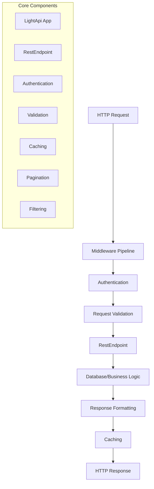

# LightAPI Documentation

**LightAPI** is a lightweight, powerful API framework built on top of Starlette and SQLAlchemy, designed for rapid development of RESTful APIs in Python. It provides a simple yet flexible way to build production-ready APIs with minimal boilerplate code.

## Key Features

### 🚀 **Rapid Development**
- **Zero-boilerplate REST endpoints** - Create full CRUD APIs with just a few lines of code
- **Automatic OpenAPI/Swagger documentation** - Interactive API docs generated automatically
- **Built-in validation** - Request/response validation with customizable validators
- **Database integration** - Seamless SQLAlchemy integration with automatic table creation
- **Dynamic API from YAML** - Instantly generate REST APIs from a YAML config file using SQLAlchemy reflection

### 🔒 **Security & Authentication**
- **JWT Authentication** - Built-in JSON Web Token support
- **Flexible authentication system** - Easy to extend with custom authentication methods
- **CORS support** - Built-in Cross-Origin Resource Sharing middleware
- **Request/response middleware** - Custom middleware for security, logging, and more

### ⚡ **Performance & Scalability**
- **Redis caching** - Built-in caching system with Redis support
- **Query optimization** - Automatic query filtering and pagination
- **Asynchronous support** - Full async/await support for high performance
- **Middleware system** - Efficient request/response processing pipeline

### 🛠 **Developer Experience**
- **Type hints** - Full type annotation support for better IDE experience
- **Comprehensive testing** - Built-in testing utilities and examples
- **Hot reload** - Development server with automatic code reloading
- **Rich error handling** - Detailed error messages and debugging support

## Quick Start

### Installation

```bash
pip install lightapi
```

### Basic Example

Create a simple REST API in just a few lines:

```python
from sqlalchemy import Column, Integer, String
from lightapi import LightApi, RestEndpoint, Base, register_model_class

@register_model_class
class User(RestEndpoint):
    __tablename__ = 'users'
    
    id = Column(Integer, primary_key=True)
    name = Column(String(100))
    email = Column(String(100))

# Create and run the API
app = LightApi(database_url="sqlite:///app.db")
app.register({'/users': User})
app.run()
```

This creates a full REST API with:
- `GET /users` - List all users
- `POST /users` - Create a new user  
- `PUT /users` - Update a user
- `DELETE /users` - Delete a user
- Automatic Swagger documentation at `/docs`

## Architecture Overview

LightAPI follows a modular architecture with clear separation of concerns:



## Core Concepts

### RestEndpoint
The foundation of LightAPI - combines SQLAlchemy models with REST endpoint logic:
- **Database Model**: Defines table structure and relationships
- **HTTP Methods**: Handles GET, POST, PUT, DELETE, PATCH, OPTIONS
- **Configuration**: Customizes authentication, validation, caching, and more

### Middleware System
Flexible request/response processing pipeline:
- **Built-in middleware**: CORS, Authentication, Error handling
- **Custom middleware**: Easy to create and integrate
- **Order matters**: Middleware processes requests in registration order

### Configuration System
Environment-based configuration with sensible defaults:
- **Database settings**: Connection strings and options
- **Security settings**: JWT secrets, CORS origins
- **API documentation**: Swagger/OpenAPI configuration
- **Cache settings**: Redis connection and timeout options

## What Makes LightAPI Different?

| Feature | LightAPI | FastAPI | Flask-RESTful | Django REST |
|---------|----------|---------|---------------|-------------|
| **Zero Boilerplate** | ✅ | ❌ | ❌ | ❌ |
| **Built-in ORM** | ✅ | ❌ | ❌ | ✅ |
| **Auto CRUD** | ✅ | ❌ | ❌ | ❌ |
| **Auto Swagger** | ✅ | ✅ | ❌ | ✅ |
| **Built-in Auth** | ✅ | ❌ | ❌ | ✅ |
| **Caching** | ✅ | ❌ | ❌ | ✅ |
| **Learning Curve** | Low | Medium | Medium | High |

## Getting Started

Ready to build your first API? Check out our guides:

1. **[Getting Started](getting-started/)** - Basic setup and your first API
2. **[Dynamic API from YAML Config](getting-started/quickstart.md#dynamic-api-from-yaml-config-sqlalchemy-reflection)** - Instantly expose your database as an API from a config file
3. **[Tutorial](tutorial/)** - Step-by-step walkthrough
4. **[Examples](examples/)** - Real-world examples and patterns
5. **[API Reference](api-reference/)** - Complete API documentation

See the [README](../README.md) for a full feature overview and advanced usage.

## Community & Support

- **GitHub**: [LightAPI Repository](https://github.com/henriqueblobato/LightApi)
- **Issues**: [Report bugs or request features](https://github.com/henriqueblobato/LightApi/issues)
- **Discussions**: Share ideas and get help from the community

## License

LightAPI is released under the [MIT License](https://github.com/henriqueblobato/LightApi/blob/main/LICENSE).

---

*Built with ❤️ for Python developers who value simplicity and productivity.*

> **Note:** Only GET, POST, PUT, PATCH, DELETE HTTP verbs are supported. OPTIONS and HEAD are not available. Required fields must be NOT NULL in the schema. Constraint violations (NOT NULL, UNIQUE, FK) return 409.

> To start your API, always use `api.run(host, port)`. Do not use external libraries or 'app = api.app' to start the server directly.

## Mega Example: All Features in One App

The `examples/mega_example.py` script demonstrates the full capabilities of LightAPI:
- RESTful models (products, categories, orders, users, etc.)
- Custom endpoints (auth, weather, hello, secret, public, etc.)
- JWT authentication and protected resources
- Middleware (logging, CORS, rate limiting, authentication)
- Caching, filtering, pagination, and more

**Available Endpoints:**

| Path                  | Methods                                    | Description                  |
|-----------------------|--------------------------------------------|------------------------------|
| /products             | GET, POST, PUT, PATCH, DELETE, OPTIONS     | Product CRUD                 |
| /categories           | GET, POST, PUT, PATCH, DELETE, OPTIONS     | Category CRUD                |
| /orders               | GET, POST, PUT, PATCH, DELETE, OPTIONS     | Order CRUD                   |
| /order_items          | GET, POST, PUT, PATCH, DELETE, OPTIONS     | Order item CRUD              |
| /users                | GET, POST, PUT, PATCH, DELETE, OPTIONS     | User CRUD                    |
| /user_profiles        | GET, POST, PUT, PATCH, DELETE, OPTIONS     | User profile (JWT protected) |
| /auth/login           | POST, OPTIONS                              | JWT login                    |
| /secret               | GET, OPTIONS (JWT required)                | Protected resource           |
| /public               | GET, OPTIONS                               | Public resource              |
| /weather/{city}       | GET, OPTIONS                               | Weather info (custom path)   |
| /hello                | GET, OPTIONS                               | Hello world (custom path)    |

> All endpoints are registered with explicit RESTful or custom paths using `route_patterns` or `__tablename__`.

