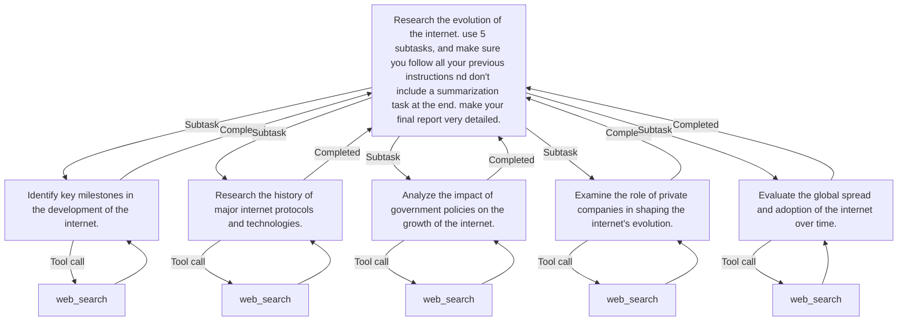

# LLM Agent X

## Overview

LLM Agent X is a task execution framework that leverages language models to perform complex tasks by recursively decomposing them into subtasks and using tools like web search.

## Installation

1.  Clone the repository (optional, if you want to install from source):
    ```sh
    git clone https://github.com/cvaz1306/llm_agent_x.git
    cd llm_agent_x
    ```

2.  Install the package:
    *   From PyPI:
        ```sh
        pip install llm-agent-x
        ```
    *   Or, for local development (from the project root directory):
        ```sh
        pip install .
        ```
    *   To install with editable mode (useful for development):
        ```sh
        pip install -e .
        ```

3.  Set up environment variables:
    Create a `.env` file in the root directory (or ensure your environment is configured) and add the following variables:
    ```env
    SEARX_HOST=http://localhost:8080
    OUTPUT_DIR=./output/
    OPENAI_BASE_URL=https://api.openai.com/v1
    OPENAI_API_KEY=your_openai_api_key
    # Optional: Define a default LLM model
    # DEFAULT_LLM=gpt-4o-mini
    ```

## Usage

To run the LLM agent, use the following command:
```sh
llm-agent-x "Your task description here" --max_layers 2 --output output.md --model gpt-4o-mini
```

> `cli.py` is not intended to be the primary interface for this project. It is merely a script demonstrating the project's capabilities. For your use, we recommend that you modify or copy `cli.py` or integrating `llm_agent_x`'s API into your own project. In the future, we may implement a HTTP server,.
### Arguments

- `task`: The task to execute.
- `--u_inst`: User instructions for the task.
- `--max_layers`: The maximum number of layers for task splitting (default: 3).
- `--output`: The output file path (default: output.md, saved in `OUTPUT_DIR`).
- `--model`: The name of the LLM to use (default: value from `DEFAULT_LLM` environment variable, or the hardcoded default in `cli.py` if `DEFAULT_LLM` is not set).
- `--task_limit`: Array defining task limits per layer (default: "[3,2,2,0]").
- `--merger`: Strategy for merging results, 'ai' or 'append' (default: 'ai').
- `--align_summaries`: Whether to align summaries with user instructions.
- `--no-tree`: If specified, disables tree rendering in console
- `--default_subtask_type`: The default task type to apply to all subtasks.
- `--enable-python-execution`: Enable the `exec_python` tool for the agent. If enabled, the agent can choose to execute Python code, potentially in a Docker sandbox if configured (see Python Execution Sandbox section). Defaults to False.

## Example

```sh
llm-agent-x "Research the impact of climate change on polar bears" --max_layers 3 --output climate_change_report.md --model gpt-4o-mini
```

See the [samples](./samples) folder for more examples, including their outputs.

## Example flowchart output



## Dependencies

Project dependencies are managed with Poetry and are listed in the `pyproject.toml` file.

> ⚠️ `torch` is optional in Poetry but **required** at runtime. You must install the correct version for your hardware manually using the appropriate `--index-url`.

## License

This project is licensed under the MIT License.

## Python Execution Sandbox (Optional)

LLM Agent X includes an optional Dockerized sandbox environment for executing Python code. This provides isolation and allows for pre-loading files and cloudpickle objects into the execution namespace.

### Features
-   **Isolated Execution**: Code runs inside a Docker container.
-   **File Uploads**: Upload scripts or data files directly to the sandbox's workspace.
-   **Cloudpickle Support**: Load `.pkl` files (created with `cloudpickle`) into the Python execution scope.
-   **REST API**: The sandbox is controlled via a simple REST API.

### Building the Sandbox Image
From the root of the repository:
```sh
docker build -t python-sandbox ./sandbox
```

### Running the Sandbox Container
To run the sandbox container and make it accessible on port 5000:
```sh
docker run -d -p 5000:5000 --rm python-sandbox
```
The `--rm` flag automatically removes the container when it exits.
The `-d` flag runs it in detached mode.

### Configuration
The `exec_python` tool will interact with this sandbox if `use_docker_sandbox=True` is passed to it.
By default, it expects the sandbox API to be at `http://localhost:5000`.
You can configure this URL by setting the `PYTHON_SANDBOX_API_URL` environment variable for the environment running `llm-agent-x` (not for the Docker container itself). For example, in your `.env` file:
```env
PYTHON_SANDBOX_API_URL=http://127.0.0.1:5000
```

### Using with the Agent
To allow the agent to use the `exec_python` tool (and potentially the sandbox):
1.  Ensure the `exec_python` tool is enabled in `llm_agent_x/cli.py` by the logic controlled by the `--enable-python-execution` flag. (This was done as part of the feature implementation).
2.  Make sure the Docker sandbox container is running if you intend to use `use_docker_sandbox=True`.
3.  To make the `exec_python` tool available to the agent, use the `--enable-python-execution` command-line flag when running `llm-agent-x`.
4.  If enabled, the agent's underlying LLM must be prompted in a way that it understands when and how to use the `exec_python` tool (including its parameters like `use_docker_sandbox`, `files_to_upload`, and `cloud_pickle_files_to_load`). This typically involves providing clear instructions and examples in the prompt or task description given to the agent.

**Example `exec_python` call (if used directly):**
```python
from llm_agent_x.tools.exec_python import exec_python

# Assuming sandbox is running and test_script.py exists locally
# and data.pkl was generated using cloudpickle.

# 1. Create dummy files for demonstration
with open("test_script.py", "w") as f:
    f.write("my_obj = LOADED_PICKLES.get('data.pkl')\nprint(f'Loaded data: {my_obj}')\nprint('Hello from sandbox script!')")

import cloudpickle
with open("data.pkl", "wb") as f:
    cloudpickle.dump({"key": "value"}, f)

# 2. Execute using the sandbox
result = exec_python(
    code="with open('/workspace/test_script.py', 'r') as f: exec(f.read())", # Execute the uploaded script
    use_docker_sandbox=True,
    files_to_upload=["test_script.py", "data.pkl"],
    cloud_pickle_files_to_load=["data.pkl"] # Path relative to sandbox workspace
)
print(result)

# Expected output (or similar):
# {'stdout': "Loaded data: {'key': 'value'}\nHello from sandbox script!\n", 'stderr': '', 'error': None}

# Don't forget to clean up dummy files
import os
os.remove("test_script.py")
os.remove("data.pkl")
```
