# 🛡️ LLMShield

<div align="center">

[](https://www.python.org/downloads/)
[](https://www.gnu.org/licenses/agpl-3.0)
[](https://github.com/yourusername/llmshield)

**Production-ready, zero-dependency Python library for protecting PII in LLM interactions**

_Designed for seamless integration into existing API-dense codebases with minimal configuration overhead_

</div>

---

## Overview

LLMShield delivers **enterprise-grade protection** for sensitive information in LLM interactions by automatically detecting and replacing PII with secure placeholders before transmission, then restoring original values in responses. The library employs a sophisticated multi-layered detection approach combining advanced pattern recognition, comprehensive dictionary matching, and intelligent contextual analysis.

### Key Features

<div align="center">

| Core Capabilities                                                                              | Advanced Features                                                                           |
| ---------------------------------------------------------------------------------------------- | ------------------------------------------------------------------------------------------- |
| **Zero Dependencies**<br/>Pure Python implementation with no external requirements             | **Conversation Memory**<br/>Multi-turn conversation support with perfect entity consistency |
| **Intelligent Entity Detection**<br/>Automatic PII identification using multi-layered analysis | **Streaming Support**<br/>Real-time processing for streaming LLM responses                  |
| **Selective Protection**<br/>Granular control over which entity types to protect               | **Performance Optimized**<br/>High-performance architecture with intelligent caching        |
| **Universal Compatibility**<br/>Works with most LLM providers out of the box                   | **Production Ready**<br/>Enterprise-grade reliability and security                          |

</div>

## High-Level Data Flow

```mermaid
graph LR
    A["Raw Input<br/>'Contact Dr. Smith at smith@hospital.org'"] --> B["Entity Detection<br/>PERSON: Dr. Smith<br/>EMAIL: smith@hospital.org"]

    B --> C["PII Anonymization<br/>'Contact &lt;PERSON_0&gt; at &lt;EMAIL_1&gt;'"]

    C --> D["LLM Processing<br/>Safe text sent to<br/>OpenAI, Claude, etc."]

    D --> E["Response Restoration<br/>Placeholders → Original PII"]

    E --> F["Protected Output<br/>'I'll help you contact Dr. Smith<br/>at smith@hospital.org'"]

    %% Styling
    classDef flowStyle fill:#f8f9fa,stroke:#495057,stroke-width:2px,color:#212529
    classDef detectionStyle fill:#e8f4f8,stroke:#0c63e4,stroke-width:2px,color:#212529
    classDef anonymizationStyle fill:#fff3cd,stroke:#856404,stroke-width:2px,color:#212529
    classDef llmStyle fill:#f0e6ff,stroke:#6f42c1,stroke-width:2px,color:#212529
    classDef restorationStyle fill:#d1ecf1,stroke:#0c5460,stroke-width:2px,color:#212529

    class A flowStyle
    class B detectionStyle
    class C anonymizationStyle
    class D llmStyle
    class E restorationStyle
    class F flowStyle
```



## Under the Hood: System Architecture


## Built-in Memory for Multi-Turn Conversations

> **Pro Tip:** LLMShield maintains entity consistency across conversation turns, ensuring the same person or organization always gets the same placeholder throughout your entire conversation. Unlike competing solutions that require complex implementation overhead or dependency-heavy architectures, LLMShield provides this sophisticated conversation memory as a core feature with zero external dependencies and superior performance through its optimised pure Python implementation.


---

## Installation

```bash
pip install llmshield
```

## Quick Start

### Basic Usage

```python
from llmshield import LLMShield

# Initialize shield
shield = LLMShield()

# Protect sensitive information
cloaked_prompt, entity_map = shield.cloak(
    "Contact John Doe at john.doe@company.com or call +1-555-0123"
)
print(cloaked_prompt)
# Output: "Contact <PERSON_0> at <EMAIL_1> or call <PHONE_2>"

# Process with LLM
llm_response = your_llm_function(cloaked_prompt)

# Restore original entities
restored_response = shield.uncloak(llm_response, entity_map)
```

> **Important:** Individual `cloak()` and `uncloak()` methods support single messages only and do not maintain conversation history. For multi-turn conversations with entity consistency across messages, use the `ask()` method.

### Direct LLM Integration

```python
from openai import OpenAI
from llmshield import LLMShield

client = OpenAI(api_key="your-api-key")
shield = LLMShield(llm_func=client.chat.completions.create)

# Single request with automatic protection
response = shield.ask(
    model="gpt-4",
    prompt="Draft an email to Sarah Johnson at sarah.j@techcorp.com"
)

# Multi-turn conversation
messages = [
    {"role": "user", "content": "I'm John Smith from DataCorp"},
    {"role": "assistant", "content": "Hello! How can I help you?"},
    {"role": "user", "content": "Email me at john@datacorp.com"}
]

response = shield.ask(model="gpt-4", messages=messages)
```

### Streaming Support

```python
response_stream = shield.ask(
    model="gpt-4",
    prompt="Generate a report about Jane Doe (jane@example.com)",
    stream=True
)

for chunk in response_stream:
    print(chunk, end="", flush=True)
```

## Entity Detection

The library detects and protects the following entity types:

<div align="center">

| Entity Type      | Examples            | Placeholder Format |
| ---------------- | ------------------- | ------------------ |
| **Person**       | John Doe, Dr. Smith | `<PERSON_0>`       |
| **Organisation** | Acme Corp, NHS      | `<ORGANISATION_0>` |
| **Place**        | London, Main Street | `<PLACE_0>`        |
| **Email**        | user@domain.com     | `<EMAIL_0>`        |
| **Phone**        | +1-555-0123         | `<PHONE_0>`        |
| **URL**          | https://example.com | `<URL_0>`          |
| **Credit Card**  | 4111-1111-1111-1111 | `<CREDIT_CARD_0>`  |
| **IP Address**   | 192.168.1.1         | `<IP_ADDRESS_0>`   |

</div>

---

## Configuration

### Custom Delimiters

```python
shield = LLMShield(
    start_delimiter='[[',
    end_delimiter=']]'
)
# Entities appear as [[PERSON_0]], [[EMAIL_1]], etc.
```

### Conversation Caching

LLMShield implements an **LRU (Least Recently Used) cache** to maintain entity consistency across multi-turn conversations. The cache stores entity mappings for conversation histories, ensuring that all entities (persons, organizations, emails, phones, etc.) mentioned in different messages receive the same placeholders.

```python
shield = LLMShield(
    llm_func=your_llm_function,
    max_cache_size=1000  # Default: 1000
)
```

#### Cache Sizing Guidelines

<table>
<tr>
<td width="33%">

**Small Applications**

- < 1,000 concurrent conversations
- `max_cache_size=500-1000`
- ~500KB-1MB memory

</td>
<td width="33%">

**Medium Applications**

- 1,000-10,000 concurrent conversations
- `max_cache_size=5000-10000`
- ~5MB-10MB memory

</td>
<td width="33%">

**Large Applications**

- > 100,000 concurrent conversations
- `max_cache_size=50000-100000`
- ~50MB-100MB memory

</td>
</tr>
</table>

**Memory Calculation:** Each conversation stores a dictionary mapping PII entities to their placeholders. With an average of 20 PII entities per conversation, each cache entry uses approximately 1-2KB of memory (entity text + placeholder mappings + metadata).

**Cache Strategy Decision Tree:**


**Per-Shield Caching Strategy:**

Each `LLMShield` instance maintains its own independent cache, providing flexibility for:

- **Demographic Partitioning**: Separate caches for different user types (premium vs. free, geographic regions, etc.)
- **Use Case Isolation**: Different cache strategies for customer service vs. internal tools vs. public APIs
- **Memory Allocation**: Distribute memory budgets across multiple shield instances based on priority
- **Custom Strategies**: Implement specialized caching logic for specific workflows or data sensitivity levels

**Cache Effectiveness Factors:**

- **Short-lived workers**: Cache benefits diminish with frequent recycling - prioritize memory efficiency
- **Long-lived workers**: Larger caches significantly reduce "cold start" latency for entity detection
- **Worker density**: Many workers sharing server resources require smaller per-worker caches
- **Traffic variability**: Spiky loads benefit from larger caches to handle burst scenarios

> **Performance Impact:** Cache hit rates above 80% significantly improve performance for multi-turn conversations by avoiding re-detection of previously seen entities. Size your cache based on expected concurrent "fresh" conversations that your server workers are actively serving, not total daily volume.

### Selective PII Detection

> **New in v1.0+:** LLMShield supports selective entity detection, allowing you to disable specific types of PII protection based on your requirements. This is useful when you want to protect some sensitive information while allowing other data types to pass through unchanged.

#### Factory Methods for Common Configurations

```python
from llmshield import LLMShield

# Disable location-based entities (PLACE, IP_ADDRESS, URL)
shield = LLMShield.disable_locations()

# Disable person detection only
shield = LLMShield.disable_persons()

# Disable contact information (EMAIL, PHONE)
shield = LLMShield.disable_contacts()

# Enable only financial entities (CREDIT_CARD)
shield = LLMShield.only_financial()
```

#### Custom Entity Configuration

For fine-grained control, use the `EntityConfig` class:

```python
from llmshield import LLMShield
from llmshield.entity_detector import EntityConfig, EntityType

# Create custom configuration
config = EntityConfig().with_disabled(
    EntityType.EMAIL,      # Disable email detection
    EntityType.PHONE,      # Disable phone detection
    EntityType.URL         # Disable URL detection
)

shield = LLMShield(entity_config=config)

# Or enable only specific types
config = EntityConfig().with_enabled(
    EntityType.PERSON,     # Only detect persons
    EntityType.CREDIT_CARD # Only detect credit cards
)

shield = LLMShield(entity_config=config)
```

#### Available Entity Types

<details>
<summary><strong>All configurable entity types</strong></summary>

```python
EntityType.PERSON          # Names (John Doe, Dr. Smith)
EntityType.ORGANISATION    # Companies (Microsoft Corp)
EntityType.PLACE           # Locations (London, Main Street)
EntityType.EMAIL           # Email addresses
EntityType.PHONE           # Phone numbers
EntityType.URL             # Web addresses
EntityType.CREDIT_CARD     # Credit card numbers
EntityType.IP_ADDRESS      # IP addresses
EntityType.CONCEPT         # Uppercase concepts (API, SQL)
```

</details>

#### Using Selective Detection with ask()

Selective detection works seamlessly with the `ask()` method for end-to-end protection:

```python
from openai import OpenAI
from llmshield import LLMShield

client = OpenAI(api_key="your-api-key")

# Create shield that ignores URLs and IP addresses
shield = LLMShield.disable_locations(llm_func=client.chat.completions.create)

# This will protect names and emails but allow URLs through
response = shield.ask(
    model="gpt-4",
    prompt="Contact John Doe at john@company.com or visit https://company.com"
)
# Cloaked: "Contact <PERSON_0> at <EMAIL_1> or visit https://company.com"
```

#### Performance Benefits

Selective detection can improve performance by:

- **Reducing detection overhead** for unused entity types
- **Minimizing placeholder generation** and entity mapping
- **Faster text processing** with fewer regex operations

<table>
<tr>
<td width="50%">

**Recommended Configurations:**

- **Customer service**: Disable `PLACE` and `URL` if not handling location data
- **Financial applications**: Use `only_financial()` for credit card protection only
- **Internal tools**: Disable `PERSON` detection if processing system logs
- **Public APIs**: Enable all types for maximum protection

</td>
<td width="50%">

**Performance Impact:**

- **Memory usage**: 20-40% reduction
- **Processing speed**: 15-30% improvement
- **Cache efficiency**: Higher hit rates
- **Latency**: Lower response times

</td>
</tr>
</table>

## Provider Compatibility

<div align="center">

### Fully Tested & Supported

| Provider                          | Status       | Features                |
| --------------------------------- | ------------ | ----------------------- |
| **OpenAI Chat Completions API**   | Full Support | Chat, Streaming, Tools  |
| **Anthropic Messages API**        | Full Support | Chat, Streaming, Tools  |
| **OpenAI Compatibility Standard** | Full Support | Universal compatibility |

### Currently Unsupported (directly)

| Provider   | Status     | Workaround                |
| ---------- | ---------- | ------------------------- |
| **Google** | Not Direct | Use compatibility wrapper |
| **Cohere** | Not Direct | Use compatibility wrapper |

</div>

> **Note:** To use unsupported providers, create a compatible wrapper that works with one of the above supported providers.

> **Caution:** Due to the behaviour and training differences in models, a slight performance degradation may be observed. Some degree of performance loss is expected, but can be mitigated to a high degree by tuning the parameters and PII filtration level based on your requirements.

## Language Support

<div align="center">

| Language            | Support Level     | Accuracy |
| ------------------- | ----------------- | -------- |
| **English**         | Full optimisation | ~90%     |
| **Other languages** | Experimental      | ???      |

</div>

We are working on extending support to more languages and improving the accuracy of entity detection.

## Development

### Setup

```bash
git clone https://github.com/yourusername/llmshield.git
cd llmshield
python -m venv venv
source venv/bin/activate  # Windows: venv\Scripts\activate
pip install -e ".[dev]"
```

### Testing

```bash
# Run tests
make tests

# Coverage analysis
make coverage

# Code quality checks
make ruff

# Documentation coverage
make doc-coverage
```

## Building and Publishing

### Building the Package

```bash
# Install build dependencies
make dev-dependencies

# Build the package
make build
```

### Publishing to PyPI

1. **Update version** in `pyproject.toml`
2. **Run quality checks**:
   ```bash
   make tests
   make coverage
   make ruff
   ```
3. **Build and publish**:
   ```bash
   make build
   twine upload dist/*
   ```

## Security Considerations

<div align="center">

| Security Aspect      | Recommendation                                              |
| -------------------- | ----------------------------------------------------------- |
| **Validation**       | Validate cloaked outputs before LLM transmission            |
| **Storage**          | Securely store entity mappings for persistent sessions      |
| **Delimiters**       | Choose delimiters that don't conflict with your data format |
| **Input Validation** | Implement comprehensive input validation                    |
| **Auditing**         | Regularly audit entity detection accuracy                   |

</div>

---

## Contributing

See [**CONTRIBUTING.md**](CONTRIBUTING.md) for development guidelines and contribution process.

## License

**GNU Affero General Public License v3.0** - See [**LICENSE.txt**](LICENSE.txt) for details.

## Maintainers

- **Aditya Dedhia** ([@adityadedhia](https://github.com/adityadedhia))
- **Sebastian Andres** ([@S-andres0694](https://github.com/S-andres0694))

## Production Usage

LLMShield is used in production environments by [brainful.ai](https://brainful.ai) to protect user data confidentiality.
