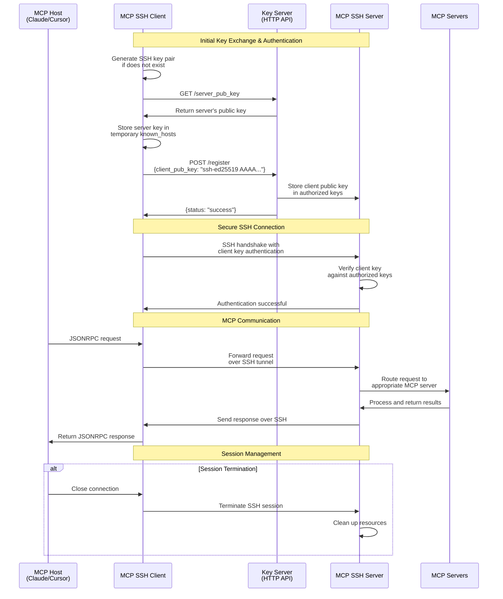

# MCP Server SSH Server

[](https://pypi.org/project/m2m-mcp-server-ssh-server/)
[](https://pypi.org/project/m2m-mcp-server-ssh-server/)
[](https://opensource.org/licenses/MIT)

A secure SSH server for accessing and interacting with MCP (Model Context Protocol) tools installed remotely. This server allows clients to connect to multiple MCP tool providers through a unified secure interface.

## Features

- **Secure Remote Access**: Access MCP tools remotely over SSH
- **Key-Based Authentication**: Support for key-based authentication
- **Key Management API**: Optional HTTP API for managing SSH keys
- **Server Aggregation**: Proxy and merge multiple MCP servers into a unified interface
- **MCP Support**: Compatible with MCP capabilities including:
  - Prompts
  - Resources
  - Tools
  - Logging
- **Dynamic Configuration**: Configure available MCP servers through a simple JSON configuration

## Authentication Flow



## Installation

In a `uv` managed python project, add to dependencies by:

```bash
uv add m2m-mcp-server-ssh-server
# For key server functionality, include the optional dependency:
uv add m2m-mcp-server-ssh-server[key-server]
```

Alternatively, for projects using `pip` for dependencies:
```bash
pip install m2m-mcp-server-ssh-server
# Or with key server functionality
pip install m2m-mcp-server-ssh-server[key-server]
```

To install directly from the source:

```bash
git clone https://github.com/Machine-To-Machine/m2m-mcp-server-ssh-server.git
cd m2m-mcp-server-ssh-server
pip install -e .
```

To run the server inside your project:

```
uv run m2m-mcp-server-ssh-server
```

## Common Use Cases

### 1. Local Development Environment

Quickly set up a local server with your preferred MCP tools:

1. Create a configuration file (`servers_config.json`):

```json
{
  "mcpServers": {
    "HackerNews": {
      "command": "uvx",
      "args": ["mcp-hn"]
    },
    "major-league-baseball": {
      "command": "uvx",
      "args": ["mcp_mlb_statsapi"]
    }
  }
}
```

2. Start the server with the key management API for easier client connection:

```bash
uv run m2m-mcp-server-ssh-server --run-key-server
```

3. Connect using the client:

```bash
uv run m2m-mcp-server-ssh-client --host localhost --port 8022 --use-key-server
```

### 2. Remote Hosting (Quick Setup)

To make your MCP tools available remotely:

1. Install on your server:

```bash
uv add m2m-mcp-server-ssh-server[key-server]
```

2. Create your configuration file with desired MCP tools

3. Start the server binding to all interfaces:

```bash
uv run m2m-mcp-server-ssh-server --host 0.0.0.0 --run-key-server --key-server-host 0.0.0.0
```

4. Connect from client machines:

```bash
uv run m2m-mcp-server-ssh-client --host your-server.example.com --port 8022 --use-key-server
```

For more detailed deployment instructions, see [Cloud Deployment Guide](docs/examples/cloud_deployment.md).

## Usage

### Command Line Options

- `--host`: SSH server host address to bind to (default: 127.0.0.1)
- `--port`: SSH server port to listen on (default: 8022)
- `--authorized-clients`: Path to authorized keys file (default: ~/.ssh/authorized_keys)
- `--server-key`: Path to server private key file (default: ~/.ssh/m2m_mcp_server_ssh_server)
- `--passphrase`: Passphrase for the private key (optional)
- `--servers-config`: Path to server configurations JSON (default: servers_config.json)
- `--log-level`: Set logging level (default: INFO)
- `--run-key-server`: Run the HTTP key management server
- `--key-server-port`: Port for the HTTP key management server (default: 8000)
- `--key-server-host`: Host for the HTTP key management server (default: 127.0.0.1)
- `--version`: Show version information and exit

**Security Note**: When binding to all interfaces (0.0.0.0), your server will be accessible from any machine that can reach your system. Make sure to use strong authentication and consider additional security measures like firewalls.

## Key Management Server

You can optionally run a key management HTTP server alongside the SSH server to simplify client key registration:

```bash
uv run m2m-mcp-server-ssh-server --run-key-server
```

This starts:
- SSH server on port 8022
- Key management HTTP server on port 8000 (localhost only by default)

### Key Management API

The key management server provides the following endpoints:

1. `POST /register` - Register a client's public key
   - Request body: `{"client_pub_key": "ssh-rsa AAAA..."}`
   - Response: `{"status": "success"}` or error message

2. `GET /server_pub_key` - Get the server's public key
   - Response: `{"server_pub_key": "ssh-ed25519 AAAA..."}`

3. `GET /health` - Check server health status
   - Response: `{"status": "healthy"}`

Example client key registration:

```bash
curl -X POST -H "Content-Type: application/json" \
  -d '{"client_pub_key": "ssh-rsa AAAA..."}' \
  http://localhost:8000/register
```

## Security Considerations

- Default binding is to localhost (127.0.0.1) for improved security
- Keys are automatically generated with secure permissions if not provided
- Default key location is `~/.ssh/m2m_mcp_server_ssh_server`
- Private keys use 0o600 permissions (readable only by owner)
- Public keys use 0o644 permissions (readable by all, writable by owner)
- Key server uses rate limiting for API endpoints
- Input validation protects against malicious inputs

## Dependencies

- anyio (>=4.5.0)
- asyncssh (>=2.20.0)
- mcp (>=1.1.3)
- pydantic (>=2.0.0)
- aiohttp (>=3.11.16) - Optional, for key server functionality

## Development

### Setup Development Environment

```bash
git clone https://github.com/Machine-To-Machine/m2m-mcp-server-ssh-server.git
cd m2m-mcp-server-ssh-server
uv venv
source .venv/bin/activate  # On Windows: .venv\Scripts\activate
uv pip install -e ".[dev]"
```

### Code Quality

```bash
# Run linting
uv run ruff check .

# Run formatting check
uv run ruff format --check .

# Run security checks
uv run bandit -r src/
```

## Contributing

We welcome contributions to help expand and improve `m2m-mcp-server-ssh-server`. Whether you want to add new features, enhance existing functionality, or improve documentation, your input is valuable.

Pull requests are welcome! Feel free to contribute new ideas, bug fixes, or enhancements.

### Contribution Guidelines

1. Fork the repository
2. Create a feature branch: `git checkout -b feature-name`
3. Commit your changes: `git commit -am 'Add some feature'`
4. Push to the branch: `git push origin feature-name`
5. Submit a pull request

## License

MIT License - See LICENSE file for details.

## Authors

- **Machine To Machine**
