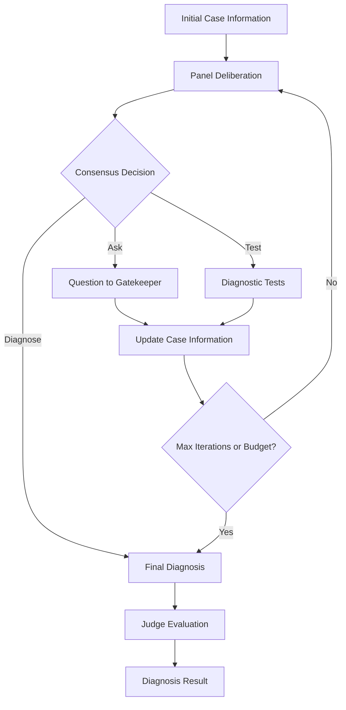

# Open-MAI-Dx-Orchestrator

> **An open-source implementation of the "Sequential Diagnosis with Language Models" paper by Microsoft Research, built with the Swarms AI framework.**

[](https://arxiv.org/abs/2506.22405)
[](LICENSE)
[](https://python.org)

MAI-DxO (MAI Diagnostic Orchestrator) is a sophisticated AI-powered diagnostic system that simulates a virtual panel of physician-agents to perform iterative medical diagnosis with cost-effectiveness optimization. This implementation faithfully reproduces the methodology described in the Microsoft Research paper while providing additional features and flexibility.

## 🚀 Quick Start

```bash
# Install the package
pip install mai-dx

# Or install from source
git clone https://github.com/The-Swarm-Corporation/Open-MAI-Dx-Orchestrator.git
cd Open-MAI-Dx-Orchestrator
pip install -e .
```

```python
from mai_dx import MaiDxOrchestrator

# Create orchestrator
orchestrator = MaiDxOrchestrator(model_name="gemini/gemini-2.5-flash")

# Run diagnosis
result = orchestrator.run(
    initial_case_info="29-year-old woman with sore throat and peritonsillar swelling...",
    full_case_details="Patient: 29-year-old female. History: Onset of sore throat...",
    ground_truth_diagnosis="Embryonal rhabdomyosarcoma of the pharynx"
)

print(f"Diagnosis: {result.final_diagnosis}")
print(f"Accuracy: {result.accuracy_score}/5.0")
print(f"Cost: ${result.total_cost:,}")
```

## 📚 Table of Contents

- [Features](#-features)
- [Installation](#-installation)
- [Architecture](#-architecture)
- [Usage](#-usage)
- [MAI-DxO Variants](#-mai-dxo-variants)
- [Configuration](#-configuration)
- [Examples](#-examples)
- [API Reference](#-api-reference)
- [Contributing](#-contributing)
- [Citation](#-citation)

## ✨ Features

### 🏥 Virtual Physician Panel
- **8 Specialized AI Agents**: Each with distinct medical expertise and decision-making roles
- **Iterative Deliberation**: Sequential consultation and consensus-building process
- **Bayesian Reasoning**: Probability-based differential diagnosis updates
- **Cognitive Bias Detection**: Built-in challenger agent to prevent diagnostic errors

### 💰 Cost-Effectiveness Optimization
- **Comprehensive Cost Tracking**: Real-time budget monitoring with 25+ medical test costs
- **Resource Stewardship**: AI agent dedicated to cost-conscious care decisions
- **Budget Constraints**: Configurable spending limits with intelligent test prioritization
- **Value-Based Testing**: Information theory-driven test selection

### 🎯 Multiple Operational Modes
- **Instant**: Immediate diagnosis from initial presentation
- **Question-Only**: History-taking without diagnostic tests
- **Budgeted**: Cost-constrained diagnostic workup
- **No-Budget**: Full diagnostic capability
- **Ensemble**: Multiple independent panels with consensus aggregation

### 📊 Advanced Evaluation
- **Clinical Accuracy Scoring**: 5-point Likert scale with detailed rubric
- **Management Impact Assessment**: Evaluation based on treatment implications
- **Diagnostic Reasoning Tracking**: Complete conversation history and decision trails
- **Ensemble Methods**: Multi-run consensus for improved accuracy

### 🔧 Technical Excellence
- **Model Agnostic**: Support for GPT, Gemini, Claude, and other LLMs
- **Robust Error Handling**: Comprehensive exception management and fallback mechanisms
- **Beautiful Logging**: Structured logging with Loguru for debugging and monitoring
- **Type Safety**: Full Pydantic models and type hints throughout

## 🛠 Installation

### Prerequisites
- Python 3.8 or higher
- API keys for your chosen language model provider

### Standard Installation
```bash
pip install mai-dx
```

### Development Installation
```bash
git clone https://github.com/The-Swarm-Corporation/Open-MAI-Dx-Orchestrator.git
cd Open-MAI-Dx-Orchestrator
pip install -e .
```

### Dependencies
The package automatically installs:
- `swarms` - AI agent orchestration framework
- `loguru` - Advanced logging
- `pydantic` - Data validation and serialization

## 🏗 Architecture

### Virtual Panel Composition

The MAI-DxO system consists of 8 specialized AI agents that work together to provide comprehensive medical diagnosis:

#### Core Diagnostic Panel

**🧠 Dr. Hypothesis**
- Maintains probability-ranked differential diagnosis (top 3 conditions)
- Updates probabilities using Bayesian reasoning after each finding
- Tracks evidence supporting and contradicting each hypothesis

**🔬 Dr. Test-Chooser**
- Selects up to 3 diagnostic tests per round for maximum information value
- Optimizes for discriminatory power between competing hypotheses
- Balances diagnostic yield with patient burden

**🤔 Dr. Challenger**
- Acts as devil's advocate to prevent cognitive biases
- Identifies contradictory evidence and alternative explanations
- Proposes falsifying tests and guards against premature closure

**💰 Dr. Stewardship**
- Enforces cost-conscious, high-value care decisions
- Advocates for cheaper alternatives when diagnostically equivalent
- Evaluates test necessity and suggests cost-effective strategies

**✅ Dr. Checklist**
- Performs quality control on panel deliberations
- Validates test names and maintains logical consistency
- Flags errors and ensures proper diagnostic methodology

#### Coordination and Evaluation

**🤝 Consensus Coordinator**
- Synthesizes panel input into optimal next action
- Decides between asking questions, ordering tests, or diagnosing
- Balances accuracy, cost, efficiency, and thoroughness

**🔑 Gatekeeper**
- Serves as clinical information oracle with complete case access
- Provides objective findings and realistic synthetic results
- Maintains clinical realism while preventing information leakage

**⚖️ Judge**
- Evaluates final diagnoses against ground truth
- Uses rigorous 5-point clinical rubric
- Considers management implications and diagnostic completeness

### Decision Process Flow



## 🎮 Usage

### Basic Usage

```python
from mai_dx import MaiDxOrchestrator

# Initialize orchestrator
orchestrator = MaiDxOrchestrator(
    model_name="gemini/gemini-2.5-flash",
    max_iterations=10,
    initial_budget=10000
)

# Define case information
initial_info = "A 45-year-old male presents with chest pain..."
full_case = "Patient: 45-year-old male. History: Acute onset chest pain..."
ground_truth = "Myocardial infarction"

# Run diagnosis
result = orchestrator.run(initial_info, full_case, ground_truth)

# Access results
print(f"Diagnosis: {result.final_diagnosis}")
print(f"Accuracy Score: {result.accuracy_score}/5.0")
print(f"Total Cost: ${result.total_cost:,}")
print(f"Iterations: {result.iterations}")
```

### Advanced Configuration

```python
# Custom orchestrator with specific settings
orchestrator = MaiDxOrchestrator(
    model_name="gpt-4",
    max_iterations=15,
    initial_budget=5000,
    mode="budgeted",
    physician_visit_cost=250,
    enable_budget_tracking=True
)

# Enable debug logging
import os
os.environ["MAIDX_DEBUG"] = "1"
```

## 📋 MAI-DxO Variants

The system supports five distinct operational variants, each optimized for different clinical scenarios:

### 1. Instant Answer
```python
orchestrator = MaiDxOrchestrator.create_variant("instant")
result = orchestrator.run(initial_info, full_case, ground_truth)
```
- **Use Case**: Emergency triage, rapid screening
- **Behavior**: Immediate diagnosis from initial presentation only
- **Cost**: Single physician visit ($300)

### 2. Question-Only
```python
orchestrator = MaiDxOrchestrator.create_variant("question_only")
result = orchestrator.run(initial_info, full_case, ground_truth)
```
- **Use Case**: Telemedicine, history-taking focused consultations
- **Behavior**: Detailed questioning without diagnostic tests
- **Cost**: Physician visit only

### 3. Budgeted
```python
orchestrator = MaiDxOrchestrator.create_variant("budgeted", budget=3000)
result = orchestrator.run(initial_info, full_case, ground_truth)
```
- **Use Case**: Resource-constrained settings, cost-conscious care
- **Behavior**: Full panel with strict budget enforcement
- **Cost**: Limited by specified budget

### 4. No-Budget
```python
orchestrator = MaiDxOrchestrator.create_variant("no_budget")
result = orchestrator.run(initial_info, full_case, ground_truth)
```
- **Use Case**: Academic medical centers, complex cases
- **Behavior**: Full diagnostic capability without cost constraints
- **Cost**: Unlimited (tracks for analysis)

### 5. Ensemble
```python
orchestrator = MaiDxOrchestrator.create_variant("ensemble")
result = orchestrator.run_ensemble(initial_info, full_case, ground_truth, num_runs=3)
```
- **Use Case**: Critical diagnoses, second opinion simulation
- **Behavior**: Multiple independent panels with consensus aggregation
- **Cost**: Sum of all panel costs

## ⚙️ Configuration

### Model Configuration

```python
# Supported models
models = [
    "gemini/gemini-2.5-flash",
    "gpt-4o",
    "gpt-4o-mini", 
    "claude-3-5-sonnet-20241022",
    "meta-llama/llama-3.1-8b-instruct"
]

orchestrator = MaiDxOrchestrator(model_name="gpt-4o")
```

### Cost Database Customization

```python
# Access and modify cost database
orchestrator = MaiDxOrchestrator()
orchestrator.test_cost_db.update({
    "custom_test": 450,
    "specialized_imaging": 2000
})
```

### Logging Configuration

```python
# Enable detailed debug logging
import os
os.environ["MAIDX_DEBUG"] = "1"

# Custom log levels and formats available
```

## 📖 Examples

### Example 1: Comprehensive Diagnostic Workup

```python
from mai_dx import MaiDxOrchestrator

# Complex case requiring multiple tests
case_info = """
A 29-year-old woman was admitted to the hospital because of sore throat 
and peritonsillar swelling and bleeding. Symptoms did not abate with 
antimicrobial therapy.
"""

case_details = """
Patient: 29-year-old female.
History: Onset of sore throat 7 weeks prior to admission. Worsening 
right-sided pain and swelling. No fevers, headaches, or GI symptoms.
Physical Exam: Right peritonsillar mass, displacing the uvula.
Initial Labs: FBC, clotting studies normal.
"""

ground_truth = "Embryonal rhabdomyosarcoma of the pharynx"

# Run with different variants
variants = ["question_only", "budgeted", "no_budget"]
results = {}

for variant in variants:
    if variant == "budgeted":
        orch = MaiDxOrchestrator.create_variant(variant, budget=3000)
    else:
        orch = MaiDxOrchestrator.create_variant(variant)
    
    results[variant] = orch.run(case_info, case_details, ground_truth)

# Compare results
for variant, result in results.items():
    print(f"{variant}: {result.final_diagnosis} (Score: {result.accuracy_score})")
```

### Example 2: Ensemble Diagnosis

```python
# High-stakes diagnosis with ensemble approach
ensemble_orchestrator = MaiDxOrchestrator.create_variant("ensemble")

ensemble_result = ensemble_orchestrator.run_ensemble(
    initial_case_info=case_info,
    full_case_details=case_details,
    ground_truth_diagnosis=ground_truth,
    num_runs=5  # 5 independent diagnostic panels
)

print(f"Ensemble Diagnosis: {ensemble_result.final_diagnosis}")
print(f"Confidence Score: {ensemble_result.accuracy_score}/5.0")
print(f"Total Cost: ${ensemble_result.total_cost:,}")
```

### Example 3: Custom Cost Analysis

```python
# Analyze cost-effectiveness across variants
import matplotlib.pyplot as plt

variants = ["instant", "question_only", "budgeted", "no_budget"]
costs = []
accuracies = []

for variant in variants:
    orch = MaiDxOrchestrator.create_variant(variant)
    result = orch.run(case_info, case_details, ground_truth)
    costs.append(result.total_cost)
    accuracies.append(result.accuracy_score)

# Plot cost vs accuracy
plt.scatter(costs, accuracies)
plt.xlabel('Total Cost ($)')
plt.ylabel('Accuracy Score')
plt.title('Cost vs Accuracy Trade-off')
for i, variant in enumerate(variants):
    plt.annotate(variant, (costs[i], accuracies[i]))
plt.show()
```

## 🔍 API Reference

### MaiDxOrchestrator Class

#### Constructor
```python
MaiDxOrchestrator(
    model_name: str = "gemini/gemini-2.5-flash",
    max_iterations: int = 10,
    initial_budget: int = 10000,
    mode: str = "no_budget",
    physician_visit_cost: int = 300,
    enable_budget_tracking: bool = False
)
```

#### Methods

**`run(initial_case_info, full_case_details, ground_truth_diagnosis)`**
- Executes the sequential diagnostic process
- Returns: `DiagnosisResult` object

**`run_ensemble(initial_case_info, full_case_details, ground_truth_diagnosis, num_runs=3)`**
- Runs multiple independent sessions with consensus aggregation
- Returns: `DiagnosisResult` object

**`create_variant(variant, **kwargs)` (Class Method)**
- Factory method for creating specialized variants
- Variants: "instant", "question_only", "budgeted", "no_budget", "ensemble"

### DiagnosisResult Class

```python
@dataclass
class DiagnosisResult:
    final_diagnosis: str
    ground_truth: str
    accuracy_score: float
    accuracy_reasoning: str
    total_cost: int
    iterations: int
    conversation_history: str
```

### Utility Functions

**`run_mai_dxo_demo(case_info=None, case_details=None, ground_truth=None)`**
- Convenience function for quick demonstrations
- Returns: Dictionary of results from multiple variants

## 🧪 Testing and Validation

### Running Tests
```bash
# Run the built-in demo
python -m mai_dx.main

# Run with custom cases
python -c "
from mai_dx import run_mai_dxo_demo
results = run_mai_dxo_demo()
print(results)
"
```

### Benchmarking
```python
import time
from mai_dx import MaiDxOrchestrator

# Performance benchmarking
start_time = time.time()
orchestrator = MaiDxOrchestrator()
result = orchestrator.run(case_info, case_details, ground_truth)
elapsed = time.time() - start_time

print(f"Diagnosis completed in {elapsed:.2f} seconds")
print(f"Accuracy: {result.accuracy_score}/5.0")
print(f"Cost efficiency: ${result.total_cost/result.accuracy_score:.0f} per accuracy point")
```

## 🤝 Contributing

We welcome contributions! Please see our [Contributing Guidelines](CONTRIBUTING.md) for details.

### Development Setup
```bash
git clone https://github.com/your-org/Open-MAI-Dx-Orchestrator.git
cd Open-MAI-Dx-Orchestrator
pip install -e ".[dev]"
pre-commit install
```

### Code Style
- Follow PEP 8 guidelines
- Use type hints throughout
- Maintain comprehensive docstrings
- Add tests for new features

## 📄 License

This project is licensed under the MIT License - see the [LICENSE](LICENSE) file for details.

## 📚 Citation

If you use this implementation in your research, please cite both the original paper and this implementation:

```bibtex
@misc{nori2025sequentialdiagnosislanguagemodels,
    title={Sequential Diagnosis with Language Models}, 
    author={Harsha Nori and Mayank Daswani and Christopher Kelly and Scott Lundberg and Marco Tulio Ribeiro and Marc Wilson and Xiaoxuan Liu and Viknesh Sounderajah and Jonathan Carlson and Matthew P Lungren and Bay Gross and Peter Hames and Mustafa Suleyman and Dominic King and Eric Horvitz},
    year={2025},
    eprint={2506.22405},
    archivePrefix={arXiv},
    primaryClass={cs.CL},
    url={https://arxiv.org/abs/2506.22405}, 
}

@software{mai_dx_orchestrator,
    title={Open-MAI-Dx-Orchestrator: An Open Source Implementation of Sequential Diagnosis with Language Models},
    author={The-Swarm-Corporation},
    year={2025},
    url={https://github.com/The-Swarm-Corporation/Open-MAI-Dx-Orchestrator.git}
}
```

## 🔗 Related Work

- [Original Paper](https://arxiv.org/abs/2506.22405) - Sequential Diagnosis with Language Models
- [Swarms Framework](https://github.com/kyegomez/swarms) - Multi-agent AI orchestration
- [Microsoft Research](https://www.microsoft.com/en-us/research/) - Original research institution

## 📞 Support

- **Issues**: [GitHub Issues](https://github.com/The-Swarm-Corporation/Open-MAI-Dx-Orchestrator/issues)
- **Discussions**: [GitHub Discussions](https://github.com/The-Swarm-Corporation/Open-MAI-Dx-Orchestrator/discussions)
- **Documentation**: [Full Documentation](https://docs.swarms.world)

---

<p align="center">
  <strong>Built with Swarms for advancing AI-powered medical diagnosis</strong>
</p>
