# MCP KQL Server

> **AI-Powered KQL Query Execution with Intelligent Schema Memory**

A Model Context Protocol (MCP) server that provides intelligent KQL (Kusto Query Language) query execution with AI-powered schema caching and context assistance for Azure Data Explorer clusters.

<!-- Badges Section -->
[](https://pypi.org/project/mcp-kql-server/)
[](https://pypi.org/project/mcp-kql-server/)
[](https://pypi.org/project/mcp-kql-server/)

[](https://github.com/4R9UN/mcp-kql-server/actions)
[](https://codecov.io/gh/4R9UN/mcp-kql-server)
[](https://github.com/4R9UN/mcp-kql-server/security)
[](https://github.com/4R9UN/mcp-kql-server)

[](https://github.com/jlowin/fastmcp)
[](https://azure.microsoft.com/en-us/services/data-explorer/)
[](https://github.com/anthropics/mcp)
[](https://github.com/4R9UN/mcp-kql-server/graphs/commit-activity)

## 🚀 Features

- **🎯 Intelligent KQL Execution**: Execute KQL queries against any Azure Data Explorer cluster
- **🧠 AI Schema Memory**: Automatic schema discovery and intelligent caching
- **📊 Rich Visualizations**: Markdown table output with configurable formatting
- **⚡ Performance Optimized**: Smart caching reduces cluster API calls
- **🔐 Azure Authentication**: Seamless Azure CLI integration
- **🎨 Context-Aware**: AI-powered query assistance and error suggestions

## 📋 Prerequisites

- Python 3.8 or higher
- Azure CLI installed and authenticated (`az login`)
- Access to Azure Data Explorer cluster(s)

## 🚀 One-Command Installation

### Quick Install (Recommended)

```bash
pip install mcp-kql-server
```

**That's it!** The server automatically:
- ✅ Sets up memory directories in `%APPDATA%\KQL_MCP` (Windows) or `~/.local/share/KQL_MCP` (Linux/Mac)
- ✅ Configures optimal defaults for production use
- ✅ Suppresses verbose Azure SDK logs
- ✅ No environment variables required

### Alternative Installation Methods

#### From Source
```bash
git clone https://github.com/4R9UN/mcp-kql-server.git
cd mcp-kql-server
pip install -e .
```

#### Development Setup
```bash
git clone https://github.com/4R9UN/mcp-kql-server.git
cd mcp-kql-server
python -m venv venv
source venv/bin/activate  # On Windows: venv\Scripts\activate
pip install -e ".[dev]"
```

#### Verify Installation
```bash
python -c "from mcp_kql_server import __version__; print(f'MCP KQL Server v{__version__} installed successfully! 🎉')"
```

## 🔧 Quick Start

### 1. Authenticate with Azure (One-time setup)

```bash
az login
```

### 2. Start the MCP Server (Zero configuration)

```bash
python -m mcp_kql_server.mcp_server
```

The server starts immediately with:
- 📁 **Auto-created memory path**: `%APPDATA%\KQL_MCP\cluster_memory`
- 🔧 **Optimized defaults**: No configuration files needed
- 🔐 **Secure setup**: Uses your existing Azure CLI credentials

### 3. Use via MCP Client

The server provides two main tools:

#### `kql_execute` - Execute KQL Queries with AI Context
#### `kql_schema_memory` - Discover and Cache Cluster Schemas

## 📊 Tool Execution Flow

### KQL Query Execution Flow

```mermaid
graph TD
    A[👤 User Submits KQL Query] --> B{🔍 Query Validation}
    B -->|❌ Invalid| C[📝 Syntax Error Response]
    B -->|✅ Valid| D[🧠 Load Schema Context]
    
    D --> E{💾 Schema Cache Available?}
    E -->|✅ Yes| F[⚡ Load from Memory]
    E -->|❌ No| G[🔍 Discover Schema]
    
    F --> H[🎯 Execute Query]
    G --> I[💾 Cache Schema + AI Context]
    I --> H
    
    H --> J{🎯 Query Success?}
    J -->|❌ Error| K[🚨 Enhanced Error Message]
    J -->|✅ Success| L[📊 Process Results]
    
    L --> M[🎨 Generate Visualization]
    M --> N[📤 Return Results + Context]
    
    K --> O[💡 AI Suggestions]
    O --> N
    
    style A fill:#e1f5fe
    style N fill:#e8f5e8
    style K fill:#ffebee
```



### Schema Memory Discovery Flow

```mermaid
graph TD
    A[👤 User Requests Schema Discovery] --> B[🔗 Connect to Cluster]
    B --> C[📂 Enumerate Databases]
    C --> D[📋 Discover Tables]
    
    D --> E[🔍 Get Table Schemas]
    E --> F[🤖 AI Analysis]
    F --> G[📝 Generate Descriptions]
    
    G --> H[💾 Store in Memory]
    H --> I[📊 Update Statistics]
    I --> J[✅ Return Summary]
    
    style A fill:#e1f5fe
    style J fill:#e8f5e8
```



## 💡 Usage Examples

### Example 1: Basic KQL Query

```python
# Execute a simple query with visualization
{
    "tool": "kql_execute",
    "input": {
        "query": "cluster('help.kusto.windows.net').database('Samples').StormEvents | take 10",
        "visualize": true,
        "use_schema_context": true
    }
}
```

**Response:**
```json
{
    "status": "success",
    "result": {
        "columns": ["StartTime", "EndTime", "State", "EventType"],
        "rows": [
            ["2007-01-01T00:00:00Z", "2007-01-01T05:00:00Z", "FLORIDA", "Waterspout"],
            ...
        ],
        "row_count": 10,
        "visualization": "| StartTime | EndTime | State | EventType |\n|---|---|---|---|\n...",
        "schema_context": ["Table: StormEvents - Weather event data...", ...]
    }
}
```

### Example 2: Complex Query with JSON Processing

```python
# Query with JSON extraction and filtering
{
    "tool": "kql_execute", 
    "input": {
        "query": """
        cluster('mycluster.kusto.windows.net').database('mydb').Events
        | where Timestamp >= ago(1d)
        | extend Properties = parse_json(PropertiesJson)
        | extend UserId = tostring(Properties.userId)
        | where isnotempty(UserId)
        | summarize Count=count() by UserId
        | top 10 by Count desc
        """,
        "visualize": true
    }
}
```

### Example 3: Schema Discovery

```python
# Discover and cache cluster schema
{
    "tool": "kql_schema_memory",
    "input": {
        "cluster_uri": "https://mycluster.kusto.windows.net",
        "force_refresh": false
    }
}
```

**Response:**
```json
{
    "status": "success",
    "result": {
        "cluster_uri": "https://mycluster.kusto.windows.net",
        "database_count": 5,
        "total_tables": 23,
        "memory_file_path": "C:/Users/user/AppData/Roaming/KQL_MCP/schema_memory.json",
        "discovery_summary": {
            "databases": ["Events", "Logs", "Metrics"],
            "tables_discovered": ["Events.UserActivity", "Logs.ApplicationLogs", ...],
            "message": "Successfully discovered 23 tables across 5 databases"
        }
    }
}
```

## 🎯 Key Benefits

### For Data Analysts
- **⚡ Faster Query Development**: AI-powered autocomplete and suggestions
- **🎨 Rich Visualizations**: Instant markdown tables for data exploration
- **🧠 Context Awareness**: Understand your data structure without documentation

### For DevOps Teams
- **🔄 Automated Schema Discovery**: Keep schema information up-to-date
- **💾 Smart Caching**: Reduce API calls and improve performance
- **🔐 Secure Authentication**: Leverage existing Azure CLI credentials

### For AI Applications
- **🤖 Intelligent Query Assistance**: AI-generated table descriptions and suggestions
- **📊 Structured Data Access**: Clean, typed responses for downstream processing
- **🎯 Context-Aware Responses**: Rich metadata for better AI decision making

## 🏗️ Architecture


## 📁 Project Structure

```
mcp-kql-server/
├── mcp_kql_server/
│   ├── __init__.py          # Package initialization
│   ├── mcp_server.py        # Main MCP server implementation
│   ├── execute_kql.py       # KQL query execution logic
│   ├── schema_memory.py     # Schema caching and discovery
│   ├── unified_memory.py    # Advanced memory management
│   ├── kql_auth.py          # Azure authentication
│   ├── utils.py             # Utility functions
│   └── constants.py         # Configuration constants
├── docs/                    # Documentation
├── Example/                 # Usage examples
├── pyproject.toml          # Project configuration
└── README.md               # This file
```

## ⚙️ Configuration

### Zero-Configuration Setup

The server works out-of-the-box with sensible defaults:

- **Memory Path**: Automatically created at:
  - **Windows**: `%APPDATA%\KQL_MCP\cluster_memory\`
  - **macOS/Linux**: `~/.local/share/KQL_MCP/cluster_memory/`
- **Authentication**: Uses your existing Azure CLI credentials
- **Logging**: Optimized for production (minimal Azure SDK logs)
- **Timeouts**: Connection (60s), Query (10min) - suitable for most workloads

### Optional Environment Variables

```bash
# Optional: Enable debug mode (only if needed)
export KQL_DEBUG=true
```

### Memory Management

Schema intelligence is automatically stored in:
- **Schema Memory**: `{memory_path}/schema_memory.json`
- **Table Cache**: `{memory_path}/clusters/{cluster}/databases/{db}/tables/`
- **Auto-cleanup**: Stale cache entries removed automatically

## 🚀 Advanced Usage

### Custom Memory Path

```python
{
    "tool": "kql_execute",
    "input": {
        "query": "...",
        "cluster_memory_path": "/custom/memory/path"
    }
}
```

### Force Schema Refresh

```python
{
    "tool": "kql_schema_memory",
    "input": {
        "cluster_uri": "mycluster",
        "force_refresh": true
    }
}
```

### Performance Optimization

```python
{
    "tool": "kql_execute",
    "input": {
        "query": "...",
        "use_schema_context": false,  # Disable for faster execution
        "visualize": false           # Disable for minimal response
    }
}
```

## 🔒 Security

- **Azure CLI Authentication**: Leverages your existing Azure credentials
- **No Credential Storage**: Server doesn't store authentication tokens
- **Query Validation**: Built-in protection against malicious queries
- **Local Memory**: Schema cache stored locally, not transmitted

## 🐛 Troubleshooting

### Common Issues

1. **Authentication Errors**
   ```bash
   # Re-authenticate with Azure CLI
   az login --tenant your-tenant-id
   ```

2. **Memory Issues**
   ```bash
   # Clear schema cache if corrupted (automatic backup created)
   # Windows:
   del "%APPDATA%\KQL_MCP\schema_memory.json"
   
   # macOS/Linux:
   rm ~/.local/share/KQL_MCP/schema_memory.json
   ```

3. **Connection Timeouts**
   - Check cluster URI format
   - Verify network connectivity
   - Confirm Azure permissions

4. **Memory Path Issues**
   - Server automatically creates fallback directory in `~/.kql_mcp_memory` if default path fails
   - Check logs for memory path initialization messages

### Debug Mode (Optional)

```bash
# Enable debug logging if needed
set KQL_DEBUG=true  # Windows
export KQL_DEBUG=true  # macOS/Linux

python -m mcp_kql_server.mcp_server
```

## 🤝 Contributing

We welcome contributions! Please see our [Contributing Guide](CONTRIBUTING.md) for details.

### Development Setup

```bash
git clone https://github.com/4R9UN/mcp-kql-server.git
cd mcp-kql-server
python -m venv venv
source venv/bin/activate
pip install -e ".[dev]"
```
## 🙏 Acknowledgments

- [FastMCP](https://github.com/jlowin/fastmcp) - MCP server framework
- [Azure Kusto Python SDK](https://github.com/Azure/azure-kusto-python) - KQL client library
- [Model Context Protocol](https://github.com/anthropics/mcp) - Protocol specification
- [Microsoft Azure Data Explorer](https://azure.microsoft.com/en-us/services/data-explorer/) - Cloud analytics service

## 📞 Support

- **Issues**: [GitHub Issues](https://github.com/4R9UN/mcp-kql-server/issues)
- **Discussions**: [GitHub Discussions](https://github.com/4R9UN/mcp-kql-server/discussions)
- **Documentation**: [Full Documentation](https://github.com/4R9UN/mcp-kql-server/docs)
- **PyPI Package**: [PyPI Project Page](https://pypi.org/project/mcp-kql-server/)
- **Author**: [Arjun Trivedi](mailto:arjuntrivedi42@yahoo.com)

## 🌟 Star History

[](https://star-history.com/#4R9UN/mcp-kql-server&Date)

---

**Happy Querying! 🎉**
