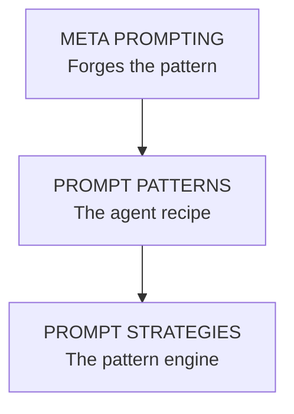

# MPS Architecture

## Meta
**🧠 The Architect**
- Designs or refines the prompt patterns
- Think of it as the LLM creating the blueprint or forging the recipe.

## Patterns
**📐 The Recipe / Blueprint**
- A reusable format or structure for solving tasks (e.g., Q&A, role-play).
- Created or suggested by meta prompts or humans.

## Strategies
**⚙️ The Execution Engine**
- The method of using patterns — like few-shot, CoT, self-consistency.
- Decides how the pattern is used during inference.

# Diagram

# Analogy
| Role        | Analogy                | Description                                      |
|-------------|------------------------|--------------------------------------------------|
| Meta        | Head Chef              | Designs the recipe (pattern) for a dish (task).  |
| Pattern     | Recipe                 | Structured set of instructions.                  |
| Strategy    | Cooking Technique      | How you apply the recipe: slow cook, grill, etc. |

# Summary
- **Meta**: Crafts the agent’s recipe (pattern + instructions).
- **Pattern**: Defines how the agent behaves (structure of input/output).
- **Strategy**: Drives how the pattern is executed during runtime.
