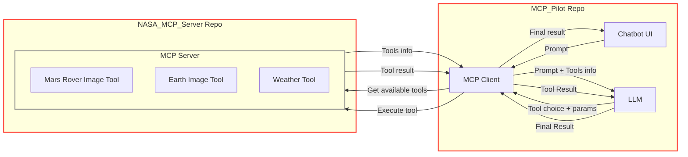

# NASA MCP Server

A Python implementation of the Model Context Protocol (MCP) server, providing tool-enabled AI conversations via the [streamable-http transport](https://modelcontextprotocol.io/specification/2025-03-26/basic/transports#streamable-http).

The Frontend code for this project is present in the [MCP_Pilot](https://github.com/adithya1012/MCP_Pilot).

## Project Structure

```
├── README.md
├── Screenshot
│   └── Mermaid Chart.png
└── Server
    ├── README.md
    ├── main.py
    ├── pyproject.toml
    ├── tools
    │   ├── aws_tools.py
    │   ├── earth_img.py
    │   ├── index.py
    │   └── mars_img.py
    └── uv.lock
```

## Architecture



## YouTube Updates

| Description                                                       | YouTube Short                                                                  | Commit/PR                                                                                                   | Date                                                                                                                                                                                                                                                                       |
| ----------------------------------------------------------------- | ------------------------------------------------------------------------------ | ----------------------------------------------------------------------------------------------------------- | -------------------------------------------------------------------------------------------------------------------------------------------------------------------------------------------------------------------------------------------------------------------------- |
| Commit Mermaid diagram on the MCP Chatbot                         | [Watch](https://youtube.com/shorts/YSOqYVHAsjg)                                | [Commit](https://github.com/adithya1012/MIE_ChatBot/commit/b00f89d741af162aeba4b8f16b3669898979d265)        | [June 18](https://docs.google.com/document/d/1RGVLmfMQ1EpN2uXK2a6YLVcGXwu7ZrbIWCEe7AmRHBc/edit?pli=1&tab=t.0#heading=h.mrf11jp1gp4)                                                                                                                                        |
| Vite Learning                                                     | [Watch](https://youtube.com/shorts/EZeK7EcgFY4)                                | [PR](https://github.com/adithya1012/Learning/pull/1)                                                        | [June 17](https://docs.google.com/document/d/1RGVLmfMQ1EpN2uXK2a6YLVcGXwu7ZrbIWCEe7AmRHBc/edit?pli=1&tab=t.0#heading=h.f3pej13xvumg)                                                                                                                                       |
| MCP chatbot architecture and Clean up folder structure.           | [Watch](https://youtube.com/shorts/Ib9I8vepgPY)                                | [PR1](https://github.com/adithya1012/MIE_ChatBot/pull/18), [PR2](https://github.com/adithya1012/MCP/pull/1) | [June 14](https://docs.google.com/document/d/1RGVLmfMQ1EpN2uXK2a6YLVcGXwu7ZrbIWCEe7AmRHBc/edit?pli=1&tab=t.0#heading=h.8pcaemy93me2), [June 16](https://docs.google.com/document/d/1RGVLmfMQ1EpN2uXK2a6YLVcGXwu7ZrbIWCEe7AmRHBc/edit?pli=1&tab=t.0#heading=h.4kqr6yuqq850) |
| UI for MCP architecture demo                                      | [Watch](https://youtube.com/shorts/l_go1mo4wHY)                                |                                                                                                             |                                                                                                                                                                                                                                                                            |
| MCP backend API testing Postman                                   | [Watch](https://youtube.com/shorts/qY5o8yI-bZQ)                                |                                                                                                             |                                                                                                                                                                                                                                                                            |
| Simple CMD line interaction with MCP architecture.                | [Watch](https://youtube.com/shorts/3tGSEd2r8D0)                                |                                                                                                             |                                                                                                                                                                                                                                                                            |
| MCP - Inspector 🚓🚨                                              | [Watch](https://youtube.com/shorts/URPhnDYoKq4)                                |                                                                                                             |                                                                                                                                                                                                                                                                            |
| MCP client (TypeScript/Node) server (python) with🌡️ Weather tool. | [Watch](https://youtube.com/shorts/TJvB7dl9_8Y)                                |                                                                                                             |                                                                                                                                                                                                                                                                            |
| MCP architecture diagram                                          | [Watch](https://youtube.com/shorts/NlC0rGRSANQ)                                |                                                                                                             |                                                                                                                                                                                                                                                                            |
| VS code copilot MCP tool attachment in agent mode                 | [Watch](https://youtube.com/shorts/5t2vZ07zfus)                                |                                                                                                             |                                                                                                                                                                                                                                                                            |
| Simple MCP                                                        | [Watch](https://youtube.com/shorts/JYjJavez4Xo)                                |                                                                                                             |                                                                                                                                                                                                                                                                            |
| Mars Image API integration:                                       | [Watch](https://youtube.com/shorts/LMLNdOsZnFk)                                |                                                                                                             |                                                                                                                                                                                                                                                                            |
| Earth Image API integration:                                      | [Watch](https://youtube.com/shorts/WJMUf-ZXRyQ)                                |                                                                                                             |                                                                                                                                                                                                                                                                            |
| YAML File Integration                                             | [Watch](https://youtube.com/shorts/CovI4RM3zrg)                                |                                                                                                             |                                                                                                                                                                                                                                                                            |
| MultiTool Integration + Chat history                              | [Watch](https://youtube.com/shorts/J4uz3EOss80)                                |                                                                                                             |                                                                                                                                                                                                                                                                            |
| LLM Response Parsing (XML)                                        | [Watch](https://youtube.com/shorts/CCQt4RiIYJE)                                |                                                                                                             |                                                                                                                                                                                                                                                                            |
| Exploring NASA APIs                                               | [Watch](https://youtube.com/shorts/cBbhRo6dW5E)                                |                                                                                                             |                                                                                                                                                                                                                                                                            |
| Other                                                             | [Watch1](https://youtu.be/GklINnKCvQs), [Watch2](https://youtu.be/90mmfmDyxn8) |                                                                                                             |                                                                                                                                                                                                                                                                            |

## Setup Instructions

### 1. Create and Activate Virtual Environment

```bash
uv venv
source .venv/bin/activate
```

### 2. Install Dependencies

```bash
uv add "mcp[cli]"
```

### 3. Run the MCP Server

```bash
python Server/tools/index.py
```

The server will start using the [streamable-http transport](https://modelcontextprotocol.io/specification/2025-03-26/basic/transports#streamable-http) and expose an HTTP endpoint at:

```
http://127.0.0.1:8000
```

## Usage

Once running, you can interact with the MCP server by sending HTTP requests to the endpoint above, following the [MCP streamable-http specification](https://modelcontextprotocol.io/specification/2025-03-26/basic/transports#streamable-http).

You can extend the server by adding new tools in the `Server/tools/` directory.

## Features

- **MCP Server**: Implements the MCP protocol for tool-enabled AI workflows.
- **Streamable HTTP Transport**: Exposes an HTTP endpoint for easy integration.
- **Extensible Tools**: Add your own tools in the `Server/tools/` directory.

## Reference

- [MCP Streamable HTTP Transport Specification](https://modelcontextprotocol.io/specification/2025-03-26/basic/transports#streamable-http)
