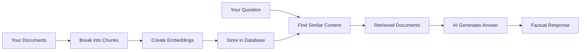
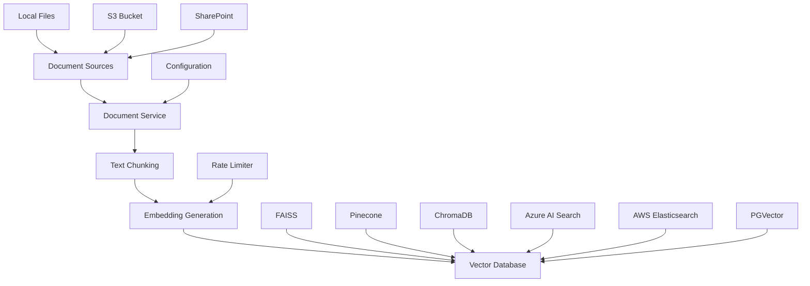
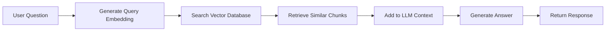

# nBedR - RAG Embedding Toolkit

A powerful tool for creating and managing embedding databases for Retrieval Augmented Generation (RAG) applications.

## Table of Contents

- [Overview](#overview)
- [Features](#features)
- [Quick Start](#quick-start)
- [Understanding Chunking](#understanding-chunking-the-art-of-breaking-down-documents)
- [Configuration](#configuration)
- [Using Your Embedding Database](#using-your-embedding-database)
- [Advanced Configuration](#advanced-configuration)
- [Development](#development)
- [Build and Release](#build-and-release)
- [Contributing](#contributing)

## Overview

### What Are Embeddings and Why Do They Matter?

Imagine you want to teach a computer to understand the meaning of words, sentences, and documents - not just the letters and spelling, but the actual **meaning** behind them. This is where embeddings come in.

**Embeddings** are like a universal translator for computers. They convert human language (text) into numbers that computers can understand and compare. Think of it like giving every piece of text a unique "fingerprint" made of numbers that captures its meaning.

Here's a simple analogy: If you were organizing books in a library, you wouldn't just sort them alphabetically. You'd group books by topic - science books near other science books, cooking books with other cooking books, etc. Embeddings do something similar but for any text - they help computers understand which pieces of text are similar in meaning, even if they use completely different words.

### How Embeddings Power Modern AI Applications

In **Generative AI (GenAI)** applications, embeddings are the secret sauce that makes AI systems truly intelligent. Here's how:

1. **Understanding Context**: When you ask an AI assistant a question, embeddings help it understand what you're really asking about, not just match keywords.

2. **Finding Relevant Information**: In **Retrieval Augmented Generation (RAG)** systems, embeddings help AI find the most relevant documents or passages to answer your questions, just like a very smart librarian who instantly knows which books contain information related to your question.

3. **Maintaining Consistency**: Embeddings ensure that AI responses are grounded in actual facts from your documents, rather than hallucinating information.

### The RAG Process Explained Simply



1. **Preparation Phase**: Your documents are broken into smaller pieces (chunks) and converted into embeddings
2. **Question Phase**: When you ask a question, the system finds the most relevant chunks using embeddings
3. **Answer Phase**: AI uses those relevant chunks to generate an accurate, factual answer

This application handles the **preparation phase** - the crucial foundation that makes everything else possible.

### Why This Application Matters

This tool provides a streamlined solution for processing documents, generating embeddings, and storing them in vector databases. Built on the foundation of the excellent RAFT toolkit, it focuses specifically on embedding operations and vector database management - essentially preparing your documents so they can be used effectively in AI applications.

### Architecture



## Features

### 🚀 Core Capabilities

- **Multi-format Document Processing**: PDF, TXT, JSON, PPTX, and more
- **Advanced Chunking Strategies**: Semantic, fixed-size, and sentence-aware chunking
- **Multiple Vector Databases**: FAISS, Pinecone, and ChromaDB support
- **Parallel Processing**: Efficient batch processing with configurable workers and multi-instance coordination
- **Rate Limiting**: Smart API rate limiting to prevent quota exhaustion
- **Cloud Storage Integration**: S3, Azure Blob, and SharePoint support

### 🔧 Document Sources

- **Local Files**: Process files from local directories
- **Amazon S3**: Direct integration with S3 buckets
- **SharePoint**: Microsoft SharePoint document libraries
- **Batch Processing**: Handle large document collections efficiently

### 🎯 Vector Database Support

- **FAISS**: High-performance similarity search and clustering
- **Pinecone**: Managed vector database service
- **ChromaDB**: Open-source embedding database
- **Azure AI Search**: Microsoft's enterprise search service with vector capabilities
- **AWS Elasticsearch**: Amazon's managed Elasticsearch with vector search support
- **PGVector**: PostgreSQL with pgvector extension for vector operations

## Quick Start

### System Requirements

- **Python 3.11 or higher** (Python 3.9 and 3.10 are no longer supported)
- 4GB+ RAM recommended for large document processing
- Sufficient disk space for vector databases (varies by collection size)

### Installation

```bash
# Ensure you're using Python 3.11 or higher
python3.11 --version  # Should show 3.11.x or higher

# Install from PyPI
pip install nbedr

# Or install from source
git clone https://github.com/your-org/nbedr.git
cd nbedr
pip install -e .
```

### Basic Usage

1. **Set up your environment variables:**

```bash
# Choose your embedding provider
export EMBEDDING_PROVIDER="openai"
export OPENAI_API_KEY="your-api-key-here"

# Choose your vector database
export VECTOR_DATABASE_TYPE="faiss"
```

2. **Process documents and create embeddings:**

```bash
# Process local documents
nbedr create-embeddings \
    --source local \
    --local-path ./documents \
    --output-path ./embeddings

# Process S3 documents
nbedr create-embeddings \
    --source s3 \
    --s3-bucket my-documents \
    --output-path ./embeddings
```

3. **Search your embeddings:**

```bash
nbedr search \
    --query "What is machine learning?" \
    --embeddings-path ./embeddings \
    --top-k 5
```

### Configuration

Basic configuration is handled through environment variables. Here are the essential settings:

#### Core Settings

```bash
# Embedding Provider
export EMBEDDING_PROVIDER="openai"  # openai, azure_openai, aws_bedrock, etc.
export OPENAI_API_KEY="your-api-key-here"
export EMBEDDING_MODEL="text-embedding-3-large"
export EMBEDDING_DIMENSIONS=1536

# Vector Database
export VECTOR_DATABASE_TYPE="faiss"  # faiss, pinecone, chromadb, etc.
export FAISS_INDEX_PATH="./embeddings_db"

# Document Processing
export CHUNK_SIZE=512
export CHUNKING_STRATEGY="semantic"  # semantic, fixed_size, sentence_aware
export BATCH_SIZE=10
export MAX_WORKERS=4
```

#### Quick Provider Setup

**OpenAI:**

```bash
export OPENAI_API_KEY="your-api-key"
export OPENAI_ORGANIZATION="your-org-id"  # Optional
```

**Pinecone:**

```bash
export PINECONE_API_KEY="your-api-key"
export PINECONE_ENVIRONMENT="your-environment"
export PINECONE_INDEX_NAME="your-index"
```

**ChromaDB:**

```bash
export CHROMA_HOST="localhost"
export CHROMA_PORT=8000
```

For detailed configuration options, advanced settings, and comprehensive setup guides, see the [Advanced Configuration](#advanced-configuration) section below.

## Advanced Configuration

This section covers advanced configuration options for production deployments, performance optimization, and specialized use cases.

### Rate Limiting Configuration

Rate limiting is configured separately for embedding providers and vector databases to prevent API quota exhaustion and optimize performance:

**Embedding Providers:**

```env
# Enable rate limiting for embedding providers
RATE_LIMIT_ENABLED=true
RATE_LIMIT_STRATEGY=sliding_window
RATE_LIMIT_REQUESTS_PER_MINUTE=500
RATE_LIMIT_TOKENS_PER_MINUTE=350000
RATE_LIMIT_MAX_BURST=100
```

**Vector Databases:**

```env
# Enable rate limiting for vector store operations
VECTOR_STORE_RATE_LIMIT_ENABLED=true
VECTOR_STORE_RATE_LIMIT_STRATEGY=sliding_window
VECTOR_STORE_RATE_LIMIT_REQUESTS_PER_MINUTE=300
VECTOR_STORE_RATE_LIMIT_MAX_BURST=50
```

#### Pre-configured Rate Limit Presets

nBedR includes optimized presets for popular services:

| Service | Preset | RPM | TPM | Strategy | Description |
|---------|--------|-----|-----|----------|-------------|
| OpenAI Tier 1 | `openai_embeddings_tier1` | 500 | 350,000 | sliding_window | Standard OpenAI limits |
| OpenAI Tier 2 | `openai_embeddings_tier2` | 5,000 | 2,000,000 | sliding_window | Higher tier limits |
| Azure OpenAI | `azure_openai_standard` | 120 | 240,000 | sliding_window | Standard deployment |
| AWS Bedrock | `aws_bedrock_titan` | 2,000 | 400,000 | sliding_window | Titan embedding limits |
| Google Vertex | `google_vertex_gecko` | 600 | 1,000,000 | sliding_window | Gecko model limits |
| Local Providers | `local_providers` | 1,000 | N/A | sliding_window | Conservative local limits |

#### Best Practices for Rate Limiting Configuration

**For Production Workloads:**

- Use `sliding_window` strategy for accuracy
- Set rates to 80% of your actual limits
- Enable burst handling for peak loads
- Monitor rate limit statistics regularly

**For Development:**

- Use `conservative` preset for safety
- Enable detailed logging for debugging
- Test with small document sets first

**For High-Volume Processing:**

- Use `adaptive` strategy for auto-tuning
- Configure multiple workers with shared rate limits
- Monitor response times and adjust accordingly

**Cost Optimization:**

- Set token limits to control embedding costs
- Use local providers for development
- Batch documents efficiently to minimize API calls

## Advanced Configuration

This section covers advanced configuration options for power users who need fine-grained control over nBedR's behavior, performance tuning, and enterprise deployment scenarios.

### Advanced Configuration Topics

- [Rate Limiting Configuration](#rate-limiting-configuration)
- [Parallel Processing and Multi-Instance Deployment](#parallel-processing-and-multi-instance-deployment)
- [Detailed Embedding Provider Configurations](#detailed-embedding-provider-configurations)
- [Advanced Vector Database Configurations](#advanced-vector-database-configurations)
- [Advanced Chunking Strategies](#advanced-chunking-strategies)

### Rate Limiting Configuration

#### Rate Limiting Configuration Examples

**Conservative Setup (Safe for Testing):**

```env
RATE_LIMIT_ENABLED=true
RATE_LIMIT_STRATEGY=sliding_window
RATE_LIMIT_REQUESTS_PER_MINUTE=60
RATE_LIMIT_TOKENS_PER_MINUTE=50000
RATE_LIMIT_MAX_BURST=10
```

**Production Setup (OpenAI Tier 1):**

```env
RATE_LIMIT_ENABLED=true
RATE_LIMIT_STRATEGY=sliding_window
RATE_LIMIT_REQUESTS_PER_MINUTE=400  # 80% of 500 limit
RATE_LIMIT_TOKENS_PER_MINUTE=280000  # 80% of 350k limit
RATE_LIMIT_MAX_BURST=80
RATE_LIMIT_TARGET_RESPONSE_TIME=2.0
```

**High-Volume Setup (Adaptive):**

```env
RATE_LIMIT_ENABLED=true
RATE_LIMIT_STRATEGY=adaptive
RATE_LIMIT_REQUESTS_PER_MINUTE=1000
RATE_LIMIT_TOKENS_PER_MINUTE=800000
RATE_LIMIT_TARGET_RESPONSE_TIME=1.5
RATE_LIMIT_MAX_RESPONSE_TIME=5.0
```

#### Monitoring Rate Limiting

nBedR provides detailed rate limiting statistics accessible through the application:

- **Total Requests**: Number of API calls made
- **Rate Limit Hits**: How many times rate limiting was applied
- **Average Response Time**: Performance monitoring
- **Current Rate**: Real-time rate limiting status
- **Wait Time**: Total time spent waiting due to rate limits

Use these metrics to optimize your rate limiting configuration for your specific workload and API tier.

### Parallel Processing and Multi-Instance Deployment

nBedR supports running multiple instances in parallel to dramatically speed up document processing for large datasets. The application includes sophisticated coordination mechanisms to prevent conflicts and ensure safe concurrent operation.

#### Why Run Multiple Instances?

When processing thousands of documents, a single instance can become a bottleneck. Multiple instances provide:

- **Faster Processing**: Parallel document processing across multiple CPU cores
- **Higher Throughput**: Multiple embedding API calls running simultaneously  
- **Fault Tolerance**: If one instance fails, others continue processing
- **Resource Utilization**: Better utilization of available CPU, memory, and network bandwidth

#### Instance Coordination System

nBedR automatically coordinates multiple instances to prevent conflicts:

**Conflict Detection:**

- Detects when multiple instances would write to the same output paths
- Prevents concurrent access to the same vector database files
- Validates configuration compatibility between instances

**Automatic Path Separation:**

- Generates instance-specific output directories
- Creates separate vector database paths for each instance
- Ensures no file conflicts between concurrent instances

**Resource Coordination:**

- Distributes rate limits fairly across all running instances
- Coordinates API quota usage to prevent rate limit violations
- Shares performance metrics for optimal load balancing

#### Running Multiple Instances

**Basic Parallel Deployment:**

```bash
# Terminal 1 - Instance 1
nbedr create-embeddings --datapath ./docs1 --output ./output1

# Terminal 2 - Instance 2  
nbedr create-embeddings --datapath ./docs2 --output ./output2

# Terminal 3 - Instance 3
nbedr create-embeddings --datapath ./docs3 --output ./output3
```

**Shared Dataset Processing:**

```bash
# All instances process the same dataset with automatic coordination
# Instance paths are automatically separated

# Terminal 1
nbedr create-embeddings --datapath ./large_dataset

# Terminal 2
nbedr create-embeddings --datapath ./large_dataset

# Terminal 3
nbedr create-embeddings --datapath ./large_dataset
```

**Custom Instance Configuration:**

```bash
# Disable coordination for specific use cases
nbedr create-embeddings --disable-coordination --datapath ./docs

# List all active instances
nbedr create-embeddings --list-instances

# Use specific instance ID
nbedr create-embeddings --instance-id my-custom-instance --datapath ./docs
```

#### Instance Management

**Monitor Active Instances:**

```bash
# List all running instances
nbedr create-embeddings --list-instances
```

**Environment Variables for Coordination:**

```env
# Disable coordination system
NBEDR_DISABLE_COORDINATION=true

# Custom coordination directory
NBEDR_COORDINATION_DIR=/tmp/nbedr_coordination

# Instance heartbeat interval (seconds)
NBEDR_HEARTBEAT_INTERVAL=60
```

#### Rate Limiting with Multiple Instances

When multiple instances run simultaneously, rate limits are automatically distributed:

**Single Instance:**

- 500 requests per minute → 500 RPM for the instance

**Three Instances:**

- 500 requests per minute → 166 RPM per instance (500/3)
- Prevents collective rate limit violations
- Ensures fair resource distribution

**Manual Rate Limit Override:**

```env
# Set per-instance rate limits manually
RATE_LIMIT_REQUESTS_PER_MINUTE=100
RATE_LIMIT_TOKENS_PER_MINUTE=50000
```

#### Best Practices for Parallel Processing

**Data Organization:**

- Split large datasets into balanced chunks for each instance
- Use different source directories to avoid file locking conflicts
- Consider document types and sizes when distributing work

**Resource Planning:**

- Monitor CPU usage - optimal is typically 2-4 instances per CPU core
- Watch memory consumption - each instance loads its own models
- Consider network bandwidth for API-heavy operations

**Error Handling:**

- Each instance fails independently without affecting others
- Use consistent configuration across all instances
- Monitor logs from all instances for comprehensive debugging

**Production Deployment:**

```bash
# Use process managers like systemd or supervisor
systemctl start nbedr-instance-1
systemctl start nbedr-instance-2
systemctl start nbedr-instance-3

# Or container orchestration
docker run -d nbedr:latest --datapath /data/batch1
docker run -d nbedr:latest --datapath /data/batch2
docker run -d nbedr:latest --datapath /data/batch3
```

#### Troubleshooting Parallel Execution

**Common Issues:**

1. **Path Conflicts**

   ```bash
   # Error: Multiple instances writing to same path
   # Solution: Use automatic coordination or specify different paths
   ```

2. **Rate Limit Violations**

   ```bash
   # Error: Combined instances exceed API limits
   # Solution: Reduce per-instance rate limits or number of instances
   ```

3. **Vector Database Locks**

   ```bash
   # Error: FAISS index file locked
   # Solution: Ensure each instance uses separate index paths
   ```

**Debugging Commands:**

```bash
# Check active instances
nbedr create-embeddings --list-instances

# View coordination logs
tail -f /tmp/nbedr_coordination/coordination.log

# Test configuration without running
nbedr create-embeddings --validate --datapath ./docs
```

### Detailed Embedding Provider Configurations

For comprehensive configuration options for all 7 embedding providers, see the [Embedding Providers section](#embedding-providers-choose-your-ai-platform) below.

### Advanced Vector Database Configurations

For detailed vector database configuration options and selection guidance, see the [Vector Databases section](#vector-databases) below.

### Advanced Chunking Strategies

For detailed chunking configuration and optimization, see the [Understanding Chunking section](#understanding-chunking-the-art-of-breaking-down-documents) below.

## Architecture


## Using Your Embedding Database

Once you've created your embedding database with NBEDR, you can integrate it into RAG applications and chatbots. Here's how to query and utilize your embeddings effectively.

### 🔍 **RAG Query Flow**



### 🚀 **Direct Search with NBEDR CLI**

```bash
# Search your embedding database
python nbedr.py search \
    --query "How do I configure SSL certificates?" \
    --vector-db faiss \
    --index-path ./embeddings_db \
    --top-k 5

# Advanced search with filters
python nbedr.py search \
    --query "database optimization techniques" \
    --vector-db pgvector \
    --filters '{"source": "technical-docs"}' \
    --top-k 10
```

### 💻 **Programmatic Integration Examples**

#### **Simple RAG Pipeline**

```python
from core.vector_stores import FAISSVectorStore
from core.clients import create_provider_from_config
from core.config import get_config

# Load configuration and initialize components
config = get_config()
embedding_provider = create_provider_from_config(config)
vector_store = FAISSVectorStore({'faiss_index_path': './embeddings_db'})

async def answer_question(question: str) -> str:
    # 1. Generate embedding for the question
    result = await embedding_provider.generate_embeddings([question])
    query_embedding = result.embeddings[0]
    
    # 2. Search for similar documents
    search_results = await vector_store.search(
        query_embedding=query_embedding,
        top_k=5
    )
    
    # 3. Combine context for LLM
    context = "\n\n".join([result.content for result in search_results])
    
    # 4. Generate answer with your LLM
    prompt = f"Context:\n{context}\n\nQuestion: {question}\nAnswer:"
    # (Add your LLM call here)
    
    return answer
```

#### **Chatbot Integration**

```python
import asyncio
from typing import List, Dict

class RAGChatbot:
    def __init__(self, vector_store, embedding_provider):
        self.vector_store = vector_store
        self.embedding_provider = embedding_provider
        self.conversation_history = []
    
    async def chat(self, message: str) -> str:
        # Generate embedding for user message
        embedding_result = await self.embedding_provider.generate_embeddings([message])
        query_embedding = embedding_result.embeddings[0]
        
        # Search for relevant context
        search_results = await self.vector_store.search(
            query_embedding=query_embedding,
            top_k=3
        )
        
        # Build context with conversation history
        context_chunks = [f"Document: {r.content}" for r in search_results]
        recent_history = self.conversation_history[-4:]  # Last 2 exchanges
        
        # Combine for LLM prompt
        context = "\n".join(context_chunks)
        history = "\n".join([f"{h['role']}: {h['content']}" for h in recent_history])
        
        # Generate response (add your LLM integration)
        response = await self.generate_llm_response(context, history, message)
        
        # Update conversation history
        self.conversation_history.extend([
            {"role": "user", "content": message},
            {"role": "assistant", "content": response}
        ])
        
        return response
```

#### **Batch Document Processing**

```python
async def process_user_queries(queries: List[str]) -> List[Dict]:
    """Process multiple queries efficiently"""
    # Generate embeddings for all queries at once
    embedding_result = await embedding_provider.generate_embeddings(queries)
    
    results = []
    for i, query_embedding in enumerate(embedding_result.embeddings):
        # Search for each query
        search_results = await vector_store.search(
            query_embedding=query_embedding,
            top_k=5
        )
        
        results.append({
            'query': queries[i],
            'matches': [
                {
                    'content': r.content,
                    'source': r.source,
                    'similarity': r.similarity_score
                }
                for r in search_results
            ]
        })
    
    return results
```

### 🎯 **Database-Specific Usage**

#### **FAISS (Local)**

```python
# Load and search FAISS index
from core.vector_stores import FAISSVectorStore

store = FAISSVectorStore({'faiss_index_path': './my_embeddings'})
await store.initialize()

results = await store.search(query_embedding, top_k=10)
```

#### **Pinecone (Cloud)**

```python
# Search Pinecone index
from core.vector_stores import PineconeVectorStore

store = PineconeVectorStore({
    'pinecone_api_key': 'your-key',
    'pinecone_environment': 'your-env',
    'pinecone_index_name': 'rag-embeddings'
})

results = await store.search(
    query_embedding=query_embedding,
    top_k=5,
    filters={'source': 'documentation'}
)
```

#### **PGVector (SQL)**

```python
# Combine vector search with SQL queries
from core.vector_stores import PGVectorStore

store = PGVectorStore({
    'pgvector_host': 'localhost',
    'pgvector_database': 'vectordb',
    'pgvector_user': 'postgres',
    'pgvector_password': 'password'
})

# Search with metadata filters
results = await store.search(
    query_embedding=query_embedding,
    top_k=10,
    filters={'metadata.document_type': 'manual'}
)
```

### 🔧 **Advanced Usage Patterns**

#### **Hybrid Search (Keyword + Semantic)**

```python
async def hybrid_search(query: str, keywords: List[str]) -> List[Dict]:
    # Semantic search
    embedding_result = await embedding_provider.generate_embeddings([query])
    semantic_results = await vector_store.search(
        query_embedding=embedding_result.embeddings[0],
        top_k=20
    )
    
    # Keyword filtering
    keyword_filtered = [
        r for r in semantic_results 
        if any(keyword.lower() in r.content.lower() for keyword in keywords)
    ]
    
    return keyword_filtered[:10]
```

#### **Contextual Chunk Assembly**

```python
async def get_expanded_context(query: str, expand_chunks: int = 2) -> str:
    # Find relevant chunks
    embedding_result = await embedding_provider.generate_embeddings([query])
    results = await vector_store.search(
        query_embedding=embedding_result.embeddings[0],
        top_k=5
    )
    
    # Group by source and expand context
    context_blocks = []
    for result in results:
        # Get neighboring chunks for better context
        expanded_context = await get_neighboring_chunks(
            result.source, 
            result.id, 
            expand_chunks
        )
        context_blocks.append(expanded_context)
    
    return "\n\n---\n\n".join(context_blocks)
```

### 📊 **Performance Optimization**

#### **Embedding Caching**

```python
from functools import lru_cache
import hashlib

class CachedEmbeddingProvider:
    def __init__(self, provider):
        self.provider = provider
        self.cache = {}
    
    async def generate_embeddings(self, texts: List[str]):
        # Hash texts for cache key
        cache_key = hashlib.md5('|'.join(texts).encode()).hexdigest()
        
        if cache_key in self.cache:
            return self.cache[cache_key]
        
        result = await self.provider.generate_embeddings(texts)
        self.cache[cache_key] = result
        return result
```

### 🎨 **Integration with Popular Frameworks**

#### **LangChain Integration**

```python
from langchain.embeddings.base import Embeddings
from langchain.vectorstores import VectorStore

class NBEDREmbeddings(Embeddings):
    def __init__(self, provider):
        self.provider = provider
    
    def embed_documents(self, texts: List[str]) -> List[List[float]]:
        result = asyncio.run(self.provider.generate_embeddings(texts))
        return result.embeddings
    
    def embed_query(self, text: str) -> List[float]:
        result = asyncio.run(self.provider.generate_embeddings([text]))
        return result.embeddings[0]
```

## Quick Start

### Installation

```bash
# Clone the repository
git clone https://github.com/your-org/nbedr.git
cd nbedr

# Install dependencies
pip install -r requirements.txt

# Or install with optional dependencies
pip install -e .[cloud,dev]
```

### Basic Usage

1. **Create embeddings from local documents:**

```bash
python nbedr.py create-embeddings \
    --source local \
    --source-path ./documents \
    --vector-db faiss \
    --output-path ./embeddings_db
```

2. **Process documents from S3:**

```bash
python nbedr.py create-embeddings \
    --source s3 \
    --source-path s3://my-bucket/documents/ \
    --vector-db pinecone \
    --pinecone-index my-index
```

3. **Use Azure AI Search:**

```bash
python nbedr.py create-embeddings \
    --source local \
    --source-path ./documents \
    --vector-db azure_ai_search \
    --azure-search-service your-service-name \
    --azure-search-index rag-embeddings
```

1. **Use AWS Elasticsearch:**

```bash
python nbedr.py create-embeddings \
    --source local \
    --source-path ./documents \
    --vector-db aws_elasticsearch \
    --aws-elasticsearch-endpoint https://your-domain.region.es.amazonaws.com
```

1. **Use PGVector:**

```bash
python nbedr.py create-embeddings \
    --source local \
    --source-path ./documents \
    --vector-db pgvector \
    --pgvector-host localhost \
    --pgvector-database vectordb
```

1. **Search for similar documents:**

```bash
python nbedr.py search \
    --query "machine learning algorithms" \
    --vector-db faiss \
    --index-path ./embeddings_db \
    --top-k 5
```

### Configuration

Create a `.env` file with your configuration:

```env
# OpenAI Configuration
OPENAI_API_KEY=your_openai_api_key
EMBEDDING_MODEL=text-embedding-ada-002
EMBEDDING_DIMENSIONS=1536

# Vector Database Configuration
VECTOR_DB_TYPE=faiss
FAISS_INDEX_PATH=./embeddings_db

# Pinecone Configuration (if using Pinecone)
PINECONE_API_KEY=your_pinecone_api_key
PINECONE_ENVIRONMENT=your_environment
PINECONE_INDEX_NAME=your_index_name

# ChromaDB Configuration (if using ChromaDB)
CHROMA_HOST=localhost
CHROMA_PORT=8000

# Azure AI Search Configuration (if using Azure AI Search)
AZURE_SEARCH_SERVICE_NAME=your_search_service
AZURE_SEARCH_API_KEY=your_api_key
AZURE_SEARCH_INDEX_NAME=rag-embeddings

# AWS Elasticsearch Configuration (if using AWS Elasticsearch)
AWS_ELASTICSEARCH_ENDPOINT=https://your-domain.region.es.amazonaws.com
AWS_ELASTICSEARCH_REGION=us-east-1
AWS_ELASTICSEARCH_INDEX_NAME=rag-embeddings
AWS_ACCESS_KEY_ID=your_access_key
AWS_SECRET_ACCESS_KEY=your_secret_key

# PGVector Configuration (if using PGVector)
PGVECTOR_HOST=localhost
PGVECTOR_PORT=5432
PGVECTOR_DATABASE=vectordb
PGVECTOR_USER=postgres
PGVECTOR_PASSWORD=your_postgres_password
PGVECTOR_TABLE_NAME=rag_embeddings

# Processing Configuration
CHUNK_SIZE=512
CHUNKING_STRATEGY=semantic
BATCH_SIZE=10
MAX_WORKERS=4
```

## Advanced Usage

### Custom Chunking Strategies

```bash
# Semantic chunking (uses embeddings to determine boundaries)
python nbedr.py create-embeddings \
    --chunking-strategy semantic \
    --chunk-size 512 \
    --source local \
    --source-path ./docs

# Fixed-size chunking
python nbedr.py create-embeddings \
    --chunking-strategy fixed \
    --chunk-size 1000 \
    --chunk-overlap 100 \
    --source local \
    --source-path ./docs
```

### Batch Processing

```bash
# Process large document collections
python nbedr.py create-embeddings \
    --source s3 \
    --source-path s3://large-corpus/ \
    --batch-size 50 \
    --max-workers 8 \
    --rate-limit-requests 100 \
    --rate-limit-period 60
```

### Preview Mode

```bash
# Preview what will be processed without actually doing it
python nbedr.py create-embeddings \
    --source local \
    --source-path ./documents \
    --preview
```

## API Usage

```python
from core.services.document_service import DocumentService
from core.config import EmbeddingConfig

# Initialize configuration
config = EmbeddingConfig()

# Create document service
service = DocumentService(config)

# Process documents
results = await service.process_documents(
    source_path="./documents",
    source_type="local"
)

print(f"Processed {len(results.chunks)} chunks")
print(f"Generated {len(results.embeddings)} embeddings")
```

## Understanding Chunking: The Art of Breaking Down Documents

### Why Chunking Matters

Think of chunking like cutting a pizza into slices - you need pieces that are the right size to be useful. If the slices are too big, they're hard to handle and contain too much mixed information. If they're too small, you lose important context and meaning.

When processing documents for AI, chunking determines how well your AI system can find and use relevant information. Good chunking means better, more accurate AI responses.

### Chunking Strategies Explained

#### 🎯 **Semantic Chunking** (Recommended for Most Use Cases)

**What it does**: Uses AI to understand the meaning and flow of your text, then creates natural breakpoints where topics change.

**Think of it like**: A smart editor who reads your document and says "this paragraph is about marketing, but this next section switches to finance" and makes a cut there.

**Best for**:

- Mixed content (reports, manuals, articles)
- Documents with varying topic sections
- When you want the highest quality results

**Configuration**:

```env
CHUNKING_STRATEGY=semantic
CHUNK_SIZE=512
```

#### 📏 **Fixed-Size Chunking** (Most Predictable)

**What it does**: Creates chunks of exactly the same size, like cutting a rope into equal lengths.

**Think of it like**: Using a ruler to mark off exact measurements - every piece is the same size.

**Best for**:

- Consistent document types (legal docs, technical manuals)
- When you need predictable processing times
- Large volumes of similar content

**Configuration**:

```env
CHUNKING_STRATEGY=fixed
CHUNK_SIZE=1000
CHUNK_OVERLAP=100
```

#### 📝 **Sentence-Aware Chunking** (Natural Boundaries)

**What it does**: Breaks text at sentence endings, keeping complete thoughts together.

**Think of it like**: A careful reader who never cuts off someone mid-sentence.

**Best for**:

- Narrative content (stories, case studies)
- Interview transcripts
- Conversational content

**Configuration**:

```env
CHUNKING_STRATEGY=sentence
CHUNK_SIZE=500
```

### Chunk Size and Overlap: Finding the Sweet Spot

#### **Chunk Size Guidelines**

| **Content Type** | **Recommended Size** | **Why** |
|---|---|---|
| **Technical Documentation** | 800-1200 tokens | Complex concepts need more context |
| **Marketing Content** | 400-600 tokens | Concise, focused messages |
| **Legal Documents** | 1000-1500 tokens | Detailed context is crucial |
| **News Articles** | 300-500 tokens | Quick, digestible information |
| **Academic Papers** | 600-1000 tokens | Balance between detail and focus |

**Token Rule of Thumb**: 1 token ≈ 0.75 words in English, so 500 tokens ≈ 375 words

#### **Overlap: The Safety Net**

**What is overlap?**: When chunks share some content at their boundaries, like overlapping roof tiles.

**Why use overlap?**:

- **Prevents Context Loss**: Important information spanning chunk boundaries isn't lost
- **Improves Search**: Better chance of finding relevant information
- **Maintains Meaning**: Keeps related concepts together

**Overlap Guidelines**:

- **Standard**: 10-20% of chunk size
- **High Precision Needed**: 20-30% overlap
- **Performance Focused**: 5-10% overlap

```env
# Example: 1000 token chunks with 20% overlap
CHUNK_SIZE=1000
CHUNK_OVERLAP=200
```

### Configuration Impact Guide

#### **Chunk Size Impact**

**Larger Chunks (1000+ tokens)**:

- ✅ **Pros**: More context, better for complex topics, fewer total chunks
- ❌ **Cons**: Less precise retrieval, higher costs, slower processing

**Smaller Chunks (300-500 tokens)**:

- ✅ **Pros**: More precise retrieval, faster processing, lower costs
- ❌ **Cons**: May lose context, more chunks to manage

#### **Overlap Impact**

**High Overlap (25%+)**:

- ✅ **Pros**: Better information preservation, improved search accuracy
- ❌ **Cons**: More storage needed, increased processing time

**Low Overlap (5-10%)**:

- ✅ **Pros**: Efficient storage, faster processing
- ❌ **Cons**: Risk of losing information at boundaries

### Recommended Configurations by Use Case

#### **Customer Support Knowledge Base**

```env
CHUNKING_STRATEGY=semantic
CHUNK_SIZE=600
CHUNK_OVERLAP=120
```
*Why*: Balances quick answers with sufficient context

#### **Legal Document Analysis**

```env
CHUNKING_STRATEGY=fixed
CHUNK_SIZE=1200
CHUNK_OVERLAP=300
```
*Why*: Maintains legal context integrity with high overlap

#### **Product Documentation**

```env
CHUNKING_STRATEGY=semantic
CHUNK_SIZE=800
CHUNK_OVERLAP=160
```
*Why*: Keeps procedures and concepts together

#### **News and Media Content**

```env
CHUNKING_STRATEGY=sentence
CHUNK_SIZE=400
CHUNK_OVERLAP=80
```
*Why*: Preserves story flow and readability

### Performance Considerations

**Cost Optimization**:

- Smaller chunks = Lower embedding costs
- Less overlap = Lower storage costs
- Batch processing = Better rate limits

**Quality Optimization**:

- Semantic chunking = Best understanding
- Higher overlap = Better information retention
- Larger chunks = More context for complex topics

**Speed Optimization**:

- Fixed chunking = Fastest processing
- Smaller chunks = Faster search
- Lower overlap = Less processing time

## Configuration Options

## Embedding Providers: Choose Your AI Platform

NBEDR supports **7 different embedding providers**, from major cloud platforms to local solutions. This gives you complete flexibility to choose the right solution for your needs, budget, and privacy requirements.

### 🌟 **Provider Overview**

| **Provider** | **Type** | **Best For** | **Cost** | **Privacy** | **Setup** |
|---|---|---|---|---|---|
| **OpenAI** | Cloud | Production, quality | Pay-per-use | Shared | Easy |
| **Azure OpenAI** | Cloud | Enterprise, compliance | Pay-per-use | Enterprise | Medium |
| **AWS Bedrock** | Cloud | AWS ecosystem | Pay-per-use | Enterprise | Medium |
| **Google Vertex AI** | Cloud | Google ecosystem | Pay-per-use | Enterprise | Medium |
| **LMStudio** | Local | Development, testing | Free | Complete | Easy |
| **Ollama** | Local | Privacy, offline use | Free | Complete | Easy |
| **Llama.cpp** | Local | Custom models, research | Free | Complete | Hard |

### 🚀 **Quick Start by Provider**

#### **OpenAI** (Recommended for Most Users)

```bash
# Set your API key
export EMBEDDING_PROVIDER=openai
export OPENAI_API_KEY=your_api_key_here
export EMBEDDING_MODEL=text-embedding-3-small

# Run embedding generation
python nbedr.py create-embeddings --source local --source-path ./documents
```

#### **Azure OpenAI** (Enterprise)

```bash
# Configure Azure OpenAI
export EMBEDDING_PROVIDER=azure_openai
export AZURE_OPENAI_API_KEY=your_api_key
export AZURE_OPENAI_ENDPOINT=https://your-resource.openai.azure.com/
export AZURE_OPENAI_DEPLOYMENT_NAME=your-embedding-deployment

python nbedr.py create-embeddings --source local --source-path ./documents
```

#### **Ollama** (Local & Free)

```bash
# Install and start Ollama
curl -fsSL https://ollama.ai/install.sh | sh
ollama serve

# Pull an embedding model
ollama pull nomic-embed-text

# Configure NBEDR
export EMBEDDING_PROVIDER=ollama
export EMBEDDING_MODEL=nomic-embed-text

python nbedr.py create-embeddings --source local --source-path ./documents
```

### 📋 **Complete Configuration Guide**

#### **OpenAI Configuration**

```env
# Provider selection
EMBEDDING_PROVIDER=openai

# Authentication
OPENAI_API_KEY=your_api_key_here
OPENAI_ORGANIZATION=your_org_id  # Optional

# Model settings
EMBEDDING_MODEL=text-embedding-3-small
EMBEDDING_DIMENSIONS=1536

# Performance
OPENAI_TIMEOUT=60
OPENAI_MAX_RETRIES=3
EMBEDDING_BATCH_SIZE=100
```

**Available Models:**

- `text-embedding-3-large` (3072 dims) - Highest quality, $0.00013/1K tokens
- `text-embedding-3-small` (1536 dims) - Best balance, $0.00002/1K tokens  
- `text-embedding-ada-002` (1536 dims) - Legacy, $0.0001/1K tokens

#### **Azure OpenAI Configuration**

```env
# Provider selection
EMBEDDING_PROVIDER=azure_openai

# Authentication
AZURE_OPENAI_API_KEY=your_api_key
AZURE_OPENAI_ENDPOINT=https://your-resource.openai.azure.com/
AZURE_OPENAI_API_VERSION=2024-02-01

# Deployment mapping
AZURE_OPENAI_DEPLOYMENT_NAME=your-embedding-deployment
# For multiple models (JSON format):
AZURE_OPENAI_DEPLOYMENT_MAPPING={"text-embedding-3-small": "embedding-small", "text-embedding-3-large": "embedding-large"}

# Model settings
EMBEDDING_MODEL=text-embedding-3-small
```

#### **AWS Bedrock Configuration**

```env
# Provider selection
EMBEDDING_PROVIDER=aws_bedrock

# AWS credentials (or use IAM roles)
AWS_BEDROCK_REGION=us-east-1
AWS_BEDROCK_ACCESS_KEY_ID=your_access_key
AWS_BEDROCK_SECRET_ACCESS_KEY=your_secret_key

# Model settings
EMBEDDING_MODEL=amazon.titan-embed-text-v1
```

**Available Models:**

- `amazon.titan-embed-text-v1` (1536 dims) - Amazon's embedding model
- `amazon.titan-embed-text-v2:0` (1024 dims) - Latest Amazon model
- `cohere.embed-english-v3` (1024 dims) - Cohere English embeddings
- `cohere.embed-multilingual-v3` (1024 dims) - Cohere multilingual

#### **Google Vertex AI Configuration**

```env
# Provider selection
EMBEDDING_PROVIDER=google_vertex

# Google Cloud settings
GOOGLE_VERTEX_PROJECT_ID=your-project-id
GOOGLE_VERTEX_LOCATION=us-central1
GOOGLE_APPLICATION_CREDENTIALS=/path/to/service-account.json

# Model settings
EMBEDDING_MODEL=textembedding-gecko@003
```

**Available Models:**

- `textembedding-gecko@003` (768 dims) - Latest Gecko model
- `textembedding-gecko@002` (768 dims) - Previous version
- `text-embedding-004` (768 dims) - Latest general model
- `text-multilingual-embedding-002` (768 dims) - Multilingual support

#### **LMStudio Configuration** (Local)

```env
# Provider selection
EMBEDDING_PROVIDER=lmstudio

# Server settings
LMSTUDIO_BASE_URL=http://localhost:1234
LMSTUDIO_API_KEY=optional_api_key  # If you set one

# Model settings (use whatever model you loaded in LMStudio)
EMBEDDING_MODEL=your-loaded-model
```

**Setup Steps:**

1. Download and install [LMStudio](https://lmstudio.ai/)
2. Download an embedding model (like `nomic-ai/nomic-embed-text-v1.5-GGUF`)
3. Load the model and start the local server
4. Configure NBEDR with the settings above

#### **Ollama Configuration** (Local)

```env
# Provider selection
EMBEDDING_PROVIDER=ollama

# Server settings
OLLAMA_BASE_URL=http://localhost:11434
OLLAMA_TIMEOUT=120

# Model settings
EMBEDDING_MODEL=nomic-embed-text
```

**Setup Steps:**

1. Install Ollama: `curl -fsSL https://ollama.ai/install.sh | sh`
2. Start Ollama: `ollama serve`
3. Pull an embedding model: `ollama pull nomic-embed-text`
4. Configure NBEDR with the settings above

**Popular Embedding Models:**

- `nomic-embed-text` (768 dims) - High-quality English embeddings
- `mxbai-embed-large` (1024 dims) - Large general-purpose model
- `snowflake-arctic-embed` (1024 dims) - Snowflake's model
- `all-minilm` (384 dims) - Lightweight multilingual

#### **Llama.cpp Configuration** (Local)

```env
# Provider selection
EMBEDDING_PROVIDER=llamacpp

# Server settings
LLAMACPP_BASE_URL=http://localhost:8000
LLAMACPP_MODEL_NAME=your-model-name
LLAMACPP_DIMENSIONS=4096  # Set based on your model

# Authentication (if needed)
LLAMACPP_API_KEY=optional_api_key
```

**Setup Steps:**

1. Install llama-cpp-python: `pip install llama-cpp-python[server]`
2. Download a GGUF embedding model
3. Start the server: `python -m llama_cpp.server --model path/to/model.gguf --embedding`
4. Configure NBEDR with the settings above

### 🎯 **Provider Selection Guide**

#### **Choose OpenAI when:**

- You want the highest quality embeddings
- Cost is not the primary concern
- You need reliable, proven performance
- You're building a production application

#### **Choose Azure OpenAI when:**

- You're in an enterprise environment
- You need compliance guarantees (SOC 2, HIPAA)
- You're already using Azure services
- You need dedicated capacity and SLAs

#### **Choose AWS Bedrock when:**

- You're already using AWS services
- You want access to multiple model providers
- You need enterprise-grade security
- You prefer AWS pricing models

#### **Choose Google Vertex AI when:**

- You're using Google Cloud Platform
- You need integration with other Google AI services
- You want access to Google's latest models
- You're building multilingual applications

#### **Choose LMStudio when:**

- You're developing and testing locally
- You want an easy GUI for model management
- You need to experiment with different models
- You want local processing without complexity

#### **Choose Ollama when:**

- Privacy is paramount (data never leaves your machine)
- You want completely free operation
- You need offline capabilities
- You're comfortable with command-line tools

#### **Choose Llama.cpp when:**

- You need maximum control and customization
- You're doing research or advanced development
- You want to use custom or fine-tuned models
- Performance optimization is critical

### 💰 **Cost Comparison**

| **Provider** | **Cost Model** | **Example Cost (1M tokens)** |
|---|---|---|
| **OpenAI** | Pay-per-token | $20-130 depending on model |
| **Azure OpenAI** | Pay-per-token | Similar to OpenAI |
| **AWS Bedrock** | Pay-per-token | $10-100 depending on model |
| **Google Vertex** | Pay-per-token | $25-200 depending on model |
| **LMStudio** | Free | $0 |
| **Ollama** | Free | $0 |
| **Llama.cpp** | Free | $0 |

### 🔒 **Privacy & Security**

#### **Cloud Providers (OpenAI, Azure, AWS, Google)**

- Data is sent to external servers
- Subject to provider's privacy policies
- Enterprise options available with enhanced security
- Data retention policies vary by provider

#### **Local Providers (LMStudio, Ollama, Llama.cpp)**

- Data never leaves your machine
- Complete privacy and control
- No internet required for processing
- Ideal for sensitive or proprietary content

### 🚀 **Performance Characteristics**

| **Provider** | **Latency** | **Throughput** | **Reliability** |
|---|---|---|---|
| **OpenAI** | Low | High | Very High |
| **Azure OpenAI** | Low | High | Very High |
| **AWS Bedrock** | Medium | Medium | High |
| **Google Vertex** | Low | High | High |
| **LMStudio** | Very Low | Medium | Medium |
| **Ollama** | Very Low | Medium | Medium |
| **Llama.cpp** | Very Low | Variable | Medium |

### 📝 **Customizing Embedding Prompts**

NBEDR allows you to customize the prompts used for generating embeddings to improve quality and relevance for your specific domain and use case.

#### **Quick Start**

1. **Use Default Template**: NBEDR includes a default embedding prompt template at `templates/embedding_prompt_template.txt`

2. **Set Custom Template Path**:

   ```bash
   export EMBEDDING_PROMPT_TEMPLATE="templates/my_custom_template.txt"
   ```

3. **Or Configure in Environment**:

   ```env
   EMBEDDING_PROMPT_TEMPLATE=/path/to/your/custom_template.txt
   ```

#### **Creating Custom Prompt Templates**

**Example Medical Domain Template** (`templates/medical_template.txt`):

```text
Generate embeddings for medical literature that capture clinical concepts effectively.

Focus on:
- Medical terminology and procedures: {content}
- Drug names, dosages, and interactions
- Symptoms, diagnoses, and treatment protocols
- Clinical outcomes and research findings

Document Type: {document_type}
Content: {content}
Metadata: {metadata}

Ensure embeddings enable accurate retrieval for medical information systems.
```

**Example Legal Domain Template** (`templates/legal_template.txt`):

```text
Generate embeddings for legal documents optimized for legal research and analysis.

Focus on:
- Legal terminology and concepts
- Case citations and precedents: {content}
- Statutory references and regulations
- Contractual terms and legal obligations

Document Type: {document_type}
Chunk: {chunk_index} of document
Content: {content}

Prioritize legal concepts and relationships for accurate legal document retrieval.
```

#### **Available Template Variables**

Use these variables in your custom templates:

- `{content}`: The document content to be embedded
- `{document_type}`: File type (pdf, txt, json, pptx, etc.)
- `{metadata}`: Additional document metadata (file size, source, etc.)
- `{chunk_index}`: Index of the current chunk within the document
- `{chunking_strategy}`: The chunking method used (semantic, fixed, sentence)

#### **Custom Variables**

Add your own variables using the `EMBEDDING_CUSTOM_PROMPT_VARIABLES` environment variable:

```bash
export EMBEDDING_CUSTOM_PROMPT_VARIABLES='{"domain": "healthcare", "use_case": "clinical_research"}'
```

Then use them in your template:

```text
Generate embeddings for {domain} content optimized for {use_case}.
Content: {content}
```

#### **Configuration Examples**

**Using Environment Variables**:

```bash
# Set custom template
export EMBEDDING_PROMPT_TEMPLATE="templates/technical_docs_template.txt"

# Add custom variables
export EMBEDDING_CUSTOM_PROMPT_VARIABLES='{"company": "TechCorp", "product": "API"}'

# Run with custom prompts
python nbedr.py create-embeddings --datapath ./docs --doctype pdf
```

**Using CLI Arguments**:

```bash
python nbedr.py create-embeddings \
  --datapath ./documents \
  --doctype pdf \
  --embedding-prompt-template templates/my_template.txt
```

#### **Template Best Practices**

1. **Be Domain-Specific**: Include terminology and concepts specific to your field
2. **Provide Context**: Explain the intended use case for the embeddings
3. **Keep It Focused**: Avoid overly long prompts that might confuse the model
4. **Test and Iterate**: Experiment with different prompts and measure embedding quality
5. **Use Variables**: Leverage template variables for dynamic content insertion

#### **Template Examples by Domain**

See the `templates/` directory for example templates:

- `embedding_prompt_template.txt` - Default general-purpose template
- `templates/README.md` - Complete template documentation with examples

**Quick Domain Templates**:

**Technical Documentation**:
```bash
export EMBEDDING_PROMPT_TEMPLATE="templates/tech_docs_template.txt"
```

**Academic Research**:

```bash
export EMBEDDING_PROMPT_TEMPLATE="templates/academic_template.txt"
```

**Business Content**:

```bash
export EMBEDDING_PROMPT_TEMPLATE="templates/business_template.txt"
```

### Vector Databases

#### **FAISS** (Facebook AI Similarity Search)

- **Best for**: Local development, high-performance searches, full control
- **Pros**: Free, very fast, runs locally
- **Cons**: Requires technical setup, no cloud features

#### **Pinecone**

- **Best for**: Production applications, scaling, managed service
- **Pros**: Fully managed, excellent performance, built-in scaling
- **Cons**: Cost increases with usage

#### **ChromaDB**

- **Best for**: Open-source preference, flexibility, development
- **Pros**: Open source, good documentation, easy to extend
- **Cons**: Requires more setup than managed services

#### **Azure AI Search** (Enterprise Search Platform)

- **Best for**: Enterprise applications, Microsoft ecosystem, hybrid search
- **Pros**:
  - **Enterprise-grade**: Built for large-scale enterprise applications
  - **Hybrid Search**: Combines keyword search, semantic search, and vector search
  - **Rich Filtering**: Advanced filtering, faceting, and aggregation capabilities
  - **Security & Compliance**: Enterprise security, compliance certifications (SOC 2, HIPAA)
  - **Multi-modal**: Supports text, images, and structured data
  - **Built-in AI**: Integrated with Azure Cognitive Services for text analysis
  - **High Availability**: 99.9% SLA with automatic failover
- **Cons**:
  - **Cost**: Can be expensive for large-scale deployments
  - **Microsoft Lock-in**: Best when already using Azure ecosystem
  - **Complexity**: More complex setup compared to simple vector databases
  - **Learning Curve**: Requires understanding of Azure services

#### **AWS Elasticsearch** (Amazon OpenSearch Service)

- **Best for**: AWS ecosystem, complex analytics, multi-purpose search
- **Pros**:
  - **AWS Integration**: Seamless integration with other AWS services
  - **Mature Platform**: Built on proven Elasticsearch technology
  - **Analytics Capabilities**: Advanced analytics, visualizations with Kibana
  - **Flexible Deployment**: Multiple instance types and configurations
  - **Cost-Effective Scaling**: Pay-as-you-scale model
  - **Multi-tenancy**: Support for multiple applications/indices
  - **Real-time Processing**: Near real-time indexing and search
- **Cons**:
  - **AWS Lock-in**: Vendor lock-in to AWS ecosystem
  - **Operational Overhead**: Requires monitoring and maintenance
  - **Cost Complexity**: Pricing can be complex with multiple factors
  - **Version Lag**: May not have latest Elasticsearch features immediately

#### **PGVector** (PostgreSQL with pgvector extension)

- **Best for**: PostgreSQL shops, relational data integration, cost-conscious deployments
- **Pros**:
  - **Familiar Technology**: Built on PostgreSQL, widely known and trusted
  - **ACID Compliance**: Full transactional support and data consistency
  - **Cost-Effective**: Use existing PostgreSQL infrastructure
  - **Rich Querying**: Combine vector search with SQL joins and filters
  - **Self-Hosted**: Complete control over data and infrastructure
  - **Active Development**: Growing ecosystem and community support
  - **Backup & Recovery**: Leverage PostgreSQL's robust backup solutions
- **Cons**:
  - **Performance Limitations**: May not match specialized vector databases at scale
  - **Manual Setup**: Requires PostgreSQL and pgvector extension installation
  - **Operational Overhead**: Need to manage PostgreSQL maintenance and tuning
  - **Limited Tooling**: Less specialized tooling compared to purpose-built vector DBs

### **Choosing the Right Vector Database**

#### **Decision Matrix**

| **Factor** | **FAISS** | **Pinecone** | **ChromaDB** | **Azure AI Search** | **AWS Elasticsearch** | **PGVector** |
|---|---|---|---|---|---|---|
| **Setup Complexity** | High | Low | Medium | High | Medium | Medium |
| **Cost** | Free | Pay-per-use | Free | High | Variable | Low |
| **Performance** | Excellent | Excellent | Good | Very Good | Good | Good |
| **Scalability** | Manual | Automatic | Manual | Automatic | Semi-automatic | Manual |
| **Enterprise Features** | None | Some | None | Extensive | Extensive | Some |
| **Multi-modal Support** | No | Limited | No | Yes | Limited | No |
| **Analytics** | No | Limited | No | Yes | Excellent | Limited |

#### **Use Case Recommendations**

**Choose FAISS when**:

- Building a prototype or research project
- Need maximum performance and control
- Have technical expertise for setup and maintenance
- Budget is limited

**Choose Pinecone when**:

- Want a simple, managed vector database
- Need to get to market quickly
- Prefer specialized vector search capabilities
- Have predictable usage patterns

**Choose ChromaDB when**:

- Prefer open-source solutions
- Need customization flexibility
- Building internal tools
- Want to avoid vendor lock-in

**Choose Azure AI Search when**:

- Already using Microsoft/Azure ecosystem
- Need enterprise-grade security and compliance
- Require hybrid search (keyword + semantic + vector)
- Building customer-facing applications
- Need rich filtering and faceting capabilities
- Have complex data types (text, images, structured data)

**Choose AWS Elasticsearch when**:

- Already using AWS ecosystem
- Need comprehensive analytics and dashboarding
- Have diverse data sources and types
- Require complex aggregations and reporting
- Want mature, battle-tested search technology
- Need multi-tenancy support

**Choose PGVector when**:

- Already using PostgreSQL as primary database
- Need to combine vector search with relational data
- Want cost-effective solution with existing infrastructure
- Require ACID compliance and transactional consistency
- Prefer self-hosted solutions
- Have existing PostgreSQL expertise in your team

## Development

### Prerequisites

nBedR requires **Python 3.11 or higher**. For detailed development setup instructions, see [docs/DEVELOPMENT.md](docs/DEVELOPMENT.md).

**Note**: The project includes a `.python-version` file that specifies Python 3.11 as the default. Tools like `pyenv` will automatically use this version.

### Quick Setup

```bash
# Check Python version
python3.11 --version

# Automated setup
./scripts/setup_dev.sh

# Or manual setup
python3.11 -m venv venv
source venv/bin/activate
pip install -e .[dev,all]
```

### Running Tests

```bash
# Run all tests
pytest

# Run with coverage
pytest --cov=core --cov-report=html

# Run specific test modules
pytest tests/unit/test_models.py
pytest tests/integration/test_document_service.py
```

### Code Quality

```bash
# Format code
black .
isort .

# Type checking
mypy core/

# Linting
flake8 core/
bandit -r core/
```

## Build and Release

For comprehensive build instructions, CI/CD pipeline details, release procedures, and deployment guidelines, see the **[Build Documentation](docs/BUILD.md)**.

### Quick Build Commands

```bash
# Local development setup
pip install -e .[dev,all]

# Run tests and quality checks
pytest tests/ -v --cov=core --cov=cli
black . && isort . && flake8 .

# Build Python package
python -m build

# Build Docker container
docker build -f deployment/docker/Dockerfile -t nbedr:local .
```

### Release Process

Releases are managed through GitHub Actions workflows:

1. **Automated CI/CD**: Every push triggers comprehensive testing and building
2. **Manual Releases**: Use GitHub Actions UI to trigger releases with automatic version management
3. **Multiple Artifacts**: Releases include PyPI packages and Docker containers
4. **Changelog Integration**: Release notes automatically include changelog content

For detailed release procedures and troubleshooting, see the [Build Documentation](docs/BUILD.md).

## Contributing

1. Fork the repository
2. Create a feature branch (`git checkout -b feature/amazing-feature`)
3. Commit your changes (`git commit -m 'Add amazing feature'`)
4. Push to the branch (`git push origin feature/amazing-feature`)
5. Open a Pull Request

## License

This project is licensed under the MIT License - see the [LICENSE](LICENSE) file for details.
