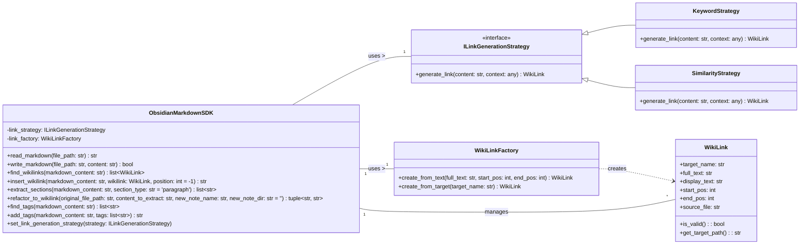

# PRD

你好！没问题，我为你总结一下我们到目前为止讨论的所有重点，这将构成你这个Python SDK项目的核心概念和初步设计方向：

---

### **项目核心目标：构建一个高效生成和组织Obsidian双链Markdown文档的Python SDK**

**核心理念：** 提供一系列“乐高小块”般的原子化、可组合的操作，以支撑用户快速、批量化地在Markdown文档中创建和管理Obsidian双链，从而高效构建知识网络。

---

### **SDK核心功能（“元语”级别原子操作）：**

1.  **文件I/O：**
    *   `read_markdown(file_path: str) -> str`：读取Markdown文件内容。
    *   `write_markdown(file_path: str, content: str) -> bool`：将内容写入Markdown文件。
2.  **双链处理：**
    *   `find_wikilinks(markdown_content: str) -> list[WikiLink]`：识别并提取文本中的所有Obsidian双链（`[[...]]`格式），返回结构化的 `WikiLink` 对象列表。
    *   `insert_wikilink(markdown_content: str, wikilink: WikiLink, position: int = -1) -> str`：在指定位置插入一个 `WikiLink` 对象（转换成字符串格式）。
3.  **内容重构与抽象：**
    *   `refactor_to_wikilink(original_file_path: str, content_to_extract: str, new_note_name: str, new_note_dir: str = '') -> tuple[str, str]`：将原始文件中特定内容抽取到新文件，并在原位置留下指向新文件的双链。
    *   `extract_sections(markdown_content: str, section_type: str = 'paragraph') -> list[str]`：从Markdown文本中按结构（如段落、标题）提取内容片段。
4.  **标签处理：**
    *   `find_tags(markdown_content: str) -> list[str]`：识别并提取文本中的所有Obsidian标签（`#tag`格式）。
    *   `add_tags(markdown_content: str, tags: list[str]) -> str`：在文本中添加指定的标签。

---

### **核心数据结构：**

1.  **`WikiLink` 类：**
    *   **职责：** 不再将双链视为普通字符串，而是独立的对象，封装了双链的结构化信息。
    *   **属性：** `target_name`（链接目标名称）、`full_text`（原始`[[...]]`文本）、`display_text`（可选的显示文本）、`start_pos`、`end_pos`（在原文中的位置）、`source_file`（来源文件路径）。
    *   **方法（示例）：** `is_valid()`、`get_target_path()`。

---

### **设计模式的引入（提升扩展性和稳定性）：**

1.  **门面模式 (Facade Pattern)：**
    *   **实现：** `ObsidianMarkdownSDK` 类作为统一的接口，隐藏了底层复杂的实现细节（如Markdown解析、文件操作、链接创建逻辑等），为用户提供简洁、高层的API。

2.  **策略模式 (Strategy Pattern)：**
    *   **应用场景：** 双链的生成逻辑（例如，从文本中识别什么作为链接，如何创建链接等）。
    *   **实现：**
        *   定义 `ILinkGenerationStrategy` 接口（或抽象基类）。
        *   创建具体策略类，如 `KeywordStrategy`（基于关键词生成链接）、`SimilarityStrategy`（基于相似度生成链接）。
        *   `ObsidianMarkdownSDK` 包含一个策略引用，并提供方法允许用户动态设置或切换策略，实现灵活的链接生成机制。

3.  **工厂模式 (Factory Pattern)：**
    *   **应用场景：** `WikiLink` 对象的创建。
    *   **实现：**
        *   引入 `WikiLinkFactory` 类。
        *   `ObsidianMarkdownSDK` 或其他模块不再直接创建 `WikiLink` 实例，而是通过 `WikiLinkFactory` 的方法（如 `create_from_text()`, `create_from_target()`）来获取 `WikiLink` 对象。
        *   这使得 `WikiLink` 对象的创建逻辑集中管理，易于修改和扩展。

---

### **整体UML设计概览（Mermaid）：**

---

这个总结涵盖了我们目前讨论的所有关键点，从宏观目标到微观的API设计，再到结构化的设计模式考量。它为你的SDK开发提供了一个清晰的起点。

接下来，你可以根据这个总结，开始着手编写代码，或者继续深入探讨某个具体模块的实现细节。你觉得这个总结怎么样？