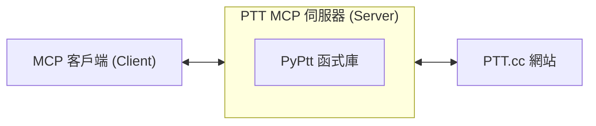

[English Version](./README_ENG.md)

<h1 align="center">PTT MCP Server</h1>

<p align="center">
The best MCP server for Ptt. Proudly built by <a href="https://pyptt.cc/">PyPtt</a> developer.
<br />
<br />
<a href="https://pypi.org/project/ptt-mcp-server/">

</a>
<a href="https://www.python.org/downloads/">

</a>
<a href="https://img.shields.io/pypi/dm/ptt-mcp-server">

</a>
<a href="./LICENSE">

</a>
</p>

## 📖 專案介紹 (Description)
本專案是一個 PTT MCP (Model Context Protocol) 伺服器，它基於功能強大的 [`PyPtt`](https://pyptt.cc/) 函式庫。這使得您的 MCP 客戶端能夠真正登入 PTT 並透過 MCP 協定與 PTT 批踢踢實業坊進行實際互動，並實現自動化操作。

## 🚀 快速開始 (Quick Start)

1.  **安裝套件：**
    ```bash
    pip install ptt-mcp-server
    ```

2.  **設定 MCP 客戶端：**
    將以下設定加入您的 MCP 客戶端設定檔，並填入您的 PTT 帳號密碼。

    ```json
    {
      "mcpServers": {
        "PTT": {
          "command": "ptt-mcp-server",
          "env": {
            "PTT_ID": "YOUR_PTT_ID", // 請換成您自己的 PTT 帳號
            "PTT_PW": "YOUR_PTT_PW"  // 請換成您自己的 PTT 密碼
          }
        }
      }
    }
    ```

3.  **啟動與測試：**
    您的 MCP 客戶端現在應該能自動啟動 PTT MCP 伺服器了。您可以嘗試一個簡單的指令來測試連線，例如要求它登入 PTT。

## 💡 使用範例 (Usage Example)

當您的 MCP 客戶端 (例如 Gemini CLI) 設定完成後，您可以像這樣與 PTT 互動：

**您輸入：**
> 幫我登入 PTT

**MCP 客戶端執行 (背後流程)：**
1.  Gemini CLI 透過 MCP 協定呼叫 `login` 功能。
2.  `ptt-mcp-server` 接收到指令，使用 `PyPtt` 函式庫執行登入。
3.  `ptt-mcp-server` 將登入成功或失敗的結果回傳給 Gemini CLI。

**您會看到：**
> 登入成功

## ⚙️ 運作原理 (How it Works)
本專案扮演一個中間層的角色。您的 MCP 客戶端 (例如 Gemini CLI 等) 會連線到本機執行的 ptt-mcp-server。伺服器收到指令後，會透過 [`PyPtt`](https://pyptt.cc/) 函式庫與 PTT 進行連線並執行相應操作，最後將結果回傳給您的客戶端。



## ✨ 詳細功能 (Features in Detail)

| 功能分類     | 具體操作                     | 支援狀態 |
|:---------|:-------------------------|:-----|
| **帳號管理** | 登入、登出                    | ✅    |
| **文章管理** | 取得文章列表、讀取文章內容、發表新文章、刪除文章 | ✅    |
| **文章互動** | 推文、噓文、給予箭頭、回覆文章          | ✅    |
| **信箱系統** | 讀取信件、傳送新信件、刪除信件          | ✅    |
| **金融系統** | 查詢 P幣、轉帳 P幣              | ✅    |
| **資訊查詢** | 查詢使用者資訊、查詢看板資訊           | ✅    |

## 📋 環境需求 (Requirements)

* Python 3.10 或更新版本。

## 🚀 安裝與設定 (Installation & Setup)

請遵循以下步驟來安裝並設定您的 MCP 伺服器。

### **步驟一：安裝套件**

開啟您的終端機 (Terminal) 並執行以下指令：

```bash
pip install ptt-mcp-server
```

### **步驟二：設定 MCP 客戶端**

您的 MCP 客戶端需要知道如何啟動這個伺服器。以下提供兩種設定方式。

**安全提示**：建議您使用環境變數來設定 PTT 帳號密碼，避免將敏感資訊直接寫在設定檔中。

#### **方法 A：標準路徑設定 (推薦)**

安裝後 ptt-mcp-server 應該就已經在您系統的 Python 環境中，這是最簡單的設定方法。

```json
{
  "mcpServers": {
    "PTT": {
      "command": "ptt-mcp-server",
      "env": {
        "PTT_ID": "YOUR_PTT_ID", // 請換成您自己的 PTT 帳號
        "PTT_PW": "YOUR_PTT_PW"  // 請換成您自己的 PTT 密碼
      }
    }
  }
}
```

#### **方法 B：使用虛擬環境的絕對路徑**

如果您使用 Python 虛擬環境 (Virtual Environment)，或是 command 無法直接執行，您可以提供 Python 直譯器和腳本的絕對路徑。

```json
{
  "mcpServers": {
    "PTT": {
      "command": "/path/to/your/venv/bin/python3",
      "args": [
        "/path/to/your/venv/bin/ptt-mcp-server"
      ],
      "env": {
        "PTT_ID": "YOUR_PTT_ID", // 請換成您自己的 PTT 帳號
        "PTT_PW": "YOUR_PTT_PW"  // 請換成您自己的 PTT 密碼
      }
    }
  }
}
```

**如何找到路徑？**

* **command**: 在您的虛擬環境啟動後，執行 `which python3`。
* **args**: 在您的虛擬環境啟動後，執行 `which ptt-mcp-server`。

## 🗺️ 未來藍圖 (Roadmap)

- [ ] 支援更多 PTT 功能 (例如：精華區操作)。
- [ ] 提供 Docker 映像檔，簡化部署流程。
- [ ] 撰寫更完整的文件與範例。
- [ ] 優化效能與連線穩定性。

歡迎透過 [Issues](https://github.com/PyPtt/ptt_mcp_server/issues) 提供您的建議！

## 🤝 貢獻 (Contributing)

我們非常歡迎任何形式的貢獻！

-   **有問題或建議？** 請到 [GitHub Issues](https://github.com/PyPtt/ptt_mcp_server/issues) 提出。
-   **想貢獻程式碼？**
    1.  Fork 本專案。
    2.  建立您的功能分支 (`git checkout -b feature/AmazingFeature`)。
    3.  Commit 您的變更 (`git commit -m 'Add some AmazingFeature'`)。
    4.  Push 到您的分支 (`git push origin feature/AmazingFeature`)。
    5.  開啟一個 Pull Request。

## 👥 貢獻者 (Contributors)

<!-- readme: collaborators,contributors -start -->
<!-- readme: collaborators,contributors -end -->

## 🙏 致謝 (Acknowledgements)

* [**PyPtt**](https://pyptt.cc/) - 驅動本專案與 PTT 互動的核心函式庫。
* [**fastmcp**](https://github.com/jlowin/fastmcp) - 提供高效能 MCP 伺服器框架。

## 📄 授權條款 (License)

本專案採用 [BSD 3-Clause License](./LICENSE) 授權。
