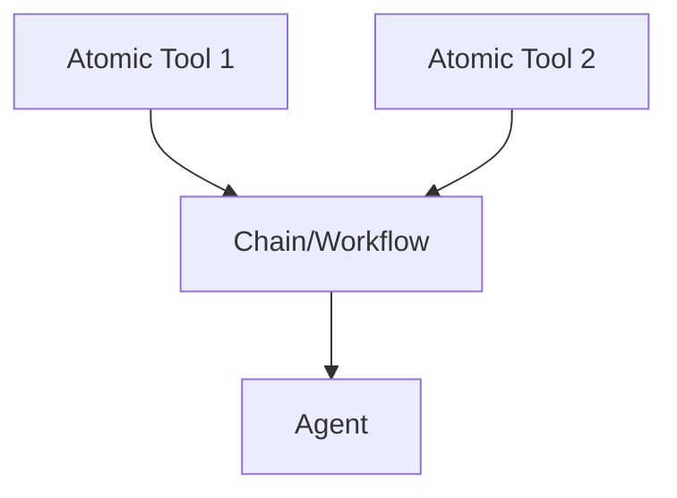

# Best Practice: Tool Chains and Workflows in tinyAgent

## 1. Atomic Tools

- Each @tool-decorated function should do one thing well (single responsibility).
- Example:
  ```python
  @tool
  def fetch_webpage(url: str) -> str:
      ...
  ```

## 2. Chaining Tools: The "Chain" or "Workflow" Pattern

- For multi-step processes, create a dedicated "chain" or "workflow" function or class.
- This chain should orchestrate calls to atomic tools, handle data flow, and expose a clean interface.

### Example: Research Chain

```python
from tinyagent.decorators import tool

@tool
def research_chain(query: str) -> dict:
    # Step 1: Search the web
    search_results = web_search_tool(query)
    # Step 2: Summarize results
    summary = summarize_tool(search_results)
    # Step 3: Save to file
    file_result = file_tool("output.txt", summary)
    return {
        "summary": summary,
        "file": file_result
    }
```

- The chain function is decorated with @tool, so it can be registered and used by agents.
- Each step inside the chain should call atomic tools, not duplicate their logic.

## 3. Naming

- Use clear names like `*_chain`, `*_workflow`, or `*_pipeline` for multi-step tools.
- Document which atomic tools are used inside the chain.

## 4. Benefits

- Keeps atomic tools simple and reusable.
- Makes complex workflows explicit and maintainable.
- Allows agents to use both atomic tools and chains as needed.

## 5. Visual



## 6. In Practice

- Register both atomic tools and chains with the factory.
- Use atomic tools for simple tasks, and chains for orchestrated workflows.
