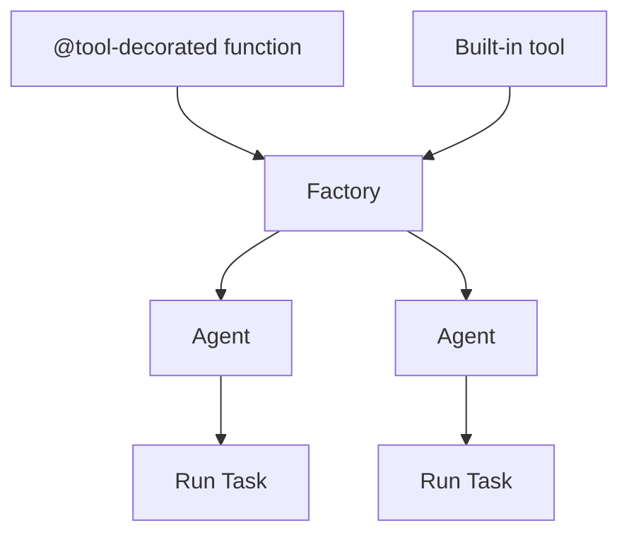

# Factory Pattern vs. Manual Tool Registration in tinyAgent

## Why Use the Factory Pattern for Agent and Tool Registration?

### 1. Centralized Tool Management

- **Factory Pattern**: All tools are registered in one place (the factory), making it easy to see, manage, and update which tools are available to all agents.
- **Manual Registration**: Tools are registered ad-hoc, often scattered across different files or functions, making it harder to track and maintain.

**Benefit:** Centralization reduces bugs, makes onboarding new developers easier, and supports better documentation and testing.

---

### 2. Consistency and Reusability

- **Factory Pattern**: Every agent created by the factory automatically has access to the same set of registered tools. This ensures that tool availability is consistent across agents.
- **Manual Registration**: Each agent may have a different set of tools, which can lead to inconsistent behavior and hard-to-find bugs.

**Benefit:** Consistency is critical for reliability, especially as your codebase and number of agents grow.

---

### 3. Scalability and Extensibility

- **Factory Pattern**: Adding a new tool is as simple as registering it with the factory. All future agents will have access to it without further changes.
- **Manual Registration**: You must remember to add the tool to every agent, increasing the risk of omissions and errors.

**Benefit:** The factory approach scales much better for large projects or when you want to add new capabilities quickly.

---

### 4. Separation of Concerns

- **Factory Pattern**: The logic for tool registration is separated from the logic for agent behavior. This makes the codebase cleaner and easier to reason about.
- **Manual Registration**: Tool registration and agent logic are often mixed together, leading to tangled code.

**Benefit:** Clean separation makes the codebase easier to maintain, refactor, and test.

---

### 5. Alignment with tinyAgent’s Philosophy

- The README.md emphasizes modularity, composability, and the ability to turn any function into a tool and any set of tools into an agent.
- The Factory Pattern is a direct implementation of this philosophy: it allows you to compose agents from a modular set of tools in a standardized, scalable way.

---

### 6. Best Practice in Software Engineering

- The Factory Pattern is a well-established design pattern for managing object creation, especially when you want to control or standardize how those objects are configured.
- It’s used in many frameworks (not just tinyAgent) for plugin, tool, or service registration.

---

## Summary Table

| Pattern                 | Pros (Best Practice)                                     | Cons (Anti-Pattern)               |
| ----------------------- | -------------------------------------------------------- | --------------------------------- |
| **Factory Pattern**     | Centralized, consistent, scalable, maintainable, modular | Slightly more boilerplate upfront |
| **Manual Registration** | Quick for tiny scripts, but error-prone and unscalable   | Hard to maintain, inconsistent    |

---

## Visual: Factory Pattern in tinyAgent

---

## In Practice

- **Use the Factory Pattern** when you want your agents to be robust, maintainable, and ready for production or team use.
- **Manual registration** is only suitable for quick demos or one-off scripts.

---

**In summary:**  
The Factory Pattern is the best practice in tinyAgent because it enforces consistency, maintainability, and scalability—core values of the framework and of good software engineering in general.
