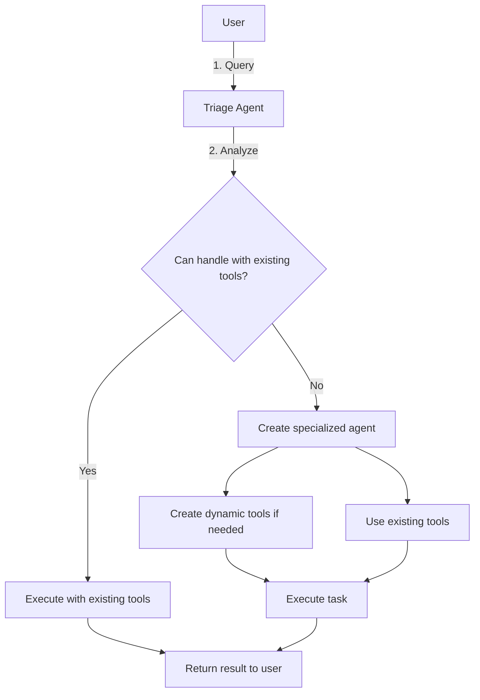

# Orchestration in tinyAgent 🎮

This document explains how tinyAgent orchestrates multiple agents to handle complex tasks.

## Architecture Overview

tinyAgent uses a multi-agent orchestration system to handle tasks efficiently:



## Key Components

### 1. Orchestrator

The Orchestrator is the central coordination component:

- Manages the lifecycle of tasks (submission, execution, completion)
- Creates and manages the triage agent
- Routes tasks to appropriate specialized agents
- Handles permission requests for new tool creation
- Tracks task status and results

```python
from core.factory.orchestrator import Orchestrator

# Get the singleton orchestrator instance
orchestrator = Orchestrator.get_instance()

# Submit a task
task_id = orchestrator.submit_task("Analyze the sentiment of tweets about AI")

# Check task status
status = orchestrator.get_task_status(task_id)
print(f"Task status: {status.status}")
print(f"Result: {status.result}")
```

### 2. Triage Agent

The Triage Agent determines how to handle each incoming task:

- Analyzes the task requirements
- Determines if existing tools can handle the task
- Decides if a new specialized agent is needed
- Selects the appropriate agent for task execution
- Can execute simple tasks directly

### 3. AgentFactory & DynamicAgentFactory

These factories manage tool and agent creation:

- **AgentFactory**: Registers tools and creates basic agents
- **DynamicAgentFactory**: Creates specialized agents with custom tools

```python
from core.factory.dynamic_agent_factory import DynamicAgentFactory

# Get the factory
factory = DynamicAgentFactory.get_instance()

# Create agent from a requirement
agent_result = factory.create_agent_from_requirement(
    "I need an agent that can analyze financial statements"
)

if agent_result["success"]:
    agent = agent_result["agent"]
    # Use the specialized agent
    result = agent.run("Analyze this quarterly report...")
```

### 4. Specialized Agents

Dynamically created agents with specific capabilities:

- Created on-demand for specific task types
- May have custom-created tools
- Optimized for particular domains
- Can share knowledge with other agents

## Task Flow

1. **Task Submission**:
   - User submits a task to the Orchestrator
   - Task is recorded with a unique ID

2. **Triage**:
   - Triage Agent analyzes the task
   - Determines the best way to handle it (direct execution, existing agent, or new agent)

3. **Agent Selection/Creation**:
   - If using existing tools: Task is executed directly
   - If needs existing agent: Task is routed to an appropriate agent
   - If needs new capabilities: A specialized agent is created

4. **Permission Management**:
   - If new tools need to be created, permission may be requested
   - Configuration controls whether this requires explicit approval

5. **Task Execution**:
   - Selected agent executes the task
   - Calls LLM to decide which tools to use
   - Executes tools with rate limiting

6. **Result Delivery**:
   - Result is returned to the user
   - Task status is updated

## Configuration Impact

The `config.yml` file directly controls orchestration behavior:

```yaml
# Example configuration
model:
  default: "deepseek/deepseek-chat"
  triage: "anthropic/claude-3.7na-sonnet"  # Optional dedicated model for triage

retries:
  max_attempts: 3  # How many retries for failed LLM calls

rate_limits:
  global: 2  # Default rate limit for all tools
  tools:
    file_hunter: 5  # Tool-specific rate limits
    chat: -1  # Unlimited

dynamic_agents:
  allow_new_tools_by_default: false  # Require permission for new tools?
  prioritize_existing_tools: true  # Use existing tools when possible
  max_agents: 10  # Maximum number of dynamic agents to keep
  model: "deepseek/deepseek-chat"  # Model for dynamic agent operations
```

## Practical Applications

The orchestration system enables several powerful capabilities:

1. **Specialized Agent Creation**: Create domain-specific agents on-the-fly
2. **Tool Chaining**: Execute complex workflows across multiple tools
3. **Resource Management**: Control API usage with configurable rate limits
4. **Error Recovery**: Handle failures with automatic retries and graceful degradation
5. **Progressive Enhancement**: Start with basic tools and add capabilities as needed

## Integration Example

Here's a complete example of working with the orchestration system:

```python
from core.factory.orchestrator import Orchestrator

# Get the singleton orchestrator instance
orchestrator = Orchestrator.get_instance()

# Submit a task that might need a specialized agent
task_id = orchestrator.submit_task(
    "Create a sentiment analysis report on these Twitter mentions",
    need_permission=True  # Require permission for new tools
)

# Check status
status = orchestrator.get_task_status(task_id)

# If permission is needed
if status.status == "needs_permission":
    print("This task needs to create new tools. Proceeding...")
    orchestrator.grant_permission(task_id)
    
# Get the final result
status = orchestrator.get_task_status(task_id)
if status.status == "completed":
    print(f"Task completed successfully: {status.result}")
else:
    print(f"Task failed: {status.error}")
```

## Advanced Features

### Dynamic Tool Creation

The DynamicAgentFactory can create entirely new tools on-the-fly:

```python
# Analyzing a specialized task requirement
result = factory.can_handle_with_existing_tools(
    "Generate synthetic financial data following GAAP standards"
)

if not result["analysis"]["can_handle"]:
    # Create a new specialized agent with custom tools
    agent_result = factory.create_agent_from_requirement(
        "Generate synthetic financial data following GAAP standards",
        ask_permission=False  # Skip permission check
    )
    
    # The agent now has custom-created tools for this specific task
    if agent_result["success"]:
        custom_agent = agent_result["agent"]
        print(f"Created tools: {agent_result['created_tools']}")
```

### Agent Lifecycle Management

The orchestration system automatically manages agent lifecycle:

- Old agents are removed when the maximum agent limit is reached
- Agent and tool usage statistics are tracked
- Agents can be reused for similar tasks
