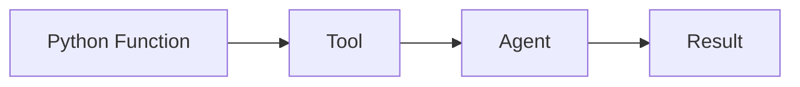
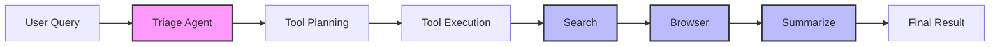

# Tools and the `@tool` Decorator

In tinyAgent, **any Python function** can be transformed into a usable "tool" by simply decorating it with `@tool`. This makes it discoverable by your agents, allowing them to execute that function in response to natural-language queries.

### Example

```python
from tinyagent.decorators import tool

@tool
def greet_person(name: str) -> str:
    """Return a friendly greeting."""
    return f"Hello, {name}!"
```

That's it! Once decorated, `greet_person` can be included in an agent's list of tools, letting your LLM-driven agent call it as needed.

### Example – `calculate_sum` Tool

Turn a plain Python function into a natural-language skill with `@tool` and `tiny_agent`.

```python
from tinyagent.decorators import tool
from tinyagent.agent import tiny_agent

@tool
def calculate_sum(a: int, b: int) -> int:
    """Return the sum of two integers."""
    return a + b

if __name__ == "__main__":
    agent = tiny_agent(tools=[calculate_sum])
    query = "calculate the sum of 5 and 3"
    result = agent.run(query, expected_type=int)
    print(f"Query: '{query}' -> Result: {result}")
```

Console output:

```
Validating args for tool: calculate_sum
Arguments provided: {'a': 5, 'b': 3}
Query: 'calculate the sum of 5 and 3' -> Result: 8
```

---

## Philosophy

tinyAgent is built on two core ideas:

### 1. Functions as Agents

Any Python function can be turned into a tool—and then seamlessly integrated into an agent. This approach makes extending and innovating simple.




```python
#!/usr/bin/env python3
"""
Example: Functions as Agents
"""
from tinyagent.decorators import tool
from tinyagent.agent import tiny_agent

@tool
def calculate_sum(a: int, b: int) -> int:
    """Calculate the sum of two integers."""
    return a + b


def main():
    # Create an agent with the calculate_sum tool
    agent = tiny_agent(tools=[calculate_sum])
    query = "calculate the sum of 5 and 3"
    result = agent.run(query, expected_type=int)
    print(f"Query: '{query}' -> Result: {result}")


if __name__ == "__main__":
    main()
```

### 2. tiny_chain Orchesration

- IN BETA

tiny_chain is the main engine of tinyAgent's orchestration. It lets your agent solve complex tasks by chaining together multiple tools, using an LLM-powered "triage agent" to plan the best sequence. If the plan fails, tiny_chain falls back to running all tools in sequence, ensuring robustness and reliability.



- **Simple:** You describe your task in natural language. tiny_chain figures out which tools to use and in what order.
- **Smart:** The triage agent (an LLM) analyzes your query and suggests a plan—sometimes a single tool, sometimes a multi-step chain.
- **Robust:** If the triage agent can't make a good plan, tiny_chain just tries all tools, so you always get an answer.
- **Extensible:** Add new tools or improve the triage agent to handle more complex workflows.

**How it works (technical overview):**

- When you submit a task, tiny_chain asks the triage agent for a plan (JSON: single tool or sequence).
- If the plan is valid, tiny_chain executes the tools in order, passing results between them.
- If the plan is invalid or fails, tiny_chain runs all tools as a fallback.
- All errors are caught and logged, so you always get feedback.

### tiny_chain Example – "Tariff Research Tool"

Use this snippet (or drop-in file) anywhere in your docs to show **exactly how tiny_chain works** end-to-end.

```python
#!/usr/bin/env python3
"""
tiny_chain example: automatically find and summarise U.S. import-tariff data
"""
from tinyagent.factory.tiny_chain import tiny_chain
from tinyagent.tools.duckduckgo_search import get_tool as search_tool
from tinyagent.tools.custom_text_browser import get_tool as browser_tool
from tinyagent.decorators import tool
from tinyagent.agent import get_llm

@tool(name="summarize", description="Summarize input text with the LLM")
def summarize(text: str) -> str:
    prompt = f"Summarize the following text:\n\n{text}\n\nSummary:"
    return get_llm()(prompt).strip()

# 1 – build the chain
chain = tiny_chain.get_instance(
    tools=[search_tool(), browser_tool(), summarize._tool]
)

# 2 – submit any natural-language task
task_id = chain.submit_task(
    "Find current US import tariffs and visit official trade websites for details"
)

# 3 – get structured results
print(chain.get_task_status(task_id).result)
```

**What it demonstrates**

| tiny_chain feature                        | Visible in run                                     |
| ----------------------------------------- | -------------------------------------------------- |
| 🔗 Automatic tool planning (triage agent) | Picks _search → browser → summarize_               |
| 🛠 Pluggable tools                         | Search + browser + summarize tools in sequence     |
| 📝 Structured trace                       | `steps`, `tools_used`, errors if any               |
| 🤖 LLM-powered step                       | `summarize` converts page content → concise answer |

Copy-paste, run, and you have a minimal yet complete example of tiny_chain orchestrating multiple tools to solve a real research task.

### Key links

- **Harmonized Tariff Schedule (USITC)**  
  <https://hts.usitc.gov/>

- **FTA Tariff Tool (International Trade Administration)**  
  <https://www.trade.gov/fta-tariff-tool-home>

- **CBP – Determining Duty Rates**  
  <https://www.cbp.gov/trade/programs-administration/determining-duty-rates>

### Console Output

```text
============================================================
Tariff Research Tool
============================================================

Researching: 'Find current US import tariffs and use the browser to visit official trade websites to get details'
------------------------------------------------------------

Tool Chain Steps:

=== Step 1 ===
Tool: search
Top hit → Harmonized Tariff Schedule (hts.usitc.gov)

=== Step 2 ===
Tool: browser
Visited title → Harmonized Tariff Schedule

=== Step 3 ===
Tool: summarize
Result →
To find current US import tariffs, consult the **Harmonized Tariff Schedule (HTS)**
on the USITC website.
For Free‑Trade Agreement rates, use the **FTA Tariff Tool** on trade.gov.
CBP also provides duty‑rate guidance.

------------------------------------------------------------
Tools used: search → browser → summarize
```

**What it demonstrates**

| tiny_chain feature                        | Visible in run                                     |
| ----------------------------------------- | -------------------------------------------------- |
| 🔗 Automatic tool planning (triage agent) | Picks _search → browser → summarize_               |
| 🛠 Pluggable tools                         | Search + browser + summarize tools in sequence     |
| 📝 Structured trace                       | `steps`, `tools_used`, errors if any               |
| 🤖 LLM-powered step                       | `summarize` converts page content → concise answer |

Copy-paste, run, and you have a minimal yet complete example of tiny_chain orchestrating multiple tools to solve a real research task.

---

## (NEW) Retrieval-Augmented Memory (RAG)

> - To enable RAG, install the appropriate extra:
>   - Local embeddings: `pip install tiny_agent_os[rag-local]`
>   - OpenAI API embeddings: `pip install tiny_agent_os[rag-api]`
>   - Both: `pip install tiny_agent_os[rag]`
> - If you do not use RAG, these dependencies are not required.
> - **API-based embedding support (e.g., OpenAI) is now available!**

For **full details and configuration examples, see [`documentation/rag.md`](documentation/rag.md)**.

tinyAgent now supports plug-and-play vector memory for contextual recall using ChromaDB. You can add memory to any agent in just a few lines:

```python
from tinyagent.decorators import tool
from tinyagent.agent import tiny_agent
from tinyagent.utils.vector_memory import VectorMemory

@tool
def calculate_sum(a: int, b: int) -> int:
    """Calculate the sum of two integers."""
    return a + b

mem = VectorMemory(persistence_directory="~/.tinyagent_mem")
agent = tiny_agent(tools=[calculate_sum], memory=mem)

# Store a fact in memory
question = "remember that my lucky numbers are 7 and 11"
agent.run(question)

# Retrieve the fact later
follow = "what were my lucky numbers?"
print(agent.run(follow))  # → "7 and 11"
```

This enables your agent to remember and retrieve facts, context, or instructions across turns—no extra boilerplate required.

## Features

- **Modular Design:** Easily convert any function into a tool.
- **Flexible Agent Options:** Use the simple orchestrator or advanced `AgentFactory`.
- **Robust Error Handling:** Improved debugging with custom exceptions.
- **Structured Output:** Enforce JSON formats for consistent outputs.

---

## Acknowledgments & Inspirations

- **my wife**
- [HuggingFace SmoLAgents](https://github.com/huggingface/smolagents)
- [Aider-AI](https://github.com/Aider-AI/aider)
- And many other open-source contributors!

---

## Contact

For questions, suggestions, or business inquiries:

- **Email**: [info@alchemiststudios.ai](mailto:info@alchemiststudios.ai)
- **X**: [@tunahorse21](https://x.com/tunahorse21)
- **Website**: [alchemiststudios.ai](https://alchemiststudios.ai)

---

## License

**Business Source License 1.1 (BSL)**
This project is licensed under the Business Source License 1.1. It is **free for individuals and small businesses** (with annual revenues under $1M).
For commercial use by larger businesses, an enterprise license is required.
For licensing or usage inquiries, please contact: [info@alchemiststudios.ai](mailto:info@alchemiststudios.ai)
