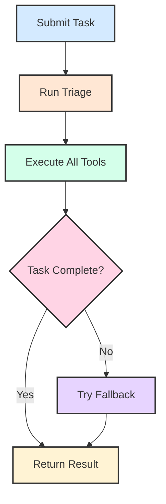

# tiny_chain: Implementation Guide

## Quick Start

```python
from tinyagent.factory.tiny_chain import tiny_chain
from tinyagent.tools.duckduckgo_search import duckduckgo_search_tool

# Create tiny_chain with tools
chain = tiny_chain.get_instance(tools=[duckduckgo_search_tool])

# Submit a task
task_id = chain.submit_task("what is the weather in New York?")
status = chain.get_task_status(task_id)
```

## How It Works

### 1. Task Creation

When you submit a task:

```python
task_id = chain.submit_task("find information")
```

The tiny_chain:

- Generates a unique task ID
- Creates a tiny_task object to track progress
- Initiates the task handling process

### 2. Task Handling Flow



> **Note**: TinyChain is currently in beta. The implementation and interface may change in future versions.

### 3. Tool Execution Chain

The tiny_chain executes tools in sequence:

1. **Search Tools** run first

   ```python
   # Example search execution
   search_result = search_tool.execute(query)
   context["search_results"] = search_result
   ```

2. **Browser Tools** use search results

   ```python
   # Example browser execution
   if search_results and "url" in search_results[0]:
       browser_result = browser_tool.execute(url=search_results[0]["url"])
   ```

3. **Processing Tools** combine previous results
   ```python
   # Example processing
   final_result = process_tool.execute(
       search_data=search_results,
       browser_data=browser_results
   )
   ```

## Key Features

### 1. Automatic Tool Selection

```python
def _execute_all_tools_sequence(self, task):
    # Gets ALL available tools
    all_tools = list(self.factory.list_tools().values())

    # Executes each tool with appropriate args
    for tool in all_tools:
        args = self._prepare_tool_args(tool, context)
        result = tool.func(**args)
```

### 2. Context Preservation

```python
execution_context = {
    "task_description": task.description,
    "search_results": [],
    "browser_results": [],
    "analysis_results": []
}
```

### 3. Result Formatting

```python
def format_results(result):
    if result['type'] == 'tool_chain':
        # Format chain results
        return format_chain_results(result)
    else:
        # Format single tool result
        return format_single_result(result)
```

## Example Use Cases

### 1. Web Search

```python
# Submit search task
task_id = chain.submit_task(
    "find recent news about AI"
)
```

### 2. Multi-Tool Processing

```python
# Task that requires multiple tools
task_id = chain.submit_task(
    "search for Python tutorials and summarize them"
)
```

### 3. Error Recovery

```python
# Task with fallback
try:
    task_id = chain.submit_task(query)
    status = chain.get_task_status(task_id)
    if status.error:
        # Fallback handling occurs automatically
        print(f"Fallback result: {status.result}")
except Exception as e:
    print(f"Error: {e}")
```

## Best Practices

1. **Tool Registration**

   ```python
   # Register tools at tiny_chain creation
   chain = tiny_chain.get_instance(
       tools=[tool1, tool2, tool3]
   )
   ```

2. **Task Description**

   ```python
   # Be specific in task description
   task_id = chain.submit_task(
       "search for weather in New York and format as JSON"
   )
   ```

3. **Result Handling**
   ```python
   # Always check status and handle errors
   status = chain.get_task_status(task_id)
   if status.error:
       handle_error(status.error)
   else:
       process_result(status.result)
   ```

## Common Patterns

### 1. Tool Chain Creation

```python
# Tools are automatically chained
chain.submit_task(
    "search for Python tutorials, visit the links, and summarize"
)
```

### 2. Context Management

```python
# Context flows between tools automatically
chain.submit_task(
    "find weather data and create a report"
)
```

### 3. Error Recovery

```python
# Automatic fallback to simpler tools
chain.submit_task(
    "complex task that might fail"
)
```

## Summary

tiny_chain provides:

- Automatic tool selection and chaining
- Context preservation between tools
- Robust error handling and recovery
- Clear result formatting and status tracking

This makes it ideal for:

- Complex multi-step tasks
- Automated tool selection
- Robust task execution
- Clear result presentation
