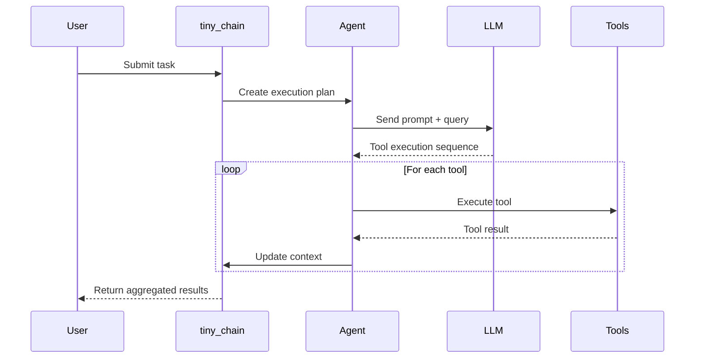

# tinyAgent Internal Flow

tinyAgent bridges natural language queries to Python function calls through these core steps:

## 1. Tool Decoration & Introspection

- Functions are decorated with `@tool`.
- The decorator introspects:
  - Parameter names and types
  - Return type
  - Docstring (description)
- It wraps the function in a `Tool` object, storing metadata and execution logic.

## 2. Agent Creation & Tool Chain Setup

- `AgentFactory.create_agent()`:
  - Accepts a list of tools or functions.
  - Converts functions to `Tool` objects if needed.
  - Registers all tools with an `Agent` instance.
- `tiny_chain.get_instance()`:
  - Manages tool execution flow
  - Handles tool dependencies
  - Maintains execution context

## 3. Prompt Construction & Task Flow

- The `Agent` builds a **system prompt** embedding:
  - Tool names
  - Descriptions
  - Parameter schemas
- The `tiny_chain` manages:
  - Task submission
  - Tool selection
  - Result aggregation

## 4. LLM Query & Response

- The prompt is sent to an LLM backend (e.g., OpenRouter/OpenAI).
- The LLM analyzes the query and:
  - Returns a plain answer, or
  - Returns a structured JSON indicating tool calls with arguments
- The tiny_chain processes multi-step executions

## 5. Response Parsing & Execution

- The agent parses the LLM response.
- If tool calls are indicated:
  - Validates parameters
  - Executes tools in sequence
  - Maintains context between steps
- Results are aggregated and formatted

## 6. Real-World Integration

### Tool Chain Example:

```python
# Initialize tools
search_tool = get_search_tool()
browser_tool = get_browser_tool()
summarize_tool = get_summarize_tool()

# Create chain
chain = tiny_chain.get_instance(tools=[
    search_tool,    # Find information
    browser_tool,   # Deep inspection
    summarize_tool  # Process results
])

# Execute task
task_id = chain.submit_task(
    "research US import tariffs",
    context={"type": "import", "region": "US"}
)

# Process results
status = chain.get_task_status(task_id)
for step in status.result['steps']:
    process_step_result(step)
```

## Sequence Diagram



## Best Practices

1. **Tool Chain Design**

   - Order tools logically
   - Maintain context between steps
   - Handle errors appropriately

2. **Task Submission**

   - Provide clear instructions
   - Include relevant context
   - Specify expected outputs

3. **Result Processing**

   - Validate each step
   - Aggregate results meaningfully
   - Handle errors gracefully

4. **Context Management**
   - Pass relevant data between tools
   - Maintain state when needed
   - Clean up resources properly
