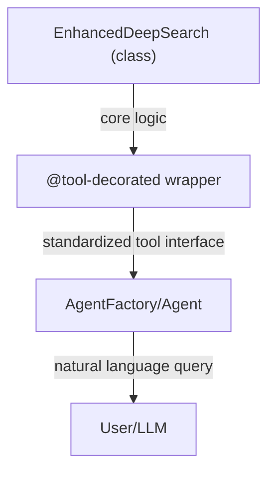

# Why Do @tool-Decorated Wrapper Functions Exist in tinyAgent?

## The Problem

- Many advanced capabilities (like deep research) are implemented as Python classes for modularity, state management, and extensibility.
- However, the agent/factory system in tinyAgent is designed to work with **tools**: functions decorated with `@tool` that expose clear metadata, parameter types, and a standardized interface.

## Why Not Use the Class Directly?

- **Classes** are flexible for developers, but:
  - They may require complex initialization (constructor arguments, config, etc.).
  - They do not expose a standard callable interface for the agent to discover, validate, or invoke.
  - They lack metadata (name, description, parameter types) needed for agent orchestration, LLM prompting, and UI integration.

## What Does the @tool Wrapper Provide?

- **@tool-decorated functions**:
  - Expose a simple, predictable function signature (e.g., `def tool_func(query: str, ...) -> dict`)
  - Attach metadata: name, description, parameter types, etc.
  - Enable automatic registration, discovery, and validation by the agent/factory system.
  - Allow the agent to call the tool in response to natural language queries, with parameter mapping and error handling.

## How It Works

- The wrapper function (e.g., `enhanced_deepsearch_tool_wrapper`) is a thin layer:
  - It instantiates the class and calls its main method.
  - It is decorated with `@tool`, making it visible and usable by the agent system.

## Architectural Benefits

| Approach          | Pros (Best Practice)                                    | Cons (Anti-Pattern)                        |
| ----------------- | ------------------------------------------------------- | ------------------------------------------ |
| **@tool Wrapper** | Standardized, discoverable, validated, agent-compatible | Slightly more boilerplate                  |
| **Class Only**    | Flexible for devs, but not agent-friendly               | Not discoverable, no metadata, error-prone |

## Visual: How the Wrapper Connects Class Logic to the Agent

## Summary

- The @tool-decorated wrapper is essential for making advanced class-based logic usable as a tool in the agent system.
- It bridges the gap between developer flexibility and agent orchestration, ensuring all tools are discoverable, validated, and safely callable by agents.
