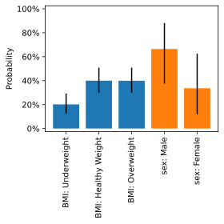

# Toplot
[Reference docs](https://luntergroup.github.io/toplot/)

Visualizations for topic models.

## Installation
```
pip3 install toplot
```

## Getting started
Topic modelling is a Bayesian endevour. After training your topic model with $K$ components, you've inferred the distribution over two latent variables:
- The posterior over the weights (i.e., the topics) of the model $\pmb{W} = [\pmb{w}_1, \dots, \pmb{w}_K]^T$. We assume that the weights have a two-level structure: each weight is composed of categorical variables (or actually, multinomials), each consisting of a set of categories.
- Per training example $i$, the posterior over the hidden units $\pmb{h}^{(i)}$ (topic loadings, also denoted as $\pmb{\theta}_i$ in LDA).

### Visualizing weights (the topic/cluster, $\pmb{w}$ or $\pmb{\phi}$)
Toplot expects your topic model's posterior samples to be organized in specific ways.
As an example, we draw 1000 samples from "fake" topic weights $\pmb{W}$ containing two
categories, body mass index (BMI) and sex, consisting of three and two categories each,
respectively.
```python
import pandas as pd
from numpy.random import dirichlet

# Draw 1000 samples from "posterior" distribution.
weight_bmi = dirichlet([16.0, 32.0, 32.0], size=1_000)
weight_sex = dirichlet([8.1, 4.1], size=1_000)
weight = pd.concat(
    {
        "BMI": pd.DataFrame(
            weight_bmi, columns=["Underweight", "Healthy Weight", "Overweight"]
        ),
        "sex": pd.DataFrame(weight_sex, columns=["Male", "Female"]),
    },
    axis="columns",
)
```
Use [`bar_plot`](https://luntergroup.github.io/toplot/weights.html#toplot.weights.bar_plot) to visualize the topic `weight`, including the 95% quantile range:


```python
from toplot import bar_plot

bar_plot(weight)
```

If you have many multinomials, you can use [`bar_plot_stacked`](https://luntergroup.github.io/toplot/weights.html#toplot.weights.bar_plot_stacked) to reduce the width of the plot. This plot folds the categories (e.g., `"Underweight"`, `"Healthy Weight"`, and `"Overweight"`) belonging to the same multinomial (BMI) into a single bar.


```python
from toplot import bar_plot_stacked

bar_plot_stacked(weight)
```

To visualize more than one topic at a time, you can make a scattermap with [`scattermap`](https://luntergroup.github.io/toplot/scattermap.html#toplot.scattermap.scattermap).


### Visualizing hidden units (topic proportions, $\pmb{h}$ or $\pmb{\theta}$)
Next, we plot the hidden units/topic identities $[\pmb{h}^{(1)}, \dots, \pmb{h}^{(m)}]^T$: that is, for each record $i$, the proportion over the components/topics. Let's generate the (average) proportion for $m=30$ records to visualize:
```python
hidden = pd.DataFrame(
    dirichlet([0.6, 0.8, 0.2], size=30),  # 30 records
    columns=["Topic_1", "Topic_2", "Topic_3"],
)
```
The function `plot_cohort` computes the distance between all examples (the cohort) and, by default, sorts them accordingly using the [travelling salesman problem](https://en.wikipedia.org/wiki/Travelling_salesman_problem).
Currently, **no uncertainty visualization** is supported for `plot_cohort` (like in `bar_plot`), so you need to pass the posterior average.


```python
from toplot import plot_cohort

plot_cohort(hidden)
```

You can emphasize the periodicity inherent in the travelling salesman solution by visualizing all the examples using a polar plot:


```python
from toplot import plot_polar_cohort

plot_polar_cohort(hidden)
```