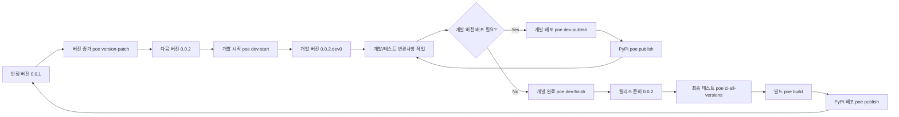

# 버전 관리 가이드

## 개발-릴리즈 사이클



## 개발 버전 워크플로우

개발 버전은 **다음 릴리즈**를 위한 활발한 개발이 진행되는 단계입니다.

### 1. 다음 버전 준비

```sh
# 먼저 버전을 올립니다
poe version-patch   # 0.0.1 -> 0.0.2
# 또는
poe version-minor   # 0.0.1 -> 0.1.0
# 또는
poe version-major   # 0.0.1 -> 1.0.0
```

### 2. 개발 모드 시작

```sh
poe dev-start       # 0.0.2 -> 0.0.2.dev0
```

### 3. 개발 및 테스트

```sh
# 코드 변경 후 검증
poe check           # 린팅 + 타입 체크
poe test            # 단위 테스트
poe test-all        # 모든 Python 버전 테스트
```

### 4. 개발 버전 배포 (선택사항)

개발 버전 배포는 다음과 같은 경우에만 권장됩니다:

- 다른 프로젝트에서 테스트가 필요한 경우
- 특정 사용자에게 사전 배포가 필요한 경우

```sh
poe dev-publish     # CI 테스트 및 빌드
poe publish         # PyPI에 배포 (예: 0.0.2.dev0)
```

#### 개발 버전 재배포가 필요한 경우

이미 PyPI에 개발 버전이 업로드된 상태에서 추가 변경사항을 반영해야 할 때:

```sh
# 개발 버전 번호 증가
poe version-dev     # 0.0.2.dev0 -> 0.0.2.dev1

# 테스트 및 배포
poe dev-publish
poe publish         # PyPI에 배포 (예: 0.0.2.dev1)
```

> **주의**:
>
> - PyPI에 업로드된 버전은 삭제할 수 없습니다
> - 동일한 버전 번호로는 재업로드가 불가능합니다
> - `pip install package`는 개발 버전을 무시합니다
> - 개발 버전 설치: `pip install package==0.0.2.dev0`

### 5. 정식 릴리즈

```sh
poe dev-finish      # 0.0.2.dev0 -> 0.0.2
poe ci-all-versions # 모든 Python 버전 최종 테스트
poe build           # 패키지 빌드
poe publish         # PyPI에 정식 배포
```

## 릴리즈 워크플로우

릴리즈 명령은 자동으로 다음을 수행합니다:

- 빌드 아티팩트 정리
- 버전 업데이트
- **모든 Python 버전 CI 테스트** (3.9, 3.10, 3.11, 3.12)
- 패키지 빌드 및 검증

```sh
# 패치 릴리즈 (버그 수정)
poe release-patch

# 마이너 릴리즈 (새 기능)
poe release-minor

# 메이저 릴리즈 (호환성 변경)
poe release-major

# 긴급 패치 (현재 Python만)
poe release-patch-quick
```

## PyPI 배포

### 배포 설정

```sh
# ~/.pypirc 파일 설정
[pypi]
  username = __token__
  password = <your-pypi-token>
```

### 배포 명령어

```sh
# PyPI에 배포
poe publish
```

## 예시 시나리오

### 간단한 버그 수정

```sh
# 개발 버전 없이 바로 패치
poe release-patch-quick  # 현재 Python 버전만 테스트
poe publish
```

### 일반적인 기능 개발

```sh
# 1. 다음 버전 결정 및 개발 시작
poe version-minor   # 0.0.1 -> 0.1.0
poe dev-start       # 0.1.0 -> 0.1.0.dev0

# 2. 개발 진행
# ... 코드 변경 ...
poe test-all        # 모든 Python 버전 테스트

# 3. 개발 완료 및 릴리즈
poe dev-finish      # 0.1.0.dev0 -> 0.1.0
poe build           # 패키지 빌드
poe publish         # PyPI에 배포
```

### 대규모 변경 (알파/베타 테스트 필요 시)

```sh
# 1. 다음 메이저 버전 준비
poe version-major   # 0.0.2 -> 1.0.0
poe dev-start       # 1.0.0 -> 1.0.0.dev0

# 2. 알파 테스트 (선택사항)
poe version-alpha   # 1.0.0.dev0 -> 1.0.0a1
poe build && poe publish

# 3. 베타 테스트 (선택사항)
poe version-beta    # 1.0.0a1 -> 1.0.0b1
poe build && poe publish

# 4. 정식 릴리즈
poe version-release # 1.0.0b1 -> 1.0.0
poe ci-all-versions # 전체 테스트
poe build && poe publish
```

## Python 버전 관리

```sh
# 지원 Python 버전 설치
poe install-pythons

# 특정 버전 테스트
poe test-py39
poe test-py310
poe test-py311
poe test-py312
```
